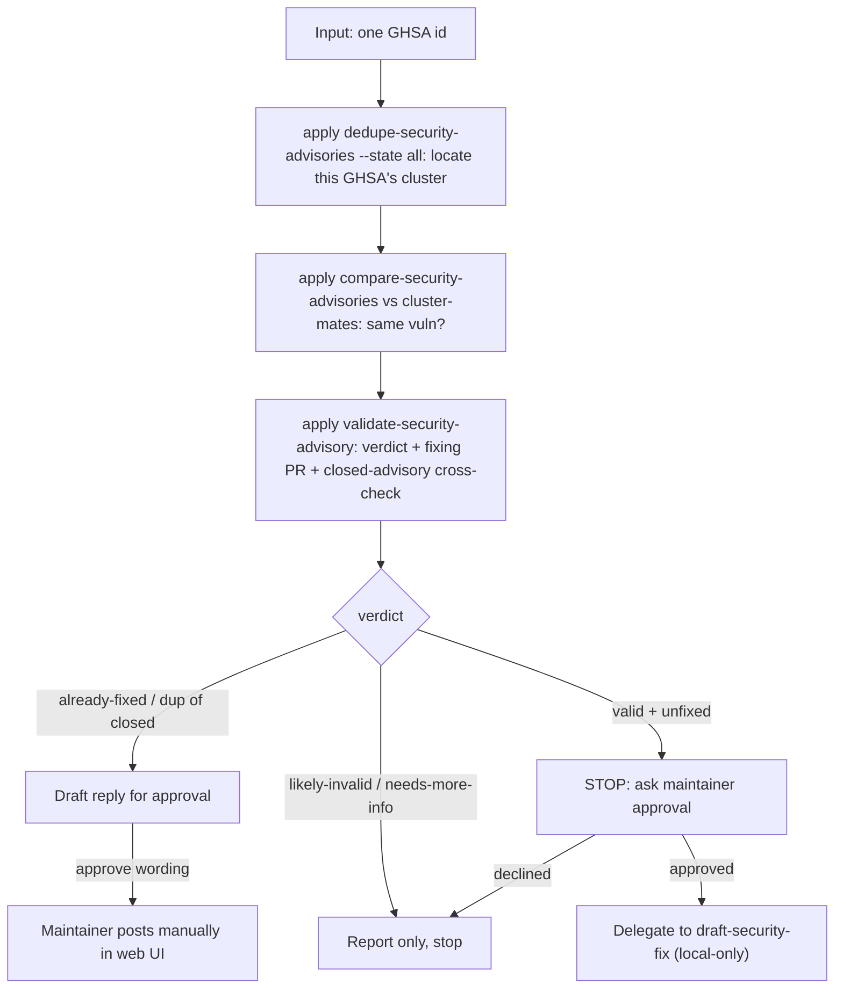

# Triage Security Advisory (orchestrator)

One entry point that triages a single security advisory end to end by delegating
to the existing skills in order: `dedupe-security-advisories` (find its cluster)
-> `compare-security-advisories` (confirm same vulnerability) ->
`validate-security-advisory` (assess + verdict) -> branch to either a
maintainer-approved reply (already fixed) or, after explicit approval,
`draft-security-fix` (valid + unfixed).

This skill is a thin coordination layer. It does NOT restate the sub-skills'
steps or commands - at each stage it applies the named sub-skill, which owns its
own behavior. The only logic unique to this skill is the ordering, the branch
rules, and the approval gates.

## Read-only through validate / gated writes (hard constraint)

- The orchestrator itself only reads. Through the dedupe, compare, and validate
  stages it MUST NOT modify any code or any advisory.
- Two approval gates require explicit maintainer permission:
  1. before delegating to `draft-security-fix` (the only code-writing step), and
  2. before any reply is posted to an advisory.
- Posting a reply is not possible via the GitHub API (there is no endpoint to
  comment on a repository security advisory); any reply is posted manually by the
  maintainer in the web UI, only after they approve the wording.
- Never accept, close, comment on, publish, or edit the advisory, nor claim to do
  so on the maintainer's behalf.

## Prerequisites

- **GitHub token**: Auto-detected via `gh auth token`, or set `GH_TOKEN`.
- **Advisory access**: Unpublished advisories require the token to belong to a
  security manager/admin of the repo or a collaborator on the advisory, with the
  `repo` or `repository_advisories:read` scope.

## Pipeline



## Presentation conventions (all steps)

In every message this skill emits - including intermediate per-step updates, not
just the final report - render each advisory reference as a Markdown link whose
visible text is the GHSA id and whose target is the advisory URL, e.g.
`[GHSA-c9hc-8hvq-j4c5](https://github.com/mlflow/mlflow/security/advisories/GHSA-c9hc-8hvq-j4c5)`.
The advisory URL is always
`https://github.com/<owner>/<repo>/security/advisories/<ghsa_id>`. Render pull
request references the same way, e.g.
`[#12345](https://github.com/mlflow/mlflow/pull/12345)`. Never emit a bare GHSA id
or PR number without its embedded link, even when listing cluster-mates compactly.

## Steps

Each step delegates to a sub-skill by name; it does not restate that sub-skill's
commands or steps.

1. **Find its cluster.** Apply the `dedupe-security-advisories` skill with
   `--state all`, then locate the cluster containing `<ghsa_id>`. If the GHSA is
   not part of any cluster (a singleton, or absent from the clustered output),
   explicitly tell the maintainer "no duplicate candidates detected for
   `<ghsa_id>`", skip the compare stage, and continue to validation. Carry this
   "no duplicates" finding into the consolidated report.

2. **Compare cluster-mates.** Only if the target has cluster-mates, apply the
   `compare-security-advisories` skill over the target plus its cluster-mates to
   confirm they are the same underlying vulnerability. Capture the earliest/
   original report and whether the target duplicates an already-closed/published
   (already-handled) advisory.

3. **Validate the target.** Apply the `validate-security-advisory` skill for
   `<ghsa_id>` to produce a verdict - valid / already-fixed / likely-invalid /
   needs-more-info - with `file:line` citations, the fixing-PR link, and the
   closed-advisory cross-check.

4. **Branch on the verdict:**
   - **Duplicate of an already-fixed/closed advisory, or verdict `already-fixed`:**
     do NOT fix. Use `validate-security-advisory`'s reply-drafting step to draft a
     courteous reply, present it, and STOP for approval (gate 2). The maintainer
     posts it manually in the advisory web UI; never post it yourself.
   - **`likely-invalid` / `needs-more-info`:** report the assessment and stop; no
     fix, no reply.
   - **`valid` and not yet fixed:** STOP and present a summary plus the proposed
     fix approach, and ask for explicit maintainer approval (gate 1). Only after
     approval, apply the `draft-security-fix` skill for `<ghsa_id>` (local-only
     patch + regression test; no commit/push/PR).

5. **Consolidated report.** Produce one combined summary drawn from each sub-skill:
   the dedupe/compare outcome (with the original source, or the "no duplicates"
   note from step 1), the validation verdict with `file:line` and fixing-PR link,
   and whichever gated action was taken (reply drafted / fix delegated / stopped).
   Render every GHSA and PR reference as a Markdown link whose visible text is the
   id, e.g.
   `[GHSA-mf9x-42mc-wh54](https://github.com/mlflow/mlflow/security/advisories/GHSA-mf9x-42mc-wh54)`.

## Non-goals

- No proof-of-concept execution (consistent with `validate-security-advisory`).
- The orchestrator never writes code directly; the only write path is the
  separately approved `draft-security-fix` delegation.
- No new CLI command; this is a single orchestrator skill over the existing ones.

## Invocation example

```bash
/triage-security-advisory GHSA-mf9x-42mc-wh54
```
