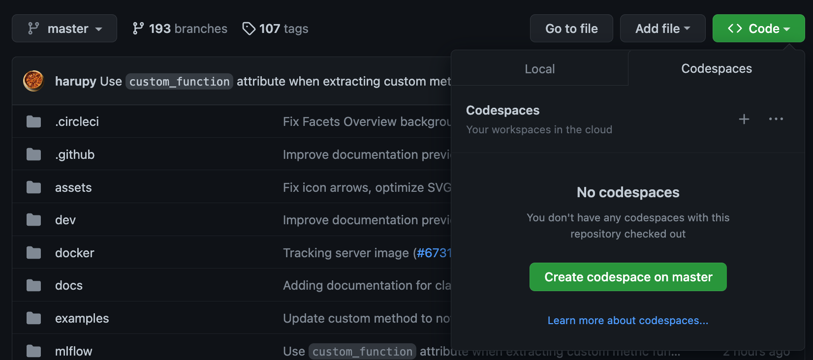

# Contributing to MLflow

We welcome community contributions to MLflow. This page provides useful information about contributing to MLflow.

**Table of Contents**

- [Governance](#governance)
- [Contribution process](#contribution-process)
- [Contribution guidelines](#contribution-guidelines)
  - [Write designs for significant changes](#write-designs-for-significant-changes)
  - [Make changes backwards compatible](#make-changes-backwards-compatible)
  - [Consider introducing new features as MLflow Plugins](#consider-introducing-new-features-as-mlflow-plugins)
- [Setting up the repository](#setting-up-the-repository)
- [Developing and testing MLflow](#developing-and-testing-mlflow)
  - [Environment Setup and Python configuration](#environment-setup-and-python-configuration)
    - [Automated Python development environment configuration](#automated-python-development-environment-configuration)
    - [Manual Python development environment configuration](#manual-python-development-environment-configuration)
  - [JavaScript and UI](#javascript-and-ui)
    - [Install Node Module Dependencies](#install-node-module-dependencies)
    - [Install Node Modules](#install-node-modules)
    - [Launching the Development UI](#launching-the-development-ui)
    - [Running the Javascript Dev Server](#running-the-javascript-dev-server)
    - [Testing a React Component](#testing-a-react-component)
    - [Linting Javascript Code](#linting-javascript-code)
  - [R](#r)
  - [Java](#java)
  - [Python](#python)
    - [Writing Python Tests](#writing-python-tests)
    - [Running Python Tests](#running-python-tests)
    - [Python Client](#python-client)
      - [Python Model Flavors](python-model-flavors)
    - [Python Server](#python-server)
      - [Building Protobuf Files](#building-protobuf-files)
      - [Database Schema Changes](#database-schema-changes)
  - [Developing inside a Docker container (experimental)](#developing-inside-a-docker-container-experimental)
    - [Prerequisites](#prerequisites)
    - [Setup](#setup)
  - [Kubernetes](#Kubernetes)
    - [Prerequisites](#kubernetes-prerequisites)
    - [Setup](#kubernetes-setup)
    - [Clean up](#kubernetes-cleanup)
  - [Writing MLflow Examples](#writing-mlflow-examples)
  - [Building a Distributable Artifact](#building-a-distributable-artifact)
  - [Writing Docs](#writing-docs)
  - [Sign your work](#sign-your-work)
- [Code of Conduct](#code-of-conduct)

## Governance

Governance of MLflow is conducted by the Technical Steering Committee
(TSC), which currently includes the following members:

- Patrick Wendell (<pwendell@gmail.com>)
- Reynold Xin (<reynoldx@gmail.com>)
- Matei Zaharia (<matei@cs.stanford.edu>)

The founding technical charter can be found
[here](https://github.com/mlflow/mlflow/blob/master/mlflow-charter.pdf).

## Contribution process

The MLflow contribution process starts with filing a GitHub issue.
MLflow defines four categories of issues: feature requests, bug reports,
documentation fixes, and installation issues. Details about each issue
type and the issue lifecycle are discussed in the [MLflow Issue
Policy](https://github.com/mlflow/mlflow/blob/master/ISSUE_POLICY.md).

MLflow committers actively [triage](ISSUE_TRIAGE.rst) and respond to
GitHub issues. In general, we recommend waiting for feedback from an
MLflow committer or community member before proceeding to implement a
feature or patch. This is particularly important for [significant
changes](https://github.com/mlflow/mlflow/blob/master/CONTRIBUTING.md#write-designs-for-significant-changes),
and will typically be labeled during triage with `needs design`.

After you have agreed upon an implementation strategy for your feature
or patch with an MLflow committer, the next step is to introduce your
changes (see [developing
changes](https://github.com/mlflow/mlflow/blob/master/CONTRIBUTING.md#developing-and-testing-mlflow))
as a pull request against the MLflow Repository (we recommend pull
requests be filed from a non-master branch on a repository fork) or as a
standalone MLflow Plugin. MLflow committers actively review pull
requests and are also happy to provide implementation guidance for
Plugins.

Once your pull request against the MLflow Repository has been merged,
your corresponding changes will be automatically included in the next
MLflow release. Every change is listed in the MLflow release notes and
[Changelog](https://github.com/mlflow/mlflow/blob/master/CHANGELOG.md).

Congratulations, you have just contributed to MLflow. We appreciate your
contribution\!

## Contribution guidelines

In this section, we provide guidelines to consider as you develop new
features and patches for MLflow.

### Write designs for significant changes

For significant changes to MLflow, we recommend outlining a design for
the feature or patch and discussing it with an MLflow committer before
investing heavily in implementation. During issue triage, we try to
proactively identify issues require design by labeling them with `needs design`. This is particularly important if your proposed implementation:

- Introduces changes or additions to the [MLflow REST
  API](https://mlflow.org/docs/latest/rest-api.html)
  - The MLflow REST API is implemented by a variety of open source
    and proprietary platforms. Changes to the REST API impact all of
    these platforms. Accordingly, we encourage developers to
    thoroughly explore alternatives before attempting to introduce
    REST API changes.
- Introduces new user-facing MLflow APIs
  - MLflow's API surface is carefully designed to generalize across
    a variety of common ML operations. It is important to ensure
    that new APIs are broadly useful to ML developers, easy to work
    with, and simple yet powerful.
- Adds new library dependencies to MLflow
- Makes changes to critical internal abstractions. Examples include:
  the Tracking Artifact Repository, the Tracking Abstract Store, and
  the Model Registry Abstract Store.

### Make changes backwards compatible

MLflow's users rely on specific platform and API behaviors in their
daily workflows. As new versions of MLflow are developed and released,
it is important to ensure that users' workflows continue to operate as
expected. Accordingly, please take care to consider backwards
compatibility when introducing changes to the MLflow code base. If you
are unsure of the backwards compatibility implications of a particular
change, feel free to ask an MLflow committer or community member for
input.

In addition to public APIs, any Python APIs within MLflow that are designated with the
annotation `@developer_stable` must remain backwards compatible. Any contribution
that adds features, modifies behavior, or otherwise changes the functionality within the
scope of these classes or methods will be closely reviewed by maintainers, and additional
backwards compatibility testing may be requested.

### Consider introducing new features as MLflow Plugins

[MLflow Plugins](https://mlflow.org/docs/latest/plugins.html) enable
integration of third-party modules with many of MLflow’s components,
allowing you to maintain and iterate on certain features independently
of the MLflow Repository. Before implementing changes to the MLflow code
base, consider whether your feature might be better structured as an
MLflow Plugin. MLflow Plugins are a great choice for the following types
of changes:

1.  Supporting a new storage platform for MLflow artifacts
2.  Introducing a new implementation of the MLflow Tracking backend
    ([Abstract
    Store](https://github.com/mlflow/mlflow/blob/cdc6a651d5af0f29bd448d2c87a198cf5d32792b/mlflow/store/tracking/abstract_store.py))
    for a particular platform
3.  Introducing a new implementation of the Model Registry backend
    ([Abstract
    Store](https://github.com/mlflow/mlflow/blob/cdc6a651d5af0f29bd448d2c87a198cf5d32792b/mlflow/store/model_registry/abstract_store.py))
    for a particular platform
4.  Automatically capturing and recording information about MLflow Runs
    created in specific environments

MLflow committers and community members are happy to provide assistance
with the development and review of new MLflow Plugins.

Finally, MLflow maintains a list of Plugins developed by community
members, which is located at
<https://mlflow.org/docs/latest/plugins.html#community-plugins>. This is
an excellent way to inform MLflow users about your exciting new Plugins.
To list your plugin, simply introduce a new pull request against the
[corresponding docs section of the MLflow code
base](https://github.com/mlflow/mlflow/blob/cdc6a651d5af0f29bd448d2c87a198cf5d32792b/docs/source/plugins.rst#community-plugins).

For more information about Plugins, see
<https://mlflow.org/docs/latest/plugins.html>.

## Setting up the repository

To set up the MLflow repository, run the following commands:

```bash
# Clone the repository
git clone --recurse-submodules git@github.com:<username>/mlflow.git
# The alternative way of cloning through https may cause permission error during branch push
# git clone --recurse-submodules https://github.com/<username>/mlflow.git

# Add the upstream repository
cd mlflow
git remote add upstream git@github.com/mlflow/mlflow.git
```

If you cloned the repository before without `--recurse-submodules`, run
this command to fetch submodules:

```bash
git submodule update --init --recursive
```

## Developing and testing MLflow

The majority of the MLflow codebase is developed in Python. This
includes the CLI, Tracking Server, Artifact Repositories (e.g., S3 or
Azure Blob Storage backends), and of course the Python fluent, tracking,
and model APIs.

### Environment Setup and Python configuration

Having a standardized development environment is advisable when working
on MLflow. Creating an environment that contains the required Python
packages (and versions), linting tools, and environment configurations
will help to prevent unnecessary CI failures when filing a PR. A
correctly configured local environment will also allow you to run tests
locally in an environment that mimics that of the CI execution
environment.

There are three means of setting up a base Python development environment
for MLflow: GitHub Codespaces, automated (through the
[dev-env-setup.sh](https://github.com/mlflow/mlflow/tree/master/dev/dev-env-setup.sh)
script) or manual. Even in a manual-based approach (i.e., testing
functionality of a specific version of a model flavor's package
version), the automated script can save a great deal of time and reduce
errors in creating the environment.

#### GitHub Codespaces



1. Navigate to https://github.com/mlflow/mlflow.git.
2. Above the file list, click `Code`, then select `Create codespace` and wait for your codespace to be created.

See [Quickstart for GitHub Codespaces](https://docs.github.com/en/codespaces/getting-started/quickstart) for more information.

#### Automated Python development environment configuration

The automated development environment setup script
([dev-env-setup.sh](https://github.com/mlflow/mlflow/tree/master/dev/dev-env-setup.sh))
can be used to setup a development environment that is configured with
all of the dependencies required and the environment configuration
needed to develop and locally test the Python code portions of MLflow.
This CLI tool's readme can be accessed via the root of the mlflow
repository as follows:

```bash
dev/dev-env-setup.sh -h
```

An example usage of this script that will build a development
environment using `virtualenv` and the minimum supported Python version
(to ensure compatibility) is:

```bash
dev/dev-env-setup.sh -d .venvs/mlflow-dev -q
```

The `-q` parameter is to "quiet" the pip install processes preventing
stdout printing during installation.

It is advised to follow all of the prompts to ensure that the
configuration of the environment, as well as git, are completed so that
your PR process is as effortless as possible.

**Note**

Frequently, a specific version of a library is required in order to
validate a feature's compatibility with older versions. Modifying your
primary development environment to test one-off compatibility can be
very error-prone and result in an environment that is significantly
different from that of the CI test environment. To support this use
case, the automated script can be used to create an environment that can
be easily modified to support testing a particular version of a model
flavor in an isolated environment. Simply run the `dev-env-setup.sh`
script, activate the new environment, and install the required version
for testing.

</div>

Example of installing an older version of `scikit-learn` to perform
isolated testing:

```bash
dev/dev-env-setup.sh -d ~/.venvs/sklearn-test -q
source ~/.venvs/sklearn-test/bin/activate
pip freeze | grep "scikit-learn"
>> scikit-learn==1.0.2
pip install scikit-learn==1.0.1
pip freeze | grep "scikit-learn"
>> scikit-learn==1.0.1
```

#### Manual Python development environment configuration

The manual process is recommended if you are going to use Conda or if
you are fond of terminal setup processes. To start with the manual
process, ensure that you have either conda or virtualenv installed.

First, ensure that your name and email are [configured in
git](https://git-scm.com/book/en/v2/Getting-Started-First-Time-Git-Setup)
so that you can [sign your work](#sign-your-work) when committing code
changes and opening pull requests:

```bash
git config --global user.name "Your Name"
git config --global user.email yourname@example.com
```

For convenience, we provide a pre-commit git hook that validates that
commits are signed-off and runs `black --check` and `pylint` to ensure the
code will pass the lint check for python. You can enable it by running:

```bash
pre-commit install -t pre-commit -t prepare-commit-msg
```

Then, install the Python MLflow package from source - this is required
for developing & testing changes across all languages and APIs. We
recommend installing MLflow in its own conda environment by running the
following from your checkout of MLflow:

```bash
conda create --name mlflow-dev-env python=3.8
conda activate mlflow-dev-env
pip install -e '.[extras]' # installs mlflow from current checkout with some useful extra utilities
```

If you plan on doing development and testing, you will also need to
install the following into the conda environment:

```bash
pip install -r requirements/dev-requirements.txt
pip install -e '.[extras]'  # installs mlflow from current checkout
pip install -e tests/resources/mlflow-test-plugin # installs `mlflow-test-plugin` that is required for running certain MLflow tests
```

You may need to run `conda install cmake` for the test requirements to
properly install, as `onnx` needs `cmake`.

Ensure [Docker](https://www.docker.com/) is installed.

Finally, we use `pytest` to test all Python contributed code. Install
`pytest`:

```bash
pip install pytest
```

### JavaScript and UI

The MLflow UI is written in JavaScript. `yarn` is required to run the
Javascript dev server and the tracking UI. You can verify that `yarn` is
on the PATH by running `yarn -v`, and [install
yarn](https://classic.yarnpkg.com/lang/en/docs/install) if needed.

#### Install Node Module Dependencies

On OSX, install the following packages required by the node modules:

```bash
brew install pixman cairo pango jpeg
```

Linux/Windows users will need to source these dependencies using the
appropriate package manager on their platforms.

#### Install Node Modules

Before running the Javascript dev server or building a distributable
wheel, install Javascript dependencies via:

```bash
cd mlflow/server/js
yarn install
cd - # return to root repository directory
```

If modifying dependencies in `mlflow/server/js/package.json`, run `yarn upgrade` within `mlflow/server/js` to install the updated dependencies.

#### Launching the Development UI

We recommend [Running the Javascript Dev
Server](#running-the-javascript-dev-server) - otherwise, the tracking
frontend will request files in the `mlflow/server/js/build` directory,
which is not checked into Git. Alternatively, you can generate the
necessary files in `mlflow/server/js/build` as described in [Building a
Distributable Artifact](#building-a-distributable-artifact).

#### Running the Javascript Dev Server

[Install Node Modules](#install-node-modules), then run the following:

In one shell:

```bash
mlflow ui
```

In another shell:

```bash
cd mlflow/server/js
yarn start
```

The Javascript Dev Server will run at <http://localhost:3000> and the
MLflow server will run at <http://localhost:5000> and show runs logged
in `./mlruns`.

#### Testing a React Component

Add a test file in the same directory as the newly created React
component. For example, `CompareRunBox.test.js` should be added in the
same directory as `CompareRunBox.js`. Next, in `mlflow/server/js`, run
the following command to start the test.

```bash
# Run tests in CompareRunBox.test.js
yarn test CompareRunBox.test.js
# Run tests with a name that matches 'plot' in CompareRunBox.test.js
yarn test CompareRunBox.test.js -t 'plot'
# Run all tests
yarn test
```

#### Linting Javascript Code

In `mlflow/server/js`, run the following command to lint your code.

```bash
# Note this command only fixes auto-fixable issues (e.g. remove trailing whitespace)
yarn lint:fix
```

### R

If contributing to MLflow's R APIs, install
[R](https://cloud.r-project.org/) and make sure that you have satisfied
all the [Environment Setup and Python configuration](#environment-setup-and-python-configuration).

For changes to R documentation, also install
[pandoc](https://pandoc.org/installing.html) 2.2.1 or above, verifying
the version of your installation via `pandoc --version`. If using Mac
OSX, note that the homebrew installation of pandoc may be out of date -
you can find newer pandoc versions at
<https://github.com/jgm/pandoc/releases>.

The `mlflow/R/mlflow` directory contains R wrappers for the Projects,
Tracking and Models components. These wrappers depend on the Python
package, so first install the Python package in a conda environment:

```bash
# Note that we don't pass the -e flag to pip, as the R tests attempt to run the MLflow UI
# via the CLI, which will not work if we run against the development tracking server
pip install .
```

[Install R](https://cloud.r-project.org/), then run the following to
install dependencies for building MLflow locally:

```bash
cd mlflow/R/mlflow
NOT_CRAN=true Rscript -e 'install.packages("devtools", repos = "https://cloud.r-project.org")'
NOT_CRAN=true Rscript -e 'devtools::install_deps(dependencies = TRUE)'
```

Build the R client via:

```bash
R CMD build .
```

Run tests:

```bash
R CMD check --no-build-vignettes --no-manual --no-tests mlflow*tar.gz
cd tests
NOT_CRAN=true LINTR_COMMENT_BOT=false Rscript ../.run-tests.R
cd -
```

Run linter:

```bash
Rscript -e 'lintr::lint_package()'
```

If opening a PR that makes API changes, please regenerate API
documentation as described in [Writing Docs](#writing-docs) and commit
the updated docs to your PR branch.

When developing, you can make Python changes available in R by running
(from mlflow/R/mlflow):

```bash
Rscript -e 'reticulate::conda_install("r-mlflow", "../../../.", pip = TRUE)'
```

Please also follow the recommendations from the [Advanced R - Style
Guide](http://adv-r.had.co.nz/Style.html) regarding naming and styling.

### Java

If contributing to MLflow's Java APIs or modifying Java documentation,
install [Java](https://www.java.com/) and [Apache
Maven](https://maven.apache.org/download.cgi).

Certain MLflow modules are implemented in Java, under the `mlflow/java/`
directory. These are the Java Tracking API client (`mlflow/java/client`)
and the Model Scoring Server for Java-based models like MLeap
(`mlflow/java/scoring`).

Other Java functionality (like artifact storage) depends on the Python
package, so first install the Python package in a conda environment as
described in [Environment Setup and Python configuration](#environment-setup-and-python-configuration).
[Install](https://www.oracle.com/technetwork/java/javase/downloads/index.html)
the Java 8 JDK (or above), and
[download](https://maven.apache.org/download.cgi) and
[install](https://maven.apache.org/install.html) Maven. You can then
build and run tests via:

```bash
cd mlflow/java
mvn compile test
```

If opening a PR that makes API changes, please regenerate API
documentation as described in [Writing Docs](#writing-docs) and commit
the updated docs to your PR branch.

### Python

If you are contributing in Python, make sure that you have satisfied all
the [Environment Setup and Python configuration](#environment-setup-and-python-configuration), including installing
`pytest`, as you will need it for the sections described below.

#### Writing Python Tests

If your PR includes code that isn't currently covered by our tests (e.g.
adding a new flavor, adding autolog support to a flavor, etc.), you
should write tests that cover your new code. Your tests should be added
to the relevant file under `tests`, or if there is no appropriate file,
in a new file prefixed with `test_` so that `pytest` includes that file
for testing.

If your tests require usage of a tracking URI, the [pytest
fixture](https://docs.pytest.org/en/3.2.1/fixture.html)
[tracking_uri_mock](https://github.com/mlflow/mlflow/blob/master/tests/conftest.py#L74)
is automatically set up for every tests. It sets up a mock tracking URI
that will set itself up before your test runs and tear itself down
after.

By default, runs are logged under a local temporary directory that's
unique to each test and torn down immediately after test execution. To
disable this behavior, decorate your test function with
`@pytest.mark.notrackingurimock`

#### Running Python Tests

Verify that the unit tests & linter pass before submitting a pull
request by running:

We use [Black](https://black.readthedocs.io/en/stable/) to ensure a
consistent code format. You can auto-format your code by running:

```bash
black .
```

Then, verify that the unit tests & linter pass before submitting a pull
request by running:

```bash
./dev/lint.sh
./dev/run-python-tests.sh
```

We use [pytest](https://docs.pytest.org/en/latest/contents.html) to run
Python tests. You can run tests for one or more test directories or
files via `pytest [file_or_dir] ... [file_or_dir]`. For example, to run
all pyfunc tests, you can run:

```bash
pytest tests/pyfunc
```

Note: Certain model tests are not well-isolated (can result in OOMs when
run in the same Python process), so simply invoking `pytest` or `pytest tests` may not work. If you'd like to run multiple model tests, we
recommend doing so via separate `pytest` invocations, e.g. `pytest tests/sklearn && pytest tests/tensorflow`

If opening a PR that changes or adds new APIs, please update or add
Python documentation as described in [Writing Docs](#writing-docs) and
commit the docs to your PR branch.

#### Python Client

For the client, if you are adding new model flavors, follow the
instructions below.

##### Python Model Flavors

If you are adding new framework flavor support, you'll need to modify
`pytest` and Github action configurations so tests for your code can run
properly. Generally, the files you'll have to edit are:

1.  `dev/run-python-tests.sh`:

    1. Add your tests to the ignore list, where the other frameworks are
       ignored
    2. Add a pytest command for your tests along with the other framework
       tests (as a separate command to avoid OOM issues)

2.  `requirements/test-requirements.txt`: add your framework and version
    to the list of requirements

You can see an example of a [flavor
PR](https://github.com/mlflow/mlflow/pull/2136/files).

#### Python Server

For the Python server, you can contribute in these two areas described
below.

##### Building Protobuf Files

To build protobuf files, simply run `generate-protos.sh`. The required
`protoc` version is `3.19.4`. You can find the URL of a
system-appropriate installation of `protoc` at
<https://github.com/protocolbuffers/protobuf/releases/tag/v3.19.4>, e.g.
<https://github.com/protocolbuffers/protobuf/releases/download/v3.19.4/protoc-3.19.4-osx-x86_64.zip>
if you're on 64-bit Mac OSX.

Then, run the following to install `protoc`:

```bash
# Update PROTOC_ZIP if on a platform other than 64-bit Mac OSX
PROTOC_ZIP=protoc-3.19.4-osx-x86_64.zip
curl -OL https://github.com/protocolbuffers/protobuf/releases/download/v3.19.4/$PROTOC_ZIP
sudo unzip -o $PROTOC_ZIP -d /usr/local bin/protoc
sudo unzip -o $PROTOC_ZIP -d /usr/local 'include/*'
rm -f $PROTOC_ZIP
```

Alternatively, you can build protobuf files using Docker:

```bash
pushd dev
DOCKER_BUILDKIT=1 docker build -t gen-protos -f Dockerfile.protos .
popd
docker run --rm \
  -v $(pwd)/mlflow/protos:/app/mlflow/protos \
  -v $(pwd)/mlflow/java/client/src/main/java:/app/mlflow/java/client/src/main/java \
  -v $(pwd)/generate-protos.sh:/app/generate-protos.sh \
  gen-protos ./generate-protos.sh
```

Verify that .proto files and autogenerated code are in sync by running
`./dev/test-generate-protos.sh.`

##### Database Schema Changes

MLflow's Tracking component supports storing experiment and run data in
a SQL backend. To make changes to the tracking database schema, run the
following from your checkout of MLflow:

```bash
# starting at the root of the project
$ pwd
~/mlflow
$ cd mlflow
# MLflow relies on Alembic (https://alembic.sqlalchemy.org) for schema migrations.
$ alembic -c mlflow/store/db_migrations/alembic.ini revision -m "add new field to db"
  Generating ~/mlflow/mlflow/store/db_migrations/versions/b446d3984cfa_add_new_field_to_db.py
# Update schema files
$ ./tests/db/update_schemas.sh
```

These commands generate a new migration script (e.g., at
`~/mlflow/mlflow/alembic/versions/12341123_add_new_field_to_db.py`) that
you should then edit to add migration logic.

### Developing inside a Docker container (experimental)

Instead of setting up local or virtual environment, it's possible to
write code and tests inside a Docker container that will contain an
isolated Python environment setup inside. It's possible to build and run
preconfigured image, then attach with the compatible code editor (e.g.
VSCode) into a running container. This helps avoiding issues with local
setup, e.g. on CPU architectures that are not yet fully compatible with
all dependency packages (e.g. Apple arm64 architecture).

#### Prerequisites

- Docker runtime installed on a local machine
  (<https://docs.docker.com/get-docker/>)
- Code editor compatible capable of running inside containers
  - Example: VSCode (<https://code.visualstudio.com/download>) with
    Remote Containers extension
    (<https://marketplace.visualstudio.com/items?itemName=ms-vscode-remote.remote-containers>)

#### Setup

Run the following command:

```bash
dev/run-test-container.sh
```

You will need to wait until the docker daemon will complete building the
docker image. After successful build, the container will be
automatically run with `mlflow-test` name. A new shell session running
in container's context will start in the terminal window, do not close
it.

Now you can attach to the running container with your code editor.

- Instructions for VSCode:

  - invoke the command palette (`[Ctrl/CMD]+Shift+P`)
  - find "Remote-Containers: Attach to Running Container..." option,
    confirm with `Enter` key
  - find the "mlflow-test" container, confirm with `Enter` key
  - a new code editor should appear running inside the context of
    Docker container
  - you can now freely change source code and corresponding tests,
    the changes will be reflected on your machine filesystem
  - to run code or tests inside container, you can open a terminal
    with `` [Ctrl/CMD]+Shift+` `` and run any
    command which will be executed inside container, e.g.
    `pytest tests/test_version.py`

After typing `exit` in the terminal window that executed
`dev/run-test-container.sh`, the container will be shut down and
removed.

### Kubernetes

To test changes or new features to the helm charts a local cluster can
be setup with scripts to save configuring your own cluster.

#### kubernetes prerequisites

- Docker runtime installed on a local machine
  (<https://docs.docker.com/get-docker/>)
- k3d installed on a local machine
  (<https://k3d.io/>)
- helm installed on a local machine
  (<https://helm.sh/>)
- helm-unittests plugin
  (https://github.com/helm-unittest/helm-unittest)
- kubectl installed on a local machine
  (<https://kubernetes.io/docs/tasks/tools/>)

#### kubernetes setup

On a machine with the prerequisites available, a bash script can be
used to setup a local k3d kubernetes cluster. The script will
configure a container repository inside the cluster and reserve the
ports 32000-32002 on the host for exposing cluster applications with 
node ports. k3d also configures a `local-path` storage class for persistent volumes.

```bash
bash dev/kubernetes/k3d-dev-env-setup.sh
```

After configuring the cluster you will need to configure access to the
cluster.

> Warning: this will overwrite access to an existing cluster

```bash
k3d kubeconfig get mlflow > $HOME/.kube/config
```

Images can be built and pushed to the cluster container registry.

```bash
bash dev/kubernetes/build-image.sh
```

A quick-start deployment can now be created.

```bash
bash dev/kubernetes/k3d-configure-mlflow-quickstart.sh
```

A simple test script is also availble for testing logging models
in `dev/kubernetes/tests`

#### kubernetes cleanup

When the cluster is no longer needed, it can be removed.

```bash
bash k3d-dev-env-teardown.sh
```

### Writing MLflow Examples

The `mlflow/examples` directory has a collection of quickstart tutorials
and various simple examples that depict MLflow tracking, project, model
flavors, model registry, and serving use cases. These examples provide
developers sample code, as a quick way to learn MLflow Python APIs.

To facilitate review, strive for brief examples that reflect real user
workflows, document how to run your example, and follow the recommended
steps below.

If you are contributing a new model flavor, follow these steps:

1.  Follow instructions in [Python Model Flavors](#python-model-flavors)
2.  Create a corresponding directory in
    `mlflow/examples/new-model-flavor`
3.  Implement your Python training `new-model-flavor` code in this
    directory
4.  Convert this directory’s content into an [MLflow
    Project](https://mlflow.org/docs/latest/projects.html) executable
5.  Add `README.md`, `MLproject`, and `conda.yaml` files and your code
6.  Read instructions in the `mlflow/test/examples/README.md` and add a
    `pytest` entry in the `test/examples/test_examples.py`
7.  Add a short description in the `mlflow/examples/README.md` file

If you are contributing to the quickstart directory, we welcome changes
to the `quickstart/mlflow_tracking.py` that make it clearer or simpler.

If you'd like to provide an example of functionality that doesn't fit
into the above categories, follow these steps:

1.  Create a directory with meaningful name in
    `mlflow/examples/new-program-name` and implement your Python code
2.  Create `mlflow/examples/new-program-name/README.md` with
    instructions how to use it
3.  Read instructions in the `mlflow/test/examples/README.md`, and add a
    `pytest` entry in the `test/examples/test_examples.py`
4.  Add a short description in the `mlflow/examples/README.md` file

Finally, before filing a pull request, verify all Python tests pass.

### Building a Distributable Artifact

[Install Node Modules](#install-node-modules), then run the following:

Generate JS files in `mlflow/server/js/build`:

```bash
cd mlflow/server/js
yarn build
```

Build a pip-installable wheel in `dist/`:

```bash
cd -
python setup.py bdist_wheel
```

### Writing Docs

First, install dependencies for building docs as described in [Environment Setup and Python configuration](#environment-setup-and-python-configuration).

To generate a live preview of Python & other rst documentation, run the
following snippet. Note that R & Java API docs must be regenerated
separately after each change and are not live-updated; see subsequent
sections for instructions on generating R and Java docs.

```bash
cd docs
make livehtml
```

Generate R API rst doc files via:

```bash
cd docs
make rdocs
```

---

**NOTE**

If you attempt to build the R documentation on an ARM-based platform (Apple silicon M1, M2, etc.)
you will likely get an error when trying to execute the Docker build process for the make command.
To address this, set the default docker platform environment variable as follows:

```bash
export DOCKER_DEFAULT_PLATFORM=linux/amd64
```

---

Generate Java API rst doc files via:

```bash
cd docs
make javadocs
```

Generate API docs for all languages via:

```bash
cd docs
make html
```

If changing existing Python APIs or adding new APIs under existing
modules, ensure that references to the modified APIs are updated in
existing docs under `docs/source`. Note that the Python doc generation
process will automatically produce updated API docs, but you should
still audit for usages of the modified APIs in guides and examples.

If adding a new public Python module, create a corresponding doc file
for the module under `docs/source/python_api` - [see
here](https://github.com/mlflow/mlflow/blob/v0.9.1/docs/source/python_api/mlflow.tracking.rst#mlflowtracking)
for an example.

### Sign your work

In order to commit your work, you need to sign that you wrote the patch
or otherwise have the right to pass it on as an open-source patch. If
you can certify the below (from developercertificate.org):

    Developer Certificate of Origin
    Version 1.1

    Copyright (C) 2004, 2006 The Linux Foundation and its contributors.
    1 Letterman Drive
    Suite D4700
    San Francisco, CA, 94129

    Everyone is permitted to copy and distribute verbatim copies of this
    license document, but changing it is not allowed.


    Developer's Certificate of Origin 1.1

    By making a contribution to this project, I certify that:

    (a) The contribution was created in whole or in part by me and I
        have the right to submit it under the open source license
        indicated in the file; or

    (b) The contribution is based upon previous work that, to the best
        of my knowledge, is covered under an appropriate open source
        license and I have the right under that license to submit that
        work with modifications, whether created in whole or in part
        by me, under the same open source license (unless I am
        permitted to submit under a different license), as indicated
        in the file; or

    (c) The contribution was provided directly to me by some other
        person who certified (a), (b) or (c) and I have not modified
        it.

    (d) I understand and agree that this project and the contribution
        are public and that a record of the contribution (including all
        personal information I submit with it, including my sign-off) is
        maintained indefinitely and may be redistributed consistent with
        this project or the open source license(s) involved.

Then add a line to every git commit message:

    Signed-off-by: Jane Smith <jane.smith@email.com>

Use your real name (sorry, no pseudonyms or anonymous contributions).
You can sign your commit automatically with `git commit -s` after you
set your `user.name` and `user.email` git configs.

## Code of Conduct

Refer to the [MLflow Contributor Covenant Code of
Conduct](./CODE_OF_CONDUCT.rst) for more information.
