# Genesis Modelhub Platform: Microservices Architecture Transformation

## Executive Summary

This document presents a comprehensive microservices architecture for the Genesis Modelhub Platform, transforming the current monolithic `genesis-service-modelhub` into a scalable, maintainable ecosystem of specialized services. The proposed architecture emphasizes separation of concerns, independent scalability, and optional high-performance components using Go.

## Current State Analysis

### Monolithic Service Overview

The current `genesis-service-modelhub` is a large FastAPI monolith handling multiple domains:


### Current Pain Points

1. **Tight Coupling**: All domains share the same codebase and deployment
2. **Scaling Challenges**: Cannot scale individual components independently
3. **Deployment Risk**: Changes to one domain affect all others
4. **Resource Inefficiency**: Memory/CPU allocated for all features even if unused
5. **Development Bottlenecks**: Teams step on each other's toes
6. **Testing Complexity**: Must test entire monolith for small changes

## Proposed Microservices Architecture

### High-Level Architecture

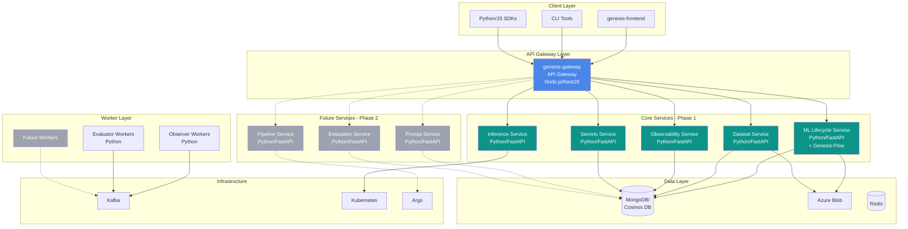

### Service Breakdown - Phase 1 (Core Services)

#### 1. API Gateway (genesis-gateway)
**Current**: `genesis-bff-modelhub`  
**Technology**: Node.js with NestJS (existing)  
**Responsibilities**:
- Request routing and load balancing
- Authentication and authorization
- Rate limiting and throttling
- Request/response transformation
- API versioning
- Circuit breaking

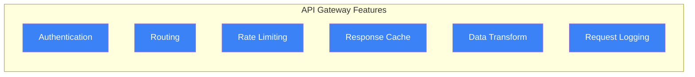

#### 2. ML Lifecycle Service (Consolidated)
**Extracted From**: Experiments, runs, models, and MLflow endpoints  
**Technology**: Python/FastAPI + Genesis-Flow  
**Responsibilities**:
- **Experiment Management**: MLflow experiments and runs
- **Model Registry**: Model versioning and lifecycle
- **Metrics & Parameters**: Tracking and storage
- **Prompts**: Prompt template management and versioning
- Direct MongoDB integration via Genesis-Flow

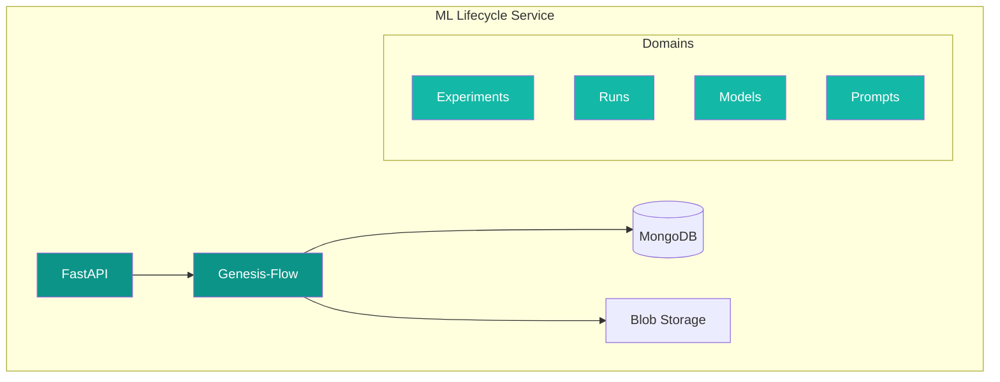

#### 3. Dataset Service
**Extracted From**: Dataset endpoints  
**Technology**: Python/FastAPI  
**Responsibilities**:
- Dataset versioning and storage
- Data quality monitoring
- Integration with Evidently
- Large file handling with streaming

#### 4. Observability Service
**Extracted From**: Observability endpoints  
**Technology**: Python/FastAPI  
**Responsibilities**:
- Trace collection and storage
- Metrics aggregation
- Dashboard APIs
- Cost tracking integration

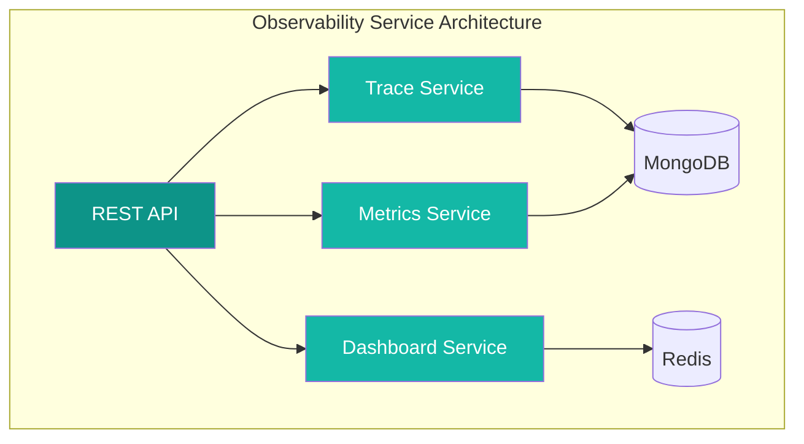

#### 5. Inference Service
**Extracted From**: KServe endpoints  
**Technology**: Python/FastAPI  
**Responsibilities**:
- Model deployment to KServe
- Endpoint management
- Autoscaling configuration
- Traffic routing

#### 6. Secrets Service
**Extracted From**: Variables endpoints  
**Technology**: Python/FastAPI  
**Responsibilities**:
- Kubernetes secrets management
- Environment variable management
- Access control
- Audit logging

### Future Services - Phase 2

#### 1. Prompt Service (Dedicated)
**Why Separate**: As prompt engineering grows, it may need its own service  
**Technology**: Python/FastAPI  
**Responsibilities**:
- Advanced prompt management
- A/B testing infrastructure
- Prompt analytics
- Template marketplace

#### 2. Pipeline Service
**Extracted From**: Pipeline endpoints  
**Technology**: Python/FastAPI  
**Responsibilities**:
- Argo workflow management
- Pipeline templates
- Execution monitoring
- Pipeline versioning

#### 3. Evaluation Service
**New Service**: Dedicated evaluation infrastructure  
**Technology**: Python/FastAPI  
**Responsibilities**:
- Model evaluation pipelines
- A/B testing for models
- Performance benchmarking
- Evaluation metrics storage


### Optional High-Performance Go Services (Future Consideration)

#### 1. Metrics Aggregator Service
**Purpose**: Real-time metrics aggregation and processing  
**Technology**: Go  
**Why Go**: High throughput, low latency, efficient memory usage  
**When to Consider**: When processing >100K metrics/second


**Key Features**:
- Process millions of metrics per second
- Real-time aggregation (sum, avg, percentiles)
- Efficient memory usage with streaming algorithms
- Batched writes to TimescaleDB

#### 2. Event Processor Service
**Purpose**: High-throughput event processing  
**Technology**: Go  
**Why Go**: Excellent concurrency primitives, low GC overhead  
**When to Consider**: When handling >50K events/second

#### 3. Query Service
**Purpose**: Fast read queries with caching  
**Technology**: Go  
**Why Go**: Fast JSON serialization, efficient caching  
**When to Consider**: When query latency becomes critical (<10ms requirement)

### Worker Architecture

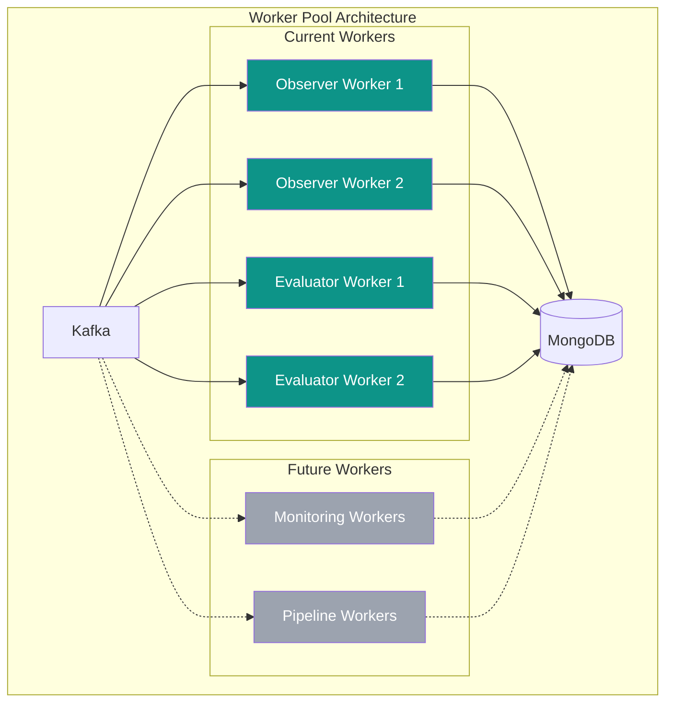

#### Current Worker Types

1. **Observer Workers** (Python)
   - Process observability traces from Kafka
   - Use autonomize-observer SDK for cost tracking
   - Write processed data to MongoDB

2. **Evaluator Workers** (Python)
   - Evaluate prompts and models
   - Complex ML computations
   - Integration with ML libraries

#### Future Worker Types

3. **Monitoring Workers** (Python/Go)
   - System resource monitoring
   - Performance metrics collection
   - Real-time alerting

4. **Pipeline Workers** (Python)
   - Argo workflow execution
   - Pipeline status updates
   - Resource management

### Event-Driven Architecture

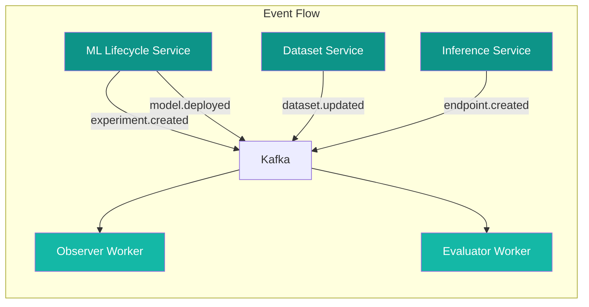

### Data Architecture

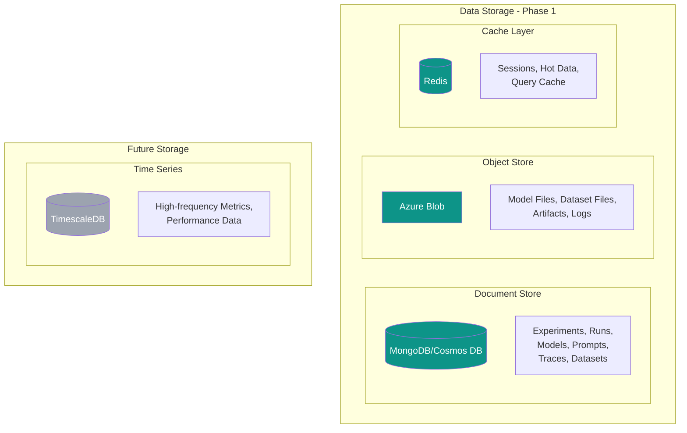

## Migration Strategy

### Phase 1: Core Services Extraction
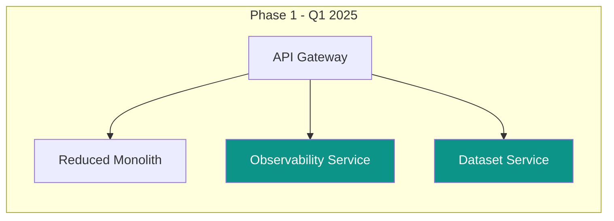

### Phase 2: ML Services Consolidation
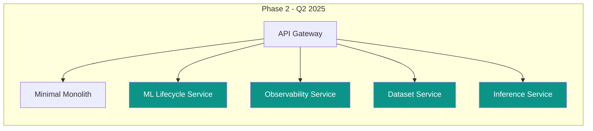

### Phase 3: Complete Migration
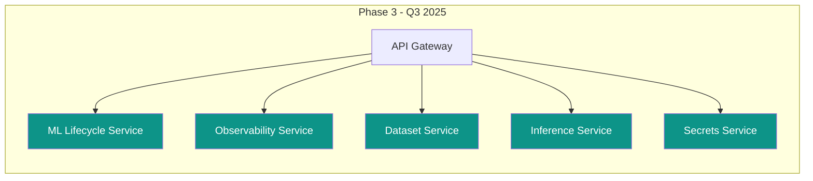

### Migration Priority

1. **Phase 1 - Q1 2025**
   - Observability Service (already semi-independent with workers)
   - Dataset Service (clear boundaries, existing Kafka integration)

2. **Phase 2 - Q2 2025**
   - ML Lifecycle Service (consolidate experiments, runs, models, prompts)
   - Inference Service (KServe management)

3. **Phase 3 - Q3 2025**
   - Secrets Service (variables management)
   - Decommission remaining monolith

## Service Communication Patterns

### Synchronous Communication


### Asynchronous Communication


## Security Architecture

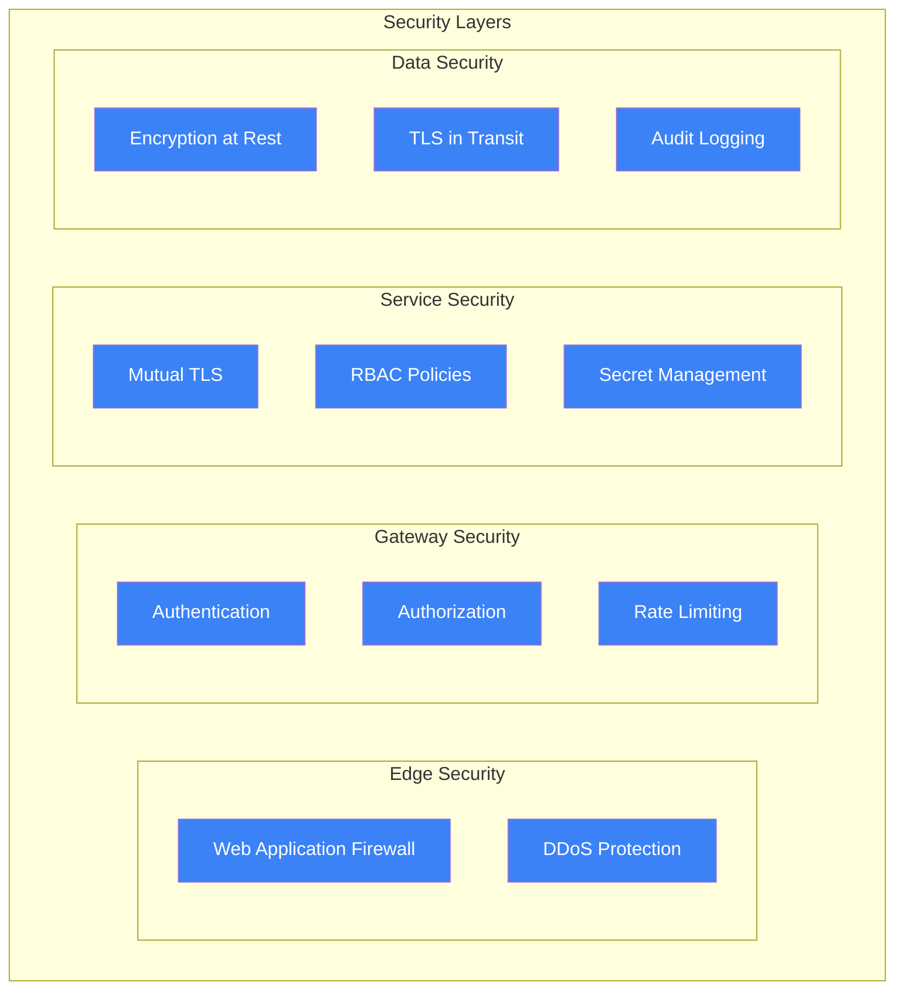

## Deployment Architecture

### Kubernetes Deployment
```yaml
apiVersion: v1
kind: Namespace
metadata:
  name: genesis-platform
---
# Example service deployment
apiVersion: apps/v1
kind: Deployment
metadata:
  name: experiment-service
  namespace: genesis-platform
spec:
  replicas: 3
  selector:
    matchLabels:
      app: experiment-service
  template:
    metadata:
      labels:
        app: experiment-service
    spec:
      containers:
      - name: experiment-service
        image: genesis/experiment-service:latest
        ports:
        - containerPort: 8000
        env:
        - name: MONGODB_URI
          valueFrom:
            secretKeyRef:
              name: mongodb-secret
              key: uri
        resources:
          requests:
            memory: "256Mi"
            cpu: "100m"
          limits:
            memory: "512Mi"
            cpu: "500m"
---
# Horizontal Pod Autoscaler
apiVersion: autoscaling/v2
kind: HorizontalPodAutoscaler
metadata:
  name: experiment-service-hpa
spec:
  scaleTargetRef:
    apiVersion: apps/v1
    kind: Deployment
    name: experiment-service
  minReplicas: 2
  maxReplicas: 10
  metrics:
  - type: Resource
    resource:
      name: cpu
      target:
        type: Utilization
        averageUtilization: 70
  - type: Resource
    resource:
      name: memory
      target:
        type: Utilization
        averageUtilization: 80
```

## Monitoring and Observability

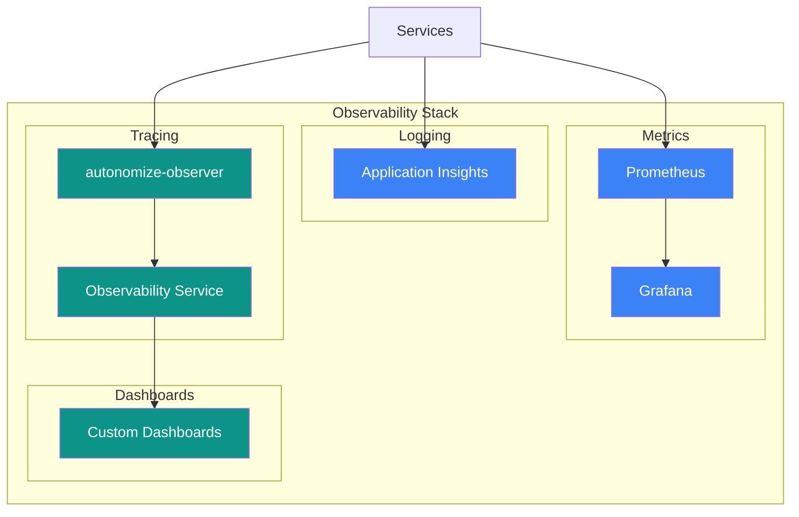

## Performance Optimization Strategies

### 1. Go Services Benefits

**Why Go for specific services:**
- **Memory Efficiency**: 10x less memory than Python for high-throughput services
- **Concurrency**: Goroutines handle 100K+ concurrent connections
- **Low Latency**: Sub-millisecond response times for hot paths
- **CPU Efficiency**: Better utilization for compute-intensive tasks

**Benchmark Comparison:**
| Operation | Python Service | Go Service | Improvement |
|-----------|---------------|------------|-------------|
| Metrics Ingestion | 10K/sec | 100K/sec | 10x |
| P95 Latency | 50ms | 5ms | 10x |
| Memory Usage | 2GB | 200MB | 10x |
| Startup Time | 30s | 2s | 15x |

### 2. Caching Strategy


## Cost Optimization

### Resource Allocation by Service

| Service | Language | Min Replicas | Max Replicas | CPU Request | Memory Request |
|---------|----------|--------------|--------------|-------------|----------------|
| Gateway | Node.js | 3 | 10 | 200m | 512Mi |
| ML Lifecycle | Python | 3 | 8 | 200m | 512Mi |
| Dataset | Python | 2 | 6 | 200m | 512Mi |
| Observability | Python | 3 | 10 | 200m | 512Mi |
| Inference | Python | 2 | 6 | 100m | 256Mi |
| Secrets | Python | 2 | 4 | 100m | 256Mi |
| Observer Worker | Python | 2 | 8 | 100m | 256Mi |
| Evaluator Worker | Python | 2 | 6 | 200m | 512Mi |

### Estimated Cost Savings

- **Infrastructure**: 30-40% reduction through efficient resource utilization
- **Development**: 50% faster feature deployment
- **Operations**: 60% reduction in incident resolution time

## Implementation Roadmap

### Q1 2025: Foundation Phase
- [ ] Set up API Gateway routing rules in genesis-bff-modelhub
- [ ] Extract Observability Service (leverage existing workers)
- [ ] Extract Dataset Service
- [ ] Implement service discovery and health checks

### Q2 2025: Core Services
- [ ] Create ML Lifecycle Service with Genesis-Flow
- [ ] Migrate experiments, runs, models, prompts endpoints
- [ ] Extract Inference Service (KServe management)
- [ ] Set up comprehensive monitoring

### Q3 2025: Completion
- [ ] Extract Secrets Service
- [ ] Complete traffic migration
- [ ] Performance optimization
- [ ] Decommission monolith

### Future Enhancements (Post Q3 2025)
- [ ] Dedicated Prompt Service (if needed)
- [ ] Pipeline Service for complex workflows
- [ ] Go-based high-performance services (if required)
- [ ] Advanced evaluation infrastructure

## Technology Stack Summary

### Current Stack (Phase 1)
- **Python**: All services (leveraging existing expertise)
- **Node.js**: API Gateway (existing genesis-bff-modelhub)
- **MongoDB/Cosmos DB**: Primary document store
- **Azure Blob**: Object storage
- **Redis**: Caching layer
- **Kubernetes**: Container orchestration
- **Kafka**: Event streaming

### Optional Go Services (Future)
When to consider Go services:
- **Metrics processing** exceeding 100K/second
- **Event processing** exceeding 50K/second
- **Sub-10ms latency** requirements
- **Memory constraints** (Go uses 10x less memory)

Potential candidates:
1. **Metrics Aggregator**: For high-frequency telemetry
2. **Event Processor**: For real-time stream processing
3. **Query Cache Service**: For ultra-low latency reads

## Conclusion

The proposed microservices architecture for the Genesis Modelhub Platform provides:

### Phase 1 Benefits (5 Core Services)
1. **Simplified Architecture**: From monolith to 5 focused services
2. **Leverages Existing Work**: Uses current workers and integrations
3. **Consolidation with Genesis-Flow**: ML Lifecycle Service handles experiments, runs, models, prompts
4. **Independent Scaling**: Each service scales based on demand
5. **Reduced Complexity**: Maintains Python stack for easier adoption

### Key Design Decisions
- **ML Lifecycle Service**: Consolidates all MLflow-related functionality using Genesis-Flow
- **Existing Workers**: Leverage current observer and evaluator workers
- **Python-First**: Focus on team expertise, consider Go only when performance demands it
- **Phased Approach**: Start with clear service boundaries, add more services as needed

### Future Flexibility
- **Prompt Service**: Can be extracted when prompt engineering needs grow
- **Pipeline Service**: Add when Argo workflow management becomes complex
- **Go Services**: Introduce only when hitting performance limits

---

**Next Steps:**
1. Review and approve the simplified architecture
2. Start with Observability Service extraction (Q1 2025)
3. Create ML Lifecycle Service with Genesis-Flow
4. Maintain flexibility for future service additions