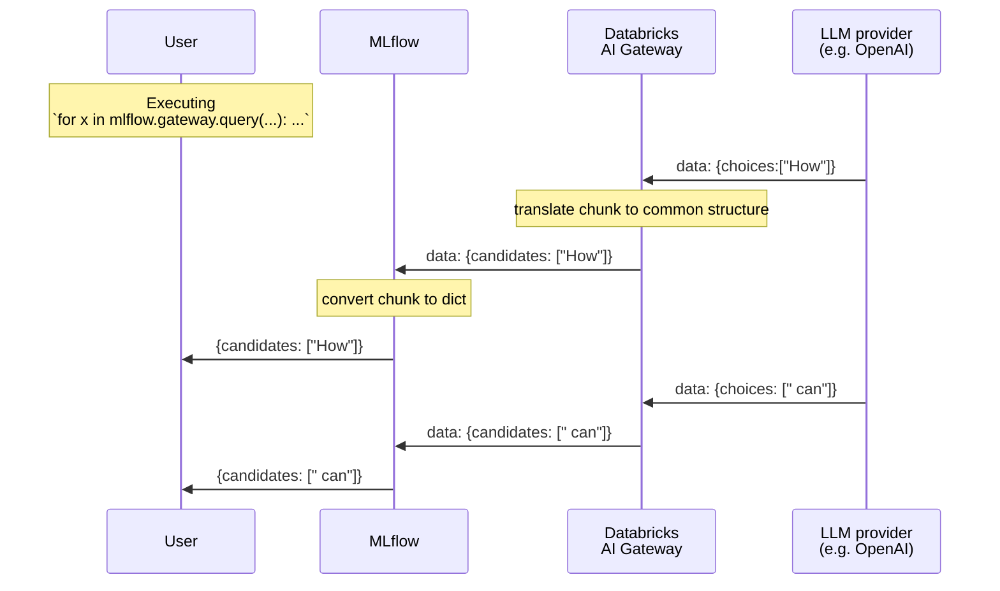

# How to demo

```sh
mlflow gateway start --config-path examples/gateway/openai/config.yaml
python stream.py
```

## OpenAI's streaming:

### Raw

```
b'data: {"id":"chatcmpl-7npjfXvSWVOk3bhIf8BPrx19plWFB","object":"chat.completion.chunk","created":1692111299,"model":"gpt-3.5-turbo-0613","choices":[{"index":0,"delta":{"role":"assistant","content":""},"finish_reason":null}]}'
b'data: {"id":"chatcmpl-7npjfXvSWVOk3bhIf8BPrx19plWFB","object":"chat.completion.chunk","created":1692111299,"model":"gpt-3.5-turbo-0613","choices":[{"index":0,"delta":{"content":"Hello"},"finish_reason":null}]}'
b'data: {"id":"chatcmpl-7npjfXvSWVOk3bhIf8BPrx19plWFB","object":"chat.completion.chunk","created":1692111299,"model":"gpt-3.5-turbo-0613","choices":[{"index":0,"delta":{"content":"!"},"finish_reason":null}]}'
b'data: {"id":"chatcmpl-7npjfXvSWVOk3bhIf8BPrx19plWFB","object":"chat.completion.chunk","created":1692111299,"model":"gpt-3.5-turbo-0613","choices":[{"index":0,"delta":{"content":" How"},"finish_reason":null}]}'
b'data: {"id":"chatcmpl-7npjfXvSWVOk3bhIf8BPrx19plWFB","object":"chat.completion.chunk","created":1692111299,"model":"gpt-3.5-turbo-0613","choices":[{"index":0,"delta":{"content":" can"},"finish_reason":null}]}'
b'data: {"id":"chatcmpl-7npjfXvSWVOk3bhIf8BPrx19plWFB","object":"chat.completion.chunk","created":1692111299,"model":"gpt-3.5-turbo-0613","choices":[{"index":0,"delta":{"content":" I"},"finish_reason":null}]}'
b'data: {"id":"chatcmpl-7npjfXvSWVOk3bhIf8BPrx19plWFB","object":"chat.completion.chunk","created":1692111299,"model":"gpt-3.5-turbo-0613","choices":[{"index":0,"delta":{"content":" assist"},"finish_reason":null}]}'
b'data: {"id":"chatcmpl-7npjfXvSWVOk3bhIf8BPrx19plWFB","object":"chat.completion.chunk","created":1692111299,"model":"gpt-3.5-turbo-0613","choices":[{"index":0,"delta":{"content":" you"},"finish_reason":null}]}'
b'data: {"id":"chatcmpl-7npjfXvSWVOk3bhIf8BPrx19plWFB","object":"chat.completion.chunk","created":1692111299,"model":"gpt-3.5-turbo-0613","choices":[{"index":0,"delta":{"content":" today"},"finish_reason":null}]}'
b'data: {"id":"chatcmpl-7npjfXvSWVOk3bhIf8BPrx19plWFB","object":"chat.completion.chunk","created":1692111299,"model":"gpt-3.5-turbo-0613","choices":[{"index":0,"delta":{"content":"?"},"finish_reason":null}]}'
b'data: {"id":"chatcmpl-7npjfXvSWVOk3bhIf8BPrx19plWFB","object":"chat.completion.chunk","created":1692111299,"model":"gpt-3.5-turbo-0613","choices":[{"index":0,"delta":{},"finish_reason":"stop"}]}'
b'data: [DONE]'
```

- SSE
- No event, only data

### Formatted

```python
# First
data: {
    "id": "chatcmpl-7npjfXvSWVOk3bhIf8BPrx19plWFB",
    "object": "chat.completion.chunk",
    "created": 1692111299,
    "model": "gpt-3.5-turbo-0613",
    "choices": [
        {
            "index": 0,
            "delta": {
                "role": "assistant",
                #       ^^^^^^^^^^^
                "content": "",
            },
            "finish_reason": null,
        }
    ],
}
...

# Intermediate
data: {
    "id": "chatcmpl-7npdHUqYPvnSjKxHCu6uD8ljlPola",
    "object": "chat.completion.chunk",
    "created": 1692110903,
    "model": "gpt-3.5-turbo-0613",
    "choices": [
        {
            "index": 0,
            "delta": {
                # No roll
                "content": "!",
            },
            "finish_reason": null,
        }
    ],
}

...

# Final
data: {
    "id": "chatcmpl-7npdHUqYPvnSjKxHCu6uD8ljlPola",
    "object": "chat.completion.chunk",
    "created": 1692110903,
    "model": "gpt-3.5-turbo-0613",
    "choices": [
        {
            "index": 0,
            "delta": {
              # No roll
              # No content
            },
            "finish_reason": "stop",
            #                ^^^^^^
        }
    ],
}

# DONE
"data: [DONE]"
```

## Cohere

```python
b'{"text":" LL","is_finished":false}'
b'{"text":"Ms","is_finished":false}'
b'{"text":" (","is_finished":false}'
b'{"text":"Large","is_finished":false}'
b'{"text":" Language","is_finished":false}'
b'{"text":" Models","is_finished":false}'
b'{"text":")","is_finished":false}'
b'{"text":" are","is_finished":false}'
b'{"text":" artificial","is_finished":false}'
b'{"text":" intelligence","is_finished":false}'
b'{"text":" models","is_finished":false}'
b'{"text":" that","is_finished":false}'
b'{"text":" are","is_finished":false}'
b'{"text":" trained","is_finished":false}'
b'{"text":" to","is_finished":false}'
b'{"text":" understand","is_finished":false}'
b'{"text":" and","is_finished":false}'
b'{"text":" generate","is_finished":false}'
b'{"text":" human","is_finished":false}'
b'{"text":"-","is_finished":false}'
b'{"is_finished":true,"finish_reason":"COMPLETE","response":{"id":"b7255d2c-2620-4f94-bd5a-97ca2dea2cbb","generations":[{"id":"7a39fee2-eedb-4493-9683-197ca87f64c9","text":" LLMs (Large Language Models) are artificial intelligence models that are trained to understand and generate human-","finish_reason":"COMPLETE"}],"prompt":"Please explain to me how LLMs work"}}'
```

- Not SSE
- The final chunk has a different structure.
- `content-type`is `application/stream+json`.

## Anthropic

https://docs.anthropic.com/claude/reference/streaming

```
event: completion
data: {"completion": " Hello", "stop_reason": null, "model": "claude-2.0"}

event: completion
data: {"completion": "!", "stop_reason": null, "model": "claude-2.0"}

event: ping
data: {}

event: completion
data: {"completion": " My", "stop_reason": null, "model": "claude-2.0"}

event: completion
data: {"completion": " name", "stop_reason": null, "model": "claude-2.0"}

event: completion
data: {"completion": " is", "stop_reason": null, "model": "claude-2.0"}

event: completion
data: {"completion": " Claude", "stop_reason": null, "model": "claude-2.0"}

event: completion
data: {"completion": ".", "stop_reason": null, "model": "claude-2.0"}

event: completion
data: {"completion": "", "stop_reason": "stop_sequence", "model": "claude-2.0"}


# Error

event: completion
data: {"completion": " Hello", "stop_reason": null, "model": "claude-2.0"}

event: error
data: {"error": {"type": "overloaded_error", "message": "Overloaded"}}
```

- SSE
- Include a named event type.

## Resources

- What's the difference between "text/event-stream" and "application/stream+json"?
- https://html.spec.whatwg.org/multipage/server-sent-events.html

## Thoughts

- Confirming to the SSE spec

## How a stream chunk is transformed:


