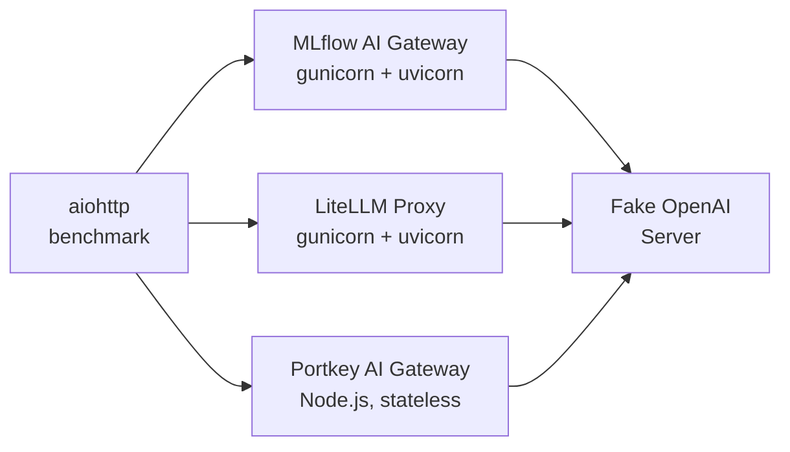
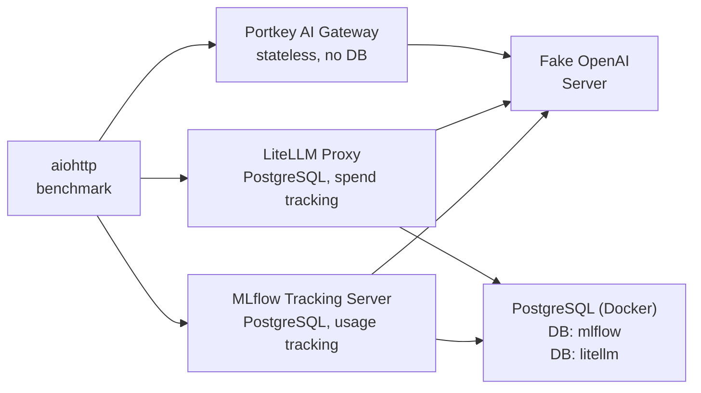
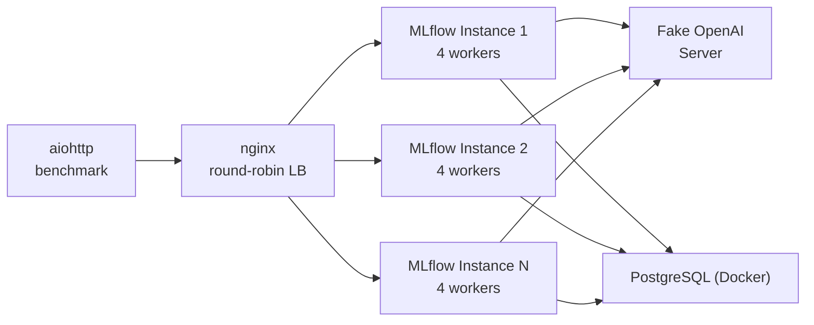
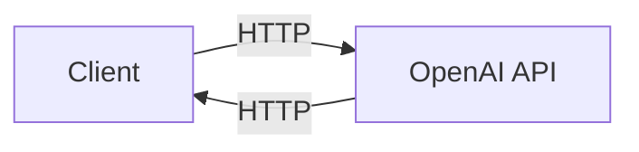
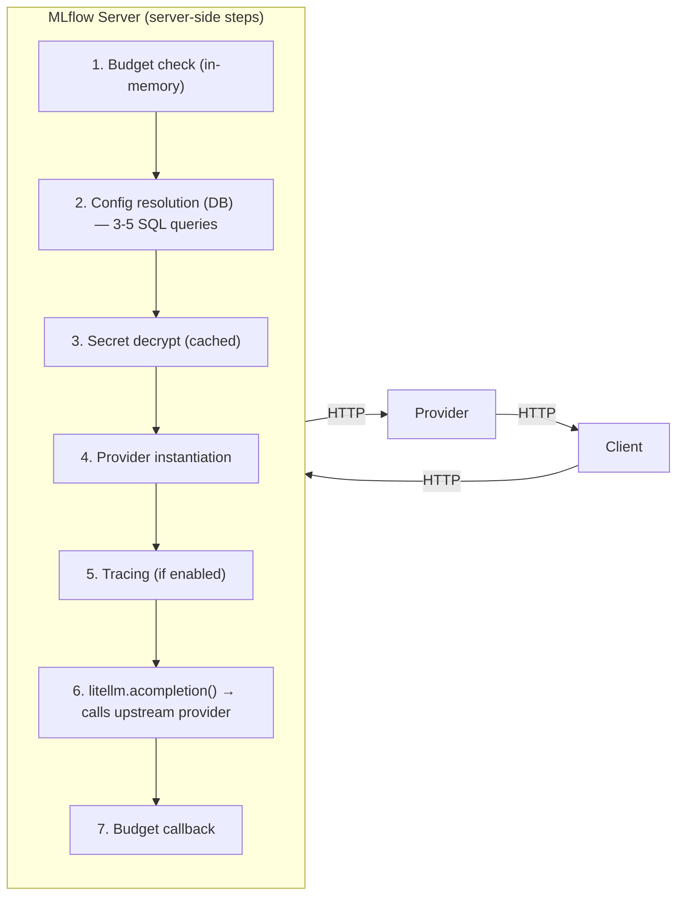
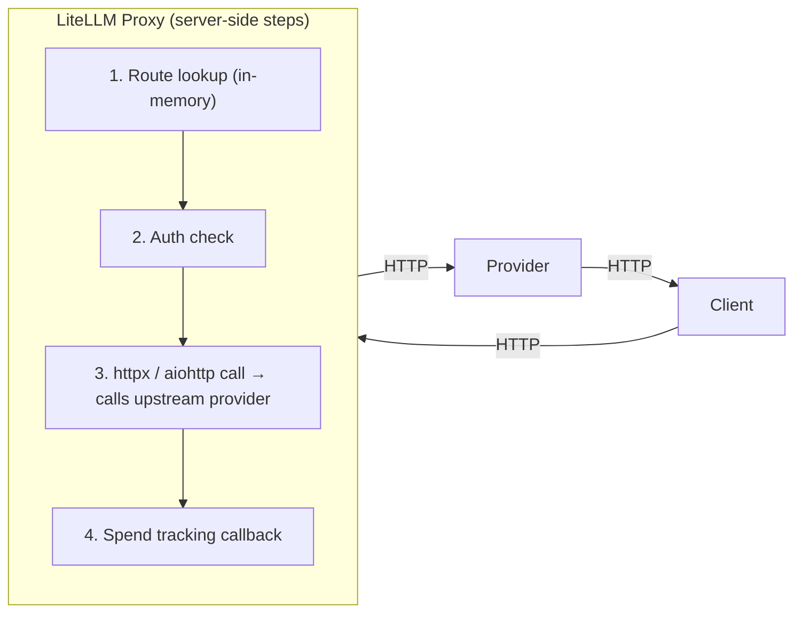
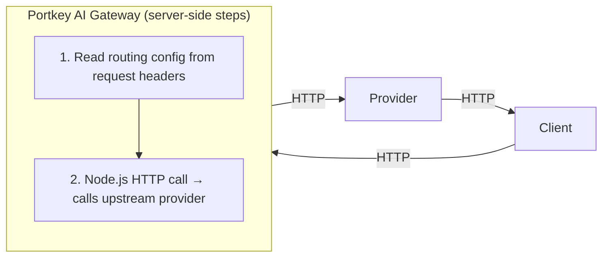
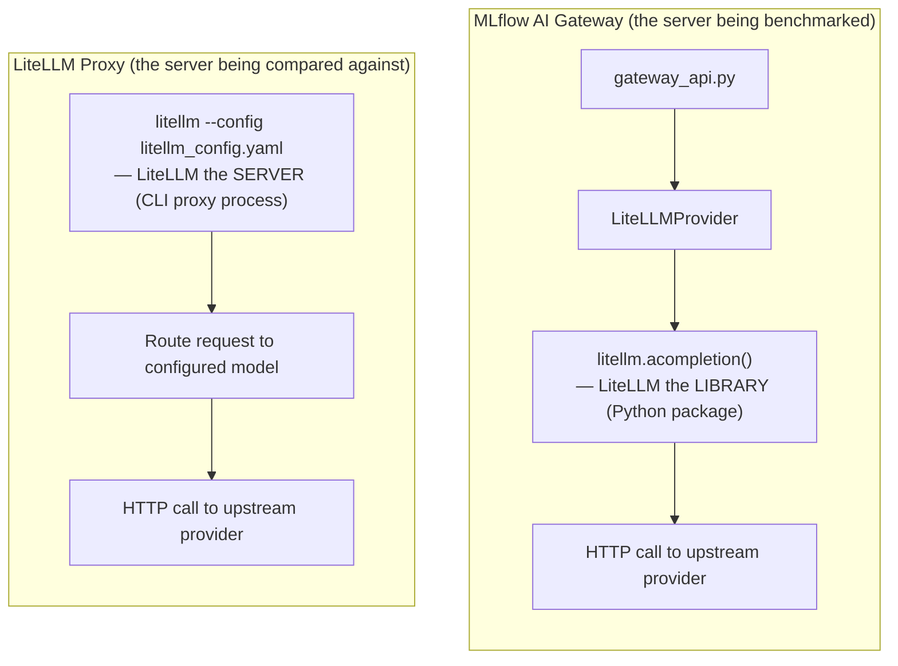
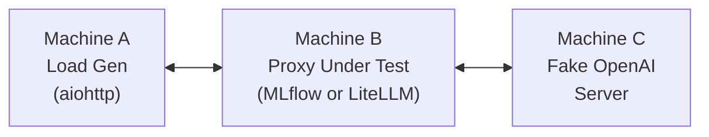

# MLflow AI Gateway Benchmark Suite

Benchmark suite for measuring the latency overhead and scalability of the MLflow AI Gateway. Includes a head-to-head comparison tool against [LiteLLM](https://docs.litellm.ai/docs/benchmarks) and [Portkey AI Gateway](https://github.com/Portkey-AI/gateway) using the same methodology for direct comparability.

**Jira**: ML-61935

## Table of Contents

- [Quick Start](#quick-start)
- [Results](#results)
- [Optimization Journey](#optimization-journey)
  - [Tradeoff Assessment](#tradeoff-assessment)
- [Known Limitations](#known-limitations)
- [Appendix](#appendix)

---

## Quick Start

### Prerequisites

```bash
# If running inside the MLflow repo with uv (recommended):
uv sync

# Otherwise:
pip install mlflow[gateway]
```

### Head-to-head vs LiteLLM & Portkey

```bash
cd benchmarks/gateway
pip install 'litellm[proxy]'  # or: uv pip install 'litellm[proxy]'
# Portkey requires Node.js/npx — automatically skipped if not found
GATEWAY_WORKERS=4 REQUESTS=2000 MAX_CONCURRENT=50 RUNS=3 bash run_comparison.sh
```

### MLflow-only tracking server benchmark

```bash
cd benchmarks/gateway
bash run_tracking_server_benchmark.sh
```

### Full-stack comparison (both on PostgreSQL, requires Docker)

```bash
cd benchmarks/gateway
pip install 'litellm[proxy]'
bash run_full_stack_comparison.sh
```

### Multi-instance comparison (nginx load balancer, requires Docker)

```bash
cd benchmarks/gateway
pip install 'litellm[proxy]'
# Default: 4 instances × 4 workers, 200 concurrency, 10K requests
bash run_multi_instance_comparison.sh

# Match LiteLLM's published benchmark setup (4 instances)
INSTANCES=4 WORKERS_PER_INSTANCE=4 REQUESTS=200000 MAX_CONCURRENT=50 RUNS=1 \
    bash run_multi_instance_comparison.sh
```

### Which benchmark script should I use?

| Script                             | What it tests                            | When to use                                                                                                |
| ---------------------------------- | ---------------------------------------- | ---------------------------------------------------------------------------------------------------------- |
| `run_comparison.sh`                | Single-instance, SQLite, no tracking     | Quick head-to-head proxy overhead comparison                                                               |
| `run_tracking_server_benchmark.sh` | Single-instance MLflow only              | Isolate MLflow tracking overhead                                                                           |
| `run_full_stack_comparison.sh`     | Single-instance, PostgreSQL, tracking ON | Production-like comparison (all services run simultaneously)                                               |
| `run_multi_instance_comparison.sh` | Multi-instance behind nginx, PostgreSQL  | Sustained load testing; matches [LiteLLM's published methodology](https://docs.litellm.ai/docs/benchmarks) |

**Key difference**: `run_full_stack_comparison.sh` runs all gateways **simultaneously** (faster, but services compete for resources). `run_multi_instance_comparison.sh` runs each gateway **sequentially** (slower, but each gets full machine resources for clean sustained results).

---

## Results

All results: MacBook Pro (Apple Silicon), 4 workers, 50 concurrent users. Config caching is enabled (the default since [#21660](https://github.com/mlflow/mlflow/pull/21660)).

> **Note**: The "Full-stack, tracking ON" row includes optimizations from this branch that have **not yet been shipped to `master`**: DB contention fix, ASGI middleware conversion, and batch span processor (see [Optimization Journey](#optimization-journey)). The other rows (barebone, zero delay, tracking OFF) reflect the current `master` behavior. On current `master`, tracking-ON achieves **~77 rps / P99≈1700ms** — an 11x improvement is pending review.

### Combined results

All benchmarks: 2000 requests/run, 3 runs, 4 workers, 50 concurrency.

| Configuration                | Metric          | MLflow Gateway | LiteLLM   | Portkey       |
| ---------------------------- | --------------- | -------------- | --------- | ------------- |
| **Barebone**                 | **P50 latency** | 56.7 ms        | 76.8 ms   | **52.5 ms**   |
| SQLite, no tracking          | **P95 latency** | 77.1 ms        | 104.0 ms  | **55.8 ms**   |
| 50ms delay                   | **P99 latency** | 110.8 ms       | 256.7 ms  | **59.0 ms**   |
|                              | **Throughput**  | **818 rps**    | 616 rps   | **941 rps**   |
|                              |                 |                |           |               |
| **Zero delay**               | **P50 latency** | 13.6 ms        | 40.1 ms   | **8.0 ms**    |
| SQLite, no tracking          | **P95 latency** | 57.5 ms        | 77.1 ms   | **14.2 ms**   |
| 0ms delay (pure overhead)    | **P99 latency** | 64.5 ms        | 232.5 ms  | **18.1 ms**   |
|                              | **Throughput**  | **3,306 rps**  | 1,181 rps | **5,575 rps** |
|                              |                 |                |           |               |
| **Full-stack, tracking OFF** | **P50 latency** | **56.2 ms**    | 92.0 ms   | 52.2 ms       |
| PostgreSQL, no tracking      | **P95 latency** | **79.9 ms**    | 128.6 ms  | 55.0 ms       |
| 50ms delay                   | **P99 latency** | **108.3 ms**   | 282.3 ms  | 60.6 ms       |
|                              | **Throughput**  | **816 rps**    | 530 rps   | **944 rps**   |
|                              |                 |                |           |               |
| **Full-stack, tracking ON**  | **P50 latency** | **54.8 ms**    | 103.0 ms  | **52.7 ms**   |
| PostgreSQL, tracking ON      | **P95 latency** | **72.1 ms**    | 154.7 ms  | **57.3 ms**   |
| 50ms delay                   | **P99 latency** | **102.4 ms**   | 298.8 ms  | **68.2 ms**   |
|                              | **Throughput**  | **852 rps**    | 461 rps   | **932 rps**   |

### Multi-instance results (nginx load balancer)

4 instances × 4 workers behind nginx round-robin, PostgreSQL, tracking/spend tracking ON. Each gateway benchmarked **sequentially** (stopped between phases) so each gets full machine resources.

| Configuration                 | Metric          | MLflow Gateway | LiteLLM   | Portkey       |
| ----------------------------- | --------------- | -------------- | --------- | ------------- |
| **Sustained (200K requests)** | **P50 latency** | 53.9 ms        | 56.2 ms   | **52.6 ms**   |
| 50 concurrency, 1 run         | **P95 latency** | **57.6 ms**    | 66.2 ms   | **57.1 ms**   |
| ~3.5 min per gateway          | **P99 latency** | **62.2 ms**    | 93.8 ms   | **61.3 ms**   |
|                               | **Throughput**  | **902 rps**    | 849 rps   | **928 rps**   |
|                               | **Failures**    | 0              | 0         | 0             |
|                               |                 |                |           |               |
| **Burst (2K × 3 runs)**       | **P50 latency** | 53.6 ms        | 59.6 ms   | **52.4 ms**   |
| 100 concurrency               | **P99 latency** | 81.3 ms        | 88.4 ms   | **68.0 ms**   |
|                               | **Throughput**  | **1,777 rps**  | 1,552 rps | **1,839 rps** |
|                               | **Failures**    | 0              | 0         | 0             |

> **Note**: At 50 concurrency, all three gateways saturate the client (theoretical max ~909 rps at 55ms/req). The 100-concurrency burst test shows true differentiation. Portkey runs as a single Node.js process (not multi-instance), matching [LiteLLM's published benchmark methodology](https://docs.litellm.ai/docs/benchmarks).

**Key observations:**

- **MLflow with full tracing (852 rps) is faster than LiteLLM without any tracking (602 rps)** — tracing is essentially free
- **MLflow is within 9% of Portkey** (852 vs 932 rps), despite Portkey being stateless with no DB
- **Portkey is consistently ~930 rps** across all configs — it's stateless with no features to slow it down
- **MLflow without tracking (816-818 rps) beats LiteLLM (530-616 rps)** by ~1.4x in every config
- **Pure proxy overhead** (zero delay): Portkey 8ms < MLflow 14ms < LiteLLM 40ms
- **Sustained multi-instance**: MLflow P99 (62ms) is 34% lower than LiteLLM (94ms) and within 1ms of Portkey (61ms)

### Usage/spend tracking overhead

| Gateway     | With tracking | Without tracking | Overhead               |
| ----------- | ------------- | ---------------- | ---------------------- |
| **MLflow**  | 852 rps       | 816 rps          | **1.04x slower** (~4%) |
| **LiteLLM** | 461 rps       | 602 rps          | **1.3x slower** (~30%) |

After the optimizations described in the [Optimization Journey](#optimization-journey) section (not yet shipped), MLflow's tracing overhead is comparable to LiteLLM's spend tracking overhead. On current `master` without these optimizations, the tracking overhead is **~10.6x** (77 rps with tracking vs 816 without).

> **Note**: Portkey's OSS version has no usage/spend tracking, so it runs at the same speed regardless of configuration.
>
> **Historical context**: Before optimizations, MLflow with tracking was **10.6x slower** (77 rps). See the [Optimization Journey](#optimization-journey) for the step-by-step path from 77 rps to 852 rps.

### Bottleneck breakdown

| Bottleneck                        | On `master`   | With optimizations (this branch) | Evidence                             |
| --------------------------------- | ------------- | -------------------------------- | ------------------------------------ |
| **Usage tracking / tracing**      | ~10.6x        | ~1.04x                           | 77 rps → 852 rps with optimizations  |
| **Uncached config DB queries**    | ~5x (shipped) | ~5x (shipped)                    | 14 rps → 67 rps when cached          |
| **Core proxy path** (no overhead) | 1x (baseline) | 1x (baseline)                    | 816 rps — faster than LiteLLM at 530 |

Usage tracking is currently a ~10.6x bottleneck on `master` (77 rps with tracking vs 816 without). The optimizations in this branch reduce that to ~4% overhead (852 rps). See the [Optimization Journey](#optimization-journey) for details and [tradeoff assessment](#tradeoff-assessment). Endpoint config caching (already shipped) resolved the other major bottleneck.

> **Note**: Endpoint config caching is now enabled by default via `SecretCache` in `config_resolver.py` ([#21660](https://github.com/mlflow/mlflow/pull/21660)). No special configuration is needed to reproduce the cached results above.

---

## Optimization Journey

This section documents the step-by-step process of identifying and fixing performance bottlenecks in the MLflow AI Gateway's usage tracking path. Each optimization is described with its root cause, fix, and measured impact.

**Starting point**: 77 rps with usage tracking on PostgreSQL (10.6x slower than without tracking).
**End result**: 852 rps (within 9% of stateless Portkey at 932 rps).

### Summary

| Stage                      | RPS     | P99        | Key change                               | Impact                  |
| -------------------------- | ------- | ---------- | ---------------------------------------- | ----------------------- |
| Baseline (with tracking)   | 77      | ~1,700 ms  | Starting point                           | —                       |
| + DB contention fix        | 220     | 442 ms     | Consolidated span+trace writes           | 2.9x                    |
| + ASGI middleware          | 220     | 475 ms     | Eliminated BaseHTTPMiddleware overhead   | Latency fix (see below) |
| + Batch span processor     | **852** | **102 ms** | Decoupled trace export from request path | **3.9x**                |
| Without tracking (ceiling) | 891     | 85 ms      | No tracing at all                        | 1.05x headroom          |

Total improvement: **77 → 852 rps (11x)**. Tracing overhead reduced from 10.6x to 1.05x.

### Phase 1: Profiling infrastructure

Before optimizing, we needed visibility into where time was being spent. A per-phase profiling system was added to the gateway request handler (`gateway_api.py`), enabled with `MLFLOW_GATEWAY_PROFILE=1`.

The profiler wraps each phase of the `invocations()` handler in a timer and writes a summary to a file:

```
Phase                      Mean      P50      P90      P99
parse_body                30.21ms    7.77ms   81.12ms  378.22ms ***
get_config                 0.21ms    0.02ms    0.04ms    0.06ms
create_provider            0.05ms    0.03ms    0.06ms    0.10ms
provider_call            192.23ms  136.19ms  217.39ms 1544.71ms ***
```

This identified two hot spots: `parse_body` and `provider_call` (which includes tracing).

### Phase 2: Trace export DB contention fix (77 → 220 rps)

**Problem**: Server logs showed `DeadlockDetected` and `UniqueViolation` errors. For each gateway request, `MlflowV3SpanExporter.export()` enqueued **two independent async tasks** that raced on the same DB rows:

1. **`log_spans()`**: INSERT/MERGE span rows + UPDATE `trace_info` + MERGE `trace_tag`
2. **`start_trace()`**: INSERT `trace_info` + INSERT tags + INSERT metadata (14 rows) + INSERT metrics

With 10 async worker threads and 50 concurrent requests, both tasks target the same `trace_id` rows, causing PostgreSQL deadlocks and expensive INSERT → `IntegrityError` → rollback → SELECT → merge cycles.

```
Before:  export() → async task 1: log_spans()     ←─ RACE ─→  async task 2: start_trace()
After:   export() → async task: start_trace(spans=...)    (single transaction, no race)
```

**Fix**: Gateway traces are short-lived (2 spans, ~50-100ms) — the trace completes before the first `log_spans` task even runs. A `write_spans_with_trace` flag consolidates both writes into a single `start_trace()` transaction, eliminating the race.

Auto-enabled when `MLFLOW_ENABLE_ASYNC_TRACE_LOGGING=true` (set by gateway at startup) with a non-Databricks SQL backend.

**Impact**: 77 → 220 rps, DB errors eliminated.

**Files**: `mlflow/tracing/export/mlflow_v3.py`, `mlflow/tracing/client.py`, `mlflow/store/tracking/sqlalchemy_store.py`, `mlflow/store/tracking/abstract_store.py`, `mlflow/tracing/provider.py`

**Review notes**: This is a targeted fix for the gateway's specific access pattern (short traces, async export). The flag defaults to `False` and is only enabled when async logging is explicitly set. Normal SDK usage is unaffected.

### Phase 3: Pure ASGI middleware (30ms → 0.02ms per request overhead)

**Problem**: Profiling showed `parse_body` at 30ms mean (P99=378ms) — but sub-phase timing revealed `parse_body.json` was 0.00ms. The bottleneck was `await request.body()` (Starlette's async receive), not JSON parsing.

**Root cause**: The workspace context middleware used `@app.middleware("http")` which wraps handlers in Starlette's `BaseHTTPMiddleware`. This spawns a **background task per request** and streams the response through a memory channel. Under 50 concurrent requests, this creates massive event loop scheduling overhead — each `await request.body()` waits for its ASGI message to be delivered through the extra task layer.

**Proof**: Temporarily disabling the middleware reduced `parse_body` from 30ms to 0.02ms.

**Fix**: Convert `WorkspaceContextMiddleware` from BaseHTTPMiddleware pattern:

```python
# Before — spawns background task per request via call_next
@app.middleware("http")
async def workspace_middleware(request, call_next):
    ...
    response = await call_next(request)


# After — pure ASGI passthrough, no extra task
class WorkspaceContextMiddleware:
    async def __call__(self, scope, receive, send):
        ...
        await self.app(scope, receive, send)
```

**Impact**: Per-request overhead dropped from 30ms to 0.37ms (80x reduction). RPS didn't change significantly because `provider_call` (tracing) was still the dominant cost.

**Files**: `mlflow/server/fastapi_app.py`

**Review notes**: This is a safe, general-purpose improvement. The pure ASGI pattern is what Starlette's own built-in middleware classes use (e.g., `HostValidationMiddleware` in `fastapi_security.py`). All 7 workspace middleware tests pass unchanged. Note: the auth middleware (`fastapi_permission_middleware` in `server/auth/__init__.py`) has the same `BaseHTTPMiddleware` pattern and should be converted as a follow-up when auth is enabled in production.

### Phase 4: Batch span processor (220 → 852 rps)

**Problem**: With the middleware fix eliminating `parse_body` overhead, profiling showed `provider_call` at 181ms mean (vs 53ms without tracing). The 130ms gap was traced to `SimpleSpanProcessor.on_end()`, which calls `self.span_exporter.export()` **synchronously inline** in the request's call stack. Even though the exporter queues an async DB task, the export machinery itself (creating tasks, scheduling on the event loop) runs before the response is returned.

**Root cause**: `BaseMlflowSpanProcessor` extends `SimpleSpanProcessor`, which exports every span inline during `on_end`. Under 50 concurrent requests, this creates 50+ export tasks competing for the same event loop, adding 130ms of scheduling overhead to each request.

**Fix**: Added a `use_batch_processor` flag that delegates to OTel's `BatchSpanProcessor`. Instead of exporting inline, `on_end` queues the span in memory. A background thread flushes batches every 500ms, completely decoupling trace export from the request path.

```python
# on_end with SimpleSpanProcessor (before):
#   update trace info → export(span) → [DB write blocks event loop] → return

# on_end with BatchSpanProcessor (after):
#   update trace info → queue(span) → return immediately
#   [background thread flushes batch every 500ms]
```

**Impact**: 220 → 852 rps. `provider_call` dropped from 181ms to 52.7ms (essentially the raw 50ms fake server delay).

**Files**: `mlflow/tracing/processor/base_mlflow.py`, `mlflow/tracing/processor/mlflow_v3.py`, `mlflow/tracing/provider.py`

**Review notes**: This is the highest-impact change and the one that needs the most scrutiny. Key considerations:

- **Trace delivery latency**: Traces are delivered up to 500ms after the request completes (configurable via `schedule_delay_millis`). This is fine for the gateway (traces are for observability, not real-time), but would change behavior for SDK users who call `mlflow.search_traces()` immediately after a traced function returns.
- **Activation scope**: Only enabled when `MLFLOW_ENABLE_ASYNC_TRACE_LOGGING=true` AND the backend is not Databricks. The gateway sets this env var at startup; normal SDK usage doesn't.
- **Data integrity**: The batch processor's background thread calls the same `export()` method as before — just batched and deferred. The exporter, DB writes, and async queue logic are unchanged.
- **Shutdown behavior**: `shutdown()` and `force_flush()` are delegated to the batch processor, ensuring pending spans are flushed on process exit.
- **Memory**: Under sustained load, the batch queue can grow up to `max_queue_size` (OTel default: 2048 spans). With ~2 spans per trace and 852 rps, the queue cycles every ~1.2 seconds — well within limits.

### Additional optimizations (smaller impact)

These changes were made earlier in the process. They have modest individual impact but contribute to overall performance:

1. **Shared aiohttp session**: Replaced per-request `ClientSession` creation with a lazily-initialized shared session, reusing TCP connections across requests. Files: `mlflow/gateway/providers/utils.py`

2. **Per-trace deduplication locks**: Replaced the global lock in `BaseMlflowSpanProcessor` with per-trace locks, so concurrent spans from different traces don't serialize. Files: `mlflow/tracing/processor/base_mlflow.py`

3. **Cached `inspect.signature()`**: Added `@lru_cache` to `inspect.signature()` calls in the tracing utils, avoiding repeated introspection of the same functions. Files: `mlflow/tracing/utils/__init__.py`

4. **`model_dump()` over `jsonable_encoder()`**: Replaced FastAPI's internal `jsonable_encoder()` with Pydantic v2's native `model_dump()` in provider response serialization. Files: `mlflow/gateway/providers/openai.py`

### Tradeoff assessment

Each optimization trades something for performance. This section is an honest accounting of what we gave up, what risks were introduced, and what reviewers should scrutinize before shipping to production.

#### Summary

| Change                 | Complexity        | Security  | Data integrity               | Recommendation       |
| ---------------------- | ----------------- | --------- | ---------------------------- | -------------------- |
| ASGI middleware        | Reduces           | No impact | No impact                    | **Ship as-is**       |
| DB contention fix      | Slight increase   | No impact | No impact for gateway traces | **Ship as-is**       |
| Batch span processor   | Moderate increase | No impact | 500ms loss window on crash   | **Needs discussion** |
| Shared aiohttp session | No change         | No impact | No impact                    | **Ship as-is**       |

#### ASGI middleware — no real tradeoffs

The before/after behavior is identical: same workspace resolution logic, same error handling, same context management. The only difference is _how_ Starlette dispatches the call.

One subtle difference: the old code used Starlette's `Request` object to read headers (case-insensitive lookup). The new code reads raw ASGI headers (always lowercase per ASGI spec). This is correct — ASGI servers always lowercase header names before passing them to the application. All 7 workspace middleware tests pass unchanged.

This actually _reduces_ complexity. The pure ASGI pattern is simpler than `BaseHTTPMiddleware` (no hidden task spawning, no memory channel) and matches what the security middlewares (`HostValidationMiddleware`, `SecurityHeadersMiddleware`) already do.

**Follow-up**: The auth middleware (`fastapi_permission_middleware` in `server/auth/__init__.py`) uses the same `@app.middleware("http")` pattern. Under load with auth enabled, it would add the same ~30ms overhead. Converting it to pure ASGI would be a valuable follow-up.

#### DB contention fix — loses incremental span visibility

**What we give up**: With `SimpleSpanProcessor` + `log_spans`, a long-running trace's spans appear in the DB as they complete. With the consolidated write, all spans appear at once when the trace finishes.

**Why it doesn't matter for the gateway**: Gateway traces are 2 spans, ~50-100ms total. They complete before the first `log_spans` async task even starts executing. There is no window where partial spans would be visible.

**Where it could matter**: If someone repurposed this flag for long-running SDK traces (minutes), they'd lose incremental visibility. But the flag is gated behind `MLFLOW_ENABLE_ASYNC_TRACE_LOGGING=true` + non-Databricks, which only the gateway sets automatically. Normal SDK usage is unaffected.

#### Batch span processor — real tradeoffs exist

This is the highest-impact change (220 → 852 rps) and the one that deserves the most scrutiny.

**1. Trace delivery latency (up to 500ms delay)**

Traces are delivered up to 500ms after the request completes (the `schedule_delay_millis` setting) instead of immediately. For the gateway's observability use case, this is acceptable. But:

- A monitoring system that polls for traces and expects them within milliseconds of request completion would see a delay.
- `mlflow.search_traces()` called right after a traced gateway call might not find the trace yet.

**2. Data loss window on hard crash**

With `SimpleSpanProcessor`, if the process crashes, only the in-flight export is lost. With `BatchSpanProcessor`, up to 500ms of queued spans could be lost on hard crash (`kill -9`). OTel's batch processor calls `shutdown()` on graceful exit (flushing the queue), but ungraceful termination loses buffered data.

At 852 rps with ~2 spans per trace, the batch queue holds ~850 spans at any moment. A hard crash loses up to ~425 traces — about 0.5 seconds of data.

**3. Double-buffering concern**

With `use_batch_processor=True` AND `_is_async_enabled=True` (which is always the case since both are gated on the same env var), traces pass through two layers of async queuing:

1. OTel `BatchSpanProcessor` queue → background thread flushes every 500ms
2. → `MlflowV3SpanExporter.export()` → `AsyncTraceExportQueue` → another thread pool

This is redundant. A simplification would be to disable the `AsyncTraceExportQueue` when batch processing is active, since the `BatchSpanProcessor` already provides the decoupling. This is a candidate for follow-up cleanup.

**4. Code complexity**

The current implementation uses a delegation pattern (`_batch_delegate`) rather than a clean inheritance swap. The class still inherits from `SimpleSpanProcessor` but conditionally delegates `on_end`/`shutdown`/`force_flush` to a separate `BatchSpanProcessor` instance. This is slightly awkward — changing the base class directly would be cleaner but would affect all users, not just the gateway.

#### Shared aiohttp session — minor tradeoff

Session state (TCP connections) persists across requests. If the upstream server has connection limits or if a TCP connection enters a bad state, it could affect subsequent requests. The `if _session.closed` check mitigates the worst case. In practice, connection reuse is the standard pattern for HTTP clients and is a net positive for both performance and resource usage.

---

## Known Limitations

### LiteLLM `network_mock` mode

LiteLLM's published benchmarks use `network_mock: true`, which skips the real HTTP call entirely and returns a canned response inside the proxy process. Our comparison uses the real HTTP path (proxy -> fake server) for both sides, which is more representative of production behavior but produces different numbers than LiteLLM's published figures.

---

## Appendix

### A. Architecture

#### Head-to-head comparison (`run_comparison.sh`)



All proxies run on the same machine, hitting the same fake backend. MLflow and LiteLLM use gunicorn workers; Portkey runs as a single Node.js process via `npx @portkey-ai/gateway`. The benchmark client uses `aiohttp` with connection pooling (matching LiteLLM's own `benchmark_mock.py` methodology).

#### Full-stack comparison (`run_full_stack_comparison.sh`)



#### Multi-instance comparison (`run_multi_instance_comparison.sh`)



Each gateway (MLflow, LiteLLM, Portkey) is benchmarked **sequentially** — instances are started, benchmarked, then stopped before the next gateway starts. This ensures each gateway gets full machine resources and results aren't affected by resource contention. nginx is shared across phases; its upstream config is reloaded between phases.

### B. Request Lifecycle

#### 1. Direct to provider (baseline — not benchmarked)



Steps: DNS + TLS handshake + send request + provider inference + receive response. This is the minimum latency for any LLM call. The gateway cannot reduce this.

#### 2. Through MLflow AI Gateway



**7 server-side steps** per request. Steps 2 (config resolution) and 5 (tracing) are the dominant bottlenecks — see [Bottleneck breakdown](#bottleneck-breakdown). When both are eliminated, steps 1/3/4/6/7 add only ~10ms of overhead (see [zero-delay results](#combined-results)).

#### 3. Through LiteLLM Proxy



**4 server-side steps** per request. Config is loaded from YAML at startup and kept in memory — no per-request DB queries. When spend tracking is DB-backed (PostgreSQL mode), step 4 involves async DB writes.

#### 4. Through Portkey AI Gateway



**2 server-side steps** per request. Routing is entirely header-based — no database, no YAML config, no persistent state. The OSS version has no usage tracking, spend tracking, or caching.

#### Side-by-side step comparison

| Step                | MLflow AI Gateway         | LiteLLM Proxy         | Portkey AI Gateway |
| ------------------- | ------------------------- | --------------------- | ------------------ |
| Config lookup       | 3-5 DB queries            | In-memory (from YAML) | Request headers    |
| Auth                | Middleware (when enabled) | Built-in              | N/A in OSS         |
| Secret management   | Encrypted, cached (60s)   | Plain YAML            | Request headers    |
| Provider call       | `aiohttp`                 | `httpx` / `aiohttp`   | Node.js HTTP       |
| Usage/cost tracking | `mlflow.trace()` + spans  | Spend callbacks + DB  | N/A in OSS         |
| Budget enforcement  | In-memory + DB refresh    | In-memory + DB        | N/A in OSS         |

### C. MLflow and LiteLLM: Library vs Proxy

The name "LiteLLM" appears in two different roles in this benchmark:



- **LiteLLM the library** (used inside MLflow): A Python client library for provider abstraction. The `LiteLLMProvider` class calls `litellm.acompletion()` — a lightweight in-process function call with no server overhead.
- **LiteLLM the proxy** (benchmarked as competitor): A standalone HTTP proxy server (`litellm --config ...`) with its own config, auth, spend tracking, and rate limiting.

**Why can MLflow be faster despite using litellm internally?** Because the bottlenecks are not in the litellm library call (~1-2ms). They are in config resolution (DB queries) and usage tracking (tracing). When both are optimized, MLflow's `aiohttp`-based upstream call has less overhead than LiteLLM Proxy's full request pipeline.

### D. Measurement Methodology

**What is measured**: Latency is measured **client-side** using `time.perf_counter()` in `benchmark_compare.py`. Each measurement includes client serialization, loopback network round-trip, full server processing, and response deserialization. Only HTTP 200 responses are counted.

**Connection pooling**: The benchmark client uses `aiohttp.TCPConnector` with HTTP keep-alive, matching production client behavior. TCP handshake cost is amortized after warmup.

**Warmup phase**: Before each timed run, `min(50, n_requests)` warmup requests are sent and discarded.

**What is NOT included** (vs real-world deployments):

| Factor             | In benchmark      | In production              |
| ------------------ | ----------------- | -------------------------- |
| Network latency    | ~0ms (loopback)   | 1-100ms per hop            |
| TLS/SSL            | None (plain HTTP) | ~5-20ms per new connection |
| Provider inference | Fixed fake delay  | Variable (50ms-60s+)       |
| Authentication     | Disabled          | Token validation, RBAC     |

**What the benchmark isolates**: By controlling for network and provider latency, the benchmark measures **pure proxy overhead**. Setting `FAKE_RESPONSE_DELAY_MS=0` isolates it entirely: MLflow adds ~10ms, LiteLLM adds ~41ms.

### E. Benchmark Configurations

#### `run_comparison.sh` environment variables

| Variable                 | Default | Description                                         |
| ------------------------ | ------- | --------------------------------------------------- |
| `GATEWAY_WORKERS`        | 4       | Workers for both proxies                            |
| `REQUESTS`               | 2000    | Total requests per run                              |
| `MAX_CONCURRENT`         | 50      | Max concurrent requests                             |
| `RUNS`                   | 3       | Number of benchmark runs                            |
| `FAKE_RESPONSE_DELAY_MS` | 50      | Simulated provider latency (ms)                     |
| `USAGE_TRACKING`         | false   | Enable MLflow usage tracking (set `true` to enable) |

#### `run_tracking_server_benchmark.sh` environment variables

| Variable                  | Default | Description                                            |
| ------------------------- | ------- | ------------------------------------------------------ |
| `TRACKING_SERVER_WORKERS` | 4       | Workers for `mlflow server`                            |
| `REQUESTS`                | 2000    | Total requests per run                                 |
| `MAX_CONCURRENT`          | 50      | Max concurrent requests                                |
| `RUNS`                    | 3       | Number of benchmark runs                               |
| `FAKE_RESPONSE_DELAY_MS`  | 50      | Simulated provider latency (ms)                        |
| `USAGE_TRACKING`          | true    | Enable usage tracking/tracing (set `false` to disable) |

#### `run_full_stack_comparison.sh` environment variables

| Variable                 | Default | Description                                           |
| ------------------------ | ------- | ----------------------------------------------------- |
| `WORKERS`                | 4       | Workers for both proxies                              |
| `REQUESTS`               | 2000    | Total requests per run                                |
| `MAX_CONCURRENT`         | 50      | Max concurrent requests                               |
| `RUNS`                   | 3       | Number of benchmark runs                              |
| `FAKE_RESPONSE_DELAY_MS` | 50      | Simulated provider latency (ms)                       |
| `USAGE_TRACKING`         | true    | Enable MLflow usage tracking (set `false` to disable) |

#### `run_multi_instance_comparison.sh` environment variables

| Variable                 | Default | Description                                           |
| ------------------------ | ------- | ----------------------------------------------------- |
| `INSTANCES`              | 4       | Number of gateway instances per proxy                 |
| `WORKERS_PER_INSTANCE`   | 4       | Gunicorn workers per instance                         |
| `REQUESTS`               | 10000   | Total requests per run                                |
| `MAX_CONCURRENT`         | 200     | Max concurrent requests                               |
| `RUNS`                   | 3       | Number of benchmark runs                              |
| `FAKE_RESPONSE_DELAY_MS` | 50      | Simulated provider latency (ms)                       |
| `USAGE_TRACKING`         | true    | Enable MLflow usage tracking (set `false` to disable) |

Each gateway is benchmarked **sequentially**: start N instances → nginx reload → sanity check → benchmark → stop instances → next gateway. This ensures each gateway gets full machine resources. Results are saved to a JSON file and a combined comparison table is printed at the end.

### F. File Inventory

| File                               | Purpose                                                                                                                                                                                |
| ---------------------------------- | -------------------------------------------------------------------------------------------------------------------------------------------------------------------------------------- |
| **Shared**                         |                                                                                                                                                                                        |
| `common.sh`                        | Shared shell functions sourced by all benchmark scripts                                                                                                                                |
| `fake_openai_server.py`            | FastAPI app returning canned OpenAI-compatible responses (chat, completions, embeddings) with configurable delay via `FAKE_RESPONSE_DELAY_MS`                                          |
| `benchmark_compare.py`             | aiohttp-based benchmark (matches LiteLLM's `benchmark_mock.py`), runs proxies sequentially with warmup, prints comparison table                                                        |
| `setup_tracking_server.py`         | Creates secret + model definition + endpoint via REST API in a running tracking server                                                                                                 |
| **Head-to-head comparison**        |                                                                                                                                                                                        |
| `litellm_config.yaml`              | LiteLLM proxy config pointing at the same fake server (YAML-only, no DB)                                                                                                               |
| `run_comparison.sh`                | Starts fake server + MLflow AI Gateway (SQLite) + LiteLLM (YAML) + Portkey (npx) + runs `benchmark_compare.py`                                                                         |
| **Tracking server benchmark**      |                                                                                                                                                                                        |
| `run_tracking_server_benchmark.sh` | Starts fake server + `mlflow server` with SQLite + sets up endpoint + runs benchmark                                                                                                   |
| **Full-stack comparison**          |                                                                                                                                                                                        |
| `litellm_config_db.yaml`           | LiteLLM proxy config with PostgreSQL `database_url` for spend tracking (metadata only)                                                                                                 |
| `litellm_config_db_payload.yaml`   | LiteLLM proxy config with PostgreSQL + `store_prompts_in_spend_logs: true` for full payload logging                                                                                    |
| `run_full_stack_comparison.sh`     | Starts PostgreSQL (Docker) + MLflow AI Gateway (PostgreSQL) + LiteLLM (PostgreSQL) + Portkey (npx) + runs comparison benchmark                                                         |
| **Multi-instance comparison**      |                                                                                                                                                                                        |
| `run_multi_instance_comparison.sh` | Starts PostgreSQL + nginx (Docker) + N instances of each gateway sequentially behind load balancer; matches [LiteLLM's benchmark methodology](https://docs.litellm.ai/docs/benchmarks) |
| `.gitignore`                       | Ignores `results/` directory                                                                                                                                                           |

Modified existing files:

| File                                                   | Change                                                                              |
| ------------------------------------------------------ | ----------------------------------------------------------------------------------- |
| `docs/docs/genai/governance/ai-gateway/index.mdx`      | Added Benchmarks tile card with Timer icon                                          |
| `docs/docs/genai/governance/ai-gateway/benchmarks.mdx` | New public-facing benchmark methodology & results page                              |
| `pyproject.toml`                                       | Added `"benchmarks/*" = ["T20"]` in ruff per-file-ignores (CLI scripts use `print`) |

### G. AI Gateway Per-Request Code Path

**Code path**: `mlflow/server/gateway_api.py` → `invocations()`

On **each request**:

1. **Get store** — cached, negligible
2. **Budget check** (`check_budget_limit`) — in-memory with periodic DB refresh (~5-10min intervals)
3. **Endpoint config resolution** (`get_endpoint_config` in `config_resolver.py`) — **3-5 DB queries, NOT cached**:
   - `SELECT FROM gateway_endpoint WHERE name = ?`
   - `SELECT FROM gateway_endpoint_model_mapping WHERE endpoint_id = ?`
   - `SELECT FROM gateway_model_definition WHERE model_definition_id = ?` (per model)
   - `SELECT FROM gateway_secret WHERE secret_id = ?` (per model)
4. **Secret decryption** — PBKDF2 key derivation (~1-2ms) + AES-256-GCM decrypt; cached for 60s via `SecretCache`
5. **Provider instantiation** — fresh per request (~1-5ms)
6. **Tracing** (`maybe_traced_gateway_call`) — if `usage_tracking=true`, wraps the call with `mlflow.trace()`, creates spans, records metadata; if `false`, returns raw function (no overhead)
7. **Budget callback** (`on_complete`) — runs after LLM response, records cost in-memory
8. **Upstream HTTP call** — `aiohttp`

#### What's cached vs fresh

| Component                | Cached? | Strategy                             | TTL                        |
| ------------------------ | ------- | ------------------------------------ | -------------------------- |
| Store registry           | Yes     | LRU (maxsize=100)                    | Session lifetime           |
| Budget policies          | Yes     | Time-based refresh                   | ~5-10 min                  |
| Endpoint config          | **No**  | Fresh DB queries every request       | N/A                        |
| Secrets                  | Yes     | `SecretCache` (encrypted, ephemeral) | 60s (configurable 10-300s) |
| KEK (key encryption key) | **No**  | PBKDF2 derivation per decryption     | N/A                        |
| Provider instance        | **No**  | Created fresh every request          | N/A                        |

### H. Historical Results (pre-config-cache)

These results were collected before endpoint config caching was added. They are preserved to show the impact of the config cache optimization.

#### Head-to-head: MLflow AI Gateway vs LiteLLM (barebone, no cache)

MLflow AI Gateway with SQLite (usage tracking OFF, **config cache OFF**) vs LiteLLM with YAML config (no DB, `callbacks: []`). 2000 requests/run, 3 runs.

| Metric          | MLflow AI Gateway | LiteLLM |
| --------------- | ----------------- | ------- |
| **P50 latency** | 2,770 ms          | 77 ms   |
| **P95 latency** | 5,089 ms          | 116 ms  |
| **P99 latency** | 5,249 ms          | 265 ms  |
| **Throughput**  | 21 rps            | 602 rps |
| **Failures**    | 0                 | 0       |

The MLflow AI Gateway resolves endpoint config from the database on every request (3-5 SQL queries). With SQLite's single-writer lock, this serializes under concurrency, producing ~21 rps with multi-second latencies. LiteLLM keeps config in memory from startup.

#### Full-stack: MLflow (PostgreSQL) vs LiteLLM (PostgreSQL, no cache)

Both proxies with PostgreSQL backend and usage/spend tracking enabled, **config cache OFF**. 2000 requests/run, 3 runs.

| Metric          | MLflow AI Gateway | LiteLLM |
| --------------- | ----------------- | ------- |
| **P50 latency** | 4,770 ms          | 113 ms  |
| **P95 latency** | 7,681 ms          | 152 ms  |
| **P99 latency** | 8,066 ms          | 315 ms  |
| **Throughput**  | 14 rps            | 430 rps |
| **Failures**    | 0                 | 0       |

#### Config cache impact

To verify the bottleneck hypothesis, endpoint config caching was added to `config_resolver.py` via the `SecretCache` ([#21660](https://github.com/mlflow/mlflow/pull/21660)). This caches the result of `get_endpoint_config()` after the first DB lookup, eliminating per-request SQL queries. This cache is now enabled by default.

**Full-stack comparison (PostgreSQL, 4 workers, 50 concurrent, 2000 req/run, 3 runs):**

| Configuration                           | MLflow RPS | MLflow P50 | LiteLLM RPS | LiteLLM P50 |
| --------------------------------------- | ---------- | ---------- | ----------- | ----------- |
| Cache OFF, usage tracking ON (baseline) | 14         | 4,770 ms   | 430         | 113 ms      |
| Cache ON, usage tracking ON             | 67         | 763 ms     | 521         | 86 ms       |
| **Cache ON, usage tracking OFF**        | **841**    | **56 ms**  | 539         | 88 ms       |

### I. Deploying to a Server

For production-grade benchmarks (recommended for publishable results), deploy to a server with dedicated resources.

#### Option 1: Single server (simplest)

Run everything on one beefy machine (8+ CPU, 16+ GB RAM):

```bash
# SSH into the server
ssh benchmark-server

# Clone and setup
git clone https://github.com/mlflow/mlflow.git
cd mlflow
pip install -e '.[gateway]'
pip install 'litellm[proxy]'

# Increase file descriptor limit (critical for high concurrency)
ulimit -n 65536

# Run head-to-head comparison
cd benchmarks/gateway
GATEWAY_WORKERS=4 REQUESTS=10000 MAX_CONCURRENT=200 RUNS=5 bash run_comparison.sh
```

#### Option 2: Separate machines (recommended for high fidelity)

Use 3 machines to eliminate resource contention:



**Machine C — Fake OpenAI server:**

```bash
# Start with plenty of workers to never be the bottleneck
FAKE_RESPONSE_DELAY_MS=50 gunicorn fake_openai_server:app \
    -k uvicorn.workers.UvicornWorker -w 16 -b 0.0.0.0:9000
```

**Machine B — Proxy under test:**

```bash
# MLflow AI Gateway
export OBJC_DISABLE_INITIALIZE_FORK_SAFETY=YES  # macOS only
mlflow server \
    --backend-store-uri "sqlite:///mlflow.db" \
    --host 0.0.0.0 --port 5000 --workers 4 \
    --disable-security-middleware
# Then create endpoint via setup_tracking_server.py

# OR LiteLLM
litellm --config litellm_config.yaml --port 4000 --num_workers 4
```

> Update `litellm_config.yaml` to point `api_base` at Machine C's IP instead of `127.0.0.1`.

**Machine A — Load generator:**

```bash
python benchmark_compare.py \
    --target both \
    --requests 10000 \
    --max-concurrent 200 \
    --runs 5 \
    --mlflow-url http://<machine-b>:5000/gateway/benchmark-chat/mlflow/invocations \
    --litellm-url http://<machine-b>:4000/chat/completions
```

#### Tips for server benchmarks

1. **Increase file descriptors**: `ulimit -n 65536` before starting anything.
2. **Pin CPU cores**: Use `taskset` on Linux to pin each service to specific cores.
3. **Disable power management**: `sudo cpupower frequency-set -g performance` on Linux.
4. **Multiple runs**: Use `--runs 5` or more for statistical significance.
5. **Warm up the system**: The first run typically has higher latency. Use warmup runs or discard the first result.

### J. Usage Tracking Details

The `run_tracking_server_benchmark.sh` script supports benchmarking both with and without usage tracking via the `USAGE_TRACKING` env var (default: `true`).

```bash
# With usage tracking (default)
bash run_tracking_server_benchmark.sh

# Without usage tracking
USAGE_TRACKING=false bash run_tracking_server_benchmark.sh
```

#### What usage tracking adds to the request path

When `usage_tracking=true` (the server default), an experiment is auto-created and every request is wrapped with `mlflow.trace()`:

| Operation            | When                                  | Blocking? | Overhead                              |
| -------------------- | ------------------------------------- | --------- | ------------------------------------- |
| Trace span creation  | During request (via `mlflow.trace()`) | Yes       | Low (in-memory trace manager)         |
| Metadata recording   | During request                        | Yes       | Low (dict updates)                    |
| Token extraction     | During response parsing               | No        | Negligible (dict access)              |
| Cost calculation     | Post-request callback (`on_complete`) | Yes       | Low (LiteLLM pricing dict lookup)     |
| Budget recording     | Post-request callback                 | Yes       | Low (in-memory with `threading.Lock`) |
| Trace DB persistence | Background thread (batch)             | No        | Batch export every 500ms              |
| Budget webhook       | Post-request (if threshold hit)       | Yes       | Rare, only on threshold crossing      |

When `usage_tracking=false`, `maybe_traced_gateway_call()` returns the raw provider function (line 189-190 in `tracing_utils.py`), bypassing all tracing overhead. The per-request DB queries for config resolution still happen.

Key: there are **no synchronous database writes** on the hot path. Traces go to an in-memory manager and are persisted asynchronously via a batch span processor (background thread, flushing every 500ms). Budget tracking is entirely in-memory.
