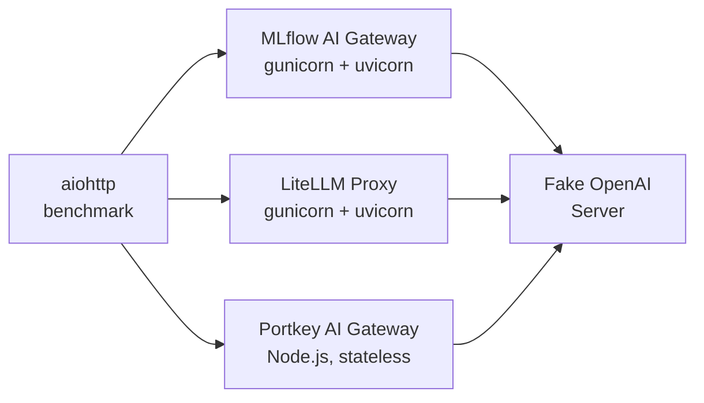
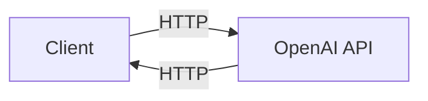
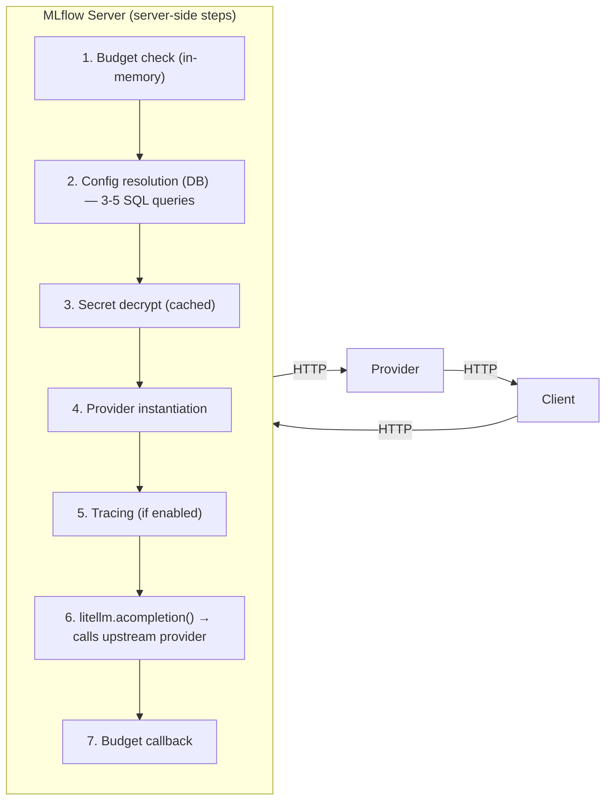
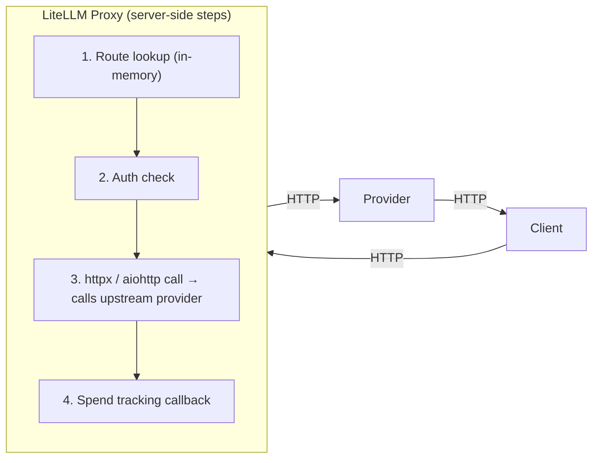
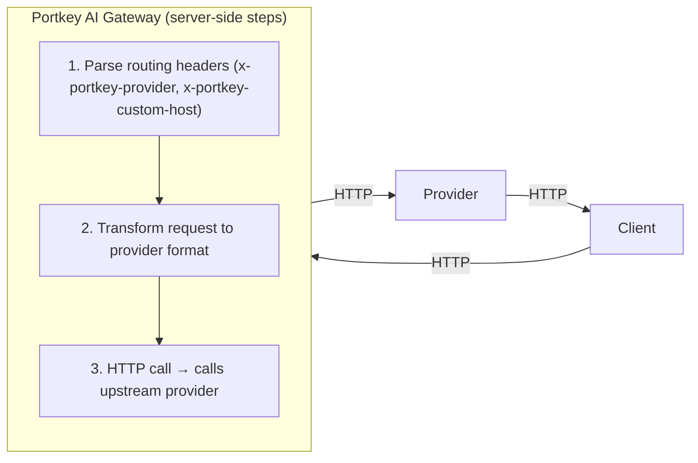
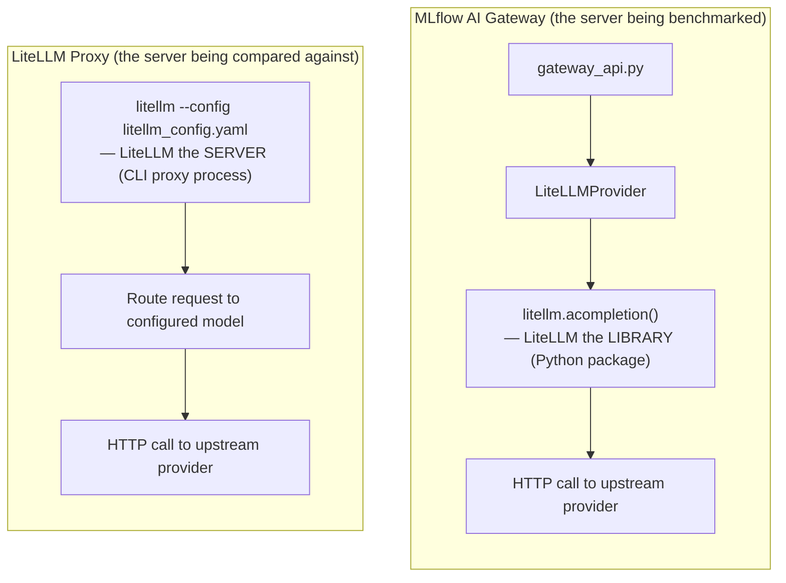
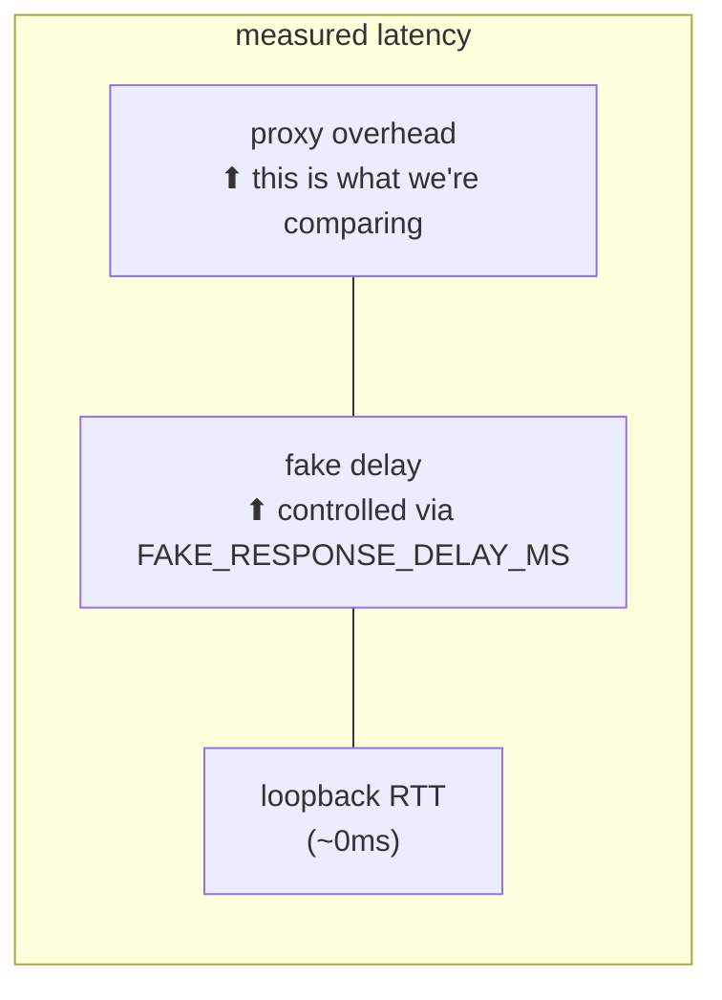
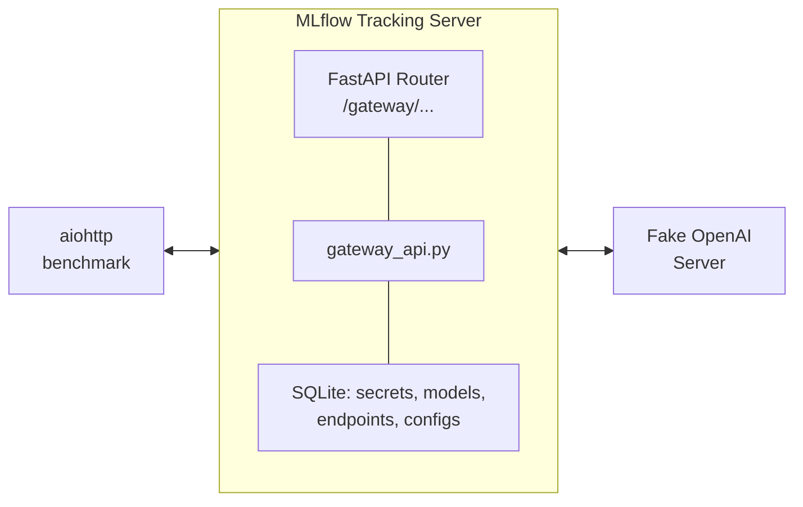
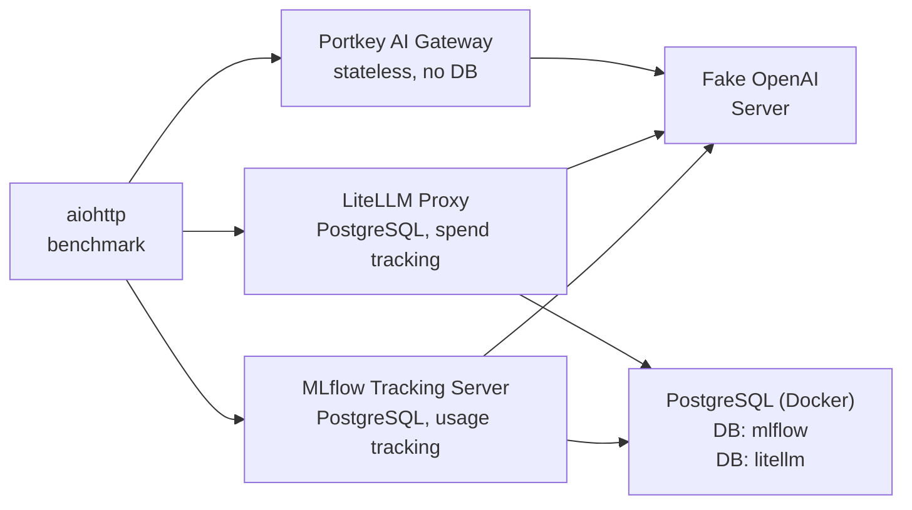

# MLflow AI Gateway Benchmark Suite

Benchmark suite for measuring the latency overhead and scalability of the MLflow AI Gateway. Includes a head-to-head comparison tool against [LiteLLM](https://docs.litellm.ai/docs/benchmarks) and [Portkey AI Gateway](https://github.com/Portkey-AI/gateway) using the same methodology for direct comparability.

**Jira**: ML-61935

## Table of Contents

- [Architecture](#architecture)
- [Request Lifecycle: Direct vs MLflow vs LiteLLM](#request-lifecycle-direct-vs-mlflow-vs-litellm)
- [MLflow and LiteLLM: Library vs Proxy](#mlflow-and-litellm-library-vs-proxy)
- [Measurement Methodology](#measurement-methodology)
- [File Inventory](#file-inventory)
- [Key Implementation Details](#key-implementation-details)
- [Quick Start](#quick-start)
- [Benchmark Configurations](#benchmark-configurations)
- [Head-to-Head Comparison (MLflow vs LiteLLM vs Portkey)](#head-to-head-comparison-mlflow-vs-litellm-vs-portkey)
- [AI Gateway Per-Request Code Path](#ai-gateway-per-request-code-path)
- [Tracking Server Benchmark](#tracking-server-benchmark)
- [Full-Stack Comparison (Both on PostgreSQL)](#full-stack-comparison-both-on-postgresql)
- [Preliminary Results](#preliminary-results)
- [Deploying to a Server](#deploying-to-a-server)
- [Usage Tracking Benchmark](#usage-tracking-benchmark)
- [Known Limitations](#known-limitations)

---

## Architecture

### Head-to-head comparison (`run_comparison.sh`)



All proxies run on the same machine, hitting the same fake backend. MLflow and LiteLLM use gunicorn workers; Portkey runs as a single Node.js process via `npx @portkey-ai/gateway`. The benchmark client uses `aiohttp` with connection pooling (matching LiteLLM's own `benchmark_mock.py` methodology).

---

## Request Lifecycle: Direct vs MLflow vs LiteLLM vs Portkey

To understand what the benchmark measures, it helps to compare the request lifecycle across four scenarios: calling the provider directly, going through the MLflow AI Gateway, going through LiteLLM Proxy, and going through Portkey AI Gateway.

### 1. Direct to provider (baseline — not benchmarked)



Steps: DNS + TLS handshake + send request + provider inference + receive response. This is the minimum latency for any LLM call. The gateway cannot reduce this.

### 2. Through MLflow AI Gateway



**7 server-side steps** per request. Steps 2 (config resolution) and 5 (tracing) are the dominant bottlenecks — see [Bottleneck isolation](#bottleneck-isolation-config-cache--usage-tracking). When both are eliminated, steps 1/3/4/6/7 add only ~10ms of overhead (see [zero-delay results](#preliminary-results)).

### 3. Through LiteLLM Proxy



**4 server-side steps** per request. Config is loaded from YAML at startup and kept in memory — no per-request DB queries. When spend tracking is DB-backed (PostgreSQL mode), step 4 involves async DB writes.

### 4. Through Portkey AI Gateway



**3 server-side steps** per request. Portkey is stateless — all routing config is passed via per-request headers (`x-portkey-provider`, `x-portkey-custom-host`). No database, no config file, no spend tracking in the OSS version. This is the lightest-weight architecture of the three.

### Side-by-side step comparison

| Step                   | MLflow AI Gateway                             | LiteLLM Proxy                         | Portkey AI Gateway                |
| ---------------------- | --------------------------------------------- | ------------------------------------- | --------------------------------- |
| Config lookup          | **3-5 SQL queries per request** (uncached)    | In-memory (loaded from YAML at start) | Per-request headers (no lookup)   |
| Secret/auth access     | AES-256-GCM decrypt (60s cache)               | Read from YAML config (no encryption) | N/A (headers carry provider info) |
| Provider instantiation | Created fresh per request                     | Reused from startup                   | Stateless (per-request routing)   |
| Upstream HTTP call     | `litellm.acompletion()` via aiohttp           | `httpx` / `aiohttp`                   | Node.js HTTP client               |
| Usage/spend tracking   | `mlflow.trace()` spans + async DB persistence | Spend callbacks + optional async DB   | N/A in OSS (cloud-only feature)   |
| Budget/rate limiting   | In-memory with periodic DB refresh            | In-memory with DB persistence         | N/A in OSS (cloud-only feature)   |

The key architectural difference: MLflow treats the database as the source of truth for endpoint config and resolves it on every request. LiteLLM treats YAML as the source of truth and loads it once at startup. Portkey is fully stateless — routing is determined by per-request headers with no server-side state. This is why MLflow is slower by default (3-5 extra SQL queries per request), but equally fast or faster when the config is cached.

---

## MLflow and LiteLLM: Library vs Proxy

The name "LiteLLM" appears in two different roles in this benchmark, which can be confusing:



### LiteLLM the library (used inside MLflow)

MLflow uses `litellm` as a **Python client library** for provider abstraction. The `LiteLLMProvider` class in `mlflow/gateway/providers/litellm.py` calls functions like `litellm.acompletion()`, `litellm.aembedding()`, and `litellm.aresponses()` to normalize request/response formats across providers (OpenAI, Anthropic, Gemini, etc.). This is a lightweight in-process function call — no server, no HTTP, no proxy overhead.

### LiteLLM the proxy (benchmarked as competitor)

The benchmark scripts start `litellm --config litellm_config.yaml` as a **standalone proxy server** process (gunicorn + uvicorn workers). This is a separate product — an HTTP proxy that routes requests to LLM providers, with its own config, auth, spend tracking, and rate limiting.

### Why can MLflow be faster despite using litellm internally?

Because the bottlenecks are **not** in the litellm library call itself. They are in the server-side steps that happen _before_ litellm is called:

| Component                    | Overhead     | Where it happens              |
| ---------------------------- | ------------ | ----------------------------- |
| `litellm.acompletion()` call | ~1-2ms       | Both MLflow and LiteLLM Proxy |
| Config resolution (DB)       | **50-200ms** | MLflow only (uncached)        |
| Usage tracking / tracing     | **10-50ms**  | MLflow only (when enabled)    |
| Core proxy routing + HTTP    | ~5-10ms      | Both (similar)                |

When the two MLflow-specific bottlenecks are removed (config cached + tracing disabled), the remaining code path is faster than LiteLLM Proxy because MLflow's `aiohttp`-based upstream call has less overhead than LiteLLM Proxy's full request pipeline (middleware, callbacks, response transformation, logging).

---

## Measurement Methodology

### What is measured

Latency is measured **client-side** using `time.perf_counter()` (high-resolution monotonic clock) in the benchmark client (`benchmark_compare.py`):


Each measurement includes: client-side serialization, network round-trip (loopback in local benchmarks), full server processing, and response deserialization. Only HTTP 200 responses are counted; failures are tracked separately.

### Connection pooling

The benchmark client uses `aiohttp.TCPConnector` with HTTP keep-alive (`force_close=False`), matching how production clients typically maintain persistent connections. This means the TCP handshake cost is amortized across requests after the warmup phase.

### Warmup phase

Before each timed run, `min(50, n_requests)` warmup requests are sent and discarded. This ensures connection pools are established, server caches are populated, and worker processes are initialized before measurement begins.

### What is NOT included (vs real-world deployments)

The benchmark runs everything on `127.0.0.1` (loopback), which eliminates several real-world costs:

| Factor                        | In benchmark                               | In production                 | Impact on results                                         |
| ----------------------------- | ------------------------------------------ | ----------------------------- | --------------------------------------------------------- |
| **Network latency**           | ~0ms (loopback)                            | 1-100ms per hop               | Adds to all latency numbers equally                       |
| **TLS/SSL handshake**         | None (plain HTTP)                          | ~5-20ms per new connection    | Adds to first-request latency                             |
| **DNS resolution**            | None (IP literal)                          | ~1-5ms (cached), ~50ms (cold) | Negligible with connection reuse                          |
| **Provider inference time**   | Fixed fake delay                           | Variable (50ms-60s+)          | Dominates real latency; proxy overhead becomes negligible |
| **Client-to-proxy network**   | ~0ms (loopback)                            | 1-50ms                        | Adds to client-measured latency                           |
| **Proxy-to-provider network** | ~0ms (loopback)                            | 10-200ms                      | Adds to server processing time                            |
| **TLS to provider**           | None                                       | ~10-30ms                      | Adds to upstream call time                                |
| **Authentication**            | Disabled (`--disable-security-middleware`) | Token validation, RBAC        | Adds ~1-5ms per request                                   |

### What the benchmark isolates

By controlling for network and provider latency, the benchmark measures **pure proxy overhead** — the extra time added by each gateway on top of the upstream provider call. The `FAKE_RESPONSE_DELAY_MS` parameter (default: 50ms) simulates a realistic provider response time.



Setting `FAKE_RESPONSE_DELAY_MS=0` isolates the proxy overhead entirely. In the [zero-delay results](#preliminary-results), MLflow adds ~10ms and LiteLLM adds ~41ms of pure proxy overhead.

### Perspective: does proxy overhead matter in production?

With a real provider adding 200-2000ms of inference time, a 10-50ms proxy overhead is 0.5-5% of total latency — often negligible. The benchmark is useful for:

1. **Identifying bottlenecks** (config resolution, tracing) that could compound at scale
2. **Comparing architectures** under controlled conditions
3. **Validating optimizations** (e.g., config caching gives 3.4x throughput improvement)

---

## File Inventory

| File                               | Purpose                                                                                                                                       |
| ---------------------------------- | --------------------------------------------------------------------------------------------------------------------------------------------- |
| **Shared**                         |                                                                                                                                               |
| `common.sh`                        | Shared shell functions sourced by all benchmark scripts                                                                                       |
| `fake_openai_server.py`            | FastAPI app returning canned OpenAI-compatible responses (chat, completions, embeddings) with configurable delay via `FAKE_RESPONSE_DELAY_MS` |
| `benchmark_compare.py`             | aiohttp-based benchmark (matches LiteLLM's `benchmark_mock.py`), runs proxies sequentially with warmup, prints comparison table               |
| `setup_tracking_server.py`         | Creates secret + model definition + endpoint via REST API in a running tracking server                                                        |
| **Head-to-head comparison**        |                                                                                                                                               |
| `litellm_config.yaml`              | LiteLLM proxy config pointing at the same fake server (YAML-only, no DB)                                                                      |
| `run_comparison.sh`                | Starts fake server + MLflow AI Gateway (SQLite) + LiteLLM (YAML) + Portkey (npx) + runs `benchmark_compare.py`                                |
| **Tracking server benchmark**      |                                                                                                                                               |
| `run_tracking_server_benchmark.sh` | Starts fake server + `mlflow server` with SQLite + sets up endpoint + runs benchmark                                                          |
| **Full-stack comparison**          |                                                                                                                                               |
| `litellm_config_db.yaml`           | LiteLLM proxy config with PostgreSQL `database_url` for spend tracking (metadata only)                                                        |
| `litellm_config_db_payload.yaml`   | LiteLLM proxy config with PostgreSQL + `store_prompts_in_spend_logs: true` for full payload logging                                           |
| `run_full_stack_comparison.sh`     | Starts PostgreSQL (Docker) + MLflow AI Gateway (PostgreSQL) + LiteLLM (PostgreSQL) + Portkey (npx) + runs comparison benchmark                |
| **Other**                          |                                                                                                                                               |
| `.gitignore`                       | Ignores `results/` directory                                                                                                                  |

### Modified existing files

| File                                                   | Change                                                                              |
| ------------------------------------------------------ | ----------------------------------------------------------------------------------- |
| `docs/docs/genai/governance/ai-gateway/index.mdx`      | Added Benchmarks tile card with Timer icon                                          |
| `docs/docs/genai/governance/ai-gateway/benchmarks.mdx` | New public-facing benchmark methodology & results page                              |
| `pyproject.toml`                                       | Added `"benchmarks/*" = ["T20"]` in ruff per-file-ignores (CLI scripts use `print`) |

---

## Key Implementation Details

### `uv run` auto-detection

The shell scripts auto-detect whether `uv` is available and prefix all commands with `uv run --extra gateway` when running inside the MLflow repository. This ensures gateway dependencies (`slowapi`, `gunicorn`, etc.) are available without manual installation.

### macOS fork safety

Gunicorn workers on macOS hit an Objective-C runtime crash on `fork()`. The scripts set `OBJC_DISABLE_INITIALIZE_FORK_SAFETY=YES` automatically.

---

## Quick Start

### Prerequisites

```bash
# If running inside the MLflow repo with uv (recommended):
uv sync

# Otherwise:
pip install mlflow[gateway]
```

### Head-to-head vs LiteLLM & Portkey

```bash
cd benchmarks/gateway
pip install 'litellm[proxy]'  # or: uv pip install 'litellm[proxy]'
# Portkey requires Node.js/npx — automatically skipped if not found
GATEWAY_WORKERS=4 REQUESTS=2000 MAX_CONCURRENT=50 RUNS=3 bash run_comparison.sh
```

### MLflow-only tracking server benchmark

```bash
cd benchmarks/gateway
bash run_tracking_server_benchmark.sh
```

### Full-stack comparison (both on PostgreSQL, requires Docker)

```bash
cd benchmarks/gateway
pip install 'litellm[proxy]'
bash run_full_stack_comparison.sh
```

---

## Benchmark Configurations

### `run_comparison.sh` environment variables

| Variable                 | Default | Description                                         |
| ------------------------ | ------- | --------------------------------------------------- |
| `GATEWAY_WORKERS`        | 4       | Workers for both proxies                            |
| `REQUESTS`               | 2000    | Total requests per run                              |
| `MAX_CONCURRENT`         | 50      | Max concurrent requests                             |
| `RUNS`                   | 3       | Number of benchmark runs                            |
| `FAKE_RESPONSE_DELAY_MS` | 50      | Simulated provider latency (ms)                     |
| `USAGE_TRACKING`         | false   | Enable MLflow usage tracking (set `true` to enable) |

### `run_tracking_server_benchmark.sh` environment variables

| Variable                  | Default | Description                                            |
| ------------------------- | ------- | ------------------------------------------------------ |
| `TRACKING_SERVER_WORKERS` | 4       | Workers for `mlflow server`                            |
| `REQUESTS`                | 2000    | Total requests per run                                 |
| `MAX_CONCURRENT`          | 50      | Max concurrent requests                                |
| `RUNS`                    | 3       | Number of benchmark runs                               |
| `FAKE_RESPONSE_DELAY_MS`  | 50      | Simulated provider latency (ms)                        |
| `USAGE_TRACKING`          | true    | Enable usage tracking/tracing (set `false` to disable) |

### `run_full_stack_comparison.sh` environment variables

| Variable                 | Default | Description                                           |
| ------------------------ | ------- | ----------------------------------------------------- |
| `WORKERS`                | 4       | Workers for both proxies                              |
| `REQUESTS`               | 2000    | Total requests per run                                |
| `MAX_CONCURRENT`         | 50      | Max concurrent requests                               |
| `RUNS`                   | 3       | Number of benchmark runs                              |
| `FAKE_RESPONSE_DELAY_MS` | 50      | Simulated provider latency (ms)                       |
| `USAGE_TRACKING`         | true    | Enable MLflow usage tracking (set `false` to disable) |

---

## Head-to-Head Comparison (MLflow vs LiteLLM vs Portkey)

The `run_comparison.sh` script runs all proxies under identical conditions:

- Same fake OpenAI backend (8 gunicorn workers on port 9000)
- Same aiohttp-based benchmark client with connection pooling
- Warmup phase (50 requests) before timed measurement
- Multiple runs to reduce variance

This mirrors LiteLLM's own `benchmark_mock.py` methodology for a fair comparison.

### What each side runs

- **MLflow AI Gateway**: `mlflow server` with SQLite backend, endpoint created via REST API (`/api/3.0/mlflow/gateway/endpoints/create`). This is the production AI Gateway code path — every request resolves endpoint config from the database.
- **LiteLLM Proxy**: `litellm --config litellm_config.yaml` — model list loaded from YAML, no database, `callbacks: []`.
- **Portkey AI Gateway**: `npx @portkey-ai/gateway` — stateless Node.js proxy. No config file; routing is via per-request headers (`x-portkey-provider: openai`, `x-portkey-custom-host: http://127.0.0.1:9000/v1`). Portkey requires Node.js/npx and is automatically skipped if not available.

Usage tracking is **disabled by default** (`USAGE_TRACKING=false`) to reduce DB overhead, but can be enabled with `USAGE_TRACKING=true`.

### Fairness note

This comparison is **not symmetric** in terms of architecture: MLflow resolves endpoint config from the database on every request (3-5 SQL queries), LiteLLM loads its config from YAML at startup and keeps it in memory, and Portkey is fully stateless with per-request header-based routing. Each reflects the real production code path for that proxy.

Portkey's OSS version has no database, spend tracking, or usage logging — it is a pure pass-through proxy. This gives it the lightest overhead but the fewest features.

For a "full production stack" comparison where MLflow and LiteLLM use PostgreSQL, see [Full-Stack Comparison](#full-stack-comparison-both-on-postgresql).

---

## AI Gateway Per-Request Code Path

**Code path**: `mlflow/server/gateway_api.py` → `invocations()`

On **each request**:

1. **Get store** — cached, negligible
2. **Budget check** (`check_budget_limit`) — in-memory with periodic DB refresh (~5-10min intervals)
3. **Endpoint config resolution** (`get_endpoint_config` in `config_resolver.py`) — **3-5 DB queries, NOT cached**:
   - `SELECT FROM gateway_endpoint WHERE name = ?`
   - `SELECT FROM gateway_endpoint_model_mapping WHERE endpoint_id = ?`
   - `SELECT FROM gateway_model_definition WHERE model_definition_id = ?` (per model)
   - `SELECT FROM gateway_secret WHERE secret_id = ?` (per model)
4. **Secret decryption** — PBKDF2 key derivation (~1-2ms) + AES-256-GCM decrypt; cached for 60s via `SecretCache`
5. **Provider instantiation** — fresh per request (~1-5ms)
6. **Tracing** (`maybe_traced_gateway_call`) — if `usage_tracking=true`, wraps the call with `mlflow.trace()`, creates spans, records metadata; if `false`, returns raw function (no overhead)
7. **Budget callback** (`on_complete`) — runs after LLM response, records cost in-memory
8. **Upstream HTTP call** — `aiohttp`

### What's cached vs fresh

| Component                | Cached? | Strategy                             | TTL                        |
| ------------------------ | ------- | ------------------------------------ | -------------------------- |
| Store registry           | Yes     | LRU (maxsize=100)                    | Session lifetime           |
| Budget policies          | Yes     | Time-based refresh                   | ~5-10 min                  |
| Endpoint config          | **No**  | Fresh DB queries every request       | N/A                        |
| Secrets                  | Yes     | `SecretCache` (encrypted, ephemeral) | 60s (configurable 10-300s) |
| KEK (key encryption key) | **No**  | PBKDF2 derivation per decryption     | N/A                        |
| Provider instance        | **No**  | Created fresh every request          | N/A                        |

The **uncached endpoint config queries** are the dominant bottleneck. With SQLite (single-writer, no connection pooling), these serialize under concurrency. PostgreSQL alleviates the single-writer lock but adds network round-trip latency to each query.

---

## Tracking Server Benchmark

The `run_tracking_server_benchmark.sh` script benchmarks the tracking server gateway code path by running a real `mlflow server` with a SQLite backend.

### Quick start

```bash
cd benchmarks/gateway

# With usage tracking (default — traces enabled)
bash run_tracking_server_benchmark.sh

# Without usage tracking (tracing disabled)
USAGE_TRACKING=false bash run_tracking_server_benchmark.sh
```

### Architecture



### What it does

1. Starts a fake OpenAI server (gunicorn, 8 workers, port 9000)
2. Starts `mlflow server` with a fresh SQLite DB and `--disable-security-middleware`
3. Creates a gateway endpoint via REST API (`setup_tracking_server.py`): secret → model definition → endpoint
4. Runs `benchmark_compare.py --target mlflow` against `http://127.0.0.1:5000/gateway/benchmark-chat/mlflow/invocations`
5. Cleans up all processes and temp directory

### Comparing with and without usage tracking

Usage tracking is **enabled by default** when creating endpoints via the tracking server API. The `USAGE_TRACKING` env var controls this:

- `USAGE_TRACKING=true` (default): Endpoint is created with `usage_tracking=true`, which auto-creates an experiment and wraps every request with `mlflow.trace()`. This adds span creation, metadata recording, and async trace persistence.
- `USAGE_TRACKING=false`: Endpoint is created with `usage_tracking=false`, so `maybe_traced_gateway_call()` returns the raw function with no tracing overhead. The per-request DB queries for config resolution still happen.

---

## Full-Stack Comparison (Both on PostgreSQL)

The `run_full_stack_comparison.sh` script benchmarks both proxies with PostgreSQL and usage/spend tracking enabled — the production code path for each.

- **MLflow**: Tracking server with PostgreSQL, gateway endpoint created via REST API, usage tracking enabled (traces + budget callbacks)
- **LiteLLM**: Proxy with PostgreSQL (same Docker container, separate database), spend tracking auto-enabled by `database_url`

### Prerequisites

- **Docker**: Required for the PostgreSQL container. Install from https://docs.docker.com/get-docker/
- **litellm[proxy]**: `pip install 'litellm[proxy]'` or `uv pip install 'litellm[proxy]'`

### Quick start

```bash
cd benchmarks/gateway

# Default: 4 workers, 2000 requests, 50 concurrent, 3 runs
bash run_full_stack_comparison.sh

# Custom configuration
WORKERS=8 REQUESTS=5000 MAX_CONCURRENT=100 RUNS=5 bash run_full_stack_comparison.sh

# Without MLflow usage tracking (LiteLLM still has spend tracking via DB)
USAGE_TRACKING=false bash run_full_stack_comparison.sh
```

### Architecture



### What each side does per request

| Operation      | MLflow (tracking server)                   | LiteLLM (PostgreSQL)                  | Portkey (stateless)               |
| -------------- | ------------------------------------------ | ------------------------------------- | --------------------------------- |
| Config lookup  | 3-5 SQL queries (PostgreSQL, uncached)     | In-memory from startup YAML + DB sync | Per-request headers (no lookup)   |
| Secret access  | Decrypt per request (60s cache)            | From YAML config (no encryption)      | N/A (headers carry provider info) |
| Usage tracking | `mlflow.trace()` spans + async persistence | Spend tracking callbacks + DB writes  | N/A in OSS                        |
| Budget check   | In-memory with periodic DB refresh         | In-memory with DB persistence         | N/A in OSS                        |
| Upstream HTTP  | `aiohttp`                                  | `httpx` / `aiohttp`                   | Node.js HTTP client               |

### Fairness notes

MLflow and LiteLLM use the same PostgreSQL instance (separate databases). Portkey runs stateless with no database. Key architectural differences remain:

- **MLflow queries the DB on every request** for endpoint config (3-5 SQL queries, uncached). LiteLLM loads config from YAML at startup and uses DB primarily for spend tracking.
- MLflow and LiteLLM have **usage/spend tracking enabled** by default, which is the intended production configuration for each.
- **Portkey has no DB mode in OSS** — it runs as a pure pass-through proxy. This gives it the lightest overhead but makes it not directly comparable on the "full-stack" dimension.

---

## Preliminary Results

All results: MacBook Pro (Apple Silicon), 4 workers, 50 concurrent users. Config caching is enabled (the default since [#21660](https://github.com/mlflow/mlflow/pull/21660)).

### Combined results

All benchmarks: 2000 requests/run, 3 runs, 4 workers, 50 concurrency.

| Configuration                | Metric          | MLflow Gateway | LiteLLM   | Portkey       |
| ---------------------------- | --------------- | -------------- | --------- | ------------- |
| **Barebone**                 | **P50 latency** | 56.7 ms        | 76.8 ms   | **52.5 ms**   |
| SQLite, no tracking          | **P95 latency** | 77.1 ms        | 104.0 ms  | **55.8 ms**   |
| 50ms delay                   | **P99 latency** | 110.8 ms       | 256.7 ms  | **59.0 ms**   |
|                              | **Throughput**  | **818 rps**    | 616 rps   | **941 rps**   |
|                              |                 |                |           |               |
| **Zero delay**               | **P50 latency** | 13.6 ms        | 40.1 ms   | **8.0 ms**    |
| SQLite, no tracking          | **P95 latency** | 57.5 ms        | 77.1 ms   | **14.2 ms**   |
| 0ms delay (pure overhead)    | **P99 latency** | 64.5 ms        | 232.5 ms  | **18.1 ms**   |
|                              | **Throughput**  | **3,306 rps**  | 1,181 rps | **5,575 rps** |
|                              |                 |                |           |               |
| **Full-stack, tracking OFF** | **P50 latency** | **56.2 ms**    | 92.0 ms   | 52.2 ms       |
| PostgreSQL, no tracking      | **P95 latency** | **79.9 ms**    | 128.6 ms  | 55.0 ms       |
| 50ms delay                   | **P99 latency** | **108.3 ms**   | 282.3 ms  | 60.6 ms       |
|                              | **Throughput**  | **816 rps**    | 530 rps   | **944 rps**   |
|                              |                 |                |           |               |
| **Full-stack, tracking ON**  | **P50 latency** | 295.6 ms       | 84.5 ms   | **52.4 ms**   |
| PostgreSQL, tracking ON      | **P95 latency** | 404.5 ms       | 122.7 ms  | **56.2 ms**   |
| 50ms delay                   | **P99 latency** | 441.5 ms       | 281.5 ms  | **61.2 ms**   |
|                              | **Throughput**  | 220 rps        | 574 rps   | **938 rps**   |

**Key observations:**

- **Portkey is consistently ~940 rps** across all configs — it's stateless with no features to slow it down
- **MLflow without tracking (816-818 rps) beats LiteLLM (530-616 rps)** by ~1.4x in every config
- **Pure proxy overhead** (zero delay): Portkey 8ms < MLflow 14ms < LiteLLM 40ms
- **PostgreSQL vs SQLite** makes little difference for MLflow when tracking is off (818 vs 816 rps)

### Usage/spend tracking overhead

The full-stack benchmark runs LiteLLM both with and without PostgreSQL spend tracking in the same invocation, allowing direct measurement of tracking overhead for each gateway.

| Gateway     | With tracking | Without tracking | Overhead               |
| ----------- | ------------- | ---------------- | ---------------------- |
| **MLflow**  | 220 rps       | 816 rps          | **3.7x slower**        |
| **LiteLLM** | 574 rps       | 598 rps          | **1.04x slower** (~4%) |

MLflow's `mlflow.trace()` overhead (spans, metadata, async persistence) causes a **3.7x throughput drop**. LiteLLM's spend tracking callbacks with async DB writes add only ~4% overhead.

> **Note**: Portkey's OSS version has no usage/spend tracking, so it runs at the same speed regardless of configuration.
>
> **Historical note**: Before the trace export contention fix (see below), MLflow with tracking was **10.6x slower** (77 rps). The fix consolidated two racing async DB tasks into a single transaction, improving throughput from 77 to 220 rps.

### Historical results (pre-config-cache)

These results were collected before endpoint config caching was added. They are preserved to show the impact of the config cache optimization.

#### Head-to-head: MLflow AI Gateway vs LiteLLM (barebone, no cache)

MLflow AI Gateway with SQLite (usage tracking OFF, **config cache OFF**) vs LiteLLM with YAML config (no DB, `callbacks: []`). 2000 requests/run, 3 runs.

| Metric          | MLflow AI Gateway | LiteLLM |
| --------------- | ----------------- | ------- |
| **P50 latency** | 2,770 ms          | 77 ms   |
| **P95 latency** | 5,089 ms          | 116 ms  |
| **P99 latency** | 5,249 ms          | 265 ms  |
| **Throughput**  | 21 rps            | 602 rps |
| **Failures**    | 0                 | 0       |

The MLflow AI Gateway resolves endpoint config from the database on every request (3-5 SQL queries). With SQLite's single-writer lock, this serializes under concurrency, producing ~21 rps with multi-second latencies. LiteLLM keeps config in memory from startup.

#### Full-stack: MLflow (PostgreSQL) vs LiteLLM (PostgreSQL, no cache)

Both proxies with PostgreSQL backend and usage/spend tracking enabled, **config cache OFF**. 2000 requests/run, 3 runs.

| Metric          | MLflow AI Gateway | LiteLLM |
| --------------- | ----------------- | ------- |
| **P50 latency** | 4,770 ms          | 113 ms  |
| **P95 latency** | 7,681 ms          | 152 ms  |
| **P99 latency** | 8,066 ms          | 315 ms  |
| **Throughput**  | 14 rps            | 430 rps |
| **Failures**    | 0                 | 0       |

#### Config cache impact

To verify the bottleneck hypothesis, endpoint config caching was added to `config_resolver.py` via the `SecretCache` ([#21660](https://github.com/mlflow/mlflow/pull/21660)). This caches the result of `get_endpoint_config()` after the first DB lookup, eliminating per-request SQL queries. This cache is now enabled by default.

**Full-stack comparison (PostgreSQL, 4 workers, 50 concurrent, 2000 req/run, 3 runs):**

| Configuration                           | MLflow RPS | MLflow P50 | LiteLLM RPS | LiteLLM P50 |
| --------------------------------------- | ---------- | ---------- | ----------- | ----------- |
| Cache OFF, usage tracking ON (baseline) | 14         | 4,770 ms   | 430         | 113 ms      |
| Cache ON, usage tracking ON             | 67         | 763 ms     | 521         | 86 ms       |
| **Cache ON, usage tracking OFF**        | **841**    | **56 ms**  | 539         | 88 ms       |

### Bottleneck breakdown

| Bottleneck                        | Overhead factor | Evidence                             |
| --------------------------------- | --------------- | ------------------------------------ |
| **Usage tracking / tracing**      | ~3.7x           | 220 rps → 816 rps when disabled      |
| **Uncached config DB queries**    | ~5x             | 14 rps → 67 rps when cached          |
| **Core proxy path** (no overhead) | 1x (baseline)   | 816 rps — faster than LiteLLM at 530 |

The two bottlenecks are orthogonal and compound. The usage tracking / tracing path is the dominant remaining factor, though significantly improved by the trace export contention fix (see below).

> **Note**: Endpoint config caching is now enabled by default via `SecretCache` in `config_resolver.py` ([#21660](https://github.com/mlflow/mlflow/pull/21660)). No special configuration is needed to reproduce the cached results above.

---

## Deploying to a Server

For production-grade benchmarks (recommended for publishable results), deploy to a server with dedicated resources.

### Option 1: Single server (simplest)

Run everything on one beefy machine (8+ CPU, 16+ GB RAM):

```bash
# SSH into the server
ssh benchmark-server

# Clone and setup
git clone https://github.com/mlflow/mlflow.git
cd mlflow
pip install -e '.[gateway]'
pip install 'litellm[proxy]'

# Increase file descriptor limit (critical for high concurrency)
ulimit -n 65536

# Run head-to-head comparison
cd benchmarks/gateway
GATEWAY_WORKERS=4 REQUESTS=10000 MAX_CONCURRENT=200 RUNS=5 bash run_comparison.sh
```

### Option 2: Separate machines (recommended for high fidelity)

Use 3 machines to eliminate resource contention:


**Machine C — Fake OpenAI server:**

```bash
# Start with plenty of workers to never be the bottleneck
FAKE_RESPONSE_DELAY_MS=50 gunicorn fake_openai_server:app \
    -k uvicorn.workers.UvicornWorker -w 16 -b 0.0.0.0:9000
```

**Machine B — Proxy under test:**

```bash
# MLflow AI Gateway
export OBJC_DISABLE_INITIALIZE_FORK_SAFETY=YES  # macOS only
mlflow server \
    --backend-store-uri "sqlite:///mlflow.db" \
    --host 0.0.0.0 --port 5000 --workers 4 \
    --disable-security-middleware
# Then create endpoint via setup_tracking_server.py

# OR LiteLLM
litellm --config litellm_config.yaml --port 4000 --num_workers 4
```

> Update `litellm_config.yaml` to point `api_base` at Machine C's IP instead of `127.0.0.1`.

**Machine A — Load generator:**

```bash
python benchmark_compare.py \
    --target both \
    --requests 10000 \
    --max-concurrent 200 \
    --runs 5 \
    --mlflow-url http://<machine-b>:5000/gateway/benchmark-chat/mlflow/invocations \
    --litellm-url http://<machine-b>:4000/chat/completions
```

### Tips for server benchmarks

1. **Increase file descriptors**: `ulimit -n 65536` before starting anything. The gateway creates a new TCP connection per upstream request, which exhausts ephemeral ports under sustained load (see [Known Limitations](#known-limitations)).

2. **Pin CPU cores**: Use `taskset` on Linux to pin each service to specific cores and avoid cache contention.

3. **Disable power management**: `sudo cpupower frequency-set -g performance` on Linux.

4. **Multiple runs**: Use `--runs 5` or more for statistical significance. The comparison script reports run-to-run variance.

5. **Warm up the system**: The first run typically has higher latency. Use warmup runs or discard the first result.

---

## Usage Tracking Benchmark

The `run_tracking_server_benchmark.sh` script supports benchmarking both with and without usage tracking via the `USAGE_TRACKING` env var (default: `true`).

```bash
# With usage tracking (default)
bash run_tracking_server_benchmark.sh

# Without usage tracking
USAGE_TRACKING=false bash run_tracking_server_benchmark.sh
```

### What usage tracking adds to the request path

When `usage_tracking=true` (the server default), an experiment is auto-created and every request is wrapped with `mlflow.trace()`:

| Operation            | When                                  | Blocking? | Overhead                              |
| -------------------- | ------------------------------------- | --------- | ------------------------------------- |
| Trace span creation  | During request (via `mlflow.trace()`) | Yes       | Low (in-memory trace manager)         |
| Metadata recording   | During request                        | Yes       | Low (dict updates)                    |
| Token extraction     | During response parsing               | No        | Negligible (dict access)              |
| Cost calculation     | Post-request callback (`on_complete`) | Yes       | Low (LiteLLM pricing dict lookup)     |
| Budget recording     | Post-request callback                 | Yes       | Low (in-memory with `threading.Lock`) |
| Trace DB persistence | Background thread                     | No        | Async, but adds memory pressure       |
| Budget webhook       | Post-request (if threshold hit)       | Yes       | Rare, only on threshold crossing      |

When `usage_tracking=false`, `maybe_traced_gateway_call()` returns the raw provider function (line 189-190 in `tracing_utils.py`), bypassing all tracing overhead. The per-request DB queries for config resolution still happen.

Key: there are **no synchronous database writes** on the hot path. Traces go to an in-memory manager and are persisted asynchronously. Budget tracking is entirely in-memory.

---

## Trace Export DB Contention Fix

### Problem

With usage tracking enabled on PostgreSQL, profiling revealed severe tail latency (P99=1700ms vs P50=361ms) and server logs showed `DeadlockDetected` and `UniqueViolation` errors on `trace_request_metadata_pk`.

**Root cause**: For each gateway request, `MlflowV3SpanExporter.export()` enqueued **two independent async tasks** that raced on the same DB rows:

1. **`_export_spans_incrementally()` → `log_spans()`**: INSERT/MERGE span rows + UPDATE `trace_info` + MERGE `trace_tag`
2. **`_export_traces()` → `start_trace()`**: INSERT `trace_info` + INSERT tags + INSERT metadata (14 rows) + INSERT metrics

Both tasks target the same `trace_info`, `trace_request_metadata`, and `trace_tag` rows for the same `trace_id`. With 10 async worker threads and 50 concurrent requests, the `start_trace` task would INSERT → catch `IntegrityError` → rollback → SELECT → merge, which is expensive under contention. Meanwhile `log_spans` is also writing to the same rows, causing PostgreSQL deadlocks.

```
                      ┌─ async task 1: log_spans()   ──┐
export() ─┤                                             ├─ RACE on same trace_id rows
                      └─ async task 2: start_trace() ──┘
```

### Fix

Gateway traces are short-lived (2 spans, ~50-100ms). The trace completes before the first `log_spans` task even runs, so incremental span export adds no value.

The fix adds a `write_spans_with_trace` flag that consolidates both writes into a single `start_trace()` transaction:

```
Before:  export() → async task 1: log_spans()     ←─ RACE ─→  async task 2: start_trace()
After:   export() → async task: start_trace(spans=...)    (single transaction, no race)
```

This is auto-enabled when `MLFLOW_ENABLE_ASYNC_TRACE_LOGGING=true` (set by the gateway server at startup) with a non-Databricks SQL backend.

### Impact

| Metric       | Before fix | After fix | Improvement |
| ------------ | ---------- | --------- | ----------- |
| **P50**      | 627 ms     | 296 ms    | 2.1x        |
| **P99**      | 1,430 ms   | 442 ms    | 3.2x        |
| **RPS**      | 77         | 220       | 2.9x        |
| **Failures** | DB errors  | 0         | Eliminated  |

Files changed:

- `mlflow/tracing/export/mlflow_v3.py` — skip incremental export, pass spans to `start_trace`
- `mlflow/tracing/client.py` — thread `spans` parameter
- `mlflow/store/tracking/sqlalchemy_store.py` — write spans in `start_trace` transaction
- `mlflow/store/tracking/abstract_store.py` — update interface
- `mlflow/tracing/provider.py` — auto-enable when async logging is set

---

## Known Limitations

### Ephemeral port exhaustion

The MLflow Gateway's `send_request()` in `mlflow/gateway/providers/utils.py` creates a new `aiohttp.ClientSession` per request without connection pooling. Under sustained high concurrency (>50 users for >20s on a single machine), this exhausts ephemeral TCP ports (`Can't assign requested address`).

**Impact**: Limits local laptop benchmarks to shorter durations or lower concurrency. On a server with separate machines (load gen / proxy / backend), this is less of an issue since TCP connections are distributed across network interfaces.

**Potential fix**: Add a persistent `aiohttp.ClientSession` with a `TCPConnector` pool to the provider base class. This would also improve real-world performance.

### LiteLLM `network_mock` mode

LiteLLM's published benchmarks use `network_mock: true`, which skips the real HTTP call entirely and returns a canned response inside the proxy process. Our comparison uses the real HTTP path (proxy -> fake server) for both sides, which is more representative of production behavior but produces different numbers than LiteLLM's published figures.
