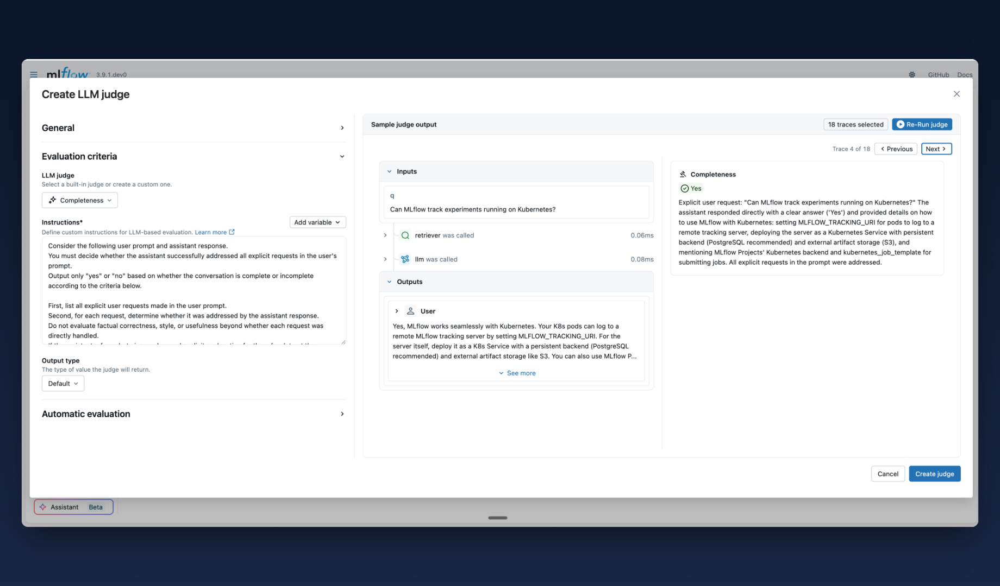

# Judge Builder



## What's New

MLflow 3.9 introduces the **Judge Builder**, a visual interface for creating custom LLM judges directly in the MLflow UI.

Evaluating LLM applications is challenging because quality is often subjective and context-dependent. While MLflow has long supported LLM-as-a-Judge evaluation through the SDK, creating and iterating on judges required coding expertise and constant context-switching between your IDE and the traces UI. With Judge Builder you can now define evaluation criteria using natural language, and test judges on real traces directly from the UI.

## Get Started

```bash
pip install 'mlflow[genai]>=3.9'
mlflow server
```

### 1. Navigate to the Judges Tab

From any experiment in MLflow, select the **Judges** tab and click **New LLM judge** to open Judge Builder.

### 2. Define Your Evaluation Scope

Choose what you want to evaluate:

- **Traces**: Evaluate individual request-response pairs for quality, correctness, and safety
- **Sessions**: Evaluate entire multi-turn conversations for coherence and goal completion

### 3. Configure Your Judge

The Judge Builder provides an intuitive interface for defining your judge:

| Field            | Description                                                                                                                      |
| ---------------- | -------------------------------------------------------------------------------------------------------------------------------- |
| **LLM Judge**    | Start from a built-in judge or select "Custom judge" for full control                                                            |
| **Name**         | A unique identifier for your judge (e.g., `tone_checker`, `accuracy_evaluator`)                                                  |
| **Instructions** | Natural language criteria using template variables like `{{ inputs }}`, `{{ outputs }}`, `{{ trace }}`, and `{{ conversation }}` |
| **Output Type**  | The return type: boolean, categorical, numeric, or structured                                                                    |
| **Model**        | Select an AI Gateway endpoint or specify a model directly                                                                        |

### 4. Test on Real Data

Before saving, click the trace/session selector to choose specific traces or sessions and click **Run judge** to preview evaluation results. This lets you validate that your instructions produce the expected assessments.

See the [Judge Builder documentation](/genai/eval-monitor/scorers/llm-judge/judge-builder) for more details.
