import { CardGroup, TitleCard } from "@site/src/components/Card";
import Tabs from '@theme/Tabs';
import TabItem from '@theme/TabItem';

# Assessments: Evaluate AI Performance with Automated and Human Feedback

MLflow Assessments provide a comprehensive system for evaluating and annotating your GenAI traces with both automated evaluations and human insights. Whether you're building a chatbot, RAG system, or complex AI agent, assessments help you systematically capture quality signals from multiple sources to improve your applications over time.

## What are Assessments?

Assessments are evaluation annotations that you attach to traces to capture critical information about AI performance. They come in two fundamental types that work together to create a complete evaluation framework.

### Expectations (Ground Truth)

Expectations define the "correct" or desired output for a given input. Think of these as your gold standard labels that establish what success looks like. When you log an expectation, you're creating a reference point against which actual AI outputs can be measured. This might be the correct answer to a factual question, the expected classification label for a piece of text, a complex mapping of categorical conditions that should be met for determining quality of a response or a list of key facts that should appear in a comprehensive response.

### Feedback (Quality Evaluations)

Feedback captures evaluations of how well your AI performed. Unlike expectations, which define the ideal outcome, feedback measures the actual quality of what your AI produced. The power of MLflow's assessment system lies in its ability to gather feedback from three distinct sources, each serving different purposes in your evaluation pipeline.

#### Sources of Feedback

MLflow supports three types of feedback sources, each with unique strengths and use cases. Choose the right source based on your evaluation needs, or combine multiple sources for comprehensive coverage.

<Tabs>
  <TabItem value="llm_judge" label="🧠 LLM_JUDGE" default>
    <h5>Automated AI Evaluation at Scale</h5>

    Modern LLM judges can evaluate AI outputs at production scale, providing consistent quality assessments without human intervention. These AI evaluators excel at not only evaluating objective quality, but are also capable of checking subjective qualities that would be difficult to encode as rules. To learn more about LLM Judge-based evaluation capabilities within MLflow, [review the evaluation guide](/genai/eval-monitor/llm-evaluation).

    **Common Use Cases:**
    - Evaluating response relevance and completeness
    - Checking adherence to tone and style guidelines
    - Assessing groundedness in provided context
    - Detecting potential safety issues or harmful content
    - Scoring overall response quality

    **Example Scenario:**
    An LLM judge evaluates whether a customer service chatbot's response is grounded in the company's knowledge base and maintains a professional, helpful tone. This automated approach enables you to monitor every single trace in production, something that would be impossible with human review alone.

  </TabItem>
  <TabItem value="code" label="🔧 CODE">
    <h5>Programmatic Rule-Based Evaluation</h5>

    Sometimes you need deterministic, rule-based evaluations that don't require the sophistication (or cost) of an LLM judge. CODE assessments handle these cases through heuristic algorithms and custom scoring functions. To learn more about heuristics-based evaluation capabilities within MLflow, [review the evaluation guide](/genai/eval-monitor/llm-evaluation).

    **Common Use Cases:**
    - Validating output format and structure
    - Checking response length constraints
    - Scanning for required keywords or phrases
    - Applying custom business logic rules
    - Performing numerical accuracy checks

    **Example Scenario:**
    A CODE assessment verifies that a financial advisor bot includes mandatory disclaimers, formats currency values correctly, and stays within regulatory word limits. These deterministic checks provide fast, consistent results and integrate seamlessly with existing evaluation pipelines.

  </TabItem>
  <TabItem value="human" label="👥 HUMAN">
    <h5>Expert Review and Quality Control</h5>

    Despite advances in automated evaluation, human expertise remains invaluable for nuanced quality assessment. HUMAN assessments capture insights that automated systems might miss and serve as the gold standard for evaluation quality.

    **Common Use Cases:**
    - Evaluating creativity and nuance in responses
    - Catching subtle errors or misunderstandings
    - Providing domain expert validation
    - Correcting automated evaluation mistakes
    - Reviewing high-stakes or sensitive interactions

    **Example Scenario:**
    A medical expert reviews an AI health assistant's responses to ensure medical accuracy and appropriate caution. When the expert identifies an incorrect automated assessment, they can override it with the correct evaluation and provide justification, creating valuable training data for improving automated systems.

  </TabItem>
</Tabs>

## Why Use Assessments?

The assessments framework transforms how teams build and improve AI applications by enabling sophisticated evaluation strategies that weren't previously possible.

### Scale Meets Quality

Traditional human evaluation doesn't scale to production volumes, while pure automation can miss important nuances. MLflow assessments solve this by enabling hybrid workflows where LLM judges and programmatic checks handle the bulk of evaluation, while humans focus on edge cases and quality control. This approach lets you maintain high quality standards even as your application scales to millions of interactions.

However, scale isn't always the primary concern. During early development phases or for agents handling sensitive use cases—such as healthcare advice, financial recommendations, or legal guidance—you may need direct human review of every interaction. MLflow's flexible assessment system supports this too, allowing you to route all traces to human reviewers when the stakes demand it. As your confidence grows and automated evaluations prove reliable, you can gradually shift to hybrid approaches that balance thoroughness with efficiency.

### Continuous Improvement Through Attribution

Every assessment is tagged with its source, creating a rich dataset for analysis. You can track agreement rates between human and automated evaluators, identify patterns where automated evaluation fails, and use human corrections to improve your evaluation systems. This attribution also enables sophisticated routing strategies, such as automatically escalating traces with low confidence scores to human review.

### Building Better AI with Better Data

Assessments create high-quality training datasets as a natural byproduct of your evaluation process. When humans override automated assessments, you capture not just the correction but also the reasoning behind it. This data becomes invaluable for fine-tuning both your AI applications and your automated evaluators, creating a virtuous cycle of improvement.

## How Assessments Work

The assessment workflow follows this pattern:

```mermaid
graph TB
    %% Main flow with generous spacing
    APP["🤖 GenAI Application<br/><br/>Your chatbot, RAG system,<br/>or AI agent runs"]

    TRACE["📊 MLflow Trace Generated<br/><br/>Execution details captured<br/>automatically"]

    %% Assessment types with clear separation
    subgraph ASSESS_TYPES[" "]
        EXPECT["📋 Expectation<br/><br/>Ground truth or<br/>expected output"]
        FEEDBACK["💬 Feedback<br/><br/>Quality evaluation<br/>or scoring"]
    end

    %% Sources laid out horizontally for better space usage
    subgraph SOURCES["🎯 Assessment Sources"]
        direction LR
        HUMAN["👥 HUMAN<br/><br/>Domain experts<br/>Manual review"]
        CODE["🔧 CODE<br/><br/>Automated scorers<br/>Heuristic rules"]
        LLM_JUDGE["🧠 LLM_JUDGE<br/><br/>AI evaluators<br/>Judge models"]
    end

    %% Override with clear positioning
    OVERRIDE["🔄 Override Capability<br/><br/>Human corrections with<br/>full audit trail"]

    %% Clear flow connections
    APP --> TRACE
    TRACE --> EXPECT
    TRACE --> FEEDBACK
    HUMAN --> EXPECT
    HUMAN --> FEEDBACK
    CODE --> FEEDBACK
    LLM_JUDGE --> FEEDBACK
    FEEDBACK -.->|Optional| OVERRIDE

    %% Enhanced styling for better readability
    classDef primary fill:#e3f2fd,stroke:#1565c0,stroke-width:3px,color:#000,font-size:14px
    classDef assessment fill:#fff3e0,stroke:#ef6c00,stroke-width:2px,color:#000,font-size:14px
    classDef source fill:#f3e5f5,stroke:#7b1fa2,stroke-width:2px,color:#000,font-size:12px
    classDef override fill:#fce4ec,stroke:#c2185b,stroke-width:2px,color:#000,font-size:12px
    classDef invisible fill:transparent,stroke:transparent

    class APP,TRACE primary
    class EXPECT,FEEDBACK assessment
    class HUMAN,CODE,LLM_JUDGE source
    class OVERRIDE override
    class ASSESS_TYPES invisible
```



Here's how this looks in code:

```python
import mlflow
from mlflow.entities import (
    Expectation,
    Feedback,
    AssessmentSource,
    AssessmentSourceType,
)

# 1. Your GenAI application generates a trace
with mlflow.start_span(name="chatbot_response") as span:
    response = your_chatbot.generate(user_question)
    trace_id = span.get_trace_id()

# 2. Log the expected answer (ground truth)
mlflow.log_expectation(
    trace_id=trace_id,
    name="expected_answer",
    value="Paris is the capital of France",
    source=AssessmentSource(
        source_type=AssessmentSourceType.HUMAN, source_id="expert@company.com"
    ),
)

# 3. Log feedback on the actual response quality
mlflow.log_feedback(
    trace_id=trace_id,
    name="accuracy",
    value=4,  # Integer scale for humans to rate on a scale of 1 to 5
    rationale="Response was mostly correct but included some outdated information",
    source=AssessmentSource(
        source_type=AssessmentSourceType.HUMAN, source_id="reviewer@company.com"
    ),
)
```

## Assessment Sources and Workflows

Every assessment in MLflow is tagged with its source, creating a complete picture of where evaluations come from and how they interact. This source tracking enables sophisticated evaluation strategies that adapt to your specific needs.

### Direct Assessment Workflows

The simplest workflow involves assessments being added directly to traces as they're generated. Each source type can independently evaluate traces based on its strengths.

LLM judges excel at evaluating subjective qualities like relevance, tone, and completeness. They can run continuously in production, evaluating every trace without human intervention. CODE assessments handle deterministic checks that don't require AI judgment, such as format validation or business rule compliance. Meanwhile, HUMAN assessments capture expert insights for high-value interactions or edge cases that automated systems struggle with.

### Override and Correction Workflows

Real-world AI systems aren't perfect, and neither are automated evaluations. The override workflow acknowledges this reality by allowing human experts to correct automated assessments while preserving the complete evaluation history.

When a human reviewer identifies an incorrect automated assessment, they can override it with the correct evaluation and provide justification for the change. The original automated assessment isn't deleted; instead, it's marked as overridden, creating an audit trail that shows both the original evaluation and the correction. This historical data becomes invaluable for identifying patterns in automated evaluation failures and improving your evaluation systems over time.

### Hybrid Evaluation Strategies

The most sophisticated teams combine multiple evaluation sources strategically. Here are three powerful patterns:

#### Automated-First with Human Escalation

Start by evaluating all traces with LLM judges or CODE assessments. Then, based on confidence scores or specific criteria, automatically route a subset to human review. This approach maximizes coverage while ensuring human expertise is applied where it matters most.

#### Multi-Source Validation

For critical use cases, apply multiple evaluation sources to the same traces. When LLM judges, CODE assessments, and human reviewers all agree, you have high confidence in the evaluation. When they disagree, you've identified an interesting edge case worth deeper investigation.

#### Continuous Learning Loop

Use human overrides as training data to improve automated evaluations. When humans consistently override certain types of automated assessments, you can identify gaps in your evaluation logic and either update your CODE assessments or fine-tune your LLM judges to better match human judgment.

See the [override feedback examples](/genai/assessments/api-guide#overriding-feedback) in the API guide for detailed implementation patterns.

:::note
The Assessments UI is coming soon to open-source MLflow! Currently, the programmatic API is available for logging and managing assessments. The visual interface for reviewing and annotating traces is available in Databricks Managed MLflow.
:::

## Next Steps

<CardGroup>
  <TitleCard
    title="API Guide"
    description="Learn how to use the complete Assessments API with detailed examples"
    link="/genai/assessments/api-guide"
  />
  <TitleCard
    title="Tracing Overview"
    description="Understand how assessments integrate with MLflow's tracing capabilities"
    link="/genai/tracing"
  />
  <TitleCard
    title="Evaluation & Monitoring"
    description="See how assessments power systematic evaluation workflows"
    link="/genai/eval-monitor"
  />
</CardGroup>


