import { CardGroup, TitleCard } from "@site/src/components/Card";

# Assessments: Capture Human Feedback and Ground Truth

MLflow Assessments provide a powerful way to annotate your GenAI traces with human feedback and ground truth expectations. Whether you're building a chatbot, RAG system, or complex AI agent, assessments help you systematically capture quality signals to improve your applications over time.

## What are Assessments?

Assessments are annotations that you attach to traces to capture two critical types of information:

### Expectations (Ground Truth)
Expectations represent the "correct" or desired output for a given input. Think of them as your gold standard labels that define what success looks like for your AI application. For example:
- The correct answer to a user's question
- The expected classification label
- The desired structured output format

### Feedback (Quality Evaluations)
Feedback captures evaluations of how well your AI performed. These can come from various sources:
- **Human reviewers**: Domain experts rating response quality
- **Automated scorers**: Heuristic algorithms checking specific criteria
- **LLM judges**: Using AI to evaluate AI outputs at scale

## Why Use Assessments?

Assessments bridge the gap between development and production by enabling:

1. **Continuous Improvement**: Systematically identify where your AI falls short by comparing actual outputs to expectations
2. **Quality Monitoring**: Track performance trends over time with consistent feedback metrics
3. **Training Data Creation**: Build high-quality datasets from production traffic for fine-tuning or testing
4. **Human-in-the-Loop Workflows**: Incorporate domain expert knowledge to handle edge cases and improve accuracy

## How Assessments Work

The assessment workflow follows this pattern:

```mermaid
flowchart TD
    %% GenAI Application Flow
    APP[🤖 GenAI Application<br/>Chatbot, RAG, Agent]
    TRACE[📊 Generate Trace<br/>Capture execution flow]
    
    %% Assessment Logging
    EXPECT[📋 Log Expectation<br/>Ground truth / Expected output]
    FEEDBACK[💬 Log Feedback<br/>Quality evaluation]
    
    %% Assessment Sources
    subgraph SOURCES[🎯 Assessment Sources]
        HUMAN[👥 HUMAN<br/>Domain experts]
        CODE[🔧 CODE<br/>Automated scorers]
        LLM[🧠 LLM_JUDGE<br/>AI evaluators]
    end
    
    %% Override Capability
    OVERRIDE[🔄 Override Assessment<br/>Human correction with audit trail]
    
    %% Flow connections
    APP --> TRACE
    TRACE --> EXPECT
    TRACE --> FEEDBACK
    
    HUMAN --> EXPECT
    HUMAN --> FEEDBACK
    CODE --> FEEDBACK
    LLM --> FEEDBACK
    
    FEEDBACK -.-> OVERRIDE
    HUMAN --> OVERRIDE
    
    %% Styling
    classDef appStyle fill:#e8f5e8,stroke:#2e7d32,stroke-width:3px,color:#000
    classDef traceStyle fill:#e3f2fd,stroke:#1976d2,stroke-width:3px,color:#000
    classDef assessStyle fill:#fff3e0,stroke:#ef6c00,stroke-width:2px,color:#000
    classDef sourceStyle fill:#f3e5f5,stroke:#7b1fa2,stroke-width:2px,color:#000
    classDef overrideStyle fill:#fce4ec,stroke:#c2185b,stroke-width:2px,color:#000
    classDef subgraphStyle fill:#f5f5f5,stroke:#424242,stroke-width:1px,color:#000
    
    class APP appStyle
    class TRACE traceStyle
    class EXPECT,FEEDBACK assessStyle
    class HUMAN,CODE,LLM sourceStyle
    class OVERRIDE overrideStyle
    class SOURCES subgraphStyle
```



Here's how this looks in code:

```python
import mlflow
from mlflow.entities import Expectation, Feedback, AssessmentSource, AssessmentSourceType

# 1. Your GenAI application generates a trace
with mlflow.start_span(name="chatbot_response") as span:
    response = your_chatbot.generate(user_question)
    trace_id = span.get_trace_id()

# 2. Log the expected answer (ground truth)
mlflow.log_expectation(
    trace_id=trace_id,
    name="expected_answer",
    value="Paris is the capital of France",
    source=AssessmentSource(
        source_type=AssessmentSourceType.HUMAN,
        source_id="expert@company.com"
    )
)

# 3. Log feedback on the actual response quality
mlflow.log_feedback(
    trace_id=trace_id,
    name="accuracy",
    value=0.8,
    rationale="Response was mostly correct but included some outdated information",
    source=AssessmentSource(
        source_type=AssessmentSourceType.HUMAN,
        source_id="reviewer@company.com"
    )
)
```

## Assessment Sources

Every assessment includes source information to track its origin:

- **HUMAN**: Annotations from domain experts or crowd workers
- **CODE**: Programmatically generated labels or heuristic evaluations
- **LLM_JUDGE**: Evaluations from LLM-as-a-Judge systems

This source tracking enables you to:
- Weight feedback differently based on source reliability
- Track annotator agreement and quality
- Build training datasets with proper attribution

### Assessment Override Capability

When automated feedback from CODE or LLM_JUDGE sources needs correction, you can override assessments while preserving the complete history. The override functionality marks the original automated assessment as invalid and logs a new human-corrected assessment with full justification. This maintains an audit trail for improving automated evaluation systems while ensuring production quality decisions are based on the most accurate assessments.

See the [override feedback examples](/genai/assessments/api-guide#overriding-feedback) in the API guide for detailed implementation patterns.

## Next Steps

<CardGroup>
  <TitleCard
    title="API Guide"
    description="Learn how to use the complete Assessments API with detailed examples"
    link="/genai/assessments/api-guide"
  />
  <TitleCard
    title="Tracing Overview"
    description="Understand how assessments integrate with MLflow's tracing capabilities"
    link="/genai/tracing"
  />
  <TitleCard
    title="Evaluation & Monitoring"
    description="See how assessments power systematic evaluation workflows"
    link="/genai/eval-monitor"
  />
</CardGroup>

:::note
The Assessments UI is coming soon to open-source MLflow! Currently, the programmatic API is available for logging and managing assessments. The visual interface for reviewing and annotating traces is available in Databricks Managed MLflow.
:::