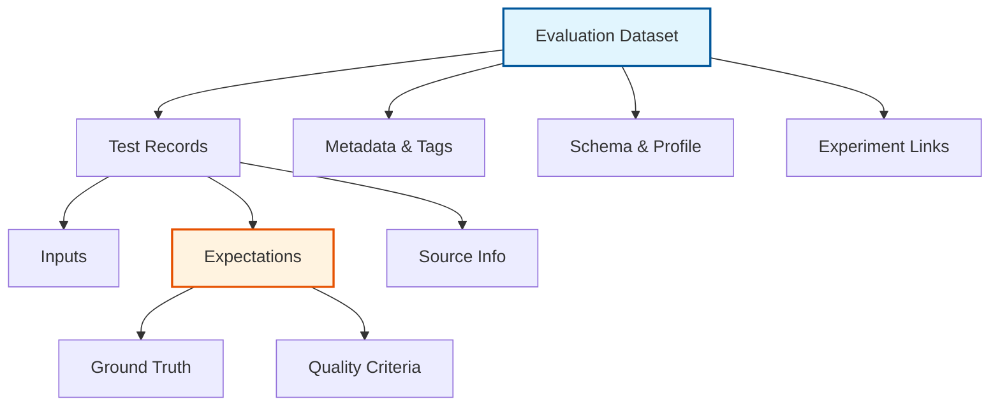
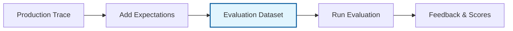

import Tabs from "@theme/Tabs"
import TabItem from "@theme/TabItem"
import { APILink } from "@site/src/components/APILink";
import ImageBox from "@site/src/components/ImageBox";
import TabsWrapper from "@site/src/components/TabsWrapper";
import FeatureHighlights from "@site/src/components/FeatureHighlights";
import TilesGrid from "@site/src/components/TilesGrid";
import TileCard from "@site/src/components/TileCard";
import { Database, GitBranch, TestTube, Users, Shield, ChartBar, FileText, Target } from "lucide-react";

# Evaluation Dataset Concepts

## What are Evaluation Datasets?

**Evaluation Datasets** in MLflow provide a structured way to organize and manage test data for GenAI applications. They serve as centralized repositories for test inputs, expected outputs (expectations), and evaluation results, enabling systematic quality assessment across your AI development lifecycle.

Evaluation datasets bridge the gap between ad-hoc testing and systematic quality assurance, providing the foundation for reproducible evaluations, regression testing, and continuous improvement of your GenAI applications.

## Use Cases

<FeatureHighlights features={[
  {
    icon: TestTube,
    title: "Systematic Testing",
    description: "Build comprehensive test suites that cover edge cases, common scenarios, and critical user journeys. Move beyond manual spot-checking to systematic quality validation."
  },
  {
    icon: GitBranch,
    title: "Regression Detection",
    description: "Maintain consistent test sets across model versions to quickly identify when changes introduce regressions. Ensure new improvements don't break existing functionality."
  },
  {
    icon: Users,
    title: "Collaborative Annotation",
    description: "Enable teams to collaboratively build and maintain test data. Subject matter experts can contribute domain-specific test cases while engineers focus on implementation."
  },
  {
    icon: Shield,
    title: "Compliance Validation",
    description: "Create specialized datasets that test for safety, bias, and regulatory requirements. Systematically verify that your AI meets organizational and legal standards."
  }
]} />

## Core Architecture

Evaluation datasets act as containers that bring together several key components:



## Dataset Object Schema

| Field                 | Type                          | Description                                                                                                                                                                                                           |
| --------------------- | ----------------------------- | --------------------------------------------------------------------------------------------------------------------------------------------------------------------------------------------------------------------- |
| `dataset_id`          | `str`                         | Unique identifier for the dataset (format: `d-{32 hex chars}`)                                                                                                                                                        |
| `name`                | `str`                         | Human-readable name for the dataset                                                                                                                                                                                   |
| `digest`              | `str`                         | Content hash for data integrity verification                                                                                                                                                                          |
| `records`             | `list[DatasetRecord]`         | The actual test data records containing inputs and expectations                                                                                                                                                       |
| `schema`              | `Optional[str]`               | JSON string describing the structure of records (automatically computed)                                                                                                                                               |
| `profile`             | `Optional[str]`               | JSON string containing statistical information about the dataset                                                                                                                                                      |
| `tags`                | `dict[str, str]`              | Key-value pairs for organizing and categorizing datasets                                                                                                                                                              |
| `experiment_ids`      | `list[str]`                   | List of MLflow experiment IDs this dataset is associated with                                                                                                                                                         |
| `created_time`        | `int`                         | Timestamp when the dataset was created (milliseconds)                                                                                                                                                                 |
| `last_update_time`    | `int`                         | Timestamp of the last modification (milliseconds)                                                                                                                                                                     |
| `created_by`          | `Optional[str]`               | User who created the dataset (auto-detected from tags)                                                                                                                                                                |
| `last_updated_by`     | `Optional[str]`               | User who last modified the dataset                                                                                                                                                                                    |

## Record Structure

Each record in an evaluation dataset represents a single test case:

```json
{
    "inputs": {
        "question": "What is the capital of France?",
        "context": "France is a country in Western Europe...",
        "temperature": 0.7
    },
    "expectations": {
        "answer": "The capital of France is Paris.",
        "confidence": 0.95,
        "contains_terms": ["Paris", "capital"],
        "tone": "informative"
    },
    "source": {
        "source_type": "HUMAN",
        "source_data": {
            "annotator": "geography_expert@company.com",
            "annotation_date": "2024-08-07"
        }
    },
    "tags": {
        "category": "geography",
        "difficulty": "easy",
        "validated": "true"
    }
}
```

### Record Fields

- **inputs**: The test input data that will be passed to your model or application
- **expectations**: The expected outputs or quality criteria for this input
- **source**: Information about how this record was created (human annotation, generated, from traces)
- **tags**: Metadata specific to this individual record

## Schema Evolution

Evaluation datasets automatically track and adapt to schema changes as you add records:

```python
# Initial records might have simple structure
initial_record = {
    "inputs": {"question": "What is MLflow?"},
    "expectations": {"answer": "MLflow is an open source platform..."}
}

# Later records can add new fields
enhanced_record = {
    "inputs": {
        "question": "What is MLflow?",
        "context": "Additional context...",  # New field
        "max_tokens": 150  # New field
    },
    "expectations": {
        "answer": "MLflow is an open source platform...",
        "relevance_score": 0.95,  # New field
        "factual_accuracy": 1.0  # New field
    }
}

# The dataset schema automatically evolves to include all fields
```

## Integration with Traces

Evaluation datasets can be built from production traces with added expectations:



This enables you to:
1. Collect real production examples
2. Add ground truth expectations
3. Build realistic test sets
4. Continuously improve coverage

## Relationship to Other Concepts

### Expectations vs Dataset Records

| Aspect           | Expectations (Standalone)      | Dataset Records                |
| ---------------- | ------------------------------ | ------------------------------- |
| **Scope**        | Single trace or span           | Organized collection            |
| **Purpose**      | Define ground truth in-place   | Systematic testing              |
| **Organization** | Attached to specific traces    | Grouped by purpose/project      |
| **Reusability**  | Tied to specific trace         | Reusable across evaluations     |
| **Management**   | Individual annotations         | Batch operations and versioning |

### Feedback vs Evaluation Results

Evaluation datasets provide the **input** for evaluation, while feedback represents the **output**:

1. **Dataset** → Contains test cases and expectations
2. **Evaluation** → Runs models against dataset
3. **Feedback** → Captures evaluation results and scores

## Best Practices

### 1. **Meaningful Organization**
Structure your datasets around specific testing goals:
- `safety_compliance_tests` - For safety validation
- `regression_suite_v2` - For regression testing
- `edge_cases_collection` - For boundary conditions

### 2. **Comprehensive Coverage**
Include diverse test cases:
- Happy path scenarios
- Edge cases and errors
- Adversarial inputs
- Different user personas

### 3. **Clear Expectations**
Define unambiguous success criteria:
```json
{
    "expectations": {
        "must_include": ["specific", "terms"],
        "must_not_include": ["inappropriate", "content"],
        "format": "json",
        "max_length": 500
    }
}
```

### 4. **Version Management**
Track dataset evolution:
```python
tags = {
    "version": "2.1.0",
    "parent_version": "2.0.0",
    "change_summary": "Added 50 edge cases for error handling"
}
```

### 5. **Quality Tiers**
Categorize datasets by quality level:
- **Gold**: Fully validated by experts
- **Silver**: Automated with spot checks
- **Bronze**: Automatically generated

## Lifecycle Management

### Creating Datasets
Start with core test cases and expand incrementally:
```python
# Week 1: Core functionality
dataset = create_evaluation_dataset(name="core_tests")

# Week 2: Add edge cases
dataset.merge_records(edge_case_records)

# Week 3: Add production examples
dataset.merge_records_from_traces(production_trace_ids)
```

### Maintaining Datasets
Regular maintenance ensures relevance:
- Review and update expectations quarterly
- Remove obsolete test cases
- Add new scenarios from production issues
- Revalidate after major model changes

### Deprecating Datasets
Mark outdated datasets appropriately:
```python
set_evaluation_dataset_tags(
    dataset_id=old_dataset.dataset_id,
    tags={
        "status": "deprecated",
        "replaced_by": new_dataset.dataset_id,
        "deprecation_date": "2024-08-01"
    }
)
```

## Performance Optimization

### Large Datasets (>10,000 records)

For large datasets, consider:
- **Sampling strategies** for quick iterations
- **Stratified subsets** for specific test scenarios
- **Lazy loading** of records when possible
- **Batch processing** for evaluations

### Schema Computation

Schema and profile are computed automatically but can impact performance:
- Computed on first access after changes
- Cached for subsequent reads
- Consider disabling for very large datasets if not needed

## Common Patterns

### Test Suite Hierarchy
Organize datasets in a hierarchy:
```
production_suite/
├── smoke_tests (10 records)
├── regression_tests (100 records)
├── comprehensive_tests (1000 records)
└── stress_tests (10000 records)
```

### A/B Test Preparation
Create balanced datasets for fair comparison:
```python
# Same test data for both models
dataset = create_evaluation_dataset(name="ab_test_set")
dataset.merge_records(balanced_test_cases)

# Evaluate Model A
results_a = evaluate(model_a, dataset=dataset)

# Evaluate Model B
results_b = evaluate(model_b, dataset=dataset)

# Compare results on identical data
compare_results(results_a, results_b)
```

### Continuous Integration
Integrate datasets into CI/CD:
```python
def test_model_quality():
    # Load standard test dataset
    dataset = get_evaluation_dataset("ci_regression_suite")
    
    # Run evaluation
    results = evaluate(current_model, dataset=dataset)
    
    # Check quality gates
    assert results.metrics["accuracy/mean"] > 0.95
    assert results.metrics["safety/mean"] > 0.99
```

## Next Steps

<TilesGrid>
  <TileCard
    icon={FileText}
    iconSize={48}
    title="SDK Guide"
    description="Complete reference for creating and managing evaluation datasets"
    href="/genai/datasets/sdk-guide"
    linkText="View SDK guide →"
    containerHeight={64}
  />
  <TileCard
    icon={Target}
    iconSize={48}
    title="Expectations"
    description="Learn how to define ground truth for your test cases"
    href="/genai/concepts/expectations"
    linkText="Understand expectations →"
    containerHeight={64}
  />
  <TileCard
    icon={ChartBar}
    iconSize={48}
    title="Evaluation Framework"
    description="Use datasets with MLflow's evaluation capabilities"
    href="/genai/eval-monitor"
    linkText="Explore evaluation →"
    containerHeight={64}
  />
</TilesGrid>