# Version Tracking Data Model

MLflow's version tracking data model provides a structured approach to managing and analyzing different versions of your GenAI applications across their entire lifecycle. By organizing version metadata within MLflow's core entities, you can systematically track performance, debug regressions, and validate deployments across development, staging, and production environments.

## Overview

Version tracking in MLflow integrates seamlessly with the core data model through strategic use of tags and metadata. This approach enables comprehensive version management while maintaining the flexibility to adapt to your specific deployment and development workflows.

```mermaid
graph TD
    subgraph VM[📊 Version Management]
        direction TB
        V1[🏷️ Version Tags]
        V2[🌍 Environment Context]
        V3[📈 Version Metrics]
        V4[🔄 Deployment Tracking]
    end

    subgraph DM[🗃️ Core Data Model]
        direction TB
        A[🧪 Experiment] --> B[📝 Trace]
        B --> C[📊 Assessment]
        C --> D[👍 Feedback]
        E[🚀 Evaluation Run] --> F[📈 Scored Traces]
        G[📋 Evaluation Dataset] --> H[📄 Version Comparisons]
    end

    VM --> DM

    classDef versionStyle fill:#e8f5e8,stroke:#2e7d32,stroke-width:3px,color:#000
    classDef coreStyle fill:#e3f2fd,stroke:#0277bd,stroke-width:2px,color:#000
    classDef containerStyle fill:#f5f5f5,stroke:#424242,stroke-width:3px,color:#000

    class V1,V2,V3,V4 versionStyle
    class A,B,C,D,E,F,G,H coreStyle
    class VM,DM containerStyle
```

## Core Entities for Version Tracking

### 🧪 Experiment: The Version Container

An **Experiment** serves as the root container for all versions of your GenAI application. Within a single experiment, you can track multiple application versions, environments, and deployment states while maintaining a unified view of your application's evolution.

**Key characteristics:**

- **Single namespace**: One experiment contains all versions of your application
- **Cross-version analysis**: Compare performance across different versions within the same container
- **Historical continuity**: Maintain complete version history in one location
- **Unified metadata**: Consistent tagging and organization across all versions

```mermaid
graph TD
    subgraph EXP[" "]
        direction TB
        TITLE[🧪 Customer Support Chatbot Experiment]
        V1[📱 v1.0.0 - Initial Release]
        V2[🔧 v1.1.0 - Bug Fixes]
        V3[✨ v2.0.0 - New Features]
        V4[🚀 v2.1.0 - Performance Update]

        TITLE -.-> V1
        V1 --> V2
        V2 --> V3
        V3 --> V4
    end

    classDef versionStyle fill:#e8f5e8,stroke:#2e7d32,stroke-width:2px,color:#000
    classDef titleStyle fill:#f5f5f5,stroke:#424242,stroke-width:3px,color:#000
    classDef containerStyle fill:#ffffff,stroke:#424242,stroke-width:1px,color:#000

    class V1,V2,V3,V4 versionStyle
    class TITLE titleStyle
    class EXP containerStyle
```

### 📝 Traces: Version-Aware Execution Records

Each **Trace** represents a single execution of your application and carries version-specific metadata through tags. This enables granular tracking of how different versions perform in various contexts.

**Version metadata captured in traces:**

```mermaid
graph TB
    subgraph TR[📝 Single Trace Execution]
        direction TB
        A[📊 Execution Data]
        B[🏷️ Version Tags]
        C[⏱️ Performance Metrics]
        D[🔗 Context Information]
    end

    subgraph TAGS[🏷️ Version Tag Examples]
        direction TB
        T1[app_version: 2.1.0]
        T2[environment: production]
        T3[deployment_id: prod-20240201]
        T4[model_version: claude-3-sonnet]
        T5[feature_flags: new_ui_enabled]
    end

    TR --> TAGS

    classDef traceStyle fill:#e8f5e8,stroke:#2e7d32,stroke-width:3px,color:#000
    classDef tagStyle fill:#fff3e0,stroke:#ef6c00,stroke-width:2px,color:#000

    class TR,A,B,C,D traceStyle
    class TAGS,T1,T2,T3,T4,T5 tagStyle
```

**Standard vs Custom Version Tags:**

| Tag Type      | Purpose                        | Examples                                         |
| ------------- | ------------------------------ | ------------------------------------------------ |
| **Automatic** | MLflow-populated metadata      | `mlflow.source.git.commit`, `mlflow.source.name` |
| **Standard**  | Reserved for specific meanings | `mlflow.trace.session`, `mlflow.trace.user`      |
| **Custom**    | Application-specific context   | `app_version`, `environment`, `deployment_id`    |

### 📊 Assessments: Version-Specific Quality Judgments

**Assessments** enable version-specific quality analysis by attaching evaluations to traces. This creates a foundation for comparing quality metrics across different versions and deployment contexts.

```mermaid
graph TD
    subgraph TRACE[📝 Trace v2.1.0]
        direction TB
        INPUT[🔤 Input: What are your hours?]
        OUTPUT[💬 Output: 9 AM - 5 PM EST]
        META[🏷️ Version: 2.1.0, Env: production]
    end

    subgraph ASSESS[📊 Assessments]
        direction TB
        F1[👍 Feedback: Relevance = 4.8/5]
        F2[⚡ Feedback: Latency = 250ms]
        F3[✅ Feedback: Accuracy = 5/5]
        E1[🎯 Expectation: Standard hours response]
    end

    TRACE --> ASSESS

    classDef traceStyle fill:#e8f5e8,stroke:#2e7d32,stroke-width:2px,color:#000
    classDef assessStyle fill:#fff3e0,stroke:#ef6c00,stroke-width:2px,color:#000

    class TRACE,INPUT,OUTPUT,META traceStyle
    class ASSESS,F1,F2,F3,E1 assessStyle
```

**Assessment types for version tracking:**

- **Performance Feedback**: Latency, throughput, resource usage
- **Quality Feedback**: Relevance, accuracy, helpfulness scores
- **User Experience**: Satisfaction ratings, usability metrics
- **Regression Testing**: Expected outputs for version validation

### 🎯 Scorers: Automated Version Analysis

**Scorers** provide automated evaluation functions that can detect version-specific performance patterns, regressions, and improvements. They transform raw trace data into actionable version insights.

```mermaid
graph TD
    subgraph SCORERS[🎯 Version-Aware Scorers]
        direction TB
        S1[⚡ Performance Scorer]
        S2[📈 Regression Detector]
        S3[🎛️ Feature Flag Analyzer]
        S4[🌍 Environment Comparator]
    end

    subgraph ANALYSIS[📊 Version Analysis]
        direction TB
        A1[📉 v2.0 → v2.1: 15% latency improvement]
        A2[⚠️ Staging shows 2% error rate increase]
        A3[✅ New feature flag performs 8% better]
        A4[🔍 Production stability maintained]
    end

    SCORERS --> ANALYSIS

    classDef scorerStyle fill:#e3f2fd,stroke:#0277bd,stroke-width:2px,color:#000
    classDef analysisStyle fill:#f3e5f5,stroke:#7b1fa2,stroke-width:2px,color:#000

    class SCORERS,S1,S2,S3,S4 scorerStyle
    class ANALYSIS,A1,A2,A3,A4 analysisStyle
```

### 📋 Evaluation Datasets: Version Testing Collections

**Evaluation Datasets** support systematic version testing by providing curated collections of inputs and expected outputs. These datasets enable consistent comparison across versions and deployment validation.

```mermaid
graph TD
    subgraph DATASETS[📋 Version Testing]
        direction TB
        D1[🧪 Regression Test Suite]
        D2[⚡ Performance Benchmark]
        D3[🆕 New Feature Validation]
        D4[🔄 A/B Test Scenarios]
    end

    subgraph CONTENT[📄 Dataset Content]
        direction TB
        C1[📝 Input Examples]
        C2[✅ Expected Outputs]
        C3[🎯 Success Criteria]
        C4[🏷️ Test Categories]
    end

    DATASETS --> CONTENT

    classDef datasetStyle fill:#f1f8e9,stroke:#388e3c,stroke-width:2px,color:#000
    classDef contentStyle fill:#fff8e1,stroke:#f57c00,stroke-width:2px,color:#000

    class DATASETS,D1,D2,D3,D4 datasetStyle
    class CONTENT,C1,C2,C3,C4 contentStyle
```

**Dataset organization for version management:**

- **Regression Testing**: Core functionality validation across versions
- **Performance Benchmarking**: Standardized performance measurement
- **Feature Validation**: New capability testing and verification
- **Environment Testing**: Deployment-specific scenario validation

### 🚀 Evaluation Runs: Version Comparison Engine

**Evaluation Runs** orchestrate systematic version comparisons by running different application versions against the same datasets and collecting scored results for analysis.

```mermaid
graph TD
    subgraph VERSIONS[📱 Application Versions]
        direction TB
        V1[v2.0.0 Current]
        V2[v2.1.0 Candidate]
    end

    subgraph DATASET[📋 Test Dataset]
        direction TB
        T1[100 Test Cases]
        T2[Expected Outputs]
        T3[Success Criteria]
    end

    subgraph EVALUATION[🚀 Evaluation Run]
        direction TB
        E1[Run v2.0.0 → Results A]
        E2[Run v2.1.0 → Results B]
        E3[Apply Scorers]
        E4[Generate Comparison]
    end

    subgraph RESULTS[📊 Comparison Results]
        direction TB
        R1[Performance Metrics]
        R2[Quality Scores]
        R3[Regression Detection]
        R4[Deployment Readiness]
    end

    VERSIONS --> EVALUATION
    DATASET --> EVALUATION
    EVALUATION --> RESULTS

    classDef versionStyle fill:#e8f5e8,stroke:#2e7d32,stroke-width:2px,color:#000
    classDef dataStyle fill:#f1f8e9,stroke:#388e3c,stroke-width:2px,color:#000
    classDef evalStyle fill:#e3f2fd,stroke:#0277bd,stroke-width:3px,color:#000
    classDef resultStyle fill:#fff8e1,stroke:#f57c00,stroke-width:2px,color:#000

    class VERSIONS,V1,V2 versionStyle
    class DATASET,T1,T2,T3 dataStyle
    class EVALUATION,E1,E2,E3,E4 evalStyle
    class RESULTS,R1,R2,R3,R4 resultStyle
```

### 🏷️ Labeling Sessions: Human Version Review

**Labeling Sessions** organize traces from specific versions for human expert review, enabling qualitative assessment of version changes and edge case identification.

```mermaid
graph TD
    subgraph SESSION[🏷️ Version Review Session]
        direction TB
        S1[📝 v2.1.0 Traces]
        S2[👥 Expert Reviewers]
        S3[📋 Review Criteria]
        S4[⭐ Quality Ratings]
    end

    subgraph INSIGHTS[💡 Review Insights]
        direction TB
        I1[🎯 Quality Improvements]
        I2[⚠️ Edge Case Issues]
        I3[🔍 User Experience Changes]
        I4[📈 Performance Feedback]
    end

    SESSION --> INSIGHTS

    classDef sessionStyle fill:#e1f5fe,stroke:#0277bd,stroke-width:2px,color:#000
    classDef insightStyle fill:#f3e5f5,stroke:#7b1fa2,stroke-width:2px,color:#000

    class SESSION,S1,S2,S3,S4 sessionStyle
    class INSIGHTS,I1,I2,I3,I4 insightStyle
```

## Version Tracking Workflow

The complete version tracking workflow integrates all data model entities to provide comprehensive version lifecycle management:

```mermaid
graph TD
    subgraph DEV[🔨 Development Phase]
        direction TB
        D1[📝 Code Changes]
        D2[🏷️ Version Tagging]
        D3[📊 Development Traces]
    end

    subgraph TEST[🧪 Testing Phase]
        direction TB
        T1[📋 Evaluation Datasets]
        T2[🚀 Evaluation Runs]
        T3[🎯 Automated Scoring]
        T4[👥 Human Review]
    end

    subgraph DEPLOY[🚀 Deployment Phase]
        direction TB
        DP1[🌍 Environment Deployment]
        DP2[📝 Production Traces]
        DP3[📊 Performance Monitoring]
    end

    subgraph ANALYZE[📈 Analysis Phase]
        direction TB
        A1[📊 Version Comparison]
        A2[🔍 Regression Detection]
        A3[💡 Improvement Insights]
        A4[🎯 Next Version Planning]
    end

    DEV --> TEST
    TEST --> DEPLOY
    DEPLOY --> ANALYZE
    ANALYZE --> DEV

    classDef devStyle fill:#e8f5e8,stroke:#2e7d32,stroke-width:2px,color:#000
    classDef testStyle fill:#fff3e0,stroke:#ef6c00,stroke-width:2px,color:#000
    classDef deployStyle fill:#e3f2fd,stroke:#0277bd,stroke-width:2px,color:#000
    classDef analyzeStyle fill:#f3e5f5,stroke:#7b1fa2,stroke-width:2px,color:#000

    class DEV,D1,D2,D3 devStyle
    class TEST,T1,T2,T3,T4 testStyle
    class DEPLOY,DP1,DP2,DP3 deployStyle
    class ANALYZE,A1,A2,A3,A4 analyzeStyle
```

## Advanced Version Management Patterns

### Multi-Environment Version Progression

Track the same version as it progresses through different environments:

```mermaid
graph LR
    subgraph ENV[🌍 Environment Progression]
        direction LR
        E1[🔧 Development] --> E2[🧪 Staging] --> E3[🚀 Production]
    end

    subgraph TRACKING[📊 Version Tracking]
        direction TB
        T1[📝 Dev Traces<br/>v2.1.0-dev]
        T2[📝 Staging Traces<br/>v2.1.0-staging]
        T3[📝 Prod Traces<br/>v2.1.0-prod]
    end

    E1 -.-> T1
    E2 -.-> T2
    E3 -.-> T3

    classDef envStyle fill:#e8f5e8,stroke:#2e7d32,stroke-width:2px,color:#000
    classDef trackStyle fill:#e3f2fd,stroke:#0277bd,stroke-width:2px,color:#000

    class ENV,E1,E2,E3 envStyle
    class TRACKING,T1,T2,T3 trackStyle
```

### Feature Flag Version Analysis

Understand how feature flags impact different versions:

```mermaid
graph TD
    subgraph VERSION[📱 Version 2.1.0]
        direction TB
        V1[🎛️ Feature Flag A: ON]
        V2[🎛️ Feature Flag B: OFF]
        V3[🎛️ Feature Flag C: A/B Test]
    end

    subgraph TRACES[📝 Trace Analysis]
        direction TB
        T1[📊 Flag A Impact: +12% performance]
        T2[📊 Flag B Impact: Baseline performance]
        T3[📊 Flag C Impact: Split testing results]
    end

    VERSION --> TRACES

    classDef versionStyle fill:#e8f5e8,stroke:#2e7d32,stroke-width:2px,color:#000
    classDef traceStyle fill:#fff3e0,stroke:#ef6c00,stroke-width:2px,color:#000

    class VERSION,V1,V2,V3 versionStyle
    class TRACES,T1,T2,T3 traceStyle
```

### Version Rollback Tracking

Monitor the impact of version rollbacks:

## Data Relationships and Dependencies

Understanding how version tracking entities relate to each other:

## Key Benefits of the Version Tracking Data Model

#### 🔍 Comprehensive Observability

- **Cross-version visibility**: Compare performance across all application versions
- **Environment-specific insights**: Understand how versions behave in different deployment contexts
- **Historical analysis**: Track application evolution over time

#### 📊 Data-Driven Decision Making

- **Regression detection**: Automatically identify performance or quality regressions
- **Improvement validation**: Confirm that new versions deliver expected benefits
- **Deployment confidence**: Make informed decisions about production deployments

#### 🔄 Efficient Development Workflow

- **Systematic testing**: Consistent evaluation processes across version changes
- **Quick iteration**: Rapid feedback on version performance and quality
- **Risk mitigation**: Early detection of issues before production deployment

#### 🎯 Quality Assurance

- **Automated evaluation**: Consistent quality measurement across versions
- **Human validation**: Expert review processes for critical version changes
- **Continuous monitoring**: Ongoing assessment of production version performance

## Integration with MLflow Ecosystem

The version tracking data model seamlessly integrates with MLflow's broader ecosystem:

```mermaid
graph TD
    subgraph MLFLOW[🌟 MLflow Ecosystem]
        direction TB

        subgraph CORE[🗃️ Core Data Model]
            C1[🧪 Experiments]
            C2[📝 Traces]
            C3[📊 Assessments]
        end

        subgraph TOOLS[🛠️ MLflow Tools]
            T1[🖥️ MLflow UI]
            T2[🔍 Search & Query]
            T3[📊 Evaluation Framework]
            T4[🎯 Custom Scorers]
        end

        subgraph INTEGRATIONS[🔗 External Integrations]
            I1[🚀 CI/CD Pipelines]
            I2[📊 Monitoring Systems]
            I3[☁️ Cloud Platforms]
            I4[📈 Analytics Tools]
        end
    end

    CORE --> TOOLS
    TOOLS --> INTEGRATIONS

    classDef coreStyle fill:#e8f5e8,stroke:#2e7d32,stroke-width:3px,color:#000
    classDef toolStyle fill:#e3f2fd,stroke:#0277bd,stroke-width:2px,color:#000
    classDef integrationStyle fill:#fff3e0,stroke:#ef6c00,stroke-width:2px,color:#000

    class CORE,C1,C2,C3 coreStyle
    class TOOLS,T1,T2,T3,T4 toolStyle
    class INTEGRATIONS,I1,I2,I3,I4 integrationStyle
```

## Next Steps

To implement comprehensive version tracking using MLflow's data model:

1. **[Track Versions & Environments](/genai/tracing/track-environments-context)**: Learn to attach version metadata to traces
2. **[Evaluation Workflows](/genai/eval-monitor)**: Create systematic version comparison processes
3. **[Query and Analysis](/genai/tracing/search-traces)**: Master advanced querying for version analysis
4. **[MLflow UI](/genai/tracing/observe-with-traces/ui)**: Use the interface for version-specific trace exploration

MLflow's version tracking data model provides the conceptual foundation for systematic application lifecycle management, enabling confident deployments, quick regression detection, and data-driven version management decisions across your GenAI application's evolution.
