# MLflow Experiments Data Model for GenAI

MLflow **Experiments** serve as the top-level organizational container for all GenAI application development and production activities. An Experiment provides a unified namespace that brings together traces, models, datasets, evaluation runs, and other MLflow entities under a single cohesive framework for your GenAI application lifecycle.

## Overview

The Experiment acts as the central hub that connects all aspects of your GenAI application development, from initial prototyping through production deployment and ongoing optimization.

```mermaid
graph TD
    subgraph EXP[🧪 MLflow Experiment]
        direction TB
        TITLE[🎯 GenAI Application Container]

        subgraph CORE[📊 Core Entities]
            T[📝 Traces]
            M[🤖 Models]
            D[📋 Datasets]
            ER[🚀 Evaluation Runs]
        end

        subgraph ANALYSIS[📈 Analysis Entities]
            A[📊 Assessments]
            S[🎯 Scorers]
            LS[🏷️ Labeling Sessions]
        end

        TITLE -.-> CORE
        TITLE -.-> ANALYSIS
    end

    classDef expStyle fill:#e8f5e8,stroke:#2e7d32,stroke-width:3px,color:#000
    classDef coreStyle fill:#e3f2fd,stroke:#0277bd,stroke-width:2px,color:#000
    classDef analysisStyle fill:#fff3e0,stroke:#ef6c00,stroke-width:2px,color:#000
    classDef titleStyle fill:#f5f5f5,stroke:#424242,stroke-width:2px,color:#000

    class EXP expStyle
    class CORE,T,M,D,ER coreStyle
    class ANALYSIS,A,S,LS analysisStyle
    class TITLE titleStyle
```

## The Experiment as Organizational Foundation

### 🎯 Single Application Focus

Each Experiment represents one distinct GenAI application or service. Whether you're building a chatbot, document summarizer, or code assistant, all related work happens within a single Experiment container.

### 🔗 Unified Entity Management

All MLflow entities associated with your GenAI application automatically inherit the Experiment context, creating natural relationships and enabling cross-entity analysis.

### 📊 Lifecycle Continuity

From development through production, your Experiment maintains continuity across all phases of your application lifecycle.

## GenAI Entities Within Experiments

### 📝 Traces: Execution Records

Traces capture individual runs of your GenAI application and are always associated with an Experiment.

```mermaid
graph TB
    subgraph EXP[🧪 Experiment]
        direction TB
        T1[📝 Trace: User Query 1]
        T2[📝 Trace: User Query 2]
        T3[📝 Trace: User Query 3]
        T4[📝 Trace: User Query N...]

        T1 -.-> TRACE_DETAIL
        T2 -.-> TRACE_DETAIL
        T3 -.-> TRACE_DETAIL
        T4 -.-> TRACE_DETAIL
    end

    subgraph TRACE_DETAIL[📝 Trace Contents]
        direction TB
        TD1[💬 Input/Output Data]
        TD2[🏷️ Tags & Metadata]
        TD3[⏱️ Performance Metrics]
        TD4[🔄 Span Hierarchy]
    end

    classDef expStyle fill:#e8f5e8,stroke:#2e7d32,stroke-width:2px,color:#000
    classDef traceStyle fill:#e3f2fd,stroke:#0277bd,stroke-width:2px,color:#000
    classDef detailStyle fill:#fff3e0,stroke:#ef6c00,stroke-width:2px,color:#000
    classDef titleStyle fill:#f5f5f5,stroke:#424242,stroke-width:2px,color:#000

    class T1,T2,T3,T4 traceStyle
    class TRACE_DETAIL,TD1,TD2,TD3,TD4 detailStyle
    class TITLE titleStyle
```

**Relationship to Experiment:**

- All traces belong to exactly one Experiment
- Traces inherit Experiment-level context and settings
- Cross-trace analysis happens within the Experiment scope

### 🤖 Models: AI System Definitions

Models represent the AI systems and configurations used in your GenAI application.

```mermaid
graph TB
    subgraph EXP[🧪 Experiment]
        direction TB

        subgraph MODELS[🤖 Model Versions]
            M1[v1.0: GPT-3.5 + Custom Prompt]
            M2[v1.1: GPT-4 + Improved Prompt]
            M3[v2.0: Claude + RAG Pipeline]
        end

        subgraph TRACES[📝 Associated Traces]
            T1[Traces using Model v1.0]
            T2[Traces using Model v1.1]
            T3[Traces using Model v2.0]
        end
    end

    M1 -.-> T1
    M2 -.-> T2
    M3 -.-> T3

    classDef expStyle fill:#e8f5e8,stroke:#2e7d32,stroke-width:3px,color:#000
    classDef modelStyle fill:#f3e5f5,stroke:#7b1fa2,stroke-width:2px,color:#000
    classDef traceStyle fill:#e3f2fd,stroke:#0277bd,stroke-width:2px,color:#000

    class EXP expStyle
    class MODELS,M1,M2,M3 modelStyle
    class TRACES,T1,T2,T3 traceStyle
```

**Relationship to Experiment:**

- Models are registered within specific Experiments
- Model versions track evolution of your GenAI application
- Traces reference specific model versions for reproducibility

### 📋 Datasets: Evaluation Collections

Datasets contain curated examples used for testing and evaluating your GenAI application.

```mermaid
graph TB
    subgraph EXP[" "]
        direction TB
        TITLE[🧪 Experiment: Document QA System]

        subgraph DATASETS[📋 Evaluation Datasets]
            D1[📄 Customer FAQ Dataset]
            D2[📚 Technical Documentation Dataset]
            D3[🧪 Edge Case Testing Dataset]
        end

        subgraph USAGE[🎯 Dataset Usage]
            U1[Model Training & Fine-tuning]
            U2[Performance Benchmarking]
            U3[Regression Testing]
            U4[Quality Validation]
        end

        DATASETS --> USAGE
    end

    classDef expStyle fill:#e8f5e8,stroke:#2e7d32,stroke-width:3px,color:#000
    classDef dataStyle fill:#f1f8e9,stroke:#388e3c,stroke-width:2px,color:#000
    classDef usageStyle fill:#fff8e1,stroke:#f57c00,stroke-width:2px,color:#000
    classDef titleStyle fill:#f5f5f5,stroke:#424242,stroke-width:2px,color:#000

    class EXP expStyle
    class DATASETS,D1,D2,D3 dataStyle
    class USAGE,U1,U2,U3,U4 usageStyle
    class TITLE titleStyle
```

**Relationship to Experiment:**

- Datasets are scoped to specific Experiments
- Enable consistent evaluation across model versions
- Support systematic testing and validation workflows

### 🚀 Evaluation Runs: Systematic Testing

Evaluation Runs orchestrate systematic testing of your GenAI application using datasets and scoring functions.

```mermaid
graph LR
    subgraph EXP[🧪 Experiment]
        direction TB

        subgraph EVAL_PROCESS[🚀 Evaluation Run Process]
            direction LR
            ER1[📋 Dataset] --> ER2[🤖 Model]
            ER2 --> ER3[🎯 Scorers]
            ER3 --> ER4[📊 Results]
        end

        subgraph OUTPUTS[📈 Evaluation Outputs]
            direction TB
            O1[📝 Generated Traces]
            O2[📊 Performance Metrics]
            O3[🎯 Quality Scores]
            O4[📋 Detailed Reports]
        end
    end

    EVAL_PROCESS --> OUTPUTS

    classDef expStyle fill:#e8f5e8,stroke:#2e7d32,stroke-width:3px,color:#000
    classDef processStyle fill:#e3f2fd,stroke:#0277bd,stroke-width:2px,color:#000
    classDef outputStyle fill:#fff3e0,stroke:#ef6c00,stroke-width:2px,color:#000

    class EXP expStyle
    class EVAL_PROCESS,ER1,ER2,ER3,ER4 processStyle
    class OUTPUTS,O1,O2,O3,O4 outputStyle
```

**Relationship to Experiment:**

- Evaluation Runs belong to specific Experiments
- Generate new Traces that become part of the Experiment
- Enable systematic comparison across models and versions

### 📊 Assessments: Quality Judgments

Assessments capture quality evaluations and performance judgments on Traces within your Experiment.

```mermaid
graph TB
    subgraph EXP[🧪 Experiment]
        direction TB

        subgraph ASSESSMENT_FLOW[📊 Assessment Flow]
            direction LR
            AF1[📝 Trace] --> AF2[🎯 Scorer/Human]
            AF2 --> AF3[📊 Assessment]
        end

        subgraph ASSESSMENT_TYPES[📋 Assessment Types]
            direction TB
            AT1[👍 Feedback: Quality Ratings]
            AT2[⚡ Feedback: Performance Metrics]
            AT3[🎯 Expectations: Ground Truth]
            AT4[🔍 Feedback: Error Analysis]
        end
    end

    ASSESSMENT_FLOW --> ASSESSMENT_TYPES

    classDef expStyle fill:#e8f5e8,stroke:#2e7d32,stroke-width:3px,color:#000
    classDef flowStyle fill:#e3f2fd,stroke:#0277bd,stroke-width:2px,color:#000
    classDef typeStyle fill:#f3e5f5,stroke:#7b1fa2,stroke-width:2px,color:#000

    class EXP expStyle
    class ASSESSMENT_FLOW,AF1,AF2,AF3 flowStyle
    class ASSESSMENT_TYPES,AT1,AT2,AT3,AT4 typeStyle
```

**Relationship to Experiment:**

- Assessments are attached to Traces within the Experiment
- Enable quality tracking across application versions
- Support data-driven improvement decisions

### 🏷️ Labeling Sessions: Human Review

Labeling Sessions organize human review workflows for Traces within your Experiment.

```mermaid
graph LR
    subgraph EXP[🧪 Experiment]
        direction TB

        subgraph SESSION[🏷️ Labeling Session]
            direction TB
            S1[📝 Selected Traces]
            S2[👥 Human Reviewers]
            S3[📋 Review Criteria]
        end

        subgraph OUTCOMES[🎯 Review Outcomes]
            direction TB
            R1[⭐ Quality Ratings]
            R2[🔍 Issue Identification]
            R3[💡 Improvement Insights]
            R4[✅ Validation Results]
        end

        SESSION --> OUTCOMES
    end

    classDef expStyle fill:#e8f5e8,stroke:#2e7d32,stroke-width:3px,color:#000
    classDef sessionStyle fill:#e1f5fe,stroke:#0277bd,stroke-width:2px,color:#000
    classDef outcomeStyle fill:#fff3e0,stroke:#ef6c00,stroke-width:2px,color:#000

    class EXP expStyle
    class SESSION,S1,S2,S3 sessionStyle
    class OUTCOMES,R1,R2,R3,R4 outcomeStyle
```

**Relationship to Experiment:**

- Labeling Sessions operate on Traces within the Experiment
- Generate Assessments that enrich the Experiment data
- Enable expert validation of automated evaluations

## Complete Experiment Ecosystem

All GenAI entities work together within the Experiment to create a comprehensive development and production environment:

```mermaid
graph TD
    subgraph EXP[" "]
        direction TB
        TITLE[🧪 GenAI Application Experiment]

        subgraph DEV[🔨 Development Phase]
            D1[🤖 Model Development]
            D2[📝 Development Traces]
            D3[🧪 Initial Testing]
        end

        subgraph EVAL[🧪 Evaluation Phase]
            E1[📋 Evaluation Datasets]
            E2[🚀 Evaluation Runs]
            E3[📊 Automated Scoring]
            E4[🏷️ Human Review]
        end

        subgraph PROD[🚀 Production Phase]
            P1[📝 Production Traces]
            P2[📊 Live Monitoring]
            P3[🔄 Continuous Assessment]
        end

        subgraph INSIGHTS[💡 Analysis & Insights]
            I1[📈 Performance Trends]
            I2[🎯 Quality Metrics]
            I3[🔍 Issue Detection]
            I4[📋 Improvement Planning]
        end

        DEV --> EVAL
        EVAL --> PROD
        PROD --> INSIGHTS
        INSIGHTS --> DEV
    end

    classDef expStyle fill:#e8f5e8,stroke:#2e7d32,stroke-width:3px,color:#000
    classDef devStyle fill:#e3f2fd,stroke:#0277bd,stroke-width:2px,color:#000
    classDef evalStyle fill:#fff3e0,stroke:#ef6c00,stroke-width:2px,color:#000
    classDef prodStyle fill:#f3e5f5,stroke:#7b1fa2,stroke-width:2px,color:#000
    classDef insightStyle fill:#f1f8e9,stroke:#388e3c,stroke-width:2px,color:#000
    classDef titleStyle fill:#f5f5f5,stroke:#424242,stroke-width:2px,color:#000

    class EXP expStyle
    class DEV,D1,D2,D3 devStyle
    class EVAL,E1,E2,E3,E4 evalStyle
    class PROD,P1,P2,P3 prodStyle
    class INSIGHTS,I1,I2,I3,I4 insightStyle
    class TITLE titleStyle
```

## Benefits of Experiment-Centric Organization

#### 🎯 Unified Context

- All related entities share common metadata and settings
- Cross-entity analysis happens naturally within the Experiment scope
- Consistent organization across development and production

#### 📊 Comprehensive Tracking

- Complete application lifecycle visibility in one location
- Historical continuity from initial development through production
- Version comparison and evolution tracking

#### 🔄 Streamlined Workflows

- Natural integration between development, testing, and production
- Automated relationship management between entities
- Simplified navigation and discovery of related components

#### 📈 Data-Driven Insights

- Holistic view of application performance and quality
- Systematic comparison across models, versions, and deployments
- Foundation for continuous improvement processes

## Experiment Management Best Practices

#### 🏗️ Organizational Structure

- **One Experiment per GenAI application**: Maintain clear boundaries between different applications
- **Descriptive naming**: Use clear, consistent naming conventions for Experiments
- **Metadata consistency**: Apply consistent tagging and organization patterns

#### 📊 Data Management

- **Trace organization**: Use consistent tagging for effective filtering and analysis
- **Dataset curation**: Maintain high-quality evaluation datasets within each Experiment
- **Assessment strategy**: Implement systematic quality measurement approaches

#### 🔄 Workflow Integration

- **CI/CD integration**: Connect deployment pipelines to Experiment tracking
- **Automated evaluation**: Set up systematic testing using Evaluation Runs
- **Continuous monitoring**: Implement ongoing assessment of production performance

## Getting Started with Experiments

Setting up an Experiment for your GenAI application creates the foundation for comprehensive tracking and analysis:

1. **🧪 Create Experiment**: Establish the container for your GenAI application
2. **📝 Enable Tracing**: Capture execution data from your application runs
3. **📋 Add Datasets**: Create evaluation collections for systematic testing
4. **🚀 Run Evaluations**: Implement systematic quality and performance testing
5. **📊 Analyze Results**: Use the unified view to drive improvements

The Experiment provides the organizational backbone that makes all other MLflow GenAI capabilities possible, creating a structured approach to developing, testing, and maintaining high-quality GenAI applications.

## Next Steps

- **[Trace Management](/genai/tracing)**: Understand how to capture and organize execution data within Experiments
- **[Evaluation Workflows](/genai/eval-monitor)**: Implement systematic testing and quality measurement
- **[MLflow UI Navigation](/genai/tracing/observe-with-traces/ui)**: Master the interface for exploring Experiment data and insights

MLflow Experiments provide the essential organizational framework that unifies all aspects of GenAI application development, enabling systematic tracking, evaluation, and improvement of your AI systems.
