import Tabs from "@theme/Tabs"
import TabItem from "@theme/TabItem"

# MLflow Data Model

MLflow's data model provides a structured approach to developing and managing GenAI applications by organizing how you log, debug, and evaluate them to achieve quality, cost, and latency goals. This structured approach addresses key challenges in reproducibility, quality assessment, and iterative development.

## Overview

The MLflow data model consists of several interconnected entities that work together to support your GenAI application development workflow:

🧪 **Experiment** - The root container for your GenAI application

🤖 **LoggedModel** - A first-class entity representing your AI model or agent with integrated tracking

🔍 **Trace** - A log of inputs, outputs, and intermediate steps from a single application execution

📊 **Assessments** - Quality judgments on a Trace, categorized as Feedback or Expectations

🎯 **Scorers** - Definitions of automated evaluation functions that produce Feedback

📋 **Evaluation Datasets** - Curated sets of inputs (and optional Expectations) for offline testing

🚀 **Evaluation Runs** - Results from running app versions against Evaluation Datasets, containing new, scored Traces

🏷️ **Labeling Sessions** - Collections of Traces organized for human review

## MLflow Experiment

An **Experiment** is the top-level container for each distinct application or use case. It contains all Traces from development and production alongside all other entities in the data model. We recommend creating a single Experiment for each application.

### Setting up an Experiment

```python
import mlflow

# Create or set an experiment
mlflow.set_experiment("my-genai-app")

# Or create explicitly
experiment = mlflow.create_experiment("my-genai-app")
```

## MLflow LoggedModel: Model Management

A **LoggedModel** is a first-class entity that represents your AI model, agent, or GenAI application within an Experiment. It provides unified tracking of model artifacts, execution traces, evaluation metrics, and metadata throughout the development lifecycle.

### Key Features of LoggedModel

LoggedModel serves as the central hub that connects:

- **Model artifacts** and configuration parameters
- **Execution traces** from development and production
- **Evaluation metrics** and performance assessments
- **Version history** and deployment tracking

### Creating LoggedModels

<Tabs>
    <TabItem value="direct" label="Direct Model Logging" default>
        Create a LoggedModel by logging your model directly:

        ```python
        import mlflow

        # Log a model with comprehensive metadata
        logged_model = mlflow.langchain.log_model(
            lc_model=your_chain,
            name="customer_support_agent",
            params={"temperature": 0.1, "max_tokens": 2000},
            model_type="agent",
            input_example={"messages": "How can I help you?"},
        )

        print(f"Model ID: {logged_model.model_id}")
        ```
    </TabItem>
    <TabItem value="active" label="Active Model Pattern">
        Use the active model pattern for automatic trace linking:

        ```python
        # Set active model for automatic trace association
        mlflow.set_active_model(name="customer_support_agent")

        # Enable autologging
        mlflow.langchain.autolog()

        # All traces will be automatically linked to the active model
        response = your_model.invoke({"messages": "Hello!"})
        ```
    </TabItem>
    <TabItem value="external" label="External Model Reference">
        Reference models stored outside MLflow:

        ```python
        # Create external model reference
        external_model = mlflow.create_external_model(
            name="production_model_v2",
            model_type="agent",
            params={"version": "2.1", "endpoint": "api.example.com"},
        )
        ```
    </TabItem>

</Tabs>

### LoggedModel Benefits

**Unified Tracking**: All model-related artifacts, traces, and metrics are organized under a single entity, providing complete visibility into model behavior and performance.

**Automatic Trace Linking**: When using the active model pattern, all execution traces are automatically associated with the LoggedModel, eliminating manual tracking overhead.

**Version Management**: LoggedModel supports systematic versioning and comparison across different model iterations, enabling data-driven model selection.

**Evaluation Integration**: Evaluation metrics and results are directly linked to LoggedModel, providing comprehensive performance assessment.

```mermaid
graph TB
    LM[🤖 LoggedModel]

    subgraph ARTIFACTS[📦 Model Components]
        MODEL_FILE[🔧 Model Artifacts]
        PARAMS[⚙️ Parameters]
        METADATA[📋 Metadata]
    end

    subgraph TRACES[📝 Execution History]
        DEV_TRACES[🔧 Development Traces]
        EVAL_TRACES[🧪 Evaluation Traces]
        PROD_TRACES[🚀 Production Traces]
    end

    subgraph METRICS[📊 Performance Data]
        EVAL_METRICS[📈 Evaluation Metrics]
        QUALITY_SCORES[⭐ Quality Scores]
        PERF_DATA[⚡ Performance Data]
    end

    LM --> ARTIFACTS
    LM --> TRACES
    LM --> METRICS

    classDef modelStyle fill:#e8f5e8,stroke:#2e7d32,stroke-width:3px,color:#000
    classDef artifactStyle fill:#e3f2fd,stroke:#0277bd,stroke-width:2px,color:#000
    classDef traceStyle fill:#fff3e0,stroke:#ef6c00,stroke-width:2px,color:#000
    classDef metricStyle fill:#f3e5f5,stroke:#7b1fa2,stroke-width:2px,color:#000

    class LM modelStyle
    class ARTIFACTS,MODEL_FILE,PARAMS,METADATA artifactStyle
    class TRACES,DEV_TRACES,EVAL_TRACES,PROD_TRACES traceStyle
    class METRICS,EVAL_METRICS,QUALITY_SCORES,PERF_DATA metricStyle
```



## MLflow Traces: The Foundation

The foundational concept is the **Trace**: a single, complete execution of your GenAI application (e.g., a user request or API call).

### How Traces are Generated

Traces are generated through:

<Tabs>
    <TabItem value="automatic" label="Automatic Instrumentation" default>
        Automatic tracing is enabled with a single line of code for 20+ popular LLM SDKs:

        ```python
        import mlflow

        # Enable automatic tracing for OpenAI
        mlflow.openai.autolog()

        # Your existing code works unchanged
        from openai import OpenAI

        client = OpenAI()
        response = client.chat.completions.create(
            model="gpt-4", messages=[{"role": "user", "content": "Hello!"}]
        )
        ```

  </TabItem>
  <TabItem value="custom" label="Decorators and Context Managers" default>
        Using the MLflow tracing APIs for fine-grained control:

        ```python
        @mlflow.trace
        def my_custom_function(input_data):
            # Your custom logic here
            result = process_data(input_data)
            return result
        ```

  </TabItem>
</Tabs>
### Purpose of Traces

Traces enable:

- **Observability**: Gain insights into application performance
- **Debugging**: Understand execution flow to resolve issues
- **Quality Evaluation**: Assess response quality over time
- **Human Review**: Provide data for expert annotation

```mermaid
graph LR
    A[👤 User Request] --> B[🤖 GenAI App]
    B --> C[📝 MLflow Trace]
    C --> D[👁️ Observability]
    C --> E[⭐ Quality Evaluation]
    C --> F[👥 Human Review]

    classDef userStyle fill:#e1f5fe,stroke:#01579b,stroke-width:2px,color:#000
    classDef appStyle fill:#f3e5f5,stroke:#4a148c,stroke-width:2px,color:#000
    classDef traceStyle fill:#e8f5e8,stroke:#1b5e20,stroke-width:3px,color:#000
    classDef outputStyle fill:#fff3e0,stroke:#e65100,stroke-width:2px,color:#000

    class A userStyle
    class B appStyle
    class C traceStyle
    class D,E,F outputStyle
```



## Assessments: Quality Judgments

**Assessments** are qualitative or quantitative judgments attached to Traces to understand and improve GenAI application quality. A Trace can have multiple Assessments, primarily Feedback or Expectations.

### Feedback Assessments

**Feedback** captures evaluations of a Trace and includes:

- 🏷️ **Name** - Developer-defined category (e.g., `relevance`, `correctness`)
- ⭐ **Score** - Evaluation (e.g., thumbs up/down, numerical rating)
- 💭 **Rationale** - Optional textual explanation for the score

```python
# Log feedback programmatically
mlflow.log_feedback(
    trace_id="trace-123",
    name="relevance",
    value=4,
    rationale="Response was highly relevant to the question",
)
```

### Expectation Assessments

**Expectations** are ground truth labels for a Trace (e.g., `expected_facts`, `expected_response`). These are primarily used in offline evaluation to compare app output against known correct answers.

## Scorers: Automated Quality Measurement

**Scorers** are functions that programmatically assess Trace quality, producing Feedback. They can be:

### Code-based Heuristics

```python
def check_response_length(trace):
    """Custom scorer to check if response is appropriate length"""
    response = trace.outputs.get("response", "")
    if 50 <= len(response) <= 500:
        return {"score": 1, "rationale": "Response length is appropriate"}
    else:
        return {"score": 0, "rationale": "Response too short or too long"}
```

### LLM Judges

```python
from mlflow.metrics import genai

# Use built-in LLM judge
relevance_metric = genai.relevance()

# Evaluate traces with the metric
results = mlflow.genai.evaluate(
    predict_fn=your_model, data=evaluation_data, scorers=[relevance_metric]
)
```

## Evaluation Datasets and Runs

MLflow provides systematic offline testing through Evaluation Datasets and Evaluation Runs.

### Evaluation Datasets

An **Evaluation Dataset** is a curated collection of example inputs used to evaluate and improve app performance:

```python
# Create an evaluation dataset
dataset = mlflow.data.from_dict(
    {
        "inputs": ["What is MLflow?", "How do I log metrics?"],
        "expectations": {
            "expected_outputs": ["MLflow is...", "To log metrics..."],
        },
    }
)

# Register the dataset
mlflow.log_input(dataset, context="evaluation")
```

### Evaluation Runs

An **Evaluation Run** stores results from running a new app version against an Evaluation Dataset:

```python
# Run evaluation
results = mlflow.genai.evaluate(
    predict_fn=your_model,
    data=evaluation_dataset,
    scorers=[relevance_metric, accuracy_metric],
)
```

The evaluation process:

1. New app version processes inputs from Evaluation Dataset
2. MLflow generates a new Trace for each input
3. Configured Scorers annotate Traces with Feedback
4. All annotated Traces are stored in the Evaluation Run

```mermaid
graph TD
    A[🚀 Production Traces] --> B[🔍 Curate Examples]
    B --> C[📋 Evaluation Dataset]
    C --> D[✅ Add Expectations]
    E[🔄 New App Version] --> F[⚙️ MLflow Evaluation]
    C --> F
    G[🎯 Scorers] --> F
    F --> H[📊 New Traces]
    H --> I[📈 Evaluation Run]

    classDef sourceStyle fill:#e3f2fd,stroke:#0277bd,stroke-width:2px,color:#000
    classDef processStyle fill:#f1f8e9,stroke:#388e3c,stroke-width:2px,color:#000
    classDef dataStyle fill:#fce4ec,stroke:#c2185b,stroke-width:2px,color:#000
    classDef resultStyle fill:#fff8e1,stroke:#f57c00,stroke-width:2px,color:#000
    classDef coreStyle fill:#e8eaf6,stroke:#3f51b5,stroke-width:3px,color:#000

    class A,E sourceStyle
    class B,G processStyle
    class C,D dataStyle
    class H,I resultStyle
    class F coreStyle
```



## Labeling Sessions: Human Review

**Labeling Sessions** organize Traces for human review, typically through the MLflow UI. Domain experts can browse these Traces and attach Feedback as Assessments.

```python
# Create a labeling session
session = mlflow.genai.create_labeling_session(name="quality-review-session")
```

## Complete Data Model Structure

All components operate within an Experiment, forming a comprehensive hierarchy:

```mermaid
graph TD
    subgraph EXP[🧪 Experiment Container]
        direction TB
        LM[🤖 LoggedModel] --> A[📝 Trace]
        A --> B[📊 Assessment]
        B --> C[👍 Feedback]
        B --> D[🎯 Expectation]
        E[⚙️ Scorer]
        F[🚀 Evaluation Run] --> G[📈 Scored Traces]
        H[📋 Evaluation Dataset] --> I[📄 Input Data + Expectations]
        J[🏷️ Labeling Session] --> K[📝 Curated Traces]
        LM --> L[📊 Model Metrics]
        LM --> M[🔧 Model Artifacts]
    end

    classDef modelStyle fill:#e8f5e8,stroke:#2e7d32,stroke-width:3px,color:#000
    classDef traceStyle fill:#e8f5e8,stroke:#2e7d32,stroke-width:3px,color:#000
    classDef assessmentStyle fill:#fff3e0,stroke:#ef6c00,stroke-width:2px,color:#000
    classDef feedbackStyle fill:#e1f5fe,stroke:#0277bd,stroke-width:2px,color:#000
    classDef expectationStyle fill:#f3e5f5,stroke:#7b1fa2,stroke-width:2px,color:#000
    classDef toolStyle fill:#fce4ec,stroke:#c2185b,stroke-width:2px,color:#000
    classDef dataStyle fill:#f1f8e9,stroke:#388e3c,stroke-width:2px,color:#000
    classDef containerStyle fill:#f5f5f5,stroke:#424242,stroke-width:3px,color:#000

    class LM,L,M modelStyle
    class A,K,G traceStyle
    class B assessmentStyle
    class C feedbackStyle
    class D expectationStyle
    class E,F toolStyle
    class H,I,J dataStyle
    class EXP containerStyle
```



## Getting Started

To begin using the MLflow data model:

1. 🧪 **Set up an experiment** for your GenAI application
2. 🤖 **Create or set a LoggedModel** to organize your model tracking
3. 🔄 **Enable automatic tracing** for your LLM library
4. 🎯 **Define custom scorers** for your quality metrics
5. 📋 **Create evaluation datasets** from representative examples
6. 🚀 **Run evaluations** to compare different versions
7. 👥 **Review traces** and add human feedback as needed

```python
import mlflow

# 1. Set up experiment
mlflow.set_experiment("my-genai-app")

# 2. Create LoggedModel
logged_model = mlflow.langchain.log_model(
    lc_model=your_model, name="my_agent", params={"temperature": 0.1}
)

# 3. Enable tracing with active model
mlflow.set_active_model(name="my_agent")
mlflow.langchain.autolog()

# 4. Your app code runs normally
# Traces are automatically captured and linked to LoggedModel

# 5. Evaluate and iterate
results = mlflow.genai.evaluate(
    predict_fn=your_model, data=evaluation_data, scorers=[your_custom_scorers]
)
```

## Next Steps

- 🤖 **[LoggedModel Guide](/genai/data-model/logged-model)**: Learn comprehensive model lifecycle management
- 🔄 **[Automatic Tracing](/genai/tracing/app-instrumentation/automatic)**: Learn how to enable automatic tracing for your LLM library
- 🛠️ **[Custom Tracing](/genai/tracing/app-instrumentation/manual-tracing)**: Add manual instrumentation to your application
- 📊 **[Evaluation Guide](/genai/eval-monitor)**: Dive deeper into evaluation workflows
- 🖥️ **[MLflow UI](/genai/tracing/observe-with-traces/ui)**: Explore traces and results in the web interface

MLflow's comprehensive data model empowers systematic observation, debugging, evaluation, and improvement of GenAI applications, providing the foundation for building high-quality, reliable, and maintainable GenAI systems.
