import { APILink } from "@site/src/components/APILink";

# MLflow LoggedModel Data Model for GenAI

MLflow **LoggedModel** represents a first-class entity for tracking and managing AI models, agents, and generative AI applications within MLflow Experiments. A LoggedModel provides comprehensive model lifecycle management, from development through production, with integrated observability and evaluation capabilities.

## Overview

The LoggedModel serves as the central entity that connects model artifacts, execution traces, evaluation metrics, and metadata under a unified framework for your AI applications.

```mermaid
graph TD
    subgraph LM[🤖 MLflow LoggedModel]
        direction TB
        TITLE[🎯 AI Model/Agent Container]

        subgraph CORE[📊 Core Properties]
            ID[🆔 Model ID]
            NAME[📝 Name]
            TYPE[🏷️ Model Type]
            STATUS[⚡ Status]
        end

        subgraph DATA[📋 Associated Data]
            ARTIFACTS[📦 Model Artifacts]
            PARAMS[⚙️ Parameters]
            METRICS[📈 Metrics]
            TAGS[🏷️ Tags]
        end

        subgraph TRACKING[📊 Execution Tracking]
            TRACES[📝 Linked Traces]
            RUNS[🚀 Source Runs]
            EVALS[🧪 Evaluation Results]
        end

        TITLE -.-> CORE
        TITLE -.-> DATA
        TITLE -.-> TRACKING
    end

    classDef modelStyle fill:#e8f5e8,stroke:#2e7d32,stroke-width:3px,color:#000
    classDef coreStyle fill:#e3f2fd,stroke:#0277bd,stroke-width:2px,color:#000
    classDef dataStyle fill:#fff3e0,stroke:#ef6c00,stroke-width:2px,color:#000
    classDef trackingStyle fill:#f3e5f5,stroke:#7b1fa2,stroke-width:2px,color:#000
    classDef titleStyle fill:#f5f5f5,stroke:#424242,stroke-width:2px,color:#000

    class LM modelStyle
    class CORE,ID,NAME,TYPE,STATUS coreStyle
    class DATA,ARTIFACTS,PARAMS,METRICS,TAGS dataStyle
    class TRACKING,TRACES,RUNS,EVALS trackingStyle
    class TITLE titleStyle
```

## LoggedModel as a First-Class Entity

### Unified Model Representation

LoggedModel provides a single abstraction for all types of AI models, from traditional ML models to complex GenAI agents and applications. Each LoggedModel maintains its own identity, metadata, and execution history.

### Integrated Lifecycle Management

LoggedModel connects development, evaluation, and production phases through a unified entity that tracks model evolution, performance metrics, and deployment status.

### Comprehensive Observability

When a LoggedModel is set as active using <APILink fn="mlflow.set_active_model"/>, MLflow automatically links all execution traces, evaluation results, and performance metrics to that model, providing comprehensive visibility into its behavior.

## LoggedModel Core Properties

### Model Identity

Every LoggedModel has unique identification and organizational properties:

### Model Artifacts and Configuration

LoggedModel stores comprehensive model information:

## LoggedModel Relationship to Traces

### Automatic Trace Linking

When autologging is enabled, all execution traces are automatically linked to the active LoggedModel:

```mermaid
graph TB
    subgraph WORKFLOW[🔄 Trace Linking Workflow]
        direction TB

        subgraph SETUP[⚙️ Setup Phase]
            CREATE[🤖 Create/Load LoggedModel]
            AUTOLOG[📊 Enable Autologging]
            SET_ACTIVE[🎯 Set Active Model]
        end

        subgraph EXECUTION[🚀 Execution Phase]
            INVOKE[💬 Model Invocation]
            TRACE_GEN[📝 Trace Generation]
            AUTO_LINK[🔗 Automatic Linking]
        end

        subgraph RESULT[📊 Result]
            LINKED_TRACES[📝 Traces Linked to LoggedModel]
            UI_VIEW[🖥️ View in Model's Traces Tab]
        end

        CREATE --> AUTOLOG
        AUTOLOG --> SET_ACTIVE
        SET_ACTIVE --> INVOKE
        INVOKE --> TRACE_GEN
        TRACE_GEN --> AUTO_LINK
        AUTO_LINK --> LINKED_TRACES
        LINKED_TRACES --> UI_VIEW
    end

    classDef setupStyle fill:#e3f2fd,stroke:#0277bd,stroke-width:2px,color:#000
    classDef executionStyle fill:#fff3e0,stroke:#ef6c00,stroke-width:2px,color:#000
    classDef resultStyle fill:#e8f5e8,stroke:#2e7d32,stroke-width:2px,color:#000

    class SETUP,CREATE,AUTOLOG,SET_ACTIVE setupStyle
    class EXECUTION,INVOKE,TRACE_GEN,AUTO_LINK executionStyle
    class RESULT,LINKED_TRACES,UI_VIEW resultStyle
```

### Trace Management

LoggedModel provides comprehensive trace organization and analysis:

```mermaid
graph TB
    LM[🤖 LoggedModel: basic_chain]

    subgraph TRACES[📝 Trace Types]
        DEV[🔧 Development Traces]
        EVAL[🧪 Evaluation Traces]
        PROD[🚀 Production Traces]
        INTERACTIVE[💬 Interactive Queries]
    end

    subgraph DATA[📊 Trace Data]
        INPUTS[📥 Input Data]
        OUTPUTS[📤 Output Data]
        TIMING[⏱️ Performance Metrics]
        METADATA[📋 Execution Metadata]
    end

    subgraph ANALYSIS[📈 Analysis Capabilities]
        SEARCH[🔍 Search & Filter]
        PATTERNS[📊 Pattern Analysis]
        QUALITY[⭐ Quality Assessment]
    end

    LM --> TRACES
    LM --> DATA
    LM --> ANALYSIS

    classDef modelStyle fill:#e8f5e8,stroke:#2e7d32,stroke-width:3px,color:#000
    classDef traceStyle fill:#e3f2fd,stroke:#0277bd,stroke-width:2px,color:#000
    classDef dataStyle fill:#fff3e0,stroke:#ef6c00,stroke-width:2px,color:#000
    classDef analysisStyle fill:#f3e5f5,stroke:#7b1fa2,stroke-width:2px,color:#000

    class LM modelStyle
    class TRACES,DEV,EVAL,PROD,INTERACTIVE traceStyle
    class DATA,INPUTS,OUTPUTS,TIMING,METADATA dataStyle
    class ANALYSIS,SEARCH,PATTERNS,QUALITY analysisStyle
```

## LoggedModel Evaluation Integration

### Metrics and Assessment

LoggedModel seamlessly integrates with MLflow's evaluation framework:

```mermaid
graph LR
    subgraph EVAL_FLOW[🧪 Evaluation Workflow]
        direction TB

        subgraph INPUT[📥 Evaluation Input]
            direction TB
            DATASET[📋 Evaluation Dataset]
            MODEL[🤖 LoggedModel]
            METRICS[📊 Evaluation Metrics]
        end

        subgraph PROCESS[⚙️ Evaluation Process]
            direction TB
            RUN_EVAL[🚀 Run Evaluation]
            GENERATE[📝 Generate Traces]
            SCORE[🎯 Calculate Scores]
        end

        subgraph OUTPUT[📤 Evaluation Output]
            direction TB
            EVAL_METRICS[📈 Model Metrics]
            EVAL_TRACES[📝 Evaluation Traces]
            REPORTS[📋 Evaluation Reports]
        end

        INPUT --> PROCESS
        PROCESS --> OUTPUT
    end

    classDef inputStyle fill:#e3f2fd,stroke:#0277bd,stroke-width:2px,color:#000
    classDef processStyle fill:#fff3e0,stroke:#ef6c00,stroke-width:2px,color:#000
    classDef outputStyle fill:#e8f5e8,stroke:#2e7d32,stroke-width:2px,color:#000

    class INPUT,DATASET,MODEL,METRICS inputStyle
    class PROCESS,RUN_EVAL,GENERATE,SCORE processStyle
    class OUTPUT,EVAL_METRICS,EVAL_TRACES,REPORTS outputStyle
```

### Metrics Storage and Display

Evaluation metrics are directly associated with LoggedModel:

```mermaid
graph TB
    subgraph METRICS_INTEGRATION[📊 Metrics Integration]
        direction TB

        subgraph METRIC_TYPES[📈 Metric Types]
            direction TB
            GENAI[🤖 GenAI Metrics]
            PERF[⚡ Performance Metrics]
            QUALITY[⭐ Quality Metrics]
            CUSTOM[🔧 Custom Metrics]
        end

        subgraph STORAGE[💾 Metric Storage]
            direction TB
            MODEL_METRICS[📊 Model-Level Metrics]
            RUN_METRICS[🚀 Run-Level Metrics]
            TRACE_METRICS[📝 Trace-Level Metrics]
        end

        subgraph DISPLAY[🖥️ Metric Display]
            direction TB
            MODEL_PAGE[📱 Model Details Page]
            COMPARISON[⚖️ Model Comparison]
            TRENDS[📈 Trend Analysis]
        end

        METRIC_TYPES --> STORAGE
        STORAGE --> DISPLAY
    end

    classDef metricStyle fill:#e3f2fd,stroke:#0277bd,stroke-width:2px,color:#000
    classDef storageStyle fill:#fff3e0,stroke:#ef6c00,stroke-width:2px,color:#000
    classDef displayStyle fill:#e8f5e8,stroke:#2e7d32,stroke-width:2px,color:#000

    class METRIC_TYPES,GENAI,PERF,QUALITY,CUSTOM metricStyle
    class STORAGE,MODEL_METRICS,RUN_METRICS,TRACE_METRICS storageStyle
    class DISPLAY,MODEL_PAGE,COMPARISON,TRENDS displayStyle
```

## LoggedModel Creation Patterns

### Creation Methods

LoggedModel can be created through multiple approaches:

### Active Model Pattern

The active model pattern enables automatic trace linking:

```mermaid
graph LR
    subgraph ACTIVE_PATTERN[🎯 Active Model Pattern]
        direction TB

        subgraph SETUP[⚙️ Setup]
            SET_ACTIVE[mlflow.set_active_model with name]
            ENABLE_AUTO[mlflow.flavor.autolog]
        end

        subgraph EXECUTION[🚀 Execution]
            MODEL_INVOKE[Model Invocation]
            TRACE_CREATE[Trace Creation]
            AUTO_LINK[Automatic Linking]
        end

        subgraph RESULT[📊 Result]
            LINKED_MODEL[LoggedModel with Traces]
            UI_DISPLAY[UI Display & Analysis]
        end

        SETUP --> EXECUTION
        EXECUTION --> RESULT
    end

    classDef setupStyle fill:#e3f2fd,stroke:#0277bd,stroke-width:2px,color:#000
    classDef executionStyle fill:#fff3e0,stroke:#ef6c00,stroke-width:2px,color:#000
    classDef resultStyle fill:#e8f5e8,stroke:#2e7d32,stroke-width:2px,color:#000

    class SETUP,SET_ACTIVE,ENABLE_AUTO setupStyle
    class EXECUTION,MODEL_INVOKE,TRACE_CREATE,AUTO_LINK executionStyle
    class RESULT,LINKED_MODEL,UI_DISPLAY resultStyle
```

## LoggedModel Lifecycle Management

### Development to Production

LoggedModel supports the complete AI model lifecycle:

### Version Management

LoggedModel supports systematic version management:

## LoggedModel UI Integration

### User Interface Features

LoggedModel provides comprehensive UI integration:

```mermaid
graph TB
    subgraph UI_INTEGRATION[🖥️ LoggedModel UI Integration]
        direction TB

        subgraph NAVIGATION[🧭 Navigation]
            direction TB
            MODELS_TAB[Models Tab]
            MODEL_DETAIL[Model Detail Page]
            BREADCRUMBS[Navigation Breadcrumbs]
        end

        subgraph VIEWS[👁️ Content Views]
            direction TB
            OVERVIEW[Model Overview]
            TRACES_TAB[Traces Tab]
            METRICS_TAB[Metrics Tab]
            ARTIFACTS_TAB[Artifacts Tab]
        end

        subgraph ACTIONS[⚡ Available Actions]
            direction TB
            LOAD_MODEL[Load Model]
            DOWNLOAD[Download Artifacts]
            COMPARE[Compare Models]
            DEPLOY[Deploy to Serving]
        end

        NAVIGATION --> VIEWS
        VIEWS --> ACTIONS
    end

    classDef navStyle fill:#e3f2fd,stroke:#0277bd,stroke-width:2px,color:#000
    classDef viewStyle fill:#fff3e0,stroke:#ef6c00,stroke-width:2px,color:#000
    classDef actionStyle fill:#e8f5e8,stroke:#2e7d32,stroke-width:2px,color:#000

    class NAVIGATION,MODELS_TAB,MODEL_DETAIL,BREADCRUMBS navStyle
    class VIEWS,OVERVIEW,TRACES_TAB,METRICS_TAB,ARTIFACTS_TAB viewStyle
    class ACTIONS,LOAD_MODEL,DOWNLOAD,COMPARE,DEPLOY actionStyle
```

## Benefits of LoggedModel-Centric Organization

### Unified Model Management

LoggedModel provides comprehensive model lifecycle management through comprehensive tracking that brings together all model-related entities in one location, integrated observability with automatic trace linking and comprehensive monitoring, version control that supports systematic model evolution and comparison, and deployment continuity that maintains consistency from development through production.

### Enhanced Development Experience

The LoggedModel abstraction enables simplified workflows where developers can focus on model development while MLflow handles tracking automatically. Comprehensive visibility provides complete insight into model behavior and performance, collaborative development allows team members to easily share and review models, and data-driven decisions are supported through integrated metrics and evaluation.

### Production Readiness

LoggedModel supports production deployment through seamless deployment with direct integration to serving platforms, monitoring integration that continues observability in production, performance tracking across all environments, and quick iteration cycles supported by comprehensive tracking and evaluation.

## LoggedModel Best Practices

### Organization Strategy

Naming conventions should use descriptive, consistent names that reflect model purpose and version information. Parameter tracking must capture all relevant configuration parameters for reproducibility. Metadata management should include comprehensive tags and descriptions for model discovery. Version strategy needs clear versioning schemes that support systematic model evolution.

### Development Workflow

Active model usage involves leveraging the active model pattern for automatic trace linking during development. Systematic evaluation requires implementing comprehensive evaluation workflows before deployment. Iterative improvement uses evaluation results to guide model enhancements. Collaboration patterns enable effective team workflows through shared LoggedModel access.

### Production Management

Monitoring setup ensures comprehensive production observability is in place. Performance tracking monitors key metrics across all deployment environments. Quality assurance maintains standards through continuous evaluation. Rollback planning prepares for quick model version rollbacks when needed.

## Getting Started with LoggedModel

Creating and using LoggedModel for your AI applications involves several straightforward steps:

- **Create your first LoggedModel** by using `mlflow.flavor.log_model()` or <APILink fn="mlflow.create_external_model"/> with a descriptive name and comprehensive parameters.
- **Enable automatic tracking** through `mlflow.set_active_model()` and `mlflow.flavor.autolog()` for seamless trace linking.
- **Implement evaluation** using MLflow's evaluation framework to assess model performance systematically.
- **Monitor and iterate** by analyzing traces and metrics to guide continuous improvement.

## Next Steps

**[Trace Management](/genai/tracing)** provides detailed guidance on capturing and analyzing execution traces linked to LoggedModel. **[Evaluation Workflows](/genai/eval-monitor)** explains systematic testing and quality measurement for LoggedModel. **[MLflow UI Navigation](/genai/tracing/observe-with-traces/ui)** helps you master the interface for exploring LoggedModel data and insights.

MLflow LoggedModel provides the essential framework for comprehensive AI model lifecycle management, enabling systematic development, evaluation, and deployment of high-quality AI applications.
