# MLflow Model Registry Data Model for GenAI

MLflow **Model Registry** provides a centralized model store, set of APIs, and UI for managing the full lifecycle of AI models. For GenAI applications, the Model Registry serves as the system of record for production-ready models, agents, and AI applications, enabling collaborative model management and deployment workflows.

## Overview

The Model Registry acts as a centralized hub for model lifecycle management, providing versioning, stage transitions, and deployment coordination for GenAI applications.

## Model Registry Core Concepts

### Registered Model

A Registered Model represents a unique model in the registry, which can have multiple versions:

```mermaid
graph TB
    RM[📦 Registered Model: chat-agent]

    PROPERTIES[<strong>Model Properties</strong><br/>📝 Name: chat-agent<br/>📄 Description: Customer service chatbot<br/>🏷️ Tags: genai, langchain, gpt-4<br/>📅 Created: 2024-03-15]

    VERSIONS[<strong>Model Versions</strong><br/>• Version 1: Initial deployment<br/>• Version 2: Prompt optimization<br/>• Version 3: RAG integration<br/>• Version 4: Multi-agent support]

    METADATA[<strong>Model Metadata</strong><br/>👤 Owner: ai-team<br/>🔐 Permissions<br/>🔄 Source Experiments]

    RM --> PROPERTIES
    RM --> VERSIONS
    RM --> METADATA

    classDef main fill:#e8f5e8,stroke:#2e7d32,stroke-width:3px
    classDef box fill:#f0f8ff,stroke:#4682b4,stroke-width:2px

    class RM main
    class PROPERTIES,VERSIONS,METADATA box
```



### Model Version

Each version of a Registered Model contains specific artifacts and metadata:

```mermaid
graph TB
    MV[Model Version: chat-agent v3]

    INFO[<strong>Version Info</strong><br/>• Version: 3<br/>• Created: 2024-04-20<br/>• Status: READY]

    ARTIFACTS[<strong>Artifacts</strong><br/>• Model Files<br/>• Dependencies<br/>• Signature<br/>• Examples]

    DEPLOY[<strong>Deployment</strong><br/>• Stage: Production<br/>• Endpoint<br/>• Aliases: latest, stable]

    MV --> INFO
    MV --> ARTIFACTS
    MV --> DEPLOY

    classDef main fill:#e8f5e8,stroke:#2e7d32,stroke-width:3px
    classDef box fill:#f0f8ff,stroke:#4682b4,stroke-width:2px

    class MV main
    class INFO,ARTIFACTS,DEPLOY box
```



### Stage Transitions

Model versions move through defined stages in their lifecycle:

```mermaid
graph LR
    subgraph LIFECYCLE[🔄 Model Version Lifecycle]
        direction TB

        NONE[📝 None]
        STAGING[🧪 Staging]
        PROD[✅ Production]
        ARCHIVED[📦 Archived]

        NONE -->|Promote| STAGING
        STAGING -->|Validate & Promote| PROD
        STAGING -->|Reject| ARCHIVED
        PROD -->|Retire| ARCHIVED
        ARCHIVED -->|Reactivate| STAGING
    end

    classDef noneStyle fill:#f5f5f5,stroke:#424242,stroke-width:2px,color:#000
    classDef stagingStyle fill:#fff3e0,stroke:#ef6c00,stroke-width:2px,color:#000
    classDef prodStyle fill:#e8f5e8,stroke:#2e7d32,stroke-width:2px,color:#000
    classDef archivedStyle fill:#ffebee,stroke:#d32f2f,stroke-width:2px,color:#000

    class NONE noneStyle
    class STAGING stagingStyle
    class PROD prodStyle
    class ARCHIVED archivedStyle
```



## Model Registry Data Model

### Registry Entity Relationships

The Model Registry maintains relationships between models, versions, and deployment stages:

```mermaid
graph TB
    subgraph DATA_MODEL[📊 Registry Data Model]
        direction TB

        subgraph ENTITIES[🏛️ Core Entities]
            REG_MODEL[📦 RegisteredModel]
            MODEL_VER[📊 ModelVersion]
            MODEL_ALIAS[🏷️ ModelAlias]
        end

        subgraph RELATIONSHIPS[🔗 Relationships]
            ONE_TO_MANY[1:N Model to Versions]
            VERSION_STAGES[Version to Stage Mapping]
            ALIAS_MAPPING[Alias to Version Mapping]
        end

        subgraph ATTRIBUTES[📋 Key Attributes]
            MODEL_ATTRS[Model: name, tags, description]
            VERSION_ATTRS[Version: number, stage, run_id]
            ALIAS_ATTRS[Alias: name, version]
        end

        REG_MODEL -->|has many| MODEL_VER
        MODEL_VER -->|has stage| VERSION_STAGES
        REG_MODEL -->|has aliases| MODEL_ALIAS
        MODEL_ALIAS -->|points to| MODEL_VER
    end

    classDef entityStyle fill:#e3f2fd,stroke:#0277bd,stroke-width:2px,color:#000
    classDef relationStyle fill:#fff3e0,stroke:#ef6c00,stroke-width:2px,color:#000
    classDef attrStyle fill:#f3e5f5,stroke:#7b1fa2,stroke-width:2px,color:#000

    class ENTITIES,REG_MODEL,MODEL_VER,MODEL_ALIAS entityStyle
    class RELATIONSHIPS,ONE_TO_MANY,VERSION_STAGES,ALIAS_MAPPING relationStyle
    class ATTRIBUTES,MODEL_ATTRS,VERSION_ATTRS,ALIAS_ATTRS attrStyle
```



## GenAI Model Registration Workflow

### From Development to Production

The typical workflow for registering GenAI models:

```mermaid
graph TB
    subgraph REGISTRATION_FLOW[📝 Registration Workflow]
        direction TB

        subgraph DEVELOPMENT[🔧 Development Phase]
            CREATE[Create GenAI Model]
            TEST[Test & Validate]
            LOG[Log Model with MLflow]
        end

        subgraph REGISTRATION[📦 Registration Phase]
            REGISTER[Register Model]
            VERSION[Create Version]
            METADATA[Add Metadata & Tags]
        end

        subgraph VALIDATION[🧪 Validation Phase]
            STAGE_TEST[Deploy to Staging]
            EVALUATE[Run Evaluations]
            APPROVE[Approval Process]
        end

        subgraph PRODUCTION[🚀 Production Phase]
            PROMOTE[Promote to Production]
            DEPLOY[Deploy to Endpoints]
            MONITOR[Monitor Performance]
        end

        DEVELOPMENT --> REGISTRATION
        REGISTRATION --> VALIDATION
        VALIDATION --> PRODUCTION
    end

    classDef devStyle fill:#e3f2fd,stroke:#0277bd,stroke-width:2px,color:#000
    classDef regStyle fill:#fff3e0,stroke:#ef6c00,stroke-width:2px,color:#000
    classDef valStyle fill:#f3e5f5,stroke:#7b1fa2,stroke-width:2px,color:#000
    classDef prodStyle fill:#e8f5e8,stroke:#2e7d32,stroke-width:2px,color:#000

    class DEVELOPMENT,CREATE,TEST,LOG devStyle
    class REGISTRATION,REGISTER,VERSION,METADATA regStyle
    class VALIDATION,STAGE_TEST,EVALUATE,APPROVE valStyle
    class PRODUCTION,PROMOTE,DEPLOY,MONITOR prodStyle
```



## Code Example: Registering a GenAI Model

Here's a practical example of registering a LangChain-based chatbot in the Model Registry:

```python
import mlflow
import os

# Set up MLflow tracking
mlflow.set_tracking_uri("http://localhost:5000")
mlflow.set_experiment("chatbot-development")

# Create the chatbot model script
# %%writefile "./chatbot_model.py"  # Uncomment if running in Jupyter

from langchain_openai import ChatOpenAI
from langchain.chains import ConversationChain
from langchain.memory import ConversationBufferMemory
from mlflow.models import set_model
import os


class ChatbotModel:
    def __init__(self):
        # Initialize LangChain components
        self.llm = ChatOpenAI(
            model="gpt-4",
            temperature=0.7,
            max_tokens=1000,
            api_key=os.getenv("OPENAI_API_KEY"),  # Use environment variable
        )

        self.memory = ConversationBufferMemory()

        self.chatbot = ConversationChain(llm=self.llm, memory=self.memory, verbose=True)

    def invoke(self, input_data):
        """Handle both direct string input and structured input"""
        if isinstance(input_data, dict):
            query = input_data.get("query", input_data.get("input", ""))
        else:
            query = str(input_data)

        return self.chatbot.predict(input=query)


# Set the model for MLflow
set_model(ChatbotModel())

# Log the model using Models from Code
with mlflow.start_run() as run:
    # Log model parameters
    mlflow.log_params(
        {
            "model_type": "conversational",
            "base_model": "gpt-4",
            "temperature": 0.7,
            "max_tokens": 1000,
            "memory_type": "buffer",
        }
    )

    # Define input example
    input_example = {"query": "Hello, how can you help me?"}

    # Log the model using Models from Code
    model_info = mlflow.langchain.log_model(
        lc_model="chatbot_model.py",  # Path to the script file
        name="chatbot",
        input_example=input_example,
        registered_model_name="customer-support-chatbot",
        extra_pip_requirements=["langchain-openai", "langchain"],
    )

    # Add model metadata
    client = mlflow.tracking.MlflowClient()

    # Tag the registered model
    client.set_registered_model_tag(
        name="customer-support-chatbot", key="team", value="ai-support"
    )

    client.set_registered_model_tag(
        name="customer-support-chatbot", key="use_case", value="customer_service"
    )

    # Update model description
    client.update_registered_model(
        name="customer-support-chatbot",
        description="GPT-4 based chatbot for customer support with conversation memory",
    )

    # Add version-specific tags
    client.set_model_version_tag(
        name="customer-support-chatbot",
        version=model_info.registered_model_version,
        key="validation_status",
        value="pending",
    )

    print(f"Model registered with version: {model_info.registered_model_version}")

# Create an alias for easy reference
client.set_registered_model_alias(
    name="customer-support-chatbot",
    alias="champion",
    version=model_info.registered_model_version,
)

# Load model from registry for serving using alias
model_uri_alias = "models:/customer-support-chatbot@champion"
loaded_model = mlflow.langchain.load_model(model_uri_alias)

# Test the loaded model
test_query = {"query": "What's the weather like?"}
response = loaded_model.invoke(test_query)
print(f"Response: {response}")
```

## Model Registry API for GenAI

### Key API Operations

The Model Registry provides comprehensive APIs for managing GenAI models:

```mermaid
flowchart TB
    subgraph MODELS[" 📦 Model Operations "]
        direction TB
        A1["🆕 create_registered_model<br/><small>Register new model</small>"]
        A2["✏️ update_registered_model<br/><small>Update metadata</small>"]
        A3["🗑️ delete_registered_model<br/><small>Remove model</small>"]
        A4["🔍 search_registered_models<br/><small>Find models</small>"]
    end

    subgraph VERSIONS[" 📊 Version Operations "]
        direction TB
        B1["📈 create_model_version<br/><small>Add new version</small>"]
        B2["🔧 update_model_version<br/><small>Modify version</small>"]
        B3["🚀 transition_model_version_stage<br/><small>Change stage</small>"]
        B4["📋 get_model_version<br/><small>Retrieve version</small>"]
    end

    subgraph ALIASES[" 🏷️ Alias Operations "]
        direction TB
        C1["🔖 set_registered_model_alias<br/><small>Create alias</small>"]
        C2["❌ delete_registered_model_alias<br/><small>Remove alias</small>"]
        C3["🎯 get_model_version_by_alias<br/><small>Load by alias</small>"]
    end

    MODELS -.-> VERSIONS
    VERSIONS -.-> ALIASES

    classDef modelBox fill:#e8f4fd,stroke:#1976d2,stroke-width:3px,color:#000
    classDef versionBox fill:#fff8e1,stroke:#f57c00,stroke-width:3px,color:#000
    classDef aliasBox fill:#f3e5f5,stroke:#7b1fa2,stroke-width:3px,color:#000
    classDef apiCall fill:#ffffff,stroke:#666,stroke-width:2px,color:#333,font-size:12px

    class MODELS modelBox
    class VERSIONS versionBox
    class ALIASES aliasBox
    class A1,A2,A3,A4,B1,B2,B3,B4,C1,C2,C3 apiCall
```



## Deployment Integration

### From Registry to Production

The Model Registry seamlessly integrates with deployment platforms:

```mermaid
graph LR
    subgraph DEPLOYMENT_INTEGRATION[🚀 Deployment Integration]
        direction TB

        subgraph REGISTRY[📦 Model Registry]
            PROD_MODEL[Production Model]
            MODEL_URI[Model URI]
            SERVING_INFO[Serving Metadata]
        end

        subgraph SERVING[🌐 Serving Platforms]
            MLFLOW_SERVE[MLflow Model Serving]
            SAGEMAKER[AWS SageMaker]
            AZURE_ML[Azure ML]
            VERTEX_AI[Google Vertex AI]
        end

        subgraph MONITORING[📊 Production Monitoring]
            PERFORMANCE[Performance Metrics]
            DRIFT[Model Drift Detection]
            USAGE[Usage Analytics]
        end

        REGISTRY --> SERVING
        SERVING --> MONITORING
        MONITORING -.->|Feedback| REGISTRY
    end

    classDef registryStyle fill:#e3f2fd,stroke:#0277bd,stroke-width:2px,color:#000
    classDef servingStyle fill:#fff3e0,stroke:#ef6c00,stroke-width:2px,color:#000
    classDef monitoringStyle fill:#e8f5e8,stroke:#2e7d32,stroke-width:2px,color:#000

    class REGISTRY,PROD_MODEL,MODEL_URI,SERVING_INFO registryStyle
    class SERVING,MLFLOW_SERVE,SAGEMAKER,AZURE_ML,VERTEX_AI servingStyle
    class MONITORING,PERFORMANCE,DRIFT,USAGE monitoringStyle
```



## Best Practices for GenAI Models

### Model Organization

**Naming Conventions**: Use descriptive, hierarchical names that indicate the model's purpose and type (e.g., `nlp/chat/customer-support-v2`).

**Version Documentation**: Document significant changes between versions, including prompt modifications, model upgrades, and performance improvements.

**Metadata Standards**: Establish consistent metadata schemas for GenAI models, including base model information, context windows, and tool integrations.

### Stage Management

**Staging Validation**: Always validate GenAI models in staging with representative workloads before production promotion.

**A/B Testing**: Use model aliases to enable smooth A/B testing between model versions in production.

**Rollback Strategy**: Maintain previous production versions in an accessible state for quick rollbacks if issues arise.

### Collaboration Workflows

**Access Control**: Define clear permissions for model registration, stage transitions, and production deployments.

**Review Process**: Implement approval workflows for production promotions, especially for customer-facing GenAI applications.

**Change Tracking**: Use tags and descriptions to track why models were promoted or archived.

## Advanced Features

### Model Lineage Tracking

The Registry maintains complete lineage from experiments to production:

```mermaid
graph TB
    subgraph LINEAGE_TRACKING[🔄 Model Lineage]
        direction TB

        EXP[🧪 Experiment Run]
        LOG[📝 Logged Model]
        REG[📦 Registered Model]
        VER[📊 Model Version]
        PROD[🚀 Production Deployment]

        EXP -->|Creates| LOG
        LOG -->|Registers| REG
        REG -->|Versions| VER
        VER -->|Deploys| PROD

        PROD -.->|Traces back to| EXP
    end

    classDef expStyle fill:#e3f2fd,stroke:#0277bd,stroke-width:2px,color:#000
    classDef logStyle fill:#fff3e0,stroke:#ef6c00,stroke-width:2px,color:#000
    classDef regStyle fill:#f3e5f5,stroke:#7b1fa2,stroke-width:2px,color:#000
    classDef prodStyle fill:#e8f5e8,stroke:#2e7d32,stroke-width:2px,color:#000

    class EXP expStyle
    class LOG logStyle
    class REG,VER regStyle
    class PROD prodStyle
```



## Integration with MLflow Ecosystem

### Comprehensive Platform Integration

The Model Registry integrates seamlessly with other MLflow components:

```mermaid
graph TB
    subgraph ECOSYSTEM[🌐 MLflow Ecosystem Integration]
        direction TB

        TRACKING[📊 MLflow Tracking]
        REGISTRY[📦 Model Registry]
        SERVING[🚀 Model Serving]
        EVALUATION[🧪 Model Evaluation]

        TRACKING -->|Logs Models| REGISTRY
        REGISTRY -->|Deploys Models| SERVING
        SERVING -->|Monitors Performance| EVALUATION
        EVALUATION -->|Informs Updates| TRACKING
    end

    classDef trackingStyle fill:#e3f2fd,stroke:#0277bd,stroke-width:2px,color:#000
    classDef registryStyle fill:#fff3e0,stroke:#ef6c00,stroke-width:2px,color:#000
    classDef servingStyle fill:#e8f5e8,stroke:#2e7d32,stroke-width:2px,color:#000
    classDef evalStyle fill:#f3e5f5,stroke:#7b1fa2,stroke-width:2px,color:#000

    class TRACKING trackingStyle
    class REGISTRY registryStyle
    class SERVING servingStyle
    class EVALUATION evalStyle
```



## Summary

The MLflow Model Registry provides a robust foundation for managing GenAI models throughout their lifecycle. By centralizing model management, versioning, and deployment workflows, it enables teams to develop, validate, and deploy AI applications with confidence. The Registry's integration with MLflow's broader ecosystem ensures comprehensive tracking, evaluation, and monitoring capabilities for production GenAI systems.
