import { APILink } from "@site/src/components/APILink";
import Tabs from "@theme/Tabs";
import TabItem from "@theme/TabItem";

# MLflow Prompt Data Model

MLflow **Prompt Registry** provides a structured approach to managing prompt templates for GenAI applications through versioned, reusable prompt entities. The Prompt data model enables systematic prompt engineering, version control, and deployment management across your organization.

## Overview

The MLflow Prompt data model centers around the **Prompt** entity, which represents a versioned template with comprehensive metadata and lifecycle management capabilities.

```mermaid
graph TD
    subgraph PROMPT[📝 MLflow Prompt Entity]
        direction TB
        TITLE[🎯 Versioned Template Container]

        subgraph CORE[📊 Core Properties]
            NAME[📛 Name]
            TEMPLATE[📄 Template Text]
            VERSION[🔢 Version Number]
        end

        subgraph METADATA[📋 Metadata]
            COMMIT[💬 Commit Message]
            TAGS[🔖 Version Tags]
            DESC[📝 Description]
        end

        subgraph MANAGEMENT[⚙️ Management]
            ALIASES[🎯 Aliases]
            TIMESTAMP[⏰ Creation Time]
            LIFECYCLE[🔄 Lifecycle State]
        end

        TITLE -.-> CORE
        TITLE -.-> METADATA
        TITLE -.-> MANAGEMENT
    end

    classDef promptStyle fill:#e8f5e8,stroke:#2e7d32,stroke-width:3px,color:#000
    classDef coreStyle fill:#e3f2fd,stroke:#0277bd,stroke-width:2px,color:#000
    classDef metaStyle fill:#fff3e0,stroke:#ef6c00,stroke-width:2px,color:#000
    classDef mgmtStyle fill:#f3e5f5,stroke:#7b1fa2,stroke-width:2px,color:#000
    classDef titleStyle fill:#f5f5f5,stroke:#424242,stroke-width:2px,color:#000

    class PROMPT promptStyle
    class CORE,NAME,TEMPLATE,VERSION coreStyle
    class METADATA,COMMIT,TAGS,DESC metaStyle
    class MANAGEMENT,ALIASES,TIMESTAMP,LIFECYCLE mgmtStyle
    class TITLE titleStyle
```



## Prompt as a Versioned Entity

### Centralized Template Management

The Prompt entity provides a single source of truth for template definitions, enabling consistent reuse across multiple applications and teams while maintaining version history and change tracking.

### Git-Inspired Versioning

Prompt versioning follows Git-like principles with sequential version numbers, commit messages describing changes, and immutable versions that ensure reproducibility and rollback capabilities.

### Dynamic Variable Support

Templates support variable interpolation using double-brace syntax (`{{variable}}`), enabling flexible content generation while maintaining template structure and reusability.

## Prompt Core Properties

### Identity and Content

Every Prompt has fundamental identification and content properties:


### Template Structure

Prompt templates support sophisticated variable interpolation:

```python
# Example template with variables
template = """
You are an expert {{ role }}. Analyze the following {{ content_type }} and provide {{ num_points }} key insights.

Content: {{ content }}

Requirements:
- Focus on {{ focus_area }}
- Use {{ tone }} tone
- Limit response to {{ max_length }} words
"""

# Variables automatically extracted: role, content_type, num_points, content, focus_area, tone, max_length
```

### Tags

Use `tags` for storing version-specific information, such as the author of the changes.

```python
# Register prompt with comprehensive tags
prompt = mlflow.genai.register_prompt(
    name="content-analyzer",
    template=template,
    commit_message="Added tone and length controls",
    tags={
        "author": "ai-team@company.com",
        "purpose": "Content analysis with customizable output",
        "model": "gpt-4",
        "performance_score": "0.92",
        "review_status": "approved",
    },
)
```

## Prompt Lifecycle Management

### Creation and Versioning

Prompts follow a systematic lifecycle with clear creation and update patterns:

```mermaid
graph TB
    CREATE[📝 Create Initial Prompt]

    subgraph DEVELOPMENT[🔧 Development Phase]
        ITERATE[🔄 Iterative Updates]
        TEST[🧪 Testing Versions]
        REFINE[✨ Refinement]
    end

    subgraph DEPLOYMENT[🚀 Deployment Phase]
        ALIAS[🎯 Alias Assignment]
        PRODUCTION[🏭 Production Use]
        MONITOR[📊 Performance Monitoring]
    end

    subgraph MAINTENANCE[🛠️ Maintenance Phase]
        UPDATE[🔄 Version Updates]
        ROLLBACK[↩️ Rollback Capability]
        ARCHIVE[📦 Archive Management]
    end

    CREATE --> DEVELOPMENT
    DEVELOPMENT --> DEPLOYMENT
    DEPLOYMENT --> MAINTENANCE
    MAINTENANCE --> DEVELOPMENT

    classDef createStyle fill:#e8f5e8,stroke:#2e7d32,stroke-width:3px,color:#000
    classDef devStyle fill:#e3f2fd,stroke:#0277bd,stroke-width:2px,color:#000
    classDef deployStyle fill:#fff3e0,stroke:#ef6c00,stroke-width:2px,color:#000
    classDef maintainStyle fill:#f3e5f5,stroke:#7b1fa2,stroke-width:2px,color:#000

    class CREATE createStyle
    class DEVELOPMENT,ITERATE,TEST,REFINE devStyle
    class DEPLOYMENT,ALIAS,PRODUCTION,MONITOR deployStyle
    class MAINTENANCE,UPDATE,ROLLBACK,ARCHIVE maintainStyle
```



### Alias Management

Aliases provide mutable references to prompt versions for flexible deployment:

```mermaid
graph TB
    PROMPT[📝 Prompt: summarization-prompt]

    subgraph VERSIONS[🔢 Available Versions]
        V1[Version 1: Initial]
        V2[Version 2: Improved]
        V3[Version 3: Enhanced]
        V4[Version 4: Latest]
    end

    subgraph ALIASES[🎯 Active Aliases]
        PROD[production → Version 2]
        STAGING[staging → Version 4]
        BETA[beta → Version 3]
    end

    PROMPT --> VERSIONS
    PROMPT --> ALIASES

    classDef promptStyle fill:#e8f5e8,stroke:#2e7d32,stroke-width:3px,color:#000
    classDef versionStyle fill:#e3f2fd,stroke:#0277bd,stroke-width:2px,color:#000
    classDef aliasStyle fill:#fff3e0,stroke:#ef6c00,stroke-width:2px,color:#000

    class PROMPT promptStyle
    class VERSIONS,V1,V2,V3,V4 versionStyle
    class ALIASES,PROD,STAGING,BETA aliasStyle
```



## Prompt Usage Patterns

### Loading and Formatting

Prompts are loaded and used through systematic patterns:

<Tabs>
  <TabItem value="specific" label="Specific Version" default>
    ```python
    # Load specific version
    prompt = mlflow.genai.load_prompt("prompts:/summarization-prompt/2")

    # Format with variables
    formatted_text = prompt.format(
        num_sentences=3, content="Your content here...", tone="professional"
    )
    ```

  </TabItem>
  <TabItem value="alias" label="Alias Reference">
    ```python
    # Load via alias for deployment flexibility
    prompt = mlflow.genai.load_prompt("prompts:/summarization-prompt@production")

    # Same formatting interface
    formatted_text = prompt.format(
        num_sentences=3, content="Your content here...", tone="professional"
    )
    ```

  </TabItem>
  <TabItem value="search" label="Discovery and Search">
    ```python
    # Search prompts by criteria
    prompts = mlflow.genai.search_prompts(filter_string="name LIKE 'my_prompt%'")

    # Load discovered prompt
    prompt = mlflow.genai.load_prompt(f"prompts:/{prompts[0].name}/{prompts[0].version}")
    ```

  </TabItem>
</Tabs>

### Framework Integration

Prompts integrate seamlessly with popular GenAI frameworks:

```python
# Integration with LangChain
from langchain.prompts import PromptTemplate

# Load from MLflow and convert format
mlflow_prompt = mlflow.genai.load_prompt("prompts:/qa-prompt/1")
langchain_prompt = PromptTemplate.from_template(mlflow_prompt.to_single_brace_format())

# Integration with OpenAI
import openai

client = openai.OpenAI()
response = client.chat.completions.create(
    messages=[
        {"role": "user", "content": mlflow_prompt.format(question="What is MLflow?")}
    ],
    model="gpt-4",
)
```

## Prompt Comparison and Evolution

### Version Comparison

MLflow provides built-in comparison capabilities for prompt evolution:


## Benefits of Prompt-Centric Organization

### Centralized Management

The Prompt Registry provides **unified template storage** that eliminates scattered prompt definitions across applications, **version control** that maintains complete change history with rollback capabilities, **collaborative development** that enables team sharing and review processes, and **consistency enforcement** that ensures standardized prompt usage across projects.

### Development Efficiency

Prompt entities enable **reusability** through shared templates across multiple applications, **systematic testing** via version comparison and performance tracking, **deployment flexibility** using aliases for environment-specific deployments, and **framework agnostic** integration with any GenAI library or service.

### Quality Assurance

The structured approach supports **change tracking** with detailed commit messages and metadata, **performance monitoring** through integrated metrics and feedback, **collaborative review** via shared access and version comparison, and **rollback safety** through immutable versions and alias management.

## Prompt Management Best Practices

### Naming and Organization

**Descriptive naming** should use clear, consistent names that reflect prompt purpose and domain. **Logical grouping** can leverage tags for functional and organizational categorization. **Version strategy** needs meaningful commit messages that document changes and improvements. **Alias strategy** should establish clear alias purposes like production, staging, and development.

### Template Design

**Variable design** should use descriptive variable names that clearly indicate expected content. **Documentation** must include inline comments and comprehensive metadata for template usage. **Modularity** can break complex prompts into reusable components where possible. **Testing** requires systematic validation across different input scenarios and edge cases.

### Lifecycle Management

**Version planning** should establish clear criteria for creating new versions versus minor updates. **Performance tracking** needs monitoring of prompt effectiveness and user satisfaction metrics. **Deployment coordination** requires synchronized alias updates across environments. **Archive management** should establish policies for managing old versions and cleanup procedures.

## Getting Started with Prompt Registry

Creating and managing prompts involves several key steps:

**Register your first prompt** using <APILink fn="mlflow.genai.register_prompt" /> with comprehensive metadata and clear commit messages. **Establish version workflow** by creating new versions for significant changes and using descriptive commit messages. **Implement alias strategy** by setting up aliases for different environments and use cases. **Integrate with applications** by loading prompts via <APILink fn="mlflow.genai.load_prompt" /> and formatting with dynamic variables.

```python
# Complete workflow example
import mlflow

# 1. Register initial prompt
prompt = mlflow.genai.register_prompt(
    name="customer-support",
    template="You are a helpful {{ role }}. Please {{ action }} for: {{ query }}",
    commit_message="Initial customer support template",
    tags={"domain": "support", "language": "en"},
)

# 2. Create production alias
mlflow.set_prompt_alias("customer-support", "production", 1)

# 3. Load and use in application
production_prompt = mlflow.genai.load_prompt("prompts:/customer-support@production")
formatted = production_prompt.format(
    role="customer service agent",
    action="provide assistance",
    query="How do I reset my password?",
)
```

## Next Steps

**[Prompt Management Guide](/genai/prompt-version-mgmt/prompt-registry/)** provides comprehensive guidance on creating, versioning, and managing prompts effectively. **[MLflow UI Navigation](/genai/tracing/observe-with-traces/ui)** helps you master the interface for exploring and managing prompts.

MLflow Prompt Registry provides the essential framework for systematic prompt engineering, enabling teams to build, version, and deploy high-quality prompt templates with confidence and collaboration.
