# MLflow Runs Data Model for GenAI

In MLflow 3, **Runs** represent evaluation iterations of your GenAI application and are attached directly to Models as part of the model's evolution. Unlike earlier MLflow versions where runs lived under experiments, runs now capture specific evaluation sessions that test and validate model performance.

## Overview

A Run represents a single evaluation iteration of your GenAI model - think of it as a snapshot of how your model or application performed during a specific testing session.

```mermaid
graph TB
    subgraph MODEL[" "]
        direction TB
        TITLE[🤖 GenAI Model: Customer Support Bot]

        subgraph RUNS[🚀 Model Runs - Evaluation Iterations]
            direction TB
            R1[📊 Run 1: Initial Evaluation]
            R2[📊 Run 2: Post-Training Eval]
            R3[📊 Run 3: Production Validation]
            R4[📊 Run 4: A/B Test Results]
        end

        R1 -.-> R2
        R2 -.-> R3
        R3 -.-> R4
    end

    classDef modelStyle fill:#f3e5f5,stroke:#7b1fa2,stroke-width:3px,color:#000
    classDef runStyle fill:#e3f2fd,stroke:#0277bd,stroke-width:2px,color:#000
    classDef titleStyle fill:#f5f5f5,stroke:#424242,stroke-width:2px,color:#000

    class MODEL modelStyle
    class RUNS,R1,R2,R3,R4 runStyle
    class TITLE titleStyle
```

## Runs as Model Evolution Snapshots

Each Run captures a specific moment in your model's development lifecycle:

```mermaid
graph TB
    subgraph RUN[📊 Individual Run Contains]
        direction TB
        RC1[📈 Evaluation Metrics]
        RC2[📋 Test Dataset Used]
        RC3[⚙️ Model Configuration]
        RC4[📝 Generated Traces]
        RC5[🎯 Quality Scores]
    end

    subgraph PURPOSE[🎯 Run Purpose]
        direction TB
        P1[🔍 Performance Validation]
        P2[📊 Quality Assessment]
        P3[🆚 Comparative Analysis]
        P4[✅ Release Readiness]
    end

    RUN --> PURPOSE

    classDef runStyle fill:#e3f2fd,stroke:#0277bd,stroke-width:2px,color:#000
    classDef purposeStyle fill:#fff3e0,stroke:#ef6c00,stroke-width:2px,color:#000

    class RUN,RC1,RC2,RC3,RC4,RC5 runStyle
    class PURPOSE,P1,P2,P3,P4 purposeStyle
```

## Relationship to Other Entities

Runs connect your model development to systematic evaluation:

```mermaid
graph TD
    subgraph ECOSYSTEM[🌟 Run Ecosystem]
        direction TB

        M[🤖 Model] --> R[📊 Run]
        R --> T[📝 Traces]
        R --> A[📊 Assessments]

        ED[📋 Evaluation Dataset] --> R
        S[🎯 Scorers] --> R

        R --> RM[📈 Run Metrics]
        R --> RR[📋 Run Results]
    end

    classDef modelStyle fill:#f3e5f5,stroke:#7b1fa2,stroke-width:2px,color:#000
    classDef runStyle fill:#e3f2fd,stroke:#0277bd,stroke-width:3px,color:#000
    classDef entityStyle fill:#e8f5e8,stroke:#2e7d32,stroke-width:2px,color:#000
    classDef resultStyle fill:#fff3e0,stroke:#ef6c00,stroke-width:2px,color:#000

    class M modelStyle
    class R runStyle
    class T,A,ED,S entityStyle
    class RM,RR resultStyle
```

**Key relationships:**

- **Runs can link to Models**: Iterative model or app development is tracked through runs
- **Runs generate Traces**: Evaluation execution creates trace records
- **Runs produce Assessments**: Quality judgments on model performance
- **Runs use Datasets**: Systematic testing against curated examples
- **Runs apply Scorers**: Automated evaluation functions

## Benefits of Model-Attached Runs

The MLflow 3 approach of attaching runs to models provides:

- **🎯 Model-Centric Organization**: Evaluation history travels with the model
- **📈 Evolution Tracking**: Clear progression of model performance over time
- **🔍 Focused Analysis**: Evaluation results directly tied to specific logged model
- **🚀 Simplified Workflows**: Natural connection between model development and testing

This model-centric approach makes it easier to understand how your GenAI application has evolved and which evaluation iterations led to improvements or regressions.
