# MLflow Traces Data Model for GenAI

MLflow **Traces** capture the complete execution flow of your GenAI applications, providing detailed observability into how requests are processed from input to output. Built on OpenTelemetry standards, the trace data model offers rich context for debugging, performance analysis, and quality assessment of your GenAI systems.

## Overview

A Trace represents a single execution of your GenAI application, containing all the steps, data transformations, and contextual information needed to understand what happened during that specific request.

```mermaid
graph TB
    subgraph TRACE[Trace Architecture]
        direction TB

        subgraph INFO[📊 TraceInfo - Metadata]
            direction TB
            I1[🆔 Trace ID & Location]
            I2[⏱️ Timing & Status]
            I3[🏷️ Tags & Context]
            I4[👁️ Request/Response Preview]
        end

        subgraph DATA[📋 TraceData - Execution Details]
            direction TB
            D1[🔄 Hierarchical Spans]
            D2[📥 Input Data]
            D3[📤 Output Data]
            D4[🎯 Performance Metrics]
        end

        INFO <--> DATA
    end

    classDef traceStyle fill:#e8f5e8,stroke:#2e7d32,stroke-width:3px,color:#000
    classDef infoStyle fill:#e3f2fd,stroke:#0277bd,stroke-width:2px,color:#000
    classDef dataStyle fill:#fff3e0,stroke:#ef6c00,stroke-width:2px,color:#000
    classDef titleStyle fill:#f5f5f5,stroke:#424242,stroke-width:2px,color:#000

    class TRACE traceStyle
    class INFO,I1,I2,I3,I4 infoStyle
    class DATA,D1,D2,D3,D4 dataStyle
    class TITLE titleStyle
```

## Trace Structure: Two Core Components

### 📊 TraceInfo: Lightweight Metadata

TraceInfo provides essential metadata about the trace for quick navigation, filtering, and analysis without needing to examine detailed execution data.

```mermaid
graph TB
    TITLE[📊 TraceInfo Components]

    subgraph IDENTITY[🆔 Identity & Location]
        ID1[trace_id: Unique identifier]
        ID2[trace_location: Storage location]
        ID3[client_request_id: External ID]
    end

    subgraph TIMING[⏱️ Timing & Status]
        T1[request_time: Start timestamp]
        T2[execution_duration: Total time]
        T3[state: OK, ERROR, IN_PROGRESS]
    end

    subgraph CONTEXT[🏷️ Context & Preview]
        C1[tags: Searchable metadata]
        C2[request_preview: Input summary]
        C3[response_preview: Output summary]
    end

    TITLE --> IDENTITY
    TITLE --> TIMING
    TITLE --> CONTEXT

    classDef titleStyle fill:#e8f5e8,stroke:#2e7d32,stroke-width:3px,color:#000
    classDef identityStyle fill:#e3f2fd,stroke:#0277bd,stroke-width:2px,color:#000
    classDef timingStyle fill:#fff3e0,stroke:#ef6c00,stroke-width:2px,color:#000
    classDef contextStyle fill:#f3e5f5,stroke:#7b1fa2,stroke-width:2px,color:#000

    class TITLE titleStyle
    class IDENTITY,ID1,ID2,ID3 identityStyle
    class TIMING,T1,T2,T3 timingStyle
    class CONTEXT,C1,C2,C3 contextStyle
```

### 📋 TraceData: Detailed Execution

TraceData contains the complete execution details, including all spans that represent individual operations within your GenAI application.

```mermaid
graph TB
    subgraph DATA[" "]
        direction TB
        TITLE[📋 TraceData Structure]

        SPANS_HEADER[🔄 Hierarchical Spans]
        S1[Root Span: Application Entry]
        S2[Child Span: Model Call]
        S3[Child Span: Tool Usage]
        S4[Child Span: Response Processing]

        PAYLOAD_HEADER[📦 Data Payload]
        P1[request: JSON input data]
        P2[response: JSON output data]
        P3[span hierarchy: Execution flow]

        TITLE -.-> SPANS_HEADER
        SPANS_HEADER --> S1
        S1 --> S2
        S1 --> S3
        S1 --> S4

        S4 -.-> PAYLOAD_HEADER
        PAYLOAD_HEADER --> P1
        PAYLOAD_HEADER --> P2
        PAYLOAD_HEADER --> P3
    end

    classDef dataStyle fill:#fff3e0,stroke:#ef6c00,stroke-width:3px,color:#000
    classDef headerStyle fill:#f5f5f5,stroke:#424242,stroke-width:2px,color:#000
    classDef spanStyle fill:#e8f5e8,stroke:#2e7d32,stroke-width:2px,color:#000
    classDef payloadStyle fill:#f3e5f5,stroke:#7b1fa2,stroke-width:2px,color:#000
    classDef titleStyle fill:#f5f5f5,stroke:#424242,stroke-width:2px,color:#000

    class DATA dataStyle
    class SPANS_HEADER,PAYLOAD_HEADER headerStyle
    class S1,S2,S3,S4 spanStyle
    class P1,P2,P3 payloadStyle
    class TITLE titleStyle
```

## Span Architecture: The Building Blocks

Spans are the fundamental units that capture individual operations within your trace. Each span represents a specific step in your GenAI application's execution flow.

```mermaid
graph TB
    TITLE[🔄 Individual Span Structure]

    subgraph IDENTITY[🆔 Span Identity]
        SI1[span_id: Unique identifier]
        SI2[trace_id: Parent trace]
        SI3[parent_id: Hierarchy link]
        SI4[name: Operation description]
    end

    subgraph TIMING[⏱️ Execution Timing]
        ST1[start_time_ns: Begin timestamp]
        ST2[end_time_ns: End timestamp]
        ST3[status: OK, ERROR, UNSET]
    end

    subgraph CONTENT[📊 Operation Data]
        SC1[inputs: Input parameters]
        SC2[outputs: Operation results]
        SC3[attributes: Metadata]
        SC4[events: Error information]
    end

    TITLE --> IDENTITY
    TITLE --> TIMING
    TITLE --> CONTENT

    classDef titleStyle fill:#e8f5e8,stroke:#2e7d32,stroke-width:3px,color:#000
    classDef identityStyle fill:#e3f2fd,stroke:#0277bd,stroke-width:2px,color:#000
    classDef timingStyle fill:#fff3e0,stroke:#ef6c00,stroke-width:2px,color:#000
    classDef contentStyle fill:#f3e5f5,stroke:#7b1fa2,stroke-width:2px,color:#000

    class TITLE titleStyle
    class IDENTITY,SI1,SI2,SI3,SI4 identityStyle
    class TIMING,ST1,ST2,ST3 timingStyle
    class CONTENT,SC1,SC2,SC3,SC4 contentStyle
```

## Specialized Span Types for GenAI

Different span types capture specific GenAI operations with tailored data structures:

```mermaid
flowchart TD
    TITLE[🎯 Built-in GenAI Span Types]
    LLM[🤖 CHAT_MODEL<br/>LLM chat interactions]
    EMB[📊 EMBEDDING<br/>Text embedding operations]
    AGT[🤖 AGENT<br/>Autonomous agent operations]
    TOOL[🔧 TOOL<br/>Function execution by agents]
    RET[📚 RETRIEVER<br/>Document search operations]
    RANK[📈 RERANKER<br/>Result reordering operations]
    PARSE[🔄 PARSER<br/>Data transformation operations]
    CHAIN[⛓️ CHAIN<br/>Sequence of operations]
    UNK[❓ UNKNOWN<br/>Default for custom operations]

    TITLE --- LLM
    TITLE --- EMB
    TITLE --- AGT
    LLM --- TOOL
    EMB --- RET
    AGT --- RANK
    RANK --- PARSE
    RET --- CHAIN
    TOOL --- UNK

    classDef titleStyle fill:#f5f5f5,stroke:#424242,stroke-width:2px,color:#000
    classDef spanTypeStyle fill:#e3f2fd,stroke:#0277bd,stroke-width:2px,color:#000

    class TITLE titleStyle
    class LLM,EMB,AGT,TOOL,RET,RANK,PARSE,CHAIN,UNK spanTypeStyle
```

### Chat Model Spans

Chat model spans capture LLM interactions with special attributes for conversation data:

| Attribute                | Purpose              | Content                                |
| ------------------------ | -------------------- | -------------------------------------- |
| **mlflow.chat.messages** | Conversation history | List of system/user/assistant messages |
| **mlflow.chat.tools**    | Available functions  | Tool definitions for function calling  |

### Retriever Spans

Retriever spans capture document search operations with structured output:

| Field                 | Purpose             | Content                    |
| --------------------- | ------------------- | -------------------------- |
| **page_content**      | Document text       | Retrieved document content |
| **metadata.doc_uri**  | Source location     | Document source URI        |
| **metadata.chunk_id** | Fragment identifier | Specific chunk reference   |
| **id**                | Unique identifier   | Document chunk ID          |

## Tags: Searchable Context

Tags provide searchable metadata that enables powerful filtering and analysis capabilities:

```mermaid
graph TB
    subgraph TAGS[" "]
        direction TB
        TITLE[🏷️ Tag Categories]

        subgraph STANDARD[📋 Standard Tags]
            direction TB
            ST1[mlflow.trace.session: Session grouping]
            ST2[mlflow.trace.user: User identification]
            ST3[mlflow.source.name: Entry point]
            ST4[mlflow.source.git.commit: Code version]
        end

        subgraph BUSINESS[💼 Business Context]
            direction TB
            BT1[user_tier: Customer segment]
            BT2[cost_center: Organization unit]
            BT3[region: Geographic location]
            BT4[feature_flags: Active features]
        end

        subgraph TECHNICAL[⚙️ Technical Context]
            direction TB
            TT1[environment: dev/staging/prod]
            TT2[app_version: Application version]
            TT3[model_version: AI model version]
            TT4[deployment_id: Deployment identifier]
        end
    end

    classDef tagsStyle fill:#e1f5fe,stroke:#0277bd,stroke-width:3px,color:#000
    classDef categoryStyle fill:#fff3e0,stroke:#ef6c00,stroke-width:2px,color:#000
    classDef titleStyle fill:#f5f5f5,stroke:#424242,stroke-width:2px,color:#000

    class TAGS tagsStyle
    class STANDARD,ST1,ST2,ST3,ST4,BUSINESS,BT1,BT2,BT3,BT4,TECHNICAL,TT1,TT2,TT3,TT4 categoryStyle
    class TITLE titleStyle
```

## Trace Lifecycle and Usage Patterns

### Development to Production Flow

```mermaid
graph LR
    subgraph LIFECYCLE[" "]
        direction TB
        TITLE[🔄 Trace Lifecycle]

        subgraph DEV[🔨 Development]
            direction TB
            D1[Manual Testing]
            D2[Debug Traces]
            D3[Performance Analysis]
        end

        subgraph EVAL[🧪 Evaluation]
            direction TB
            E1[Dataset Creation]
            E2[Quality Assessment]
            E3[Comparative Analysis]
        end

        subgraph PROD[🚀 Production]
            direction TB
            P1[Live Monitoring]
            P2[Performance Tracking]
            P3[Quality Metrics]
        end

        DEV --> EVAL
        EVAL --> PROD
        PROD --> DEV
    end

    classDef lifecycleStyle fill:#f3e5f5,stroke:#7b1fa2,stroke-width:3px,color:#000
    classDef devStyle fill:#e3f2fd,stroke:#0277bd,stroke-width:2px,color:#000
    classDef evalStyle fill:#fff3e0,stroke:#ef6c00,stroke-width:2px,color:#000
    classDef prodStyle fill:#e8f5e8,stroke:#2e7d32,stroke-width:2px,color:#000
    classDef titleStyle fill:#f5f5f5,stroke:#424242,stroke-width:2px,color:#000

    class LIFECYCLE lifecycleStyle
    class DEV,D1,D2,D3 devStyle
    class EVAL,E1,E2,E3 evalStyle
    class PROD,P1,P2,P3 prodStyle
    class TITLE titleStyle
```

## Relationship to Other MLflow Entities

Traces integrate with the broader MLflow ecosystem to enable comprehensive GenAI application management:

```mermaid
graph TD
    subgraph ECOSYSTEM[" "]
        direction TB
        TITLE[🌟 Trace Relationships]

        EXP[🧪 Experiment] --> TRACE[📝 Trace]
        TRACE --> ASSESS[📊 Assessment]
        TRACE --> FEEDBACK[👍 Feedback]

        MODEL[🤖 Model] --> RUN[🚀 Run]
        RUN --> TRACE

        DATASET[📋 Evaluation Dataset] --> RUN
        SCORER[🎯 Scorer] --> ASSESS

        SESSION[🏷️ Labeling Session] --> TRACE
        SESSION --> FEEDBACK
    end

    classDef ecosystemStyle fill:#f3e5f5,stroke:#7b1fa2,stroke-width:3px,color:#000
    classDef entityStyle fill:#e3f2fd,stroke:#0277bd,stroke-width:2px,color:#000
    classDef traceStyle fill:#e8f5e8,stroke:#2e7d32,stroke-width:3px,color:#000
    classDef resultStyle fill:#fff3e0,stroke:#ef6c00,stroke-width:2px,color:#000
    classDef titleStyle fill:#f5f5f5,stroke:#424242,stroke-width:2px,color:#000

    class ECOSYSTEM ecosystemStyle
    class EXP,MODEL,DATASET,SCORER,SESSION entityStyle
    class TRACE traceStyle
    class ASSESS,FEEDBACK,RUN resultStyle
    class TITLE titleStyle
```

## Data Analysis and Quality Patterns

### Performance Analysis

Traces enable comprehensive performance monitoring through span timing and attributes:

- **End-to-end latency**: Total trace execution time
- **Component bottlenecks**: Individual span performance
- **Resource utilization**: Token usage, API calls, compute costs
- **Error patterns**: Failed spans and their characteristics

### Quality Assessment

Trace data supports systematic quality evaluation:

- **Input/output validation**: Verify data transformations
- **Conversation analysis**: Chat model interaction patterns
- **Retrieval effectiveness**: Document search performance
- **Error correlation**: Link failures to specific conditions

### Business Intelligence

Rich tagging enables business-focused analysis:

- **User behavior**: Session and user-based patterns
- **Cost attribution**: Resource usage by business unit
- **Feature adoption**: A/B testing and feature flag analysis
- **Operational metrics**: Environment and deployment performance

## Benefits of the Trace Data Model

#### 🔍 **Complete Observability**

- **Hierarchical visibility**: Understand nested operation relationships
- **Rich context**: Tags and attributes provide searchable metadata
- **OpenTelemetry compatibility**: Integrate with existing observability tools

#### 📊 **Data-Driven Decisions**

- **Performance optimization**: Identify bottlenecks and improvement opportunities
- **Quality tracking**: Monitor application quality trends over time
- **Cost management**: Track resource usage and optimization opportunities

#### 🔄 **Development Integration**

- **Debug support**: Detailed execution flow for troubleshooting
- **Evaluation datasets**: Create test cases from production traces
- **Continuous improvement**: Systematic quality enhancement workflows

#### 🎯 **Business Alignment**

- **User-centric analysis**: Track experience by user segments
- **Feature validation**: Measure impact of new capabilities
- **Compliance support**: Audit trails and data governance

## Getting Started with Trace Data

Understanding the trace data model enables several key workflows:

1. **🔍 Trace Analysis**: Query and filter traces for specific patterns
2. **📊 Performance Monitoring**: Track key metrics across your application
3. **🧪 Quality Evaluation**: Create systematic testing from trace data
4. **💡 Continuous Improvement**: Use insights to enhance your GenAI application

The hierarchical span structure, combined with rich metadata and specialized schemas, provides the foundation for comprehensive GenAI application observability and continuous improvement.
