# GenAI Developer Workflow with MLflow

This guide walks you through the complete development lifecycle of GenAI applications and agents, highlighting common challenges and MLflow's recommended solutions. We'll iteratively build both the development workflow and data flow that enables you to create GenAI applications that **reliably deliver high-quality responses** at optimal cost and latency.

## Table of Contents

- [Workflow Overview](#workflow-overview)
- [Development Challenges](#development-challenges)
- [Core Components](#core-components)
- [Development Phase](#development-phase)
- [Production Phase](#production-phase)
- [Evaluation & Improvement](#evaluation--improvement)
- [Complete Workflow Integration](#complete-workflow-integration)
- [Benefits & Best Practices](#benefits--best-practices)

## Workflow Overview

The MLflow GenAI development workflow addresses the unique challenges of building reliable AI applications through systematic observation, evaluation, and improvement cycles.

```mermaid
flowchart LR
    DEV[🔨 <strong>Development</strong><br/>Write & improve<br/>your GenAI app]

    PROD[🚀 <strong>Production</strong><br/>Deploy app<br/>& serve users]

    OBSERVE[👁️ <strong>Observation</strong><br/>Collect traces<br/>& monitor quality]

    EVAL[⚖️ <strong>Evaluation</strong><br/>Test changes<br/>systematically]

    IMPROVE[💡 <strong>Improvement</strong><br/>Analyze issues<br/>& iterate]

    DEV --> PROD
    PROD --> OBSERVE
    OBSERVE --> IMPROVE
    IMPROVE --> EVAL
    EVAL --> DEV

    classDef phaseStyle fill:#e3f2fd,stroke:#1976d2,stroke-width:3px,color:#000

    class DEV,PROD,OBSERVE,EVAL,IMPROVE phaseStyle
```

## Development Challenges

Building reliable GenAI applications presents unique challenges that traditional software development practices don't address:

#### 🎯 **Quality Assessment Challenge**

- **Problem**: Unlike traditional software, GenAI outputs are subjective and context-dependent
- **MLflow Solution**: Systematic evaluation with automated scorers and human expert feedback
- **Future Benefit**: Consistent quality measurement across development and production

#### 📊 **Observability Challenge**

- **Problem**: Understanding why GenAI applications fail or produce poor results
- **MLflow Solution**: Comprehensive tracing of execution flow, inputs, outputs, and context
- **Future Benefit**: Detailed debugging capabilities and performance optimization insights

#### 🔄 **Iteration Speed Challenge**

- **Problem**: Testing changes against diverse scenarios is time-consuming and manual
- **MLflow Solution**: Automated evaluation harness with curated datasets from production traffic
- **Future Benefit**: Rapid validation of improvements with confidence in quality maintenance

#### 💰 **Cost & Performance Challenge**

- **Problem**: Balancing response quality with latency and API costs
- **MLflow Solution**: Performance monitoring and cost tracking across different configurations
- **Future Benefit**: Data-driven optimization of cost-performance trade-offs

## Core Components

### 📊 **MLflow Traces**

Capture complete execution details of every request, providing:

- **Input/output tracking**: Full visibility into data transformations
- **Performance metrics**: Latency, token usage, and cost attribution
- **Error analysis**: Detailed failure context for debugging
- **Contextual metadata**: User, session, and environment information

### 🧪 **Evaluation Harness**

Systematic testing framework that:

- **Runs new versions** against historical production scenarios
- **Applies consistent scoring** using automated metrics and LLM judges
- **Compares performance** across different application versions
- **Validates quality** before production deployment

### 🎯 **Automated Scorers**

AI-powered quality assessment that provides:

- **Consistent evaluation**: Same criteria applied across development and production
- **Scalable feedback**: Automated assessment of large volumes of interactions
- **Expert-aligned ratings**: LLM judges trained on domain expert preferences
- **Real-time monitoring**: Continuous quality assessment in production

### 📋 **Evaluation Datasets**

Curated collections of test scenarios that:

- **Represent real usage**: Built from actual production traffic patterns
- **Include expert annotations**: Ground truth labels from domain experts
- **Enable regression testing**: Consistent benchmarks across versions
- **Support iterative improvement**: Growing collection of edge cases and scenarios

## Development Phase

### Initial Application Development

```mermaid
flowchart LR
    subgraph DEV_DETAIL[🔨 Development Workflow]
        direction TB

        START[📝 Write Application Code]
        INSTRUMENT[🔧 Add MLflow Tracing]
        TEST[🧪 Local Testing]
        DEBUG[🔍 Debug with Traces]
        REFINE[✨ Refine Implementation]

        START --> INSTRUMENT
        INSTRUMENT --> TEST
        TEST --> DEBUG
        DEBUG --> REFINE
        REFINE --> TEST
    end

    classDef devStep fill:#e3f2fd,stroke:#1976d2,stroke-width:2px
    class START,INSTRUMENT,TEST,DEBUG,REFINE devStep
```

**Key Activities:**

- **Instrument your code** with MLflow tracing decorators
- **Capture development traces** to understand execution flow
- **Iterate rapidly** using trace data to identify issues
- **Build initial evaluation datasets** from development scenarios

### Version Development Process

```mermaid
flowchart TB
    ISSUE[🚨 Identified Issue/Improvement]
    CODE_CHANGE[📝 Implement Code Changes]
    LOCAL_EVAL[🧪 Local Evaluation]
    COMPARE[📊 Compare Against Baseline]
    READY[✅ Ready for Production Testing]

    ISSUE --> CODE_CHANGE
    CODE_CHANGE --> LOCAL_EVAL
    LOCAL_EVAL --> COMPARE
    COMPARE --> READY

    classDef processStep fill:#fff3e0,stroke:#f57c00,stroke-width:2px
    class ISSUE,CODE_CHANGE,LOCAL_EVAL,COMPARE,READY processStep
```

## Production Phase

### Deployment & Monitoring

```mermaid
flowchart LR
    subgraph PROD_DETAIL[🚀 Production Operations]
        direction TB

        DEPLOY[🌐 Deploy Application]
        SERVE[🔄 Serve User Requests]
        LOG[📊 Log All Traces]
        MONITOR[📈 Monitor Performance]
        ALERT[🚨 Quality Alerts]

        DEPLOY --> SERVE
        SERVE --> LOG
        LOG --> MONITOR
        MONITOR --> ALERT
    end

    classDef prodStep fill:#e8f5e8,stroke:#388e3c,stroke-width:2px
    class DEPLOY,SERVE,LOG,MONITOR,ALERT prodStep
```

**Key Capabilities:**

- **Automatic trace collection** from all production requests
- **Real-time quality monitoring** using automated scorers
- **Performance tracking** including latency and cost metrics
- **User feedback integration** for quality assessment

### Production Data Collection

Production traces provide valuable insights:

| Data Type                  | Purpose            | Usage                                 |
| -------------------------- | ------------------ | ------------------------------------- |
| **Request/Response Pairs** | Quality assessment | Evaluation dataset creation           |
| **Performance Metrics**    | Optimization       | Cost and latency analysis             |
| **Error Patterns**         | Debugging          | Issue identification and resolution   |
| **User Feedback**          | Quality validation | Expert annotation and scorer training |

## Evaluation & Improvement

### Systematic Quality Assessment

```mermaid
flowchart TB
    subgraph EVAL_PROCESS[⚖️ Evaluation Process]
        direction TB

        COLLECT[📊 Collect Production Data]
        CURATE[🎯 Curate Test Scenarios]
        ANNOTATE[👨‍💼 Expert Annotation]
        SCORE[🤖 Automated Scoring]
        COMPARE[📈 Version Comparison]
        DECIDE[✅ Deployment Decision]

        COLLECT --> CURATE
        CURATE --> ANNOTATE
        ANNOTATE --> SCORE
        SCORE --> COMPARE
        COMPARE --> DECIDE
    end

    classDef evalStep fill:#f3e5f5,stroke:#7b1fa2,stroke-width:2px
    class COLLECT,CURATE,ANNOTATE,SCORE,COMPARE,DECIDE evalStep
```

### Continuous Improvement Cycle

The evaluation framework enables systematic improvement:

1. **Issue Identification**: Use production traces and monitoring to identify quality or performance issues
2. **Root Cause Analysis**: Examine detailed trace data to understand failure patterns
3. **Solution Development**: Create targeted improvements based on data insights
4. **Systematic Testing**: Validate changes using evaluation harness with representative scenarios
5. **Quality Assurance**: Ensure new versions don't introduce regressions
6. **Confident Deployment**: Deploy validated improvements with quality guarantees

## Complete Workflow Integration

### End-to-End Data Flow

```mermaid
flowchart TB
    subgraph WORKFLOW[🌟 Complete MLflow GenAI Workflow]
        direction TB

        %% User interaction
        USER[👥 End Users]
        APP[🚀 Production App]

        %% Data collection
        TRACES[📊 Trace Collection]
        MONITOR[📈 Monitoring & Alerts]

        %% Analysis & improvement
        ANALYSIS[🔍 Issue Analysis]
        DATASETS[📋 Evaluation Datasets]

        %% Development & testing
        DEV[👨‍💻 Developer]
        VERSION[🔄 New Version]
        EVAL[🧪 Evaluation Harness]
        SCORERS[🎯 Automated Scorers]

        %% Expert input
        EXPERT[👨‍💼 Domain Experts]
        FEEDBACK[💬 Quality Feedback]

        %% Results & deployment
        RESULTS[📊 Evaluation Results]
        DEPLOY[🚀 Deployment]

        %% Flow connections
        USER --> APP
        APP --> TRACES
        TRACES --> MONITOR
        MONITOR --> ANALYSIS
        ANALYSIS --> DEV
        DEV --> VERSION
        VERSION --> EVAL

        TRACES --> DATASETS
        EXPERT --> DATASETS
        EXPERT --> FEEDBACK

        DATASETS --> EVAL
        SCORERS --> EVAL
        SCORERS --> TRACES

        EVAL --> RESULTS
        RESULTS --> DEPLOY
        DEPLOY --> APP

        FEEDBACK --> ANALYSIS
    end

    classDef userStyle fill:#e8f5e8,stroke:#388e3c,stroke-width:2px
    classDef systemStyle fill:#e3f2fd,stroke:#1976d2,stroke-width:2px
    classDef processStyle fill:#fff3e0,stroke:#f57c00,stroke-width:2px
    classDef expertStyle fill:#f3e5f5,stroke:#7b1fa2,stroke-width:2px

    class USER,APP userStyle
    class TRACES,MONITOR,DATASETS,RESULTS systemStyle
    class ANALYSIS,DEV,VERSION,EVAL,DEPLOY processStyle
    class EXPERT,FEEDBACK,SCORERS expertStyle
```

## Benefits & Best Practices

### 🎯 **Quality Assurance Benefits**

- **Consistent evaluation**: Same quality criteria across development and production
- **Expert alignment**: Automated scorers trained on domain expert preferences
- **Regression prevention**: Systematic testing prevents quality degradation
- **Continuous monitoring**: Real-time quality assessment in production

### 📊 **Operational Benefits**

- **Complete observability**: Full visibility into application behavior
- **Performance optimization**: Data-driven cost and latency improvements
- **Rapid debugging**: Detailed trace data accelerates issue resolution
- **Scalable monitoring**: Automated quality assessment for high-volume applications

### 🔄 **Development Benefits**

- **Faster iteration**: Automated evaluation accelerates improvement cycles
- **Confident deployment**: Quality validation before production release
- **Data-driven decisions**: Evidence-based approach to application improvements
- **Systematic improvement**: Structured approach to quality enhancement

### 💡 **Best Practices**

**Start Simple, Scale Systematically:**

- Begin with basic tracing and monitoring
- Gradually add evaluation datasets and automated scorers
- Implement systematic workflows as your application matures

**Align Scorers with Business Goals:**

- Train automated scorers on domain expert preferences
- Regularly validate scorer performance against human judgment
- Update scoring criteria as business requirements evolve

**Leverage Production Data:**

- Use real user interactions to build evaluation datasets
- Identify quality issues through production trace analysis
- Create test scenarios from actual usage patterns

**Implement Continuous Feedback Loops:**

- Collect user feedback systematically
- Monitor quality trends over time
- Iterate based on data insights rather than assumptions

This comprehensive workflow enables you to build, deploy, and continuously improve GenAI applications with confidence in their quality, performance, and reliability.

MLflow's GenAI developer workflow provides the foundation for building reliable, high-quality AI applications that deliver consistent value to your users.
