# Phase 1: Building and Iteratively Improving Your GenAI App

This phase covers the initial development of your GenAI application, from building your first proof-of-concept through iterative improvement based on feedback from test users. You'll establish the foundation for systematic development, debugging, and quality improvement that will serve you throughout your application's lifecycle.

## Table of Contents

- [Overview](#overview)
- [Challenge 1: Debug Application Logic](#challenge-1-debug-application-logic)
- [Challenge 2: Leverage Test User Queries](#challenge-2-leverage-test-user-queries)
- [Challenge 3: Track Quality Feedback](#challenge-3-track-quality-feedback)
- [Challenge 4: Systematic Prompt Iteration](#challenge-4-systematic-prompt-iteration)
- [Phase 1 Summary](#phase-1-summary)

## Overview

During Phase 1, you'll face several key challenges as you develop and refine your GenAI application:

| Challenge                  | Solution                  | Key Benefit                                              |
| -------------------------- | ------------------------- | -------------------------------------------------------- |
| **Debug Complex Logic**    | MLflow Tracing            | Complete observability across development and production |
| **Use Real User Queries**  | Trace Collection & Search | Test with realistic usage patterns                       |
| **Track Quality Feedback** | Feedback APIs & UI        | Systematic quality assessment                            |
| **Get Expert Input**       | Review App Integration    | Authoritative validation from domain experts             |
| **Iterate on Prompts**     | Evaluation Harness        | Side-by-side comparison of variants                      |

## Challenge 1: Debug Application Logic

### The Problem

Even simple applications with a single prompt can be difficult to debug. As your app grows beyond basic prompts to include external data sources like vector databases and APIs, debugging becomes increasingly complex. You need to understand what input data was used for each variable in your prompt template, determine whether latency issues stem from the LLM or a slow API call, reproduce user issues by understanding exactly how their input was processed through each step, and maintain the same debugging visibility in both local development and production environments.

### Solution: Implement MLflow Tracing

MLflow Tracing provides complete observability into your application's logic, latency, and cost. The same tracing works identically in development and production environments.

```mermaid
flowchart TB
    DEV[👨‍💻 Developer]
    IMPL[🔧 Implement MLflow Tracing]
    CODE[📝 Your Application Code]

    LOCAL[💻 Local Development]
    PROD[🌐 Production Deployment]

    TRACES[📊 Trace Logs]
    UI[🖥️ MLflow Trace UI]

    USERS[👥 End Users]

    DEV --> IMPL
    IMPL --> CODE
    CODE --> LOCAL
    CODE --> PROD

    DEV --> LOCAL
    USERS --> PROD

    LOCAL --> TRACES
    PROD --> TRACES
    TRACES --> UI

    classDef devStyle fill:#e3f2fd,stroke:#1976d2,stroke-width:2px
    classDef prodStyle fill:#e8f5e8,stroke:#388e3c,stroke-width:2px
    classDef dataStyle fill:#fff3e0,stroke:#f57c00,stroke-width:2px
    classDef userStyle fill:#f3e5f5,stroke:#7b1fa2,stroke-width:2px

    class DEV,LOCAL devStyle
    class PROD prodStyle
    class IMPL,CODE,TRACES,UI dataStyle
    class USERS userStyle
```

### Implementation Benefits

Beyond immediate debugging capabilities, implementing tracing enables future capabilities including quality feedback attachment to specific execution traces, performance optimization through detailed timing analysis, cost tracking across different configurations, and production monitoring with the same observability tools.

## Challenge 2: Leverage Test User Queries

### The Problem

During development, beta testers provide valuable real-world examples that reveal natural language patterns showing how users actually phrase questions, realistic usage scenarios you hadn't considered, quality gaps where your application underperforms, and edge cases involving unusual but valid user inputs. You need a systematic way to capture and reuse these examples for testing improvements.

### Solution: Systematic Query Collection

MLflow Tracing automatically captures every user interaction with complete context. Use the MLflow Trace UI and SDK to browse, select, and reuse valuable examples.

```mermaid
flowchart TB
    USERS[👥 Beta Test Users]
    APP[🚀 Your Application]
    TRACES[📊 Captured Traces]

    DEV[👨‍💻 Developer]
    SEARCH[🔍 Search Traces API]
    SELECT[📋 Select Valuable Examples]
    TEST[🧪 Test Improvements]

    USERS --> APP
    APP --> TRACES

    DEV --> SEARCH
    SEARCH --> TRACES
    TRACES --> SELECT
    SELECT --> TEST
    TEST --> APP

    classDef userStyle fill:#f3e5f5,stroke:#7b1fa2,stroke-width:2px
    classDef appStyle fill:#e8f5e8,stroke:#388e3c,stroke-width:2px
    classDef dataStyle fill:#fff3e0,stroke:#f57c00,stroke-width:2px
    classDef devStyle fill:#e3f2fd,stroke:#1976d2,stroke-width:2px

    class USERS userStyle
    class APP appStyle
    class TRACES,SELECT dataStyle
    class DEV,SEARCH,TEST devStyle
```

### Query Collection Workflow

**Automatic capture** records all user interactions during beta testing with rich context including inputs, outputs, timing, and metadata. **Programmatic access** via the `search_traces` SDK enables notebook and IDE integration for easy exploration. **Direct reuse** allows you to leverage `trace.inputs` for validation testing, making it simple to test improvements against real user queries that previously caused issues or represented important use cases.

The systematic approach ensures you're testing with realistic usage patterns rather than synthetic examples, capturing the natural language variations that users actually employ, and building a comprehensive library of test cases that grows with your application.

## Challenge 3: Track Quality Feedback

### The Problem

Even with a small group of test users, you need reliable ways to capture user feedback on response quality, log your own observations during development iteration, identify problem patterns across different types of queries, and guide improvement priorities based on systematic feedback collection. Without structured feedback collection, quality issues can go unnoticed or be difficult to reproduce and fix.

### Solution: Integrated Feedback Collection

MLflow's feedback system allows you to attach quality assessments directly to traces through multiple channels.

```mermaid
flowchart TB
    USERS[👥 Test Users]
    DEV[👨‍💻 Developer]

    APP[🚀 Your Application]
    UI_FEEDBACK[👍👎 In-App Feedback]
    DEV_FEEDBACK[📝 Developer Annotations]

    LOG_API[🔧 feedback logging]
    TRACE_UI[🖥️ MLflow Trace UI]

    TRACES[📊 Trace Logs with Feedback]
    ANALYSIS[📈 Quality Analysis]

    USERS --> APP
    USERS --> UI_FEEDBACK
    DEV --> DEV_FEEDBACK

    UI_FEEDBACK --> LOG_API
    DEV_FEEDBACK --> TRACE_UI

    APP --> TRACES
    LOG_API --> TRACES
    TRACE_UI --> TRACES

    TRACES --> ANALYSIS

    classDef userStyle fill:#f3e5f5,stroke:#7b1fa2,stroke-width:2px
    classDef devStyle fill:#e3f2fd,stroke:#1976d2,stroke-width:2px
    classDef appStyle fill:#e8f5e8,stroke:#388e3c,stroke-width:2px
    classDef dataStyle fill:#fff3e0,stroke:#f57c00,stroke-width:2px

    class USERS userStyle
    class DEV devStyle
    class APP appStyle
    class UI_FEEDBACK,DEV_FEEDBACK,LOG_API,TRACE_UI,TRACES,ANALYSIS dataStyle
```

### Feedback Collection Methods

The system supports multiple feedback collection approaches to accommodate different workflows and user types. **MLflow Trace UI** allows direct annotation of traces during development, perfect for developers who want to mark specific interactions for further analysis.

This multi-channel approach ensures that feedback collection doesn't become a bottleneck while maintaining the structure needed for systematic quality analysis.

## Challenge 4: Systematic Prompt Iteration

### The Problem

When iterating on prompts and code changes to improve quality, you need systematic testing of multiple variations against the same inputs, side-by-side comparison to quickly identify the best performing version, version tracking to promote successful changes to production, debugging capability to understand why specific versions succeeded or failed, and expert validation when needed to confirm quality improvements. Manual testing of variations is time-consuming and error-prone.

### Solution: MLflow Evaluation Harness

The Evaluation Harness enables systematic testing and comparison of multiple application variants with minimal setup effort.

```mermaid
flowchart TB
    DEV[👨‍💻 Developer]
    VARIANTS[🔄 App Variants to Test]
    INPUTS[📝 Test Inputs]

    HARNESS[🧪 MLflow Evaluation Harness]
    RUNS[📊 Evaluation Runs]
    EVAL_UI[🖥️ Evaluation UI]

    COMPARE[⚖️ Side-by-Side Comparison]
    BEST[✅ Best Performing Version]
    DEPLOY[🚀 Deploy to Production]

    EXPERTS[👨‍💼 Domain Experts]
    REVIEW[📱 Review App]

    DEV --> VARIANTS
    DEV --> INPUTS

    VARIANTS --> HARNESS
    INPUTS --> HARNESS
    HARNESS --> RUNS
    RUNS --> EVAL_UI

    EVAL_UI --> COMPARE
    COMPARE --> BEST
    BEST --> DEPLOY

    RUNS --> REVIEW
    EXPERTS --> REVIEW

    classDef devStyle fill:#e3f2fd,stroke:#1976d2,stroke-width:2px
    classDef evalStyle fill:#fff3e0,stroke:#f57c00,stroke-width:2px
    classDef expertStyle fill:#f3e5f5,stroke:#7b1fa2,stroke-width:2px
    classDef prodStyle fill:#e8f5e8,stroke:#388e3c,stroke-width:2px

    class DEV devStyle
    class VARIANTS,INPUTS,HARNESS,RUNS,EVAL_UI,COMPARE evalStyle
    class EXPERTS,REVIEW expertStyle
    class BEST,DEPLOY prodStyle
```

### Systematic Evaluation Process

**Minimal setup** allows you to run multiple variants against selected inputs with simple configuration, eliminating the manual effort of testing each variation individually. **Visual comparison** through the Evaluation UI provides side-by-side output analysis, making it easy to spot differences in quality, tone, accuracy, or completeness across different versions.

**Version tracking** maintains a complete history of code and prompt changes, enabling you to understand which modifications led to improvements and which caused regressions. **Expert integration** allows you to share evaluation results with domain experts when technical assessment isn't sufficient to determine the best approach.

**Historical record** keeping tracks which changes led to improvements over time, building institutional knowledge about what works well for your specific use case and domain. This systematic approach transforms prompt iteration from a manual, error-prone process into a reliable, data-driven workflow that builds confidence in your improvements.

## Phase 1 Summary

By the end of Phase 1, you will have established a robust foundation for GenAI application development with comprehensive infrastructure, active data collection, systematic quality improvement processes, and readiness for scaling to broader deployment.

### Infrastructure Established

Your technical foundation includes **MLflow Tracing** implemented for complete observability across all application components, **feedback collection** systems that capture input from both users and developers, **expert review** workflows that provide authoritative validation without technical barriers, and an **evaluation harness** for systematic testing of improvements.

### Data Collection Active

Your systematic data collection captures **real user queries** from beta testing that reflect natural usage patterns, **quality feedback** that's systematically collected and organized for analysis, **performance metrics** tracked across different scenarios to understand application behavior, and **expert assessments** integrated directly with trace data for comprehensive quality evaluation.

### Quality Improvement Process

The systematic approach to quality improvement includes **systematic testing** of prompt and code variations against realistic inputs, **data-driven decisions** based on real user interactions rather than assumptions, **expert validation** of improvements before broader deployment, and **version tracking** for confident promotion of successful changes to production.

### Ready for Scale

Your Phase 1 implementation creates the foundation for **production deployment** with comprehensive monitoring capabilities, **automated quality assessment** using production data patterns, **continuous improvement** cycles based on systematic evaluation rather than ad-hoc changes, and **scalable feedback collection** from larger user bases without overwhelming manual processes.

## Next Steps

With Phase 1 complete, you're ready to move to **[Phase 2: Systematically Testing Quality, Cost, and Latency](/genai/developer-workflow/phase2-systematically-test)** where you'll scale your application to serve real users with confidence through systematic testing and performance optimization.

Phase 1 establishes the systematic development practices that will serve you throughout your GenAI application's lifecycle, ensuring reliable quality improvement and confident scaling.
