# Phase 1: Building and Iteratively Improving Your GenAI App

This phase covers the initial development of your GenAI application, from building your first proof-of-concept through iterative improvement based on feedback from test users. You'll establish the foundation for systematic development, debugging, and quality improvement that will serve you throughout your application's lifecycle.

## Table of Contents

- [Overview](#overview)
- [Challenge 1: Debug Application Logic](#challenge-1-debug-application-logic)
- [Challenge 2: Leverage Test User Queries](#challenge-2-leverage-test-user-queries)
- [Challenge 3: Track Quality Feedback](#challenge-3-track-quality-feedback)
- [Challenge 4: Get Domain Expert Input](#challenge-4-get-domain-expert-input)
- [Challenge 5: Systematic Prompt Iteration](#challenge-5-systematic-prompt-iteration)
- [Phase 1 Summary](#phase-1-summary)

## Overview

During Phase 1, you'll face several key challenges as you develop and refine your GenAI application:

| Challenge | Solution | Key Benefit |
|-----------|----------|-------------|
| **Debug Complex Logic** | MLflow Tracing | Complete observability across development and production |
| **Use Real User Queries** | Trace Collection & Search | Test with realistic usage patterns |
| **Track Quality Feedback** | Feedback APIs & UI | Systematic quality assessment |
| **Get Expert Input** | Review App Integration | Authoritative validation from domain experts |
| **Iterate on Prompts** | Evaluation Harness | Side-by-side comparison of variants |

## Challenge 1: Debug Application Logic

### The Problem

Even simple applications with a single prompt can be difficult to debug. As your app grows beyond basic prompts to include external data sources (vector databases, APIs) and tools, debugging becomes increasingly complex:

- **Prompt Construction**: What input data was used for each variable in the prompt template?
- **Performance Issues**: Is latency due to the LLM or a slow API call?
- **User Issue Reproduction**: Understanding exactly how user input was processed through each step
- **Local vs Production**: Seeing the same debugging information in both environments

### Solution: Implement MLflow Tracing

MLflow Tracing provides complete observability into your application's logic, latency, and cost. The same tracing works identically in development and production environments.

```mermaid
flowchart TB
    DEV[👨‍💻 Developer]
    IMPL[🔧 Implement MLflow Tracing]
    CODE[📝 Your Application Code]

    LOCAL[💻 Local Development]
    PROD[🌐 Production Deployment]

    TRACES[📊 Trace Logs]
    UI[🖥️ MLflow Trace UI]

    USERS[👥 End Users]

    DEV --> IMPL
    IMPL --> CODE
    CODE --> LOCAL
    CODE --> PROD

    DEV --> LOCAL
    USERS --> PROD

    LOCAL --> TRACES
    PROD --> TRACES
    TRACES --> UI

    classDef devStyle fill:#e3f2fd,stroke:#1976d2,stroke-width:2px
    classDef prodStyle fill:#e8f5e8,stroke:#388e3c,stroke-width:2px
    classDef dataStyle fill:#fff3e0,stroke:#f57c00,stroke-width:2px
    classDef userStyle fill:#f3e5f5,stroke:#7b1fa2,stroke-width:2px

    class DEV,LOCAL devStyle
    class PROD prodStyle
    class IMPL,CODE,TRACES,UI dataStyle
    class USERS userStyle
```

### Implementation Benefits

Beyond immediate debugging capabilities, implementing tracing enables future capabilities:
- **Quality feedback attachment** to specific execution traces
- **Performance optimization** through detailed timing analysis
- **Cost tracking** across different configurations
- **Production monitoring** with the same observability tools

## Challenge 2: Leverage Test User Queries

### The Problem

During development, beta testers provide valuable real-world examples that reveal:
- **Natural language patterns**: How users actually phrase questions
- **Usage scenarios**: Realistic use cases you hadn't considered
- **Quality gaps**: Areas where your application underperforms
- **Edge cases**: Unusual but valid user inputs

You need a systematic way to capture and reuse these examples for testing improvements.

### Solution: Systematic Query Collection

MLflow Tracing automatically captures every user interaction with complete context. Use the MLflow Trace UI and SDK to browse, select, and reuse valuable examples.

```mermaid
flowchart TB
    USERS[👥 Beta Test Users]
    APP[🚀 Your Application]
    TRACES[📊 Captured Traces]

    DEV[👨‍💻 Developer]
    SEARCH[🔍 Search Traces API]
    SELECT[📋 Select Valuable Examples]
    TEST[🧪 Test Improvements]

    USERS --> APP
    APP --> TRACES

    DEV --> SEARCH
    SEARCH --> TRACES
    TRACES --> SELECT
    SELECT --> TEST
    TEST --> APP

    classDef userStyle fill:#f3e5f5,stroke:#7b1fa2,stroke-width:2px
    classDef appStyle fill:#e8f5e8,stroke:#388e3c,stroke-width:2px
    classDef dataStyle fill:#fff3e0,stroke:#f57c00,stroke-width:2px
    classDef devStyle fill:#e3f2fd,stroke:#1976d2,stroke-width:2px

    class USERS userStyle
    class APP appStyle
    class TRACES,SELECT dataStyle
    class DEV,SEARCH,TEST devStyle
```

### Key Capabilities

- **Automatic capture** of all user interactions during beta testing
- **Rich context** including inputs, outputs, timing, and metadata
- **Programmatic access** via `search_traces` SDK for notebook/IDE integration
- **Direct reuse** of `trace.inputs` for validation testing

## Challenge 3: Track Quality Feedback

### The Problem

Even with a small group of test users, you need reliable ways to:
- **Capture user feedback** on response quality
- **Log your own observations** during development iteration
- **Identify problem patterns** across different types of queries
- **Guide improvement priorities** based on systematic feedback collection

### Solution: Integrated Feedback Collection

MLflow's feedback system allows you to attach quality assessments directly to traces through multiple channels.

```mermaid
flowchart TB
    USERS[👥 Test Users]
    DEV[👨‍💻 Developer]
    
    APP[🚀 Your Application]
    UI_FEEDBACK[👍👎 In-App Feedback]
    DEV_FEEDBACK[📝 Developer Annotations]
    
    LOG_API[🔧 log_feedback API]
    TRACE_UI[🖥️ MLflow Trace UI]
    
    TRACES[📊 Trace Logs with Feedback]
    ANALYSIS[📈 Quality Analysis]
    
    USERS --> APP
    USERS --> UI_FEEDBACK
    DEV --> DEV_FEEDBACK
    
    UI_FEEDBACK --> LOG_API
    DEV_FEEDBACK --> TRACE_UI
    
    APP --> TRACES
    LOG_API --> TRACES
    TRACE_UI --> TRACES
    
    TRACES --> ANALYSIS
    
    classDef userStyle fill:#f3e5f5,stroke:#7b1fa2,stroke-width:2px
    classDef devStyle fill:#e3f2fd,stroke:#1976d2,stroke-width:2px
    classDef appStyle fill:#e8f5e8,stroke:#388e3c,stroke-width:2px
    classDef dataStyle fill:#fff3e0,stroke:#f57c00,stroke-width:2px
    
    class USERS userStyle
    class DEV devStyle
    class APP appStyle
    class UI_FEEDBACK,DEV_FEEDBACK,LOG_API,TRACE_UI,TRACES,ANALYSIS dataStyle
```

### Feedback Collection Methods

- **In-application UI**: Thumbs up/down or free-text feedback captured via `log_feedback` API
- **MLflow Trace UI**: Direct annotation of traces during development
- **Review App**: Built-in chat UI for Databricks deployments with automatic feedback integration

## Challenge 4: Get Domain Expert Input

### The Problem

During development, you often encounter situations where you need authoritative input:
- **Correct answers** for queries outside your expertise
- **Validation** of whether negative user feedback is justified
- **Priority assessment** for different types of issues
- **Business stakeholder input** on acceptable response quality

Domain experts need an accessible way to provide structured feedback without technical complexity.

### Solution: MLflow Review App

The Review App enables you to share specific traces with domain experts for structured review and feedback collection.

```mermaid
flowchart TB
    DEV[👨‍💻 Developer]
    TRACES[📊 Trace Logs]
    TRACE_UI[🖥️ MLflow Trace UI]
    
    SELECT[📋 Select Traces for Review]
    QUESTIONS[❓ Configure Review Questions]
    REVIEW_APP[📱 MLflow Review App]
    
    EXPERTS[👨‍💼 Domain Experts]
    EXPERT_FEEDBACK[💬 Expert Feedback]
    
    ENRICHED_TRACES[📊 Traces with Expert Input]
    
    DEV --> TRACE_UI
    TRACE_UI --> TRACES
    DEV --> SELECT
    DEV --> QUESTIONS
    
    SELECT --> REVIEW_APP
    QUESTIONS --> REVIEW_APP
    
    EXPERTS --> REVIEW_APP
    REVIEW_APP --> EXPERT_FEEDBACK
    EXPERT_FEEDBACK --> ENRICHED_TRACES
    
    TRACES --> ENRICHED_TRACES
    
    classDef devStyle fill:#e3f2fd,stroke:#1976d2,stroke-width:2px
    classDef expertStyle fill:#f3e5f5,stroke:#7b1fa2,stroke-width:2px
    classDef dataStyle fill:#fff3e0,stroke:#f57c00,stroke-width:2px
    classDef appStyle fill:#e8f5e8,stroke:#388e3c,stroke-width:2px
    
    class DEV devStyle
    class EXPERTS expertStyle
    class TRACES,SELECT,QUESTIONS,EXPERT_FEEDBACK,ENRICHED_TRACES dataStyle
    class TRACE_UI,REVIEW_APP appStyle
```

### Review App Features

- **User-friendly interface** that domain experts can use without technical knowledge
- **Custom questions** tailored to your specific review needs
- **Automatic integration** with original traces for unified feedback view
- **Structured collection** of expert assessments and recommendations

## Challenge 5: Systematic Prompt Iteration

### The Problem

When iterating on prompts and code changes to improve quality, you need:
- **Systematic testing** of multiple variations against the same inputs
- **Side-by-side comparison** to quickly identify the best performing version
- **Version tracking** to promote successful changes to production
- **Debugging capability** to understand why specific versions succeeded or failed
- **Expert validation** when needed to confirm quality improvements

Manual testing of variations is time-consuming and error-prone.

### Solution: MLflow Evaluation Harness

The Evaluation Harness enables systematic testing and comparison of multiple application variants with minimal setup effort.

```mermaid
flowchart TB
    DEV[👨‍💻 Developer]
    VARIANTS[🔄 App Variants to Test]
    INPUTS[📝 Test Inputs]

    HARNESS[🧪 MLflow Evaluation Harness]
    RUNS[📊 Evaluation Runs]
    EVAL_UI[🖥️ Evaluation UI]

    COMPARE[⚖️ Side-by-Side Comparison]
    BEST[✅ Best Performing Version]
    DEPLOY[🚀 Deploy to Production]

    EXPERTS[👨‍💼 Domain Experts]
    REVIEW[📱 Review App]

    DEV --> VARIANTS
    DEV --> INPUTS

    VARIANTS --> HARNESS
    INPUTS --> HARNESS
    HARNESS --> RUNS
    RUNS --> EVAL_UI

    EVAL_UI --> COMPARE
    COMPARE --> BEST
    BEST --> DEPLOY

    RUNS --> REVIEW
    EXPERTS --> REVIEW

    classDef devStyle fill:#e3f2fd,stroke:#1976d2,stroke-width:2px
    classDef evalStyle fill:#fff3e0,stroke:#f57c00,stroke-width:2px
    classDef expertStyle fill:#f3e5f5,stroke:#7b1fa2,stroke-width:2px
    classDef prodStyle fill:#e8f5e8,stroke:#388e3c,stroke-width:2px

    class DEV devStyle
    class VARIANTS,INPUTS,HARNESS,RUNS,EVAL_UI,COMPARE evalStyle
    class EXPERTS,REVIEW expertStyle
    class BEST,DEPLOY prodStyle
```

### Evaluation Workflow Benefits

- **Minimal setup**: Run multiple variants against selected inputs with simple configuration
- **Visual comparison**: Side-by-side output analysis in the Evaluation UI
- **Version tracking**: Maintain history of code and prompt changes
- **Expert integration**: Share evaluation results with domain experts when needed
- **Historical record**: Track which changes led to improvements over time

## Phase 1 Summary

By the end of Phase 1, you will have established a robust foundation for GenAI application development:

#### 🔧 **Infrastructure Established**
- **MLflow Tracing** implemented for complete observability
- **Feedback collection** systems for user and developer input
- **Expert review** workflows for authoritative validation
- **Evaluation harness** for systematic testing

#### 📊 **Data Collection Active**
- **Real user queries** captured from beta testing
- **Quality feedback** systematically collected and organized
- **Performance metrics** tracked across different scenarios
- **Expert assessments** integrated with trace data

#### 🎯 **Quality Improvement Process**
- **Systematic testing** of prompt and code variations
- **Data-driven decisions** based on real user interactions
- **Expert validation** of improvements before broader deployment
- **Version tracking** for confident promotion of successful changes

#### 🚀 **Ready for Scale**
Your Phase 1 implementation creates the foundation for:
- **Production deployment** with comprehensive monitoring
- **Automated quality assessment** using production data
- **Continuous improvement** cycles based on systematic evaluation
- **Scalable feedback collection** from larger user bases

## Next Steps

With Phase 1 complete, you're ready to move to:

- **[Phase 2: Production Deployment](/genai/developer-workflow/phase2-systematically-test)**: Scale your application to serve real users with confidence

Phase 1 establishes the systematic development practices that will serve you throughout your GenAI application's lifecycle, ensuring reliable quality improvement and confident scaling.