# Phase 2: Systematically Testing Quality, Cost, and Latency

As your GenAI application development progresses, you reach a critical point where you need greater confidence before releasing to a broader user base. Phase 2 focuses on establishing systematic testing processes that ensure quality, optimize performance, and scale expert judgment through automation.

## Table of Contents

- [Overview](#overview)
- [Challenge 1: Prevent Regressions](#challenge-1-prevent-regressions)
- [Challenge 2: Optimize Performance Without Quality Loss](#challenge-2-optimize-performance-without-quality-loss)
- [Challenge 3: Scale Expert Judgment](#challenge-3-scale-expert-judgment)
- [Phase 2 Summary](#phase-2-summary)

## Overview

Phase 2 addresses the challenges of scaling quality assurance and preparing for broader production deployment:

| Challenge                 | Solution                       | Key Benefit                                              |
| ------------------------- | ------------------------------ | -------------------------------------------------------- |
| **Prevent Regressions**   | Evaluation Datasets & Harness  | Systematic regression testing with historical validation |
| **Optimize Performance**  | Cost/Latency Testing Framework | Performance optimization without quality compromise      |
| **Scale Expert Judgment** | LLM Judges & Automated Scoring | Expert-aligned quality assessment at scale               |

## Challenge 1: Prevent Regressions

### The Problem

As you implement fixes and add new functionality, you face the critical challenge of ensuring that improvements don't break existing capabilities. Manual testing becomes increasingly unwieldy as applications grow in complexity, making it difficult to validate every change against all previous test cases. Teams working with CI/CD pipelines need automated regression checks that provide confidence without slowing development velocity. New developers joining the team require systematic validation tools that don't depend on deep institutional knowledge of historical edge cases.

### Solution: Systematic Regression Testing

MLflow's Evaluation Datasets and Harness provide comprehensive regression testing capabilities that integrate seamlessly with your development workflow.

```mermaid
flowchart TB
    PROD[🚀 Production App]
    TRACES[📊 Historical Traces]
    DEV[👨‍💻 Developer]

    UI[🖥️ MLflow Trace UI]
    SELECT[📋 Select Working Examples]
    DATASET[📊 Evaluation Dataset]

    VERSION[🔄 New App Version]
    HARNESS[🧪 Evaluation Harness]
    RESULTS[📈 Evaluation Results]

    COMPARE[⚖️ Version Comparison]
    VALIDATE[✅ Regression Validation]
    DEPLOY[🚀 Deploy to Production]

    EXPERTS[👨‍💼 Domain Experts]
    REVIEW[📱 Review App]

    PROD --> TRACES
    TRACES --> UI
    DEV --> UI
    UI --> SELECT
    SELECT --> DATASET

    DEV --> VERSION
    VERSION --> HARNESS
    DATASET --> HARNESS
    HARNESS --> RESULTS

    RESULTS --> COMPARE
    COMPARE --> VALIDATE
    VALIDATE --> DEPLOY

    RESULTS --> REVIEW
    EXPERTS --> REVIEW

    classDef prodStyle fill:#e8f5e8,stroke:#388e3c,stroke-width:2px
    classDef devStyle fill:#e3f2fd,stroke:#1976d2,stroke-width:2px
    classDef dataStyle fill:#fff3e0,stroke:#f57c00,stroke-width:2px
    classDef expertStyle fill:#f3e5f5,stroke:#7b1fa2,stroke-width:2px

    class PROD,DEPLOY prodStyle
    class DEV,VERSION devStyle
    class TRACES,UI,SELECT,DATASET,HARNESS,RESULTS,COMPARE,VALIDATE dataStyle
    class EXPERTS,REVIEW expertStyle
```



### Regression Testing Workflow

**Dataset Creation** forms the foundation of effective regression testing. Start by curating examples from production traces that demonstrate correct behavior, paying special attention to edge cases that capture important boundary conditions and special scenarios. Include expert-validated correct responses as ground truth, and maintain dataset relevance by regularly updating with new important cases as your application evolves.

**Systematic Validation** automates the testing process to provide consistent, reliable results. Run new versions against complete evaluation datasets automatically, monitoring not just correctness but also latency and cost implications. Compare results across different application versions to understand the impact of changes, and embed regression testing directly into CI/CD pipelines to catch issues before deployment.

**Expert Integration** ensures that automated testing aligns with human judgment. Send questionable results to domain experts through the Review App for targeted evaluation. Establish validation workflows that confirm changes maintain or improve quality, and incorporate expert assessments into regression criteria to continuously improve the testing process.

The implementation provides confidence in changes through systematic validation before production deployment, enables team productivity by allowing faster development without fear of breaking existing functionality, maintains quality assurance across all application capabilities, and builds a comprehensive historical record of application evolution.

## Challenge 2: Optimize Performance Without Quality Loss

### The Problem

Performance optimization presents unique challenges for GenAI applications that traditional software doesn't face. Quality trade-offs become complex when faster models or shorter prompts may reduce response quality in subtle ways. Cost optimization through lower-cost configurations might impact accuracy or completeness in ways that aren't immediately obvious. User experience demands for low latency can conflict with quality goals, creating tension between different success metrics. The challenge lies in optimizing across multiple dimensions simultaneously while maintaining the quality standards your users expect.

### Solution: Performance-Aware Testing Framework

Apply the same systematic regression testing approach to performance optimization, ensuring quality is maintained while improving cost and latency metrics.

```mermaid
flowchart TB
    BASELINE[📊 Current Performance Baseline]
    OPTIMIZE[⚡ Performance Optimization]

    CONFIG_A[⚙️ Config A: Faster Model]
    CONFIG_B[⚙️ Config B: Shorter Prompts]
    CONFIG_C[⚙️ Config C: Reduced Context]

    DATASET[📋 Regression Test Dataset]
    HARNESS[🧪 Evaluation Harness]

    RESULTS_A[📈 Results A: Speed vs Quality]
    RESULTS_B[📈 Results B: Cost vs Quality]
    RESULTS_C[📈 Results C: Latency vs Quality]

    COMPARE[⚖️ Multi-Dimensional Comparison]
    OPTIMAL[🎯 Optimal Configuration]
    DEPLOY[🚀 Deploy Optimized Version]

    BASELINE --> OPTIMIZE
    OPTIMIZE --> CONFIG_A
    OPTIMIZE --> CONFIG_B
    OPTIMIZE --> CONFIG_C

    DATASET --> HARNESS
    CONFIG_A --> HARNESS
    CONFIG_B --> HARNESS
    CONFIG_C --> HARNESS

    HARNESS --> RESULTS_A
    HARNESS --> RESULTS_B
    HARNESS --> RESULTS_C

    RESULTS_A --> COMPARE
    RESULTS_B --> COMPARE
    RESULTS_C --> COMPARE

    COMPARE --> OPTIMAL
    OPTIMAL --> DEPLOY

    classDef baselineStyle fill:#f3e5f5,stroke:#7b1fa2,stroke-width:2px
    classDef configStyle fill:#e3f2fd,stroke:#1976d2,stroke-width:2px
    classDef testStyle fill:#fff3e0,stroke:#f57c00,stroke-width:2px
    classDef resultStyle fill:#e8f5e8,stroke:#388e3c,stroke-width:2px

    class BASELINE baselineStyle
    class OPTIMIZE,CONFIG_A,CONFIG_B,CONFIG_C configStyle
    class DATASET,HARNESS testStyle
    class RESULTS_A,RESULTS_B,RESULTS_C,COMPARE,OPTIMAL,DEPLOY resultStyle
```



### Performance Optimization Process

**Establishing Baselines** requires comprehensive measurement of your current state across multiple dimensions. Capture quality metrics including current accuracy, relevance, and completeness scores. Document performance metrics such as latency percentiles, token usage, and API costs. Define user experience requirements including response time expectations and minimum quality thresholds that must be maintained.

**Systematic Testing** ensures that optimization efforts don't inadvertently harm quality. Run controlled experiments that test one optimization dimension at a time to isolate the impact of specific changes. Apply comprehensive evaluation by running the full regression test suite for each configuration. Track multiple metrics simultaneously to understand the relationships between quality improvements and performance gains.

**Trade-off Analysis** helps you make informed decisions about which optimizations to adopt. Define quality boundaries that represent minimum acceptable levels for your use case. Quantify performance gains in terms of cost reduction and latency improvement. Select optimal configurations that maximize performance improvements while staying within quality constraints.

### Key Optimization Areas

| Optimization Type      | Approach                        | Quality Considerations             |
| ---------------------- | ------------------------------- | ---------------------------------- |
| **Model Selection**    | Test faster/cheaper models      | Validate accuracy and capabilities |
| **Prompt Engineering** | Reduce token usage              | Ensure completeness and clarity    |
| **Context Management** | Optimize retrieval and chunking | Maintain relevance and coverage    |
| **Caching Strategies** | Implement response caching      | Verify freshness requirements      |

## Challenge 3: Scale Expert Judgment

### The Problem

As development velocity increases, domain expert availability becomes a critical bottleneck that constrains the entire team's progress. Expert review capacity simply cannot scale to evaluate every change and regression test, especially as applications become more complex and testing becomes more comprehensive. Development velocity suffers when teams must wait for expert review before proceeding with improvements. Different experts may apply varying standards and criteria, leading to inconsistency in quality assessment. Modern CI/CD pipelines require automated quality assessment that can operate without human intervention while maintaining the standards that experts would apply.

### Solution: LLM Judges for Automated Quality Assessment

MLflow's LLM Judges enable you to capture and scale expert judgment through AI-powered evaluation.

```mermaid
flowchart TB
    EXPERTS[👨‍💼 Domain Experts]
    CRITERIA[📋 Evaluation Criteria]
    EXAMPLES[📊 Labeled Examples]

    JUDGE_DEV[🤖 LLM Judge Development]
    GUIDELINES[📜 Judge Guidelines Framework]
    VALIDATION[✅ Expert Alignment Validation]

    SCORER[🎯 Automated Scorer]
    HARNESS[🧪 Evaluation Harness]
    MONITORING[📈 Production Monitoring]

    AUTO_EVAL[🔄 Automated Evaluation]
    FEEDBACK[💬 Quality Feedback]
    CONTINUOUS[🔄 Continuous Assessment]

    EXPERTS --> CRITERIA
    EXPERTS --> EXAMPLES

    CRITERIA --> JUDGE_DEV
    EXAMPLES --> VALIDATION
    JUDGE_DEV --> GUIDELINES
    GUIDELINES --> VALIDATION

    VALIDATION --> SCORER
    SCORER --> HARNESS
    SCORER --> MONITORING

    HARNESS --> AUTO_EVAL
    MONITORING --> FEEDBACK
    AUTO_EVAL --> CONTINUOUS

    classDef expertStyle fill:#f3e5f5,stroke:#7b1fa2,stroke-width:2px
    classDef devStyle fill:#e3f2fd,stroke:#1976d2,stroke-width:2px
    classDef autoStyle fill:#fff3e0,stroke:#f57c00,stroke-width:2px
    classDef resultStyle fill:#e8f5e8,stroke:#388e3c,stroke-width:2px

    class EXPERTS,CRITERIA,EXAMPLES expertStyle
    class JUDGE_DEV,GUIDELINES,VALIDATION devStyle
    class SCORER,HARNESS,MONITORING autoStyle
    class AUTO_EVAL,FEEDBACK,CONTINUOUS resultStyle
```



### LLM Judge Development Process

**Capturing Expert Knowledge** begins with close collaboration between technical teams and domain experts to articulate evaluation standards clearly. Work together to define the specific criteria that experts use when assessing quality, and generate labeled datasets that demonstrate the difference between correct and incorrect responses. Document these guidelines formally to create structured criteria that can be consistently applied.

**Judge Implementation** translates expert knowledge into automated assessment tools. Use MLflow's `judge.guidelines` framework to encode expert criteria in a format that LLMs can apply consistently. Develop judge prompts that mirror expert reasoning processes, and refine judge behavior iteratively based on expert feedback to ensure alignment with human judgment.

**Validation and Alignment** ensures that automated judges truly reflect expert standards. Test judge assessments against expert-labeled examples to measure agreement. Use agreement metrics to quantify alignment between judge and expert evaluations, and establish continuous calibration processes to maintain expert alignment as the application evolves.

**Integration and Automation** brings expert-aligned assessment into your development and production workflows. Add judges as custom metrics in your evaluation harness for systematic testing. Deploy judges for real-time quality assessment in production monitoring. Enable automated quality gates in CI/CD pipelines that apply expert standards without requiring expert time.

### Example Judge Criteria

```markdown
## Empathy Evaluation Judge

### Guidelines
- The response must acknowledge user complaints with empathy
- Emotional language should be appropriate to the situation
- The bot should avoid dismissive or robotic responses

### Scoring
- Score 1: Response shows clear empathy and emotional intelligence
- Score 0: Response lacks empathy or is dismissive
```

### Benefits of Automated Judgment

Automated judgment provides scalable assessment that can evaluate quality at the speed of development without creating bottlenecks. Consistent standards ensure that uniform criteria are applied across all evaluations, eliminating the variability that comes from different human reviewers. Expert multiplication leverages expert knowledge without requiring their time for every assessment. Continuous monitoring enables real-time quality assessment in production environments where human review would be impractical.

## Phase 2 Summary

By completing Phase 2, you establish the systematic testing foundation necessary for confident production deployment. Your systematic testing infrastructure includes regression test datasets curated from production examples, an automated evaluation harness for comprehensive testing, a performance optimization framework that balances quality and efficiency, and LLM judges for scalable quality assessment.

### Quality Assurance Capabilities

The comprehensive validation capabilities you've built enable thorough testing of new versions before deployment. Multi-dimensional optimization ensures you can improve performance across quality, cost, and latency without sacrificing any dimension. Expert-aligned automation reduces manual review bottlenecks while maintaining quality standards. Historical tracking provides visibility into application performance evolution over time.

### Production Readiness

Your Phase 2 implementation delivers confidence in deployments through systematic validation processes. Automated quality gates integrated into CI/CD pipelines ensure consistent quality standards. Scalable expert judgment enables faster development cycles without compromising quality oversight. Performance optimization capabilities ensure you can meet user expectations for both quality and performance.

### Ready for Scale

Phase 2 prepares you for broader user deployment with comprehensive quality assurance systems in place. Continuous integration with automated testing enables rapid, safe iteration. Performance optimization across multiple dimensions ensures efficient resource usage. Production monitoring with automated quality assessment provides ongoing visibility into application performance.

## Next Steps

With Phase 2 complete, you're ready to advance to **[Phase 3: Production Deployment Monitoring](/genai/developer-workflow/phase3-monitor)** where you'll deploy to broader user bases with comprehensive monitoring capabilities.

Phase 2 establishes the systematic testing and quality assurance capabilities that ensure reliable, high-quality GenAI applications ready for broader production deployment.
