# Phase 3: Production Monitoring and Continuous Improvement

With systematic testing established in Phase 2, Phase 3 focuses on deploying your GenAI application to production with comprehensive monitoring and continuous improvement capabilities. This phase ensures quality remains high at scale while enabling data-driven prioritization of improvements.

## Table of Contents

- [Overview](#overview)
- [Challenge 1: Automated Quality Monitoring](#challenge-1-automated-quality-monitoring)
- [Challenge 2: Data-Driven Improvement Prioritization](#challenge-2-data-driven-improvement-prioritization)
- [Challenge 3: Production Traffic Quality Enhancement](#challenge-3-production-traffic-quality-enhancement)
- [Phase 3 Summary](#phase-3-summary)

## Overview

Phase 3 addresses the challenges of maintaining and improving quality in production environments at scale:

| Challenge | Solution | Key Benefit |
|-----------|----------|-------------|
| **Automated Quality Monitoring** | Online LLM Judges & User Feedback | Continuous quality assessment without manual review |
| **Data-Driven Prioritization** | Usage Analytics & Impact Analysis | Focus improvements on highest-impact areas |
| **Production Traffic Enhancement** | Systematic Query Analysis | Leverage real usage patterns for quality improvement |

## Challenge 1: Automated Quality Monitoring

### The Problem

In production, you need continuous quality monitoring without the bottleneck of human review:

- **Scale limitations**: Manual review doesn't scale to production traffic volumes
- **Real-time assessment**: Need immediate quality feedback for live interactions
- **Quality drift detection**: Identify degradation before it impacts users significantly
- **Automated alerting**: Get notified of quality issues without constant monitoring

### Solution: Online LLM Judges and User Feedback Integration

Transform your Phase 2 LLM judges into production monitoring tools that provide continuous quality assessment.

```mermaid
flowchart TB
    USERS[👥 Production Users]
    APP[🚀 Production Application]
    TRACES[📊 Live Traces]
    
    JUDGES[🤖 Online LLM Judges]
    FEEDBACK[👍👎 User Feedback]
    SCORES[📈 Quality Scores]
    
    MONITOR[📊 Quality Monitoring Dashboard]
    ALERTS[🚨 Quality Alerts]
    ANALYSIS[🔍 Issue Analysis]
    
    PRIORITY[📋 Issue Prioritization]
    IMPROVE[🔧 Targeted Improvements]
    
    USERS --> APP
    APP --> TRACES
    
    TRACES --> JUDGES
    USERS --> FEEDBACK
    
    JUDGES --> SCORES
    FEEDBACK --> SCORES
    
    SCORES --> MONITOR
    MONITOR --> ALERTS
    ALERTS --> ANALYSIS
    
    ANALYSIS --> PRIORITY
    PRIORITY --> IMPROVE
    IMPROVE --> APP
    
    classDef userStyle fill:#f3e5f5,stroke:#7b1fa2,stroke-width:2px
    classDef prodStyle fill:#e8f5e8,stroke:#388e3c,stroke-width:2px
    classDef monitorStyle fill:#fff3e0,stroke:#f57c00,stroke-width:2px
    classDef actionStyle fill:#e3f2fd,stroke:#1976d2,stroke-width:2px
    
    class USERS userStyle
    class APP prodStyle
    class TRACES,JUDGES,FEEDBACK,SCORES,MONITOR monitorStyle
    class ALERTS,ANALYSIS,PRIORITY,IMPROVE actionStyle
```



### Implementation Strategy

#### 1. Deploy LLM Judges as Online Metrics
Transform your validated Phase 2 judges into production monitoring:

- **Real-time scoring**: Apply judges to every production interaction
- **Performance optimization**: Ensure judges don't impact user latency
- **Cost management**: Balance judge accuracy with evaluation costs
- **Quality tracking**: Monitor judge performance and alignment over time

#### 2. Integrate User Feedback Collection
Systematically capture user sentiment and quality indicators:

- **Thumbs up/down**: Simple binary feedback on response quality
- **Detailed feedback**: Optional text comments for specific issues
- **Implicit signals**: Track user behavior patterns (copy, edit, retry)
- **Sentiment analysis**: Automatic analysis of user feedback tone

#### 3. Quality Monitoring Dashboard
Create comprehensive visibility into production quality:

- **Real-time metrics**: Live quality scores and trends
- **Comparative analysis**: Performance across different user segments
- **Issue detection**: Automated identification of quality degradation
- **Historical tracking**: Long-term quality trends and improvements

### Quality Monitoring Workflow


## Challenge 2: Data-Driven Improvement Prioritization

### The Problem

With production data flowing in, you need systematic approaches to prioritize improvements:

- **Resource allocation**: Limited development time requires focused improvement efforts
- **Impact assessment**: Understanding which issues affect the most users or critical use cases
- **User behavior analysis**: Identifying patterns in how users interact with your application
- **Business alignment**: Ensuring improvements align with business objectives and user needs

### Solution: Usage Analytics and Impact Analysis

Leverage production data to make data-driven decisions about where to focus improvement efforts.

```mermaid
flowchart TB
    PROD_DATA[📊 Production Data Collection]
    
    subgraph ANALYTICS[📈 Usage Analytics]
        direction TB
        VOLUME[📊 Query Volume Analysis]
        PATTERNS[🔍 Usage Pattern Analysis]
        SEGMENTS[👥 User Segment Analysis]
        BEHAVIOR[🎭 Behavior Pattern Analysis]
    end
    
    subgraph IMPACT[🎯 Impact Assessment]
        direction TB
        FREQ[📈 Issue Frequency]
        SEVERITY[⚠️ Issue Severity]
        USER_IMPACT[👥 User Impact Scope]
        BUSINESS[💼 Business Impact]
    end
    
    subgraph PRIORITIZATION[📋 Prioritization]
        direction TB
        SCORING[🎯 Priority Scoring Matrix]
        ROADMAP[🗺️ Improvement Roadmap]
        RESOURCE[⚡ Resource Allocation]
    end
    
    PROD_DATA --> ANALYTICS
    ANALYTICS --> IMPACT
    IMPACT --> PRIORITIZATION
    
    classDef dataStyle fill:#f3e5f5,stroke:#7b1fa2,stroke-width:2px
    classDef analysisStyle fill:#fff3e0,stroke:#f57c00,stroke-width:2px
    classDef impactStyle fill:#e8f5e8,stroke:#388e3c,stroke-width:2px
    classDef priorityStyle fill:#e3f2fd,stroke:#1976d2,stroke-width:2px
    
    class PROD_DATA dataStyle
    class ANALYTICS,VOLUME,PATTERNS,SEGMENTS,BEHAVIOR analysisStyle
    class IMPACT,FREQ,SEVERITY,USER_IMPACT,BUSINESS impactStyle
    class PRIORITIZATION,SCORING,ROADMAP,RESOURCE priorityStyle
```



### Analytics Framework

#### 1. Usage Pattern Analysis
Understanding how users interact with your application:

- **Query volume**: Track request patterns across time, features, and user types
- **Success rates**: Monitor completion rates and user satisfaction by query type
- **Feature adoption**: Identify which capabilities are most/least used
- **User journeys**: Analyze common interaction patterns and drop-off points

#### 2. Quality Issue Impact Assessment
Systematic evaluation of quality issues:

| Impact Dimension | Measurement | Weight Factor |
|------------------|-------------|---------------|
| **Frequency** | How often does this issue occur? | High volume = Higher priority |
| **User Impact** | How many users are affected? | Broader impact = Higher priority |
| **Severity** | How bad is the user experience? | Critical issues = Higher priority |
| **Business Impact** | Does this affect key business metrics? | Revenue impact = Higher priority |

#### 3. Priority Scoring Matrix
Quantitative approach to improvement prioritization:

```
Priority Score = (Frequency × User_Impact × Severity × Business_Weight) / Development_Effort
```

#### 4. Improvement Roadmap Development
Transform analysis into actionable plans:

- **Quick wins**: High-impact, low-effort improvements for immediate deployment
- **Strategic initiatives**: Larger efforts with significant long-term benefits
- **Research projects**: Longer-term investigations into complex quality challenges
- **Maintenance tasks**: Ongoing optimization and performance improvements

### Implementation Workflow

```mermaid
flowchart TB
    COLLECT[📊 Data Collection]
    ANALYZE[🔍 Pattern Analysis]
    ASSESS[⚖️ Impact Assessment]
    PRIORITIZE[📋 Prioritization]
    PLAN[🗺️ Roadmap Planning]
    EXECUTE[⚡ Implementation]
    MEASURE[📈 Impact Measurement]
    
    COLLECT --> ANALYZE
    ANALYZE --> ASSESS
    ASSESS --> PRIORITIZE
    PRIORITIZE --> PLAN
    PLAN --> EXECUTE
    EXECUTE --> MEASURE
    MEASURE --> COLLECT
    
    classDef processStyle fill:#e3f2fd,stroke:#1976d2,stroke-width:2px
    
    class COLLECT,ANALYZE,ASSESS,PRIORITIZE,PLAN,EXECUTE,MEASURE processStyle
```



## Challenge 3: Production Traffic Quality Enhancement

### The Problem

Production traffic provides the richest source of real-world usage patterns, but leveraging it effectively requires systematic approaches:

- **Query diversity**: Production users ask questions you didn't anticipate during development
- **Edge case discovery**: Real usage reveals edge cases and failure modes
- **Natural language patterns**: Understanding how users naturally phrase requests
- **Quality improvement opportunities**: Identifying specific areas where your application can be enhanced

### Solution: Systematic Production Query Analysis

Build on Phase 1's approach to systematically leverage production traffic for continuous quality improvement.

```mermaid
flowchart TB
    PROD_TRAFFIC[🌐 Production Traffic]
    TRACE_COLLECTION[📊 Comprehensive Trace Collection]
    
    subgraph ANALYSIS[🔍 Query Analysis]
        direction TB
        CATEGORIZE[📂 Query Categorization]
        QUALITY_ASSESS[⭐ Quality Assessment]
        PATTERN_ID[🔍 Pattern Identification]
        EDGE_CASES[⚠️ Edge Case Detection]
    end
    
    subgraph CURATION[📋 Data Curation]
        direction TB
        EVAL_DATASETS[📊 Evaluation Datasets]
        TRAINING_DATA[🎓 Training Examples]
        TEST_SCENARIOS[🧪 Test Scenarios]
    end
    
    subgraph IMPROVEMENT[🚀 Quality Enhancement]
        direction TB
        PROMPT_OPT[📝 Prompt Optimization]
        CAPABILITY_GAPS[🔧 Capability Enhancement]
        MODEL_FINE_TUNE[🎯 Model Fine-tuning]
    end
    
    PROD_TRAFFIC --> TRACE_COLLECTION
    TRACE_COLLECTION --> ANALYSIS
    ANALYSIS --> CURATION
    CURATION --> IMPROVEMENT
    IMPROVEMENT --> PROD_TRAFFIC
    
    classDef prodStyle fill:#e8f5e8,stroke:#388e3c,stroke-width:2px
    classDef analysisStyle fill:#fff3e0,stroke:#f57c00,stroke-width:2px
    classDef curationStyle fill:#f3e5f5,stroke:#7b1fa2,stroke-width:2px
    classDef improveStyle fill:#e3f2fd,stroke:#1976d2,stroke-width:2px
    
    class PROD_TRAFFIC,TRACE_COLLECTION prodStyle
    class ANALYSIS,CATEGORIZE,QUALITY_ASSESS,PATTERN_ID,EDGE_CASES analysisStyle
    class CURATION,EVAL_DATASETS,TRAINING_DATA,TEST_SCENARIOS curationStyle
    class IMPROVEMENT,PROMPT_OPT,CAPABILITY_GAPS,MODEL_FINE_TUNE improveStyle
```



### Production Query Enhancement Process

#### 1. Systematic Query Collection
Building on Phase 1's foundations with production scale:

- **Comprehensive tracing**: Capture all production interactions with full context
- **Quality tagging**: Apply LLM judge scores and user feedback to all traces
- **Pattern recognition**: Identify common query types and response patterns
- **Anomaly detection**: Flag unusual queries or unexpected failure modes

#### 2. Quality-Focused Curation
Transform raw production data into improvement opportunities:

- **High-value examples**: Identify queries that represent important use cases
- **Quality gaps**: Find interactions where your application underperformed
- **Success patterns**: Understand what works well for replication
- **Edge case collection**: Build comprehensive test coverage from real usage

#### 3. Systematic Improvement Workflow
Use curated production data for targeted enhancements:

| Improvement Type | Data Source | Enhancement Method |
|------------------|-------------|-------------------|
| **Prompt Optimization** | Low-scoring interactions | Iterative prompt refinement |
| **Capability Gaps** | Failed or poor-quality responses | Feature development planning |
| **Model Fine-tuning** | High-quality example pairs | Supervised learning improvements |
| **Knowledge Updates** | Factual errors or outdated info | Knowledge base enhancement |

#### 4. Continuous Learning Loop
Establish ongoing improvement cycles:

```mermaid
flowchart TB
    MONITOR[📊 Monitor Quality]
    IDENTIFY[🔍 Identify Issues]
    CURATE[📋 Curate Examples]
    IMPROVE[🔧 Implement Fixes]
    TEST[🧪 Test Changes]
    DEPLOY[🚀 Deploy Updates]
    
    
    CURATE --> IMPROVE
    IMPROVE --> TEST
    TEST --> DEPLOY
    DEPLOY --> MONITOR
    MONITOR --> IDENTIFY
    IDENTIFY --> CURATE
    
    classDef loopStyle fill:#e3f2fd,stroke:#1976d2,stroke-width:2px
    
    class MONITOR,IDENTIFY,CURATE,IMPROVE,TEST,DEPLOY loopStyle
```



### Advanced Production Analytics

#### Query Pattern Analysis
- **Intent classification**: Automatically categorize user intents and needs
- **Complexity assessment**: Identify query types that challenge your application
- **Success prediction**: Understand characteristics of successful interactions

#### User Behavior Insights
- **Interaction patterns**: How users phrase follow-up questions and corrections
- **Satisfaction indicators**: Behavioral signals of user satisfaction or frustration
- **Usage evolution**: How user needs and patterns change over time

#### Quality Trend Analysis
- **Performance tracking**: Monitor quality metrics across different dimensions
- **Regression detection**: Identify when and where quality decreases
- **Improvement validation**: Measure the impact of your enhancement efforts

## Phase 3 Summary

Phase 3 establishes comprehensive production monitoring and continuous improvement capabilities:

#### 🤖 **Automated Quality Assurance**
- **Online LLM judges** providing real-time quality assessment
- **User feedback integration** for comprehensive quality signals
- **Automated alerting** for proactive quality management
- **Scalable monitoring** without manual review bottlenecks

#### 📊 **Data-Driven Decision Making**
- **Usage analytics** revealing user behavior and needs
- **Impact assessment** for prioritizing improvement efforts
- **Priority scoring** balancing multiple business and technical factors
- **Resource optimization** focusing on highest-impact improvements

#### 🔄 **Continuous Improvement Engine**
- **Production traffic analysis** for real-world enhancement opportunities
- **Systematic curation** of improvement examples
- **Quality enhancement workflows** based on production insights
- **Ongoing learning loops** for sustained quality improvement

#### 🎯 **Production Excellence**
Your Phase 3 implementation enables:
- **Sustained quality** at production scale
- **Proactive issue resolution** before user impact
- **Continuous enhancement** based on real usage patterns
- **Business-aligned improvements** driven by data insights

## Best Practices for Phase 3

#### 🔍 **Monitoring Excellence**
- **Balance automation with human oversight**: Use LLM judges for scale, experts for validation
- **Monitor the monitors**: Ensure your LLM judges remain aligned with expert judgment
- **Alert optimization**: Tune alerts to catch real issues without noise

#### 📈 **Analytics-Driven Improvement**
- **Regular review cycles**: Establish weekly/monthly data review processes
- **Cross-functional collaboration**: Include product, engineering, and business stakeholders
- **Experimentation culture**: Use A/B testing for improvement validation

#### 🔄 **Continuous Learning**
- **Feedback loop optimization**: Minimize time from issue detection to resolution
- **Knowledge sharing**: Document learnings and successful improvement patterns
- **Tool evolution**: Continuously improve your monitoring and analysis capabilities

Phase 3 represents the maturity of your GenAI application development process, enabling sustained excellence in production environments through systematic monitoring, data-driven decision making, and continuous improvement.