# Phase 3: Production Monitoring and Continuous Improvement

With systematic testing established in Phase 2, Phase 3 focuses on deploying your GenAI application to production with comprehensive monitoring and continuous improvement capabilities. This phase ensures quality remains high at scale while enabling data-driven prioritization of improvements.

## Table of Contents

- [Overview](#overview)
- [Challenge 1: Automated Quality Monitoring](#challenge-1-automated-quality-monitoring)
- [Challenge 2: Data-Driven Improvement Prioritization](#challenge-2-data-driven-improvement-prioritization)
- [Challenge 3: Production Traffic Quality Enhancement](#challenge-3-production-traffic-quality-enhancement)
- [Phase 3 Summary](#phase-3-summary)

## Overview

Phase 3 addresses the challenges of maintaining and improving quality in production environments at scale:

| Challenge                          | Solution                          | Key Benefit                                          |
| ---------------------------------- | --------------------------------- | ---------------------------------------------------- |
| **Automated Quality Monitoring**   | Online LLM Judges & User Feedback | Continuous quality assessment without manual review  |
| **Data-Driven Prioritization**     | Usage Analytics & Impact Analysis | Focus improvements on highest-impact areas           |
| **Production Traffic Enhancement** | Systematic Query Analysis         | Leverage real usage patterns for quality improvement |

## Challenge 1: Automated Quality Monitoring

### The Problem

In production, you need continuous quality monitoring without the bottleneck of human review. Scale limitations mean manual review doesn't scale to production traffic volumes, while real-time assessment requires immediate quality feedback for live interactions. Quality drift detection becomes critical to identify degradation before it impacts users significantly, and automated alerting ensures you're notified of quality issues without constant monitoring.

### Solution: Online LLM Judges and User Feedback Integration

Transform your Phase 2 LLM judges into production monitoring tools that provide continuous quality assessment.

```mermaid
flowchart TB
    USERS[👥 Production Users]
    APP[🚀 Production Application]
    TRACES[📊 Live Traces]

    JUDGES[🤖 Online LLM Judges]
    FEEDBACK[👍👎 User Feedback]
    SCORES[📈 Quality Scores]

    MONITOR[📊 Quality Monitoring Dashboard]
    ALERTS[🚨 Quality Alerts]
    ANALYSIS[🔍 Issue Analysis]

    PRIORITY[📋 Issue Prioritization]
    IMPROVE[🔧 Targeted Improvements]

    USERS --> APP
    APP --> TRACES

    TRACES --> JUDGES
    USERS --> FEEDBACK

    JUDGES --> SCORES
    FEEDBACK --> SCORES

    SCORES --> MONITOR
    MONITOR --> ALERTS
    ALERTS --> ANALYSIS

    ANALYSIS --> PRIORITY
    PRIORITY --> IMPROVE
    IMPROVE --> APP

    classDef userStyle fill:#f3e5f5,stroke:#7b1fa2,stroke-width:2px
    classDef prodStyle fill:#e8f5e8,stroke:#388e3c,stroke-width:2px
    classDef monitorStyle fill:#fff3e0,stroke:#f57c00,stroke-width:2px
    classDef actionStyle fill:#e3f2fd,stroke:#1976d2,stroke-width:2px

    class USERS userStyle
    class APP prodStyle
    class TRACES,JUDGES,FEEDBACK,SCORES,MONITOR monitorStyle
    class ALERTS,ANALYSIS,PRIORITY,IMPROVE actionStyle
```

### Implementation Strategy

**Deploy LLM Judges as Online Metrics** by transforming your validated Phase 2 judges into production monitoring tools. Apply judges to every production interaction for real-time scoring while ensuring judges don't impact user latency. Balance judge accuracy with evaluation costs through careful cost management, and continuously monitor judge performance and alignment over time to maintain quality standards.

**Integrate User Feedback Collection** through systematic capture of user sentiment and quality indicators. Simple binary feedback like thumbs up/down provides quick quality assessments, while optional text comments capture specific issues. Track implicit signals such as user behavior patterns including copy, edit, and retry actions, and apply automatic sentiment analysis to user feedback tone for deeper insights.

**Create Quality Monitoring Dashboard** with comprehensive visibility into production quality through real-time metrics showing live quality scores and trends. Enable comparative analysis of performance across different user segments, automated issue detection to identify quality degradation, and historical tracking of long-term quality trends and improvements.

### Quality Monitoring Workflow

```mermaid
flowchart TB
    subgraph REALTIME[🔄 Real-Time Monitoring]
        direction TB
        INTERACTION[User Interaction]
        JUDGE_SCORE[LLM Judge Score]
        USER_RATING[User Feedback]
        COMBINED[Combined Quality Score]

        INTERACTION --> JUDGE_SCORE
        INTERACTION --> USER_RATING
        JUDGE_SCORE --> COMBINED
        USER_RATING --> COMBINED
    end

    subgraph ANALYSIS[📊 Quality Analysis]
        direction TB
        TRENDS[Quality Trends]
        SEGMENTS[User Segment Analysis]
        PATTERNS[Issue Pattern Detection]
        ALERTS[Quality Alerts]

        COMBINED --> TRENDS
        COMBINED --> SEGMENTS
        COMBINED --> PATTERNS
        PATTERNS --> ALERTS
    end

    subgraph ACTION[🎯 Action Items]
        direction TB
        PRIORITY[Issue Prioritization]
        INVESTIGATION[Root Cause Analysis]
        FIXES[Targeted Improvements]

        ALERTS --> PRIORITY
        PRIORITY --> INVESTIGATION
        INVESTIGATION --> FIXES
    end

    classDef realtimeStyle fill:#e8f5e8,stroke:#388e3c,stroke-width:2px
    classDef analysisStyle fill:#fff3e0,stroke:#f57c00,stroke-width:2px
    classDef actionStyle fill:#e3f2fd,stroke:#1976d2,stroke-width:2px

    class REALTIME,INTERACTION,JUDGE_SCORE,USER_RATING,COMBINED realtimeStyle
    class ANALYSIS,TRENDS,SEGMENTS,PATTERNS,ALERTS analysisStyle
    class ACTION,PRIORITY,INVESTIGATION,FIXES actionStyle
```

The monitoring workflow operates through three integrated stages. **Real-time monitoring** captures every user interaction and immediately applies both LLM judge scoring and user feedback collection, combining these signals into comprehensive quality scores. **Quality analysis** processes these scores to identify trends, segment performance differences, detect issue patterns, and generate automated alerts when quality thresholds are breached. **Action items** flow from alerts through issue prioritization, root cause investigation, and targeted improvements that feed back into the production application.

## Challenge 2: Data-Driven Improvement Prioritization

### The Problem

With production data flowing in, you need systematic approaches to prioritize improvements. Resource allocation becomes critical because limited development time requires focused improvement efforts. Impact assessment involves understanding which issues affect the most users or critical use cases, while user behavior analysis identifies patterns in how users interact with your application. Business alignment ensures improvements align with business objectives and user needs rather than pursuing improvements that don't deliver meaningful value.

### Solution: Usage Analytics and Impact Analysis

Leverage production data to make data-driven decisions about where to focus improvement efforts.

```mermaid
flowchart TB
    PROD_DATA[📊 Production Data Collection]

    subgraph ANALYTICS[📈 Usage Analytics]
        direction TB
        VOLUME[📊 Query Volume Analysis]
        PATTERNS[🔍 Usage Pattern Analysis]
        SEGMENTS[👥 User Segment Analysis]
        BEHAVIOR[🎭 Behavior Pattern Analysis]
    end

    subgraph IMPACT[🎯 Impact Assessment]
        direction TB
        FREQ[📈 Issue Frequency]
        SEVERITY[⚠️ Issue Severity]
        USER_IMPACT[👥 User Impact Scope]
        BUSINESS[💼 Business Impact]
    end

    subgraph PRIORITIZATION[📋 Prioritization]
        direction TB
        SCORING[🎯 Priority Scoring Matrix]
        ROADMAP[🗺️ Improvement Roadmap]
        RESOURCE[⚡ Resource Allocation]
    end

    PROD_DATA --> ANALYTICS
    ANALYTICS --> IMPACT
    IMPACT --> PRIORITIZATION

    classDef dataStyle fill:#f3e5f5,stroke:#7b1fa2,stroke-width:2px
    classDef analysisStyle fill:#fff3e0,stroke:#f57c00,stroke-width:2px
    classDef impactStyle fill:#e8f5e8,stroke:#388e3c,stroke-width:2px
    classDef priorityStyle fill:#e3f2fd,stroke:#1976d2,stroke-width:2px

    class PROD_DATA dataStyle
    class ANALYTICS,VOLUME,PATTERNS,SEGMENTS,BEHAVIOR analysisStyle
    class IMPACT,FREQ,SEVERITY,USER_IMPACT,BUSINESS impactStyle
    class PRIORITIZATION,SCORING,ROADMAP,RESOURCE priorityStyle
```

### Analytics Framework

**Usage Pattern Analysis** helps you understand how users interact with your application by tracking query volume across time, features, and user types. Monitor success rates and completion rates by query type to understand user satisfaction patterns. Identify which capabilities are most and least used through feature adoption analysis, and analyze common interaction patterns and drop-off points in user journeys to optimize the overall experience.

**Quality Issue Impact Assessment** provides systematic evaluation through multiple dimensions. Track frequency to understand how often issues occur, assess user impact to determine how many users are affected, evaluate severity to gauge how bad the user experience becomes, and measure business impact to understand effects on key business metrics.

| Impact Dimension    | Measurement                            | Weight Factor                     |
| ------------------- | -------------------------------------- | --------------------------------- |
| **Frequency**       | How often does this issue occur?       | High volume = Higher priority     |
| **User Impact**     | How many users are affected?           | Broader impact = Higher priority  |
| **Severity**        | How bad is the user experience?        | Critical issues = Higher priority |
| **Business Impact** | Does this affect key business metrics? | Revenue impact = Higher priority  |

**Priority Scoring Matrix** applies a quantitative approach using the formula: `Priority Score = (Frequency × User_Impact × Severity × Business_Weight) / Development_Effort`. This mathematical approach ensures consistent, objective prioritization decisions that balance impact against implementation costs.

**Improvement Roadmap Development** transforms analysis into actionable plans. Identify quick wins with high impact and low effort for immediate deployment, plan strategic initiatives involving larger efforts with significant long-term benefits, scope research projects for longer-term investigations into complex quality challenges, and schedule maintenance tasks for ongoing optimization and performance improvements.

### Implementation Workflow

```mermaid
flowchart TB
    COLLECT[📊 Data Collection]
    ANALYZE[🔍 Pattern Analysis]
    ASSESS[⚖️ Impact Assessment]
    PRIORITIZE[📋 Prioritization]
    PLAN[🗺️ Roadmap Planning]
    EXECUTE[⚡ Implementation]
    MEASURE[📈 Impact Measurement]

    COLLECT --> ANALYZE
    ANALYZE --> ASSESS
    ASSESS --> PRIORITIZE
    PRIORITIZE --> PLAN
    PLAN --> EXECUTE
    EXECUTE --> MEASURE
    MEASURE --> COLLECT

    classDef processStyle fill:#e3f2fd,stroke:#1976d2,stroke-width:2px

    class COLLECT,ANALYZE,ASSESS,PRIORITIZE,PLAN,EXECUTE,MEASURE processStyle
```

The implementation creates a continuous cycle where data collection feeds pattern analysis, which informs impact assessment for prioritization decisions. These priorities drive roadmap planning and implementation execution, with impact measurement completing the loop by feeding back into data collection for ongoing refinement.

## Challenge 3: Production Traffic Quality Enhancement

### The Problem

Production traffic provides the richest source of real-world usage patterns, but leveraging it effectively requires systematic approaches. Query diversity means production users ask questions you didn't anticipate during development, while edge case discovery reveals real usage failures and unexpected modes. Natural language patterns show how users naturally phrase requests, different from synthetic test cases, and quality improvement opportunities emerge from analyzing where your application can be enhanced based on actual usage.

### Solution: Systematic Production Query Analysis

Build on Phase 1's approach to systematically leverage production traffic for continuous quality improvement.

```mermaid
flowchart TB
    PROD_TRAFFIC[🌐 Production Traffic]
    TRACE_COLLECTION[📊 Comprehensive Trace Collection]

    subgraph ANALYSIS[🔍 Query Analysis]
        direction TB
        CATEGORIZE[📂 Query Categorization]
        QUALITY_ASSESS[⭐ Quality Assessment]
        PATTERN_ID[🔍 Pattern Identification]
        EDGE_CASES[⚠️ Edge Case Detection]
    end

    subgraph CURATION[📋 Data Curation]
        direction TB
        EVAL_DATASETS[📊 Evaluation Datasets]
        TRAINING_DATA[🎓 Training Examples]
        TEST_SCENARIOS[🧪 Test Scenarios]
    end

    subgraph IMPROVEMENT[🚀 Quality Enhancement]
        direction TB
        PROMPT_OPT[📝 Prompt Optimization]
        CAPABILITY_GAPS[🔧 Capability Enhancement]
        MODEL_FINE_TUNE[🎯 Model Fine-tuning]
    end

    PROD_TRAFFIC --> TRACE_COLLECTION
    TRACE_COLLECTION --> ANALYSIS
    ANALYSIS --> CURATION
    CURATION --> IMPROVEMENT
    IMPROVEMENT --> PROD_TRAFFIC

    classDef prodStyle fill:#e8f5e8,stroke:#388e3c,stroke-width:2px
    classDef analysisStyle fill:#fff3e0,stroke:#f57c00,stroke-width:2px
    classDef curationStyle fill:#f3e5f5,stroke:#7b1fa2,stroke-width:2px
    classDef improveStyle fill:#e3f2fd,stroke:#1976d2,stroke-width:2px

    class PROD_TRAFFIC,TRACE_COLLECTION prodStyle
    class ANALYSIS,CATEGORIZE,QUALITY_ASSESS,PATTERN_ID,EDGE_CASES analysisStyle
    class CURATION,EVAL_DATASETS,TRAINING_DATA,TEST_SCENARIOS curationStyle
    class IMPROVEMENT,PROMPT_OPT,CAPABILITY_GAPS,MODEL_FINE_TUNE improveStyle
```

### Production Query Enhancement Process

**Systematic Query Collection** builds on Phase 1's foundations at production scale through comprehensive tracing that captures all production interactions with full context. Apply quality tagging by using LLM judge scores and user feedback on all traces, employ pattern recognition to identify common query types and response patterns, and use anomaly detection to flag unusual queries or unexpected failure modes.

**Quality-Focused Curation** transforms raw production data into improvement opportunities. Identify high-value examples representing important use cases, find quality gaps where your application underperformed, understand success patterns for replication across similar scenarios, and build comprehensive test coverage through edge case collection from real usage.

**Systematic Improvement Workflow** uses curated production data for targeted enhancements across multiple dimensions:

| Improvement Type        | Data Source                      | Enhancement Method               |
| ----------------------- | -------------------------------- | -------------------------------- |
| **Prompt Optimization** | Low-scoring interactions         | Iterative prompt refinement      |
| **Capability Gaps**     | Failed or poor-quality responses | Feature development planning     |
| **Model Fine-tuning**   | High-quality example pairs       | Supervised learning improvements |
| **Knowledge Updates**   | Factual errors or outdated info  | Knowledge base enhancement       |

**Continuous Learning Loop** establishes ongoing improvement cycles that create sustainable quality enhancement:

```mermaid
flowchart TB
    MONITOR[📊 Monitor Quality]
    IDENTIFY[🔍 Identify Issues]
    CURATE[📋 Curate Examples]
    IMPROVE[🔧 Implement Fixes]
    TEST[🧪 Test Changes]
    DEPLOY[🚀 Deploy Updates]

    MONITOR --> IDENTIFY
    IDENTIFY --> CURATE
    CURATE --> IMPROVE
    IMPROVE --> TEST
    TEST --> DEPLOY
    DEPLOY --> MONITOR

    classDef loopStyle fill:#e3f2fd,stroke:#1976d2,stroke-width:2px

    class MONITOR,IDENTIFY,CURATE,IMPROVE,TEST,DEPLOY loopStyle
```

### Advanced Production Analytics

**Query Pattern Analysis** provides deeper insights through intent classification that automatically categorizes user intents and needs, complexity assessment that identifies query types challenging your application, and success prediction that helps understand characteristics of successful interactions.

**User Behavior Insights** reveal interaction patterns showing how users phrase follow-up questions and corrections, satisfaction indicators through behavioral signals of user satisfaction or frustration, and usage evolution tracking how user needs and patterns change over time.

**Quality Trend Analysis** enables performance tracking across different dimensions, regression detection to identify when and where quality decreases, and improvement validation to measure the impact of your enhancement efforts.

## Phase 3 Summary

Phase 3 establishes comprehensive production monitoring and continuous improvement capabilities that ensure sustained excellence at scale.

### Automated Quality Assurance

Your quality assurance infrastructure includes **online LLM judges** providing real-time quality assessment without human bottlenecks, **user feedback integration** for comprehensive quality signals combining automated and human judgment, **automated alerting** for proactive quality management that prevents issues from escalating, and **scalable monitoring** that maintains quality oversight without requiring manual review of every interaction.

### Data-Driven Decision Making

The decision-making framework encompasses **usage analytics** revealing user behavior and needs through comprehensive data analysis, **impact assessment** for prioritizing improvement efforts based on quantified business and user impact, **priority scoring** that balances multiple business and technical factors objectively, and **resource optimization** focusing development efforts on highest-impact improvements.

### Continuous Improvement Engine

Your improvement engine operates through **production traffic analysis** that identifies real-world enhancement opportunities, **systematic curation** of improvement examples from actual usage patterns, **quality enhancement workflows** based on production insights rather than hypothetical scenarios, and **ongoing learning loops** for sustained quality improvement that evolves with your application.

### Production Excellence

Phase 3 implementation enables **sustained quality** at production scale through automated monitoring and continuous improvement, **proactive issue resolution** before significant user impact through early detection and rapid response, **continuous enhancement** based on real usage patterns rather than assumptions, and **business-aligned improvements** driven by data insights that directly support organizational objectives.

### Best Practices for Phase 3

**Monitoring Excellence** requires balancing automation with human oversight by using LLM judges for scale while reserving experts for validation of edge cases and complex scenarios. Monitor the monitors to ensure your LLM judges remain aligned with expert judgment over time, and optimize alerts to catch real issues without creating noise that desensitizes teams to important signals.

**Analytics-Driven Improvement** involves establishing regular review cycles with weekly or monthly data review processes that bring together stakeholders across functions. Foster cross-functional collaboration by including product, engineering, and business stakeholders in improvement decisions, and cultivate an experimentation culture that uses A/B testing for improvement validation before full deployment.

**Continuous Learning** focuses on feedback loop optimization to minimize time from issue detection to resolution, knowledge sharing through documentation of learnings and successful improvement patterns, and tool evolution that continuously improves your monitoring and analysis capabilities based on operational experience.

## Next Steps

Phase 3 represents the maturity of your GenAI application development process, enabling sustained excellence in production environments through systematic monitoring, data-driven decision making, and continuous improvement. With all three phases complete, you have established a comprehensive framework for developing, testing, deploying, and continuously improving GenAI applications at scale.

Your complete implementation provides confidence in production deployment, systematic quality assurance, data-driven improvement prioritization, and sustainable enhancement processes that will serve your application throughout its lifecycle.
