import Tabs from "@theme/Tabs";
import TabItem from "@theme/TabItem";

# Evaluation Concepts Overview

MLflow's evaluation system helps you assess and monitor the quality of your GenAI applications. This guide explains the key components and how they work together to provide reliable quality assessment from development through production.

## Core Components

MLflow evaluation is built around these key components:

```mermaid
graph TB
    TRACES[📝 Traces]
    SCORERS[🎯 Scorers]
    DATASETS[📋 Evaluation Datasets]
    HARNESS[⚙️ Evaluation Harness]

    subgraph RESULTS[📊 Results & Analysis]
        ASSESSMENTS[📈 Assessments]
        UI[🖥️ Evaluation UI]
        RUNS[📁 Evaluation Runs]
    end

    DATASETS --> HARNESS
    SCORERS --> HARNESS
    HARNESS --> TRACES
    TRACES --> ASSESSMENTS
    ASSESSMENTS --> UI
    ASSESSMENTS --> RUNS

    classDef inputStyle fill:#e3f2fd,stroke:#0277bd,stroke-width:2px,color:#000
    classDef processStyle fill:#fff3e0,stroke:#ef6c00,stroke-width:2px,color:#000
    classDef outputStyle fill:#e8f5e8,stroke:#2e7d32,stroke-width:2px,color:#000

    class DATASETS,SCORERS inputStyle
    class HARNESS,TRACES processStyle
    class RESULTS,ASSESSMENTS,UI,RUNS outputStyle
```



The evaluation process flows from preparation through analysis. Evaluation Datasets provide the test inputs that represent real user scenarios, while Scorers define the quality criteria your application should meet. The Evaluation Harness orchestrates the actual testing by running your application against the test data and applying the scorers to assess quality. This process generates Traces that capture both the execution details and the quality assessments, which then feed into analysis tools that help you understand and improve your application's performance.

## Traces and Assessments

At the foundation is the **Trace data model** that captures your application's execution and evaluation results. Understanding this foundation is crucial because it ensures that every quality score is linked to the specific execution context that generated it.

### Traces

Traces represent complete records of your application execution, containing the input data that triggered the execution, the output data your application generated, internal operations like LLM calls and document retrievals, and timing metadata that helps you understand performance characteristics. This comprehensive capture means you can always trace back from a quality score to understand exactly what happened during that specific execution.

### Assessments

Quality evaluations are attached to traces as assessments, which come in two fundamental types. **Feedback** represents quality scores from automated evaluation, such as a relevance score of 0.85 generated by an LLM judge with a rationale explaining why the response directly addresses the question. **Expectations** contain ground truth labels provided by domain experts, like the expected correct answer "Paris is the capital of France" for a geography question.

This separation allows you to compare automated assessments against expert-provided ground truth, enabling you to validate and improve your evaluation criteria over time.

## Evaluation Harness

The **Evaluation Harness** (`mlflow.evaluate()`) orchestrates your evaluations and supports two distinct modes depending on your needs and constraints.

<Tabs>
<TabItem value="app_mode" label="Application Mode (Recommended)" default>

### Direct Application Execution

The recommended approach involves the harness calling your application directly for each test case. This creates the most reliable evaluation process because it mirrors exactly how your application behaves in production.

The process begins when you provide your instrumented application code, evaluation dataset, and scorers to the harness. For each test case in your dataset, the harness executes your application and captures complete traces of the execution, including all intermediate steps, API calls, and decision points. These traces then feed into your scorers, which generate comprehensive quality assessments that get stored for analysis.

This approach offers significant advantages. The evaluation results remain consistent with production behavior because you're testing the same code path users will experience. The complete execution context enables sophisticated scorers that can examine not just final outputs but also intermediate reasoning steps. The harness can parallelize application calls to speed up evaluation while maintaining the same quality standards used in production.

</TabItem>
<TabItem value="precomputed" label="Pre-computed Results">

### Answer Sheet Mode

Sometimes you need to evaluate pre-computed outputs when running the application directly isn't feasible. This mode accepts existing traces or input/output pairs, creates synthetic traces when needed, and applies your scorers to generate assessments.

This approach becomes necessary when you can't run application code directly in the evaluation environment, when you're analyzing historical outputs from production systems, or when testing outputs generated by external systems that you don't control.

However, this mode has important limitations. The evaluation may miss crucial execution context that some scorers need to make accurate assessments, and synthetic traces might not capture the nuanced decision-making process your application uses in practice.

</TabItem>
</Tabs>

## Scorers

**Scorers** assess your application's quality using a fundamental principle: **write once, use everywhere**. The same scorer that evaluates your application during development will work identically in production monitoring, ensuring consistency across your entire quality assurance process.

### How Scorers Work

Scorers follow a systematic assessment process. They receive traces from your application execution along with any available ground truth expectations. The scorer then applies its evaluation logic, which might involve code-based analysis, LLM-powered assessment, or hybrid approaches that combine multiple techniques. Finally, the scorer generates structured quality scores accompanied by rationales and metadata that explain the assessment.

### Types of Scorers

<Tabs>
<TabItem value="predefined" label="Predefined Scorers" default>

MLflow provides ready-to-use scorers for common evaluation scenarios. The open-source version includes heuristic metrics like exact match and ROUGE scores, performance metrics such as latency and token counts, and a framework for building custom scorers.

Databricks MLflow extends these capabilities with advanced LLM-powered scorers. General quality scorers assess dimensions like relevance, safety, and correctness using sophisticated language models. RAG-specific scorers evaluate retrieval quality, response groundedness, and information sufficiency. These predefined scorers have been carefully tuned by MLflow's research team to provide reliable quality assessment across diverse applications.

</TabItem>
<TabItem value="custom" label="Custom Scorers">

As applications mature, custom scorers become essential for capturing unique quality requirements that generic scorers can't address. Guidelines-based scorers, available on both platforms, allow you to define evaluation criteria using natural language. For example, you might specify that "responses must be polite and professional in tone" and have the scorer assess compliance with this guideline.

Databricks MLflow also supports LLM judges for complex reasoning scenarios where you need custom prompts and sophisticated rubrics. For maximum flexibility, both platforms support Python scorers that can implement arbitrary evaluation logic, integrate with external systems, or perform complex mathematical computations tailored to your specific needs.

</TabItem>
</Tabs>

## Evaluation Datasets

**Evaluation Datasets** provide systematic test data management that ensures consistent and reproducible quality assessment. The approach you choose depends on your evaluation maturity and operational requirements.

### Dataset Approaches

For quick prototyping, simple arrays work well. You can define test cases as dictionaries containing inputs and expected outputs, enabling immediate evaluation without complex setup. This approach works particularly well when you're establishing initial quality baselines.

Trace-based datasets leverage existing application traces as test data, preserving the real execution context and ensuring your evaluation reflects actual application behavior. This approach is especially valuable when you want to convert production interactions into systematic test cases.

Databricks MLflow also offers managed datasets with enterprise features including version control, audit trails, and collaborative editing capabilities. These datasets use Delta table backing for scalability and provide comprehensive governance features that track who created or modified test cases and when changes occurred.

## Production Monitoring

**Production Monitoring** extends evaluation capabilities to live applications, providing continuous quality oversight without manual intervention. This capability is currently available exclusively in Databricks MLflow.

The monitoring service automatically applies your evaluation scorers to production traces based on configurable sampling rates. This creates continuous quality tracking that identifies degradation patterns over time and integrates with alerting systems to notify you when application performance falls below acceptable levels.

Configuration involves defining sampling strategies that balance evaluation coverage with computational costs. Critical scorers like safety and correctness might run on 100% of traffic, while comprehensive quality scorers sample 20% of interactions, and experimental scorers test new criteria on just 5% of traffic. This intelligent sampling ensures you maintain comprehensive quality visibility while managing evaluation expenses effectively.

## Evaluation UI

The **Evaluation UI** transforms raw evaluation data into actionable insights through comprehensive visualization and analysis tools. The interface provides both high-level overviews and detailed drill-down capabilities that help you understand quality patterns and guide improvement efforts.

The result overview shows aggregate metrics across all test cases and scorers, giving you immediate visibility into overall application quality. When you need deeper insights, the detailed inspection capability lets you examine individual traces, complete with execution flow visualization, scorer feedback with rationales, and input/output analysis that helps validate assessment accuracy.

Comparative analysis becomes crucial as your application evolves. The UI enables side-by-side comparison of different application versions, helping you track quality improvements and identify potential regressions before they impact users. Quality trend visualization shows long-term performance patterns that inform strategic development decisions.

## Getting Started

### Building Evaluation Maturity

Begin with a simple evaluation setup using predefined scorers to establish baseline quality measurement. This foundation provides immediate value while you learn how evaluation fits into your development workflow.

```python
import mlflow

# Start with basic evaluation
results = mlflow.evaluate(
    model=your_app, data=eval_dataset, extra_metrics=["exact_match", "toxicity"]
)
```

As your understanding deepens, add custom evaluation logic that captures your application's unique quality requirements. This might involve creating scorers that check specific business rules or assess domain-specific quality dimensions.

```python
# Custom scorer for specific needs
@mlflow.scorer
def response_length_check(trace):
    response = trace.outputs.get("response", "")
    if 50 <= len(response) <= 500:
        return {"score": 1, "rationale": "Appropriate length"}
    return {"score": 0, "rationale": "Too short or too long"}
```

Finally, scale to production by deploying monitoring with appropriate sampling strategies, integrating evaluation into your CI/CD pipelines, and establishing quality gates that prevent low-quality changes from reaching users.

### Platform Considerations

MLflow OSS provides excellent support for development workflows, custom evaluation logic, and cost-conscious quality assessment. It's particularly well-suited for teams building custom evaluation approaches or working with budget constraints.

Databricks MLflow offers comprehensive LLM-powered evaluation, automated production monitoring, and enterprise governance features. This platform excels when you need sophisticated semantic evaluation, continuous production quality assessment, or enterprise-scale collaboration and compliance features.

## Key Takeaways

- **Foundation**: Traces capture execution context while assessments provide quality scores
- **Flexibility**: The same evaluation logic works consistently in development and production
- **Scalability**: The framework supports everything from simple testing to enterprise monitoring
- **Customization**: Start with predefined scorers and add custom logic as your needs evolve
- **Integration**: Evaluation fits naturally into existing MLflow tracking and experimentation workflows

## Next Steps

- **[Evaluation Harness Guide](/genai/eval-monitor/concepts/eval-harness)**: Learn to run evaluations effectively
- **[Custom Scorers](/genai/eval-monitor/custom-scorers)**: Build application-specific evaluation logic
- **[Production Monitoring](/genai/eval-monitor/concepts/production-monitoring)**: Set up continuous quality assessment