import Tabs from "@theme/Tabs";
import TabItem from "@theme/TabItem";

# MLflow Judges: Comprehensive Quality Assessment

Judges are specialized evaluation functions that assess specific quality dimensions of your GenAI applications. They provide focused, interpretable feedback on everything from safety and relevance to custom business requirements, forming the building blocks for comprehensive quality evaluation.

Think of judges as domain experts that examine your application's outputs through different lenses—each one bringing specialized knowledge to evaluate a particular aspect of quality with detailed explanations for their assessments.

```mermaid
graph TD
    A[🎯 GenAI Application Output] --> B{🔍 Quality Assessment}

    B --> C[🛡️ Safety Judge]
    B --> D[🎯 Relevance Judge]
    B --> E[⚖️ Correctness Judge]
    B --> F[🏗️ Grounding Judge]
    B --> G[📋 Guidelines Judge]
    B --> H[📊 Context Judge]

    C --> I[📋 Detailed Feedback]
    D --> I
    E --> I
    F --> I
    G --> I
    H --> I

    I --> J[🎯 Comprehensive Quality Picture]

    style A fill:#e3f2fd,stroke:#1976d2,color:#000
    style B fill:#f3e5f5,stroke:#7b1fa2,color:#000
    style I fill:#fff9c4,stroke:#f9a825,color:#000
    style J fill:#e8f5e9,stroke:#388e3c,color:#000
```



## Why Use Judges?

**Specialized Expertise**: Each judge focuses on one quality dimension, bringing deep knowledge and nuanced understanding to specific evaluation challenges. This specialization ensures more accurate and reliable assessments than generic evaluation approaches.

**Transparent Decision-Making**: Judges provide not just scores but detailed rationales explaining their assessments. This transparency helps you understand quality issues and guides improvement efforts.

**Modular Design**: Combine different judges to create comprehensive evaluation suites tailored to your application's specific needs. Use safety judges for content moderation, relevance judges for query matching, and custom guidelines judges for business-specific requirements.

## Core Judge Categories

### **Content Safety and Compliance**

Ensure your application produces appropriate, safe content that meets regulatory and business standards.

<Tabs>
<TabItem value="safety" label="🛡️ Safety Assessment">

**Safety judges** evaluate content for harmful, toxic, or inappropriate material using sophisticated content analysis.

**What it evaluates:**
- Harmful or dangerous content
- Toxic language and hate speech
- Inappropriate or offensive material
- Violence and self-harm references

**Best for:**
- Customer-facing applications
- Content moderation workflows
- Regulatory compliance requirements
- Brand safety protection

```python
from mlflow.genai.judges import is_safe

# Evaluate content safety
safety_result = is_safe(content="Your response text here")
print(f"Safe: {safety_result.value}")
print(f"Reason: {safety_result.rationale}")
```

**[Learn more about Safety Judges →](/genai/eval-monitor/concepts/judges/is-safe)**

</TabItem>
<TabItem value="guidelines" label="📋 Guidelines Compliance">

**Guidelines judges** assess adherence to custom business rules, brand voice requirements, and specific operational criteria using natural language specifications.

**What it evaluates:**
- Brand voice and tone consistency
- Business policy compliance
- Custom operational requirements
- Regulatory adherence

**Best for:**
- Brand consistency enforcement
- Policy compliance checking
- Custom business rule validation
- Regulatory requirement verification

```python
from mlflow.genai.judges import meets_guidelines

# Evaluate guideline adherence
guidelines_result = meets_guidelines(
    guidelines=["Maintain professional tone", "Include helpful examples"],
    context={"response": "Your application's response"},
)
```

**[Learn more about Guidelines Judges →](/genai/eval-monitor/concepts/judges/guidelines)**

</TabItem>
</Tabs>

### **Accuracy and Correctness**

Verify that your application provides accurate, factual information that aligns with expected outcomes and source material.

<Tabs>
<TabItem value="correctness" label="✅ Factual Correctness">

**Correctness judges** evaluate whether responses contain accurate information that matches expected facts or ground truth data.

**What it evaluates:**
- Factual accuracy against known truth
- Consistency with provided information
- Logical coherence of statements
- Adherence to expected outcomes

**Best for:**
- Knowledge-based applications
- Educational content validation
- Fact-checking workflows
- Quality assurance processes

```python
from mlflow.genai.judges import is_correct

# Evaluate factual correctness
correctness_result = is_correct(
    request="What is the capital of France?",
    response="Paris is the capital of France.",
    expected_facts=["Paris is the capital of France"],
)
```

**[Learn more about Correctness Judges →](/genai/eval-monitor/concepts/judges/is-correct)**

</TabItem>
<TabItem value="grounding" label="🏗️ Response Grounding">

**Grounding judges** assess whether responses are properly based on and supported by provided context or source material.

**What it evaluates:**
- Alignment between response and source context
- Unsupported claims or hallucinations
- Proper use of provided information
- Faithful representation of sources

**Best for:**
- RAG (Retrieval-Augmented Generation) systems
- Document-based Q&A applications
- Research and citation workflows
- Information synthesis tasks

```python
from mlflow.genai.judges import is_grounded

# Evaluate response grounding
grounding_result = is_grounded(
    request="What are the benefits of indexing?",
    response="Indexing improves query performance.",
    context=[{"content": "Database indexes speed up data retrieval."}],
)
```

**[Learn more about Grounding Judges →](/genai/eval-monitor/concepts/judges/is-grounded)**

</TabItem>
</Tabs>

### **Relevance and Context**

Evaluate how well your application's responses address user needs and make appropriate use of available information.

<Tabs>
<TabItem value="relevance" label="🎯 Query Relevance">

**Relevance judges** determine whether responses appropriately address the user's question or request without going off-topic.

**What it evaluates:**
- Direct addressing of user queries
- Topical alignment and focus
- Appropriate scope of response
- Avoidance of irrelevant tangents

**Best for:**
- Search and Q&A systems
- Customer support applications
- Educational tools
- Content recommendation systems

```python
from mlflow.genai.judges import is_context_relevant

# Evaluate query relevance
relevance_result = is_context_relevant(
    request="How do I optimize SQL queries?",
    context="Use indexes and limit result sets for better performance.",
)
```

**[Learn more about Relevance Judges →](/genai/eval-monitor/concepts/judges/is-context-relevant)**

</TabItem>
<TabItem value="context_sufficiency" label="📊 Context Sufficiency">

**Context sufficiency judges** evaluate whether the available context provides adequate information to generate appropriate responses.

**What it evaluates:**
- Completeness of provided context
- Adequacy for answering queries
- Information gaps or missing details
- Context quality and relevance

**Best for:**
- RAG system optimization
- Information retrieval validation
- Context quality assessment
- Knowledge base evaluation

```python
from mlflow.genai.judges import is_context_sufficient

# Evaluate context sufficiency
sufficiency_result = is_context_sufficient(
    request="What is the capital of France?",
    context=[{"content": "Paris is the capital of France."}],
    expected_facts=["Paris is the capital of France"],
)
```

**[Learn more about Context Sufficiency Judges →](/genai/eval-monitor/concepts/judges/is-context-sufficient)**

</TabItem>
</Tabs>

## Platform Capabilities

Understanding which judges are available on your platform helps you choose the right evaluation strategy:

<Tabs>
<TabItem value="oss_platform" label="🌐 MLflow Open Source">

**Custom Judge Development**: MLflow OSS excels at custom judge creation using Python functions that implement your specific evaluation logic. This approach gives you complete control over assessment criteria and is ideal for deterministic quality checks.

**Heuristic-Based Evaluation**: Build judges using keyword matching, pattern recognition, length constraints, and other programmatic approaches. These judges are fast, cost-effective, and provide consistent results for well-defined criteria.

**External LLM Integration**: Create sophisticated judges by integrating with external LLM providers like OpenAI, Anthropic, or others. This enables semantic evaluation while maintaining platform flexibility.

```python
from mlflow.entities import Feedback


def custom_brand_voice_judge(response):
    """Custom judge for brand voice compliance."""
    professional_indicators = ["thank you", "please", "we appreciate"]
    informal_terms = ["hey", "awesome", "super cool"]

    response_lower = response.lower()
    professional_count = sum(
        1 for term in professional_indicators if term in response_lower
    )
    informal_count = sum(1 for term in informal_terms if term in response_lower)

    if professional_count > informal_count:
        return Feedback(value=1.0, rationale="Response maintains professional tone")
    else:
        return Feedback(value=0.0, rationale="Response uses informal language")
```

**[Learn more about Custom Judge Development →](/genai/eval-monitor/custom-scorers)**

</TabItem>
<TabItem value="databricks_platform" label="🏢 Databricks MLflow">

**Advanced Built-in Judges**: Databricks provides sophisticated, pre-built judges that understand semantic nuances and context. These judges leverage advanced LLM capabilities to provide human-like assessment quality.

**Natural Language Guidelines**: Define evaluation criteria using plain English descriptions rather than code. The system automatically interprets and applies these guidelines with sophisticated reasoning.

**Comprehensive RAG Support**: Specialized judges designed specifically for retrieval-augmented generation systems, including context relevance, grounding assessment, and retrieval quality evaluation.

```python
# Databricks built-in judges with advanced capabilities
from mlflow.genai.judges import (
    is_safe,  # Advanced safety assessment
    is_grounded,  # Sophisticated grounding evaluation
    is_correct,  # Nuanced correctness checking
    meets_guidelines,  # Natural language guideline interpretation
)

# Use with simple, natural language criteria
guidelines_result = meets_guidelines(
    guidelines=[
        "Maintain a helpful and professional tone",
        "Provide specific examples when explaining concepts",
        "Acknowledge if information is uncertain",
    ],
    context={"response": "Your application's response"},
)
```

**Note**: Databricks judges require the `databricks-agents` package and are optimized for the Databricks platform.

</TabItem>
</Tabs>

## Choosing the Right Judges

Selecting appropriate judges depends on your application type, quality requirements, and platform capabilities:

#### For Customer-Facing Applications
Start with safety judges to ensure appropriate content, add relevance judges to verify responses address user needs, and include guidelines judges to maintain brand consistency. Consider correctness judges if your application provides factual information.

#### For RAG and Knowledge Systems
Prioritize grounding judges to prevent hallucinations, use context sufficiency judges to validate retrieval quality, include correctness judges for factual accuracy, and add relevance judges to ensure responses stay on-topic.

#### For Compliance-Heavy Industries
Implement comprehensive guidelines judges for regulatory requirements, use safety judges for content appropriateness, add correctness judges for accuracy validation, and consider custom judges for industry-specific requirements.

#### For Creative and Conversational Applications
Focus on guidelines judges for brand voice and style, include safety judges for content appropriateness, use relevance judges to maintain conversation flow, and add custom judges for creativity or engagement metrics.

## Implementation Workflow

**1. Identify Quality Dimensions**: Determine which aspects of quality matter most for your application and users. Consider safety, accuracy, relevance, and any business-specific requirements.

**2. Select Core Judges**: Choose 3-5 judges that cover your most critical quality dimensions. Starting with a focused set helps establish baseline quality measurement without overwhelming complexity.

**3. Develop Evaluation Pipeline**: Integrate selected judges into your development and testing workflow. Use the same judges for both offline evaluation and production monitoring to maintain consistency.

**4. Iterate and Expand**: Based on initial results and operational experience, add additional judges or refine existing ones. Use production insights to guide judge selection and configuration.

```python
# Example comprehensive judge suite
evaluation_judges = [
    # Core safety and appropriateness
    is_safe,  # Content safety
    meets_guidelines,  # Brand compliance
    # Accuracy and reliability
    is_correct,  # Factual accuracy
    is_grounded,  # Source alignment
    # Relevance and utility
    is_context_relevant,  # Query addressing
    # Custom business logic
    custom_response_quality_judge,  # Domain-specific requirements
]

# Use in evaluation pipeline
results = mlflow.genai.evaluate(
    data=your_test_dataset, predict_fn=your_application, scorers=evaluation_judges
)
```

## Next Steps

### **Getting Started**
Begin with the judge categories most relevant to your application. Safety and relevance judges provide broad quality coverage for most applications, while specialized judges like grounding and context sufficiency become important for specific use cases.

### **Deep Dive Resources**
Each judge category has detailed concept pages that explain implementation patterns, best practices, and advanced configuration options. These resources help you understand not just how to use judges, but when and why to apply them effectively.

### **Advanced Topics**
- **[Custom Scorers](/genai/eval-monitor/custom-scorers)** - Build domain-specific evaluation logic
- **[Production Monitoring](/genai/eval-monitor/concepts/production-monitoring)** - Deploy judges for continuous quality assessment
- **[Evaluation Strategies](/genai/eval-monitor)** - Comprehensive approaches to GenAI evaluation

**Ready to implement comprehensive quality assessment?** Start by exploring the judge categories most relevant to your application, then build a focused evaluation suite that grows with your quality requirements.