import Tabs from "@theme/Tabs";
import TabItem from "@theme/TabItem";

# Production Monitoring for GenAI Applications

Extend your development evaluation pipeline into production with continuous quality monitoring. Use the same scorers and judges that validated your application during development to automatically assess live user interactions and catch quality issues before they impact your users.

:::info Databricks Exclusive Feature
Production monitoring is available exclusively in **Databricks MLflow**. This feature requires Databricks infrastructure for advanced tracing capabilities, automated sampling, and integrated alerting.
:::

## Why Production Monitoring Matters

Development evaluation provides confidence using carefully curated test sets, but production environments introduce unpredictable user queries, edge cases, and evolving usage patterns that often expose quality issues missed during testing. Production monitoring bridges this reality gap by automatically verifying that your GenAI application maintains the same quality standards in live environments that you established during development.

Rather than waiting for user complaints or manual spot-checks to surface problems, monitoring identifies quality degradation, safety violations, and performance regressions as they occur. This proactive approach allows teams to address issues before they significantly impact user experience or business outcomes.

```mermaid
graph TD
    A[👥 Live User Traffic] --> B[🔍 MLflow Tracing]
    B --> C[⚡ Smart Sampling]
    C --> D[📊 Same Scorers from Dev]
    D --> E{📈 Quality Assessment}

    E -->|✅ Pass| F[📋 Store Results]
    E -->|❌ Fail| G[🚨 Alert & Investigate]

    F --> H[📊 Dashboards & Trends]
    G --> I[🔄 Improve & Deploy]

    I --> A

    style A fill:#e3f2fd,stroke:#1976d2,color:#000
    style B fill:#f3e5f5,stroke:#7b1fa2,color:#000
    style D fill:#e8f5e9,stroke:#388e3c,color:#000
    style G fill:#ffebee,stroke:#d32f2f,color:#000
    style H fill:#fff3e0,stroke:#f57c00,color:#000
```



## How Production Monitoring Works

Production monitoring creates a seamless quality assurance pipeline that operates continuously on live application traffic. Your production application, instrumented with MLflow Tracing, automatically captures user requests and application responses, along with retrieved context from RAG systems, tool calls, and performance metrics.

Since evaluating every request would be cost-prohibitive, the system intelligently samples traffic using risk-based approaches that prioritize critical user segments, focus on error conditions, and adapt rates based on quality stability. These sampled traces are then evaluated using the exact same scorers you used in development, ensuring consistency between offline testing and live monitoring.

Results feed into dashboards and alerting systems that provide real-time quality insights, automated notifications for threshold violations, and the ability to convert production traces into test cases for systematic debugging and improvement.

```mermaid
flowchart LR
    subgraph dev [" 🔬 Development"]
        A[Scorers & Judges] --> B[Offline Evaluation]
    end

    subgraph prod [" 🚀 Production"]
        C[Same Scorers] --> D[Live Monitoring]
        D --> E[Quality Insights]
    end

    dev --> prod

    subgraph feedback [" 🔄 Feedback Loop"]
        F[Production Issues] --> G[New Test Cases]
        G --> H[Fix & Validate]
        H --> I[Deploy Improvements]
    end

    prod --> feedback
    feedback --> dev

    style dev fill:#e8f5e9,stroke:#2e7d32,color:#000
    style prod fill:#e3f2fd,stroke:#1976d2,color:#000
    style feedback fill:#fff3e0,stroke:#f57c00,color:#000
```



## Setting Up Production Monitoring

### **Basic Monitor Configuration**

<Tabs>
<TabItem value="setup" label="🔧 Initial Setup">

```python
import mlflow

# Configure production monitoring with the same scorers from development
monitor = mlflow.genai.create_monitor(
    name="customer_support_bot_monitor",
    # Your production endpoint
    endpoint="endpoints:/customer-support-bot-prod",
    # Reuse scorers from development evaluation
    scorers=[
        # Built-in safety and quality assessments
        "safety",  # Content safety validation
        "relevance_to_query",  # Response relevance checking
        "groundedness",  # RAG grounding verification
        # Custom business logic
        brand_compliance_scorer,  # Your custom brand guidelines
        response_completeness_scorer,  # Your domain-specific quality check
    ],
    # Sampling configuration
    sampling_rate=0.08,  # Monitor 8% of traffic
    # Organization
    experiment_name="production_quality_monitoring",
    # Optional: Advanced configuration
    config={
        "priority_sampling": {
            "premium_users": 0.25,  # Higher sampling for premium users
            "error_responses": 1.0,  # Sample all error cases
            "new_features": 0.20,  # Higher sampling for new functionality
        }
    },
)

print(f"✅ Monitor '{monitor.name}' is now tracking production quality")
```

</TabItem>
<TabItem value="advanced" label="⚙️ Advanced Configuration">

```python
# Advanced monitoring setup with custom sampling logic
monitor = mlflow.genai.create_monitor(
    name="enterprise_chatbot_monitor",
    endpoint="endpoints:/enterprise-chatbot-v2",
    # Comprehensive scorer suite
    scorers=[
        # Safety and compliance
        "safety",
        "guideline_adherence",
        # Quality dimensions
        "relevance_to_query",
        "correctness",
        "groundedness",
        # Performance monitoring
        "latency",
        "token_usage",
        # Custom business metrics
        customer_satisfaction_predictor,
        regulatory_compliance_checker,
        brand_voice_consistency_scorer,
    ],
    # Intelligent sampling strategy
    sampling_config={
        # Critical user segments
        "enterprise_tier": {"rate": 0.30, "priority": "high"},
        "trial_users": {"rate": 0.15, "priority": "medium"},
        # Response characteristics
        "long_responses": {"rate": 0.25},  # Sample longer responses more
        "multi_turn": {"rate": 0.20},  # Higher rate for conversations
        # Error conditions
        "timeouts": {"rate": 1.0},  # Always sample timeouts
        "errors": {"rate": 1.0},  # Always sample errors
        # Default fallback
        "default": {"rate": 0.05},
    },
    # Alert configuration
    alert_thresholds={
        "safety_violations": {"threshold": 0.02, "window": "1h"},
        "avg_relevance": {"threshold": 0.75, "window": "30m"},
        "error_rate": {"threshold": 0.05, "window": "15m"},
    },
    experiment_name="enterprise_production_monitoring",
)
```

</TabItem>
</Tabs>

### **Key Configuration Options**

The sampling strategy determines which requests get evaluated, balancing cost against coverage. You can set a base sampling rate for general traffic while implementing priority sampling for critical segments or error conditions. Adaptive sampling automatically adjusts rates based on quality stability, reducing monitoring costs when metrics are stable and increasing coverage during quality incidents.

When selecting scorers, the best practice is to reuse the same scorers from development to maintain consistency between offline and online evaluation. You might add production-specific scorers to monitor aspects only relevant in live environments, and balance cost versus coverage by using lightweight heuristic scorers for broad monitoring while reserving LLM-based judges for deeper analysis of critical scenarios.

## Monitoring Dashboards and Analysis

### **Real-Time Quality Dashboards**

Integrated Databricks dashboards provide comprehensive views of your application's quality over time. Quality metrics overview sections track safety violation rates, average relevance and correctness scores, response times, and error frequencies. Segment analysis capabilities let you examine quality metrics by user tier, geography, or query type, helping identify patterns in quality issues.

The system includes automated anomaly detection that identifies unusual patterns in quality metrics, threshold violation alerts that notify relevant stakeholders, and root cause analysis tools that help diagnose the source of quality degradation when issues occur.

### **Analyzing Production Data**

<Tabs>
<TabItem value="insights" label="📊 Quality Insights">

```python
# Query production monitoring results for analysis
production_results = mlflow.search_runs(
    experiment_ids=[monitor.experiment_id],
    filter_string="metrics.safety_score < 0.9",
    order_by=["start_time DESC"],
    max_results=100,
)

# Analyze quality trends
import pandas as pd

results_df = pd.DataFrame(
    [
        {
            "timestamp": run.info.start_time,
            "safety_score": run.data.metrics.get("safety_score"),
            "relevance_score": run.data.metrics.get("relevance_score"),
            "user_segment": run.data.tags.get("user_segment"),
            "trace_id": run.data.tags.get("trace_id"),
        }
        for run in production_results.iterrows()
    ]
)

print("📈 Quality Trends by User Segment:")
segment_quality = results_df.groupby("user_segment")[
    ["safety_score", "relevance_score"]
].mean()
print(segment_quality)
```

</TabItem>
<TabItem value="troubleshooting" label="🔍 Issue Investigation">

```python
# Find and analyze problematic production traces
def investigate_quality_issues(monitor_name, days_back=7):
    """Identify and analyze recent quality issues."""

    # Query low-quality traces
    poor_traces = mlflow.search_traces(
        experiment_names=[f"{monitor_name}_monitoring"],
        filter_string="""
            assessments.safety.value = 'no' OR
            assessments.relevance_to_query.value < 0.6 OR
            assessments.groundedness.value = 'no'
        """,
        max_results=50,
        order_by=["timestamp DESC"],
    )

    print(f"🚨 Found {len(poor_traces)} quality issues in the last {days_back} days")

    # Analyze common patterns
    issue_patterns = {}
    for trace in poor_traces:
        for assessment in trace.data.assessments:
            if assessment.value in ["no", False] or (
                isinstance(assessment.value, (int, float)) and assessment.value < 0.6
            ):
                issue_type = assessment.name
                issue_patterns[issue_type] = issue_patterns.get(issue_type, 0) + 1

                print(f"❌ {issue_type}: {assessment.rationale}")

    print("\n📊 Most Common Issues:")
    for issue, count in sorted(
        issue_patterns.items(), key=lambda x: x[1], reverse=True
    ):
        print(f"  {issue}: {count} instances")

    return poor_traces


# Run investigation
problem_traces = investigate_quality_issues("customer_support_bot")
```

</TabItem>
</Tabs>

## Alerts and Automated Responses

### **Smart Alerting System**

Configure intelligent alerts that notify you of quality issues without overwhelming your team:

```python
# Configure comprehensive alerting
alert_config = {
    # Critical safety alerts
    "safety_violations": {
        "threshold": 0.01,  # Alert if >1% unsafe responses
        "window": "30m",  # Evaluate over 30-minute windows
        "severity": "critical",  # High-priority notification
        "channels": ["slack", "pagerduty"],
    },
    # Quality degradation alerts
    "relevance_degradation": {
        "threshold": 0.70,  # Alert if relevance drops below 70%
        "window": "1h",  # Hourly evaluation
        "baseline": "7d",  # Compare to 7-day historical average
        "severity": "warning",
        "channels": ["slack"],
    },
    # Performance alerts
    "response_latency": {
        "threshold": 5000,  # Alert if latency >5 seconds
        "window": "15m",  # 15-minute windows
        "percentile": 95,  # 95th percentile latency
        "severity": "warning",
        "channels": ["email"],
    },
}

monitor.configure_alerts(alert_config)
```

### **Automated Response Actions**

Beyond alerting, the system can trigger automated responses to quality issues. Immediate actions might include increasing sampling rates during quality incidents for better diagnostics, automatically creating support tickets for investigation, or triggering additional validation for flagged response types.

For more severe issues, escalation procedures can route critical safety violations to immediate human review, schedule automatic model rollbacks for severe quality degradation, or initiate emergency response procedures for widespread quality problems.

## Converting Production Issues to Test Cases

Transform production quality failures into development test cases for systematic improvement:

```python
def create_test_cases_from_production(monitor_name, quality_threshold=0.6):
    """Convert production failures into offline evaluation test cases."""

    # Find production traces with quality issues
    failing_traces = mlflow.search_traces(
        experiment_names=[f"{monitor_name}_monitoring"],
        filter_string=f"assessments.relevance_to_query.value < {quality_threshold}",
        max_results=100,
    )

    # Convert to evaluation dataset format
    test_cases = []
    for trace in failing_traces:
        test_case = {
            # Core evaluation data
            "inputs": trace.data.inputs,
            "expected_outputs": trace.data.outputs,  # What was actually generated
            # Production context
            "metadata": {
                "source": "production_failure",
                "trace_id": trace.info.trace_id,
                "timestamp": trace.info.timestamp,
                "user_segment": trace.data.tags.get("user_segment"),
                "issue_type": "low_relevance",
            },
            # Assessment details
            "quality_scores": {
                assessment.name: {
                    "value": assessment.value,
                    "rationale": assessment.rationale,
                }
                for assessment in trace.data.assessments
            },
        }
        test_cases.append(test_case)

    # Save as evaluation dataset
    dataset_name = (
        f"{monitor_name}_production_failures_{datetime.now().strftime('%Y%m%d')}"
    )

    eval_dataset = mlflow.data.from_pandas(
        pd.DataFrame(test_cases),
        name=dataset_name,
        description=f"Production quality failures for regression testing",
    )

    print(
        f"✅ Created evaluation dataset '{dataset_name}' with {len(test_cases)} test cases"
    )
    return eval_dataset


# Generate test cases from recent production issues
production_test_cases = create_test_cases_from_production("customer_support_bot")

# Use for offline evaluation and debugging
results = mlflow.genai.evaluate(
    data=production_test_cases,
    predict_fn=your_updated_model,
    scorers=[relevance_scorer, safety_scorer],
)
```

## Cost Optimization Strategies

Effective production monitoring requires balancing comprehensive coverage with computational costs. Smart sampling techniques provide the most impactful approach to cost management. Risk-based sampling allocates higher monitoring rates to critical scenarios like new user onboarding flows, complex queries, and premium features, while maintaining lower rates for familiar patterns and routine requests. Error conditions like timeouts, failures, and safety flags should always receive full monitoring coverage since they represent the highest-risk scenarios.

Designing efficient scorers also significantly impacts costs. Using heuristic pre-filters before expensive LLM judges can dramatically reduce API calls while maintaining quality coverage. For example, a lightweight safety scorer might first apply keyword filtering to catch obviously safe or unsafe content, only calling sophisticated LLM judges for borderline cases that require nuanced evaluation.

## Integration with Development Workflow

### **Continuous Improvement Loop**

Create a systematic process for using production insights to improve your application:

```mermaid
graph TD
    A[🚀 Production Deployment] --> B[📊 Monitor Quality]
    B --> C{🎯 Quality Issues?}

    C -->|✅ No Issues| D[📈 Continue Monitoring]
    C -->|❌ Issues Found| E[🔍 Investigate Root Cause]

    E --> F[📝 Create Test Cases]
    F --> G[🛠️ Fix in Development]
    G --> H[✅ Validate with Same Scorers]
    H --> I[🚀 Deploy Improvements]

    I --> A
    D --> B

    style A fill:#e3f2fd,stroke:#1976d2,color:#000
    style B fill:#f3e5f5,stroke:#7b1fa2,color:#000
    style E fill:#fff3e0,stroke:#f57c00,color:#000
    style G fill:#e8f5e9,stroke:#388e3c,color:#000
```



### **Version Tracking and A/B Testing**

Monitor quality across different model versions:

```python
# Track monitoring results by model version
with mlflow.start_run(tags={"model_version": "v2.1", "deployment": "production"}):
    monitor = mlflow.genai.create_monitor(
        name="chatbot_v2_1_monitor",
        endpoint="endpoints:/chatbot-prod",
        scorers=[safety_scorer, relevance_scorer],
        sampling_rate=0.10,
    )


# Compare quality across versions
def compare_model_versions(experiment_name, versions):
    """Compare quality metrics across model versions."""
    version_results = {}

    for version in versions:
        runs = mlflow.search_runs(
            experiment_names=[experiment_name],
            filter_string=f"tags.model_version = '{version}'",
            order_by=["start_time DESC"],
        )

        version_results[version] = {
            "avg_safety": runs["metrics.safety_score"].mean(),
            "avg_relevance": runs["metrics.relevance_score"].mean(),
            "sample_count": len(runs),
        }

    return pd.DataFrame(version_results).T


version_comparison = compare_model_versions(
    "production_monitoring", ["v2.0", "v2.1", "v2.2"]
)
print("📊 Quality Comparison Across Versions:")
print(version_comparison)
```

## Best Practices for Production Monitoring

Successful production monitoring starts conservatively and evolves based on operational experience. Begin with critical scorers focused on safety and core quality metrics, using low sampling rates between 1-5% initially. Establish quality baselines by monitoring for one to two weeks before setting alert thresholds, as this provides realistic expectations for normal operating ranges.

As your monitoring matures, regular threshold reviews help reduce alert noise while maintaining effective issue detection. Track changes to scorers alongside model updates to understand how modifications impact quality assessment. Weekly review cycles create systematic processes for examining quality trends and converting production issues into development test cases.

The most successful teams establish clear feedback loops where production insights directly inform development priorities. This means systematically converting production failures into regression tests, using monitoring data to guide feature development, and treating quality metrics as key performance indicators alongside traditional business metrics.

## Access and Next Steps

:::info Getting Started with Production Monitoring
Production monitoring is currently available in **limited preview** for Databricks customers. Getting started requires requesting access from your Databricks representative to join the preview program. Your application must use MLflow Tracing for comprehensive span collection, and you should identify and test the scorers you want to use in production before deployment.

We recommend beginning with a pilot deployment using small sampling rates on non-critical applications to gain operational experience before expanding to mission-critical systems. For more information about joining the preview program, reach out to your Databricks account team.
:::

### **Related Resources**

Understanding MLflow Tracing setup prepares your application for production monitoring, while learning to build custom scorers helps create specialized metrics for your monitoring needs. Establishing evaluation best practices provides the quality baselines necessary for effective production monitoring, and exploring advanced Databricks MLflow capabilities reveals the full potential of integrated quality management.

Ready to enhance your GenAI application quality? Start by establishing robust offline evaluation practices, then extend them into production with comprehensive monitoring that ensures consistent quality for your users.