import Tabs from "@theme/Tabs";
import TabItem from "@theme/TabItem";

# Key Concepts: Scorers, Judges, and Feedback

To effectively evaluate your GenAI applications using MLflow, it's essential to understand three core concepts that form the foundation of its quality assessment framework: **Scorers**, **Judges**, and **Feedback**.

## Scorers: Defining and Calculating Metrics

A **Scorer** is a Python function responsible for computing one or more quality metrics. When you run `mlflow.evaluate()`, you provide a list of Scorers to be applied to your application against an evaluation dataset.

Key characteristics of Scorers:

* **Purpose**: Calculate a specific quality metric based on the application's inputs, outputs, and potentially ground-truth targets or other metadata from the evaluation dataset.
* **Naming**: Often named after the metric they compute (e.g., `cosine_similarity_scorer`, or built-in ones like `mlflow.metrics.exact_match()`). GenAI-specific Scorers follow the pattern `mlflow.metrics.genai.<metric_name>()`, for example, `mlflow.metrics.genai.answer_relevance()`.
* **Inputs**: Typically receive:

  * `inputs`: The inputs provided to your application for a given row.
  * `outputs`: The outputs generated by your application for those inputs.
  * `targets` (optional): The ground truth or expected outputs.
  * Other context or configuration if it's a complex Scorer.
* **Output**: Return one or more **Feedback** objects containing the results of the metric calculation. These Feedback objects are logged by `mlflow.evaluate()` and become part of the evaluation results.

MLflow offers:

* **Built-in Scorers**: For common metrics (e.g., `mlflow.metrics.accuracy_score()`, `mlflow.metrics.rougeL()`) and GenAI-specific metrics.
* **Custom Scorer Capability**: You can define your own Scorer functions in Python to:

  * Implement deterministic logic (e.g., keyword checks, JSON validation, length constraints).
  * Utilize one or more **Judges** (predefined or custom) to perform detailed sub-assessments.
  * Customize how data from the trace, inputs, or outputs is extracted and processed before assessment.

### Example: Custom Scorer Calling a Judge

```python
from mlflow.genai.scorers import scorer
from mlflow.genai.judges import is_safe

@scorer
def safety_scorer(inputs, outputs):
    # Extract response text
    response_text = outputs.get("response", "")
    # Use Judge to check safety
    feedback = is_safe(content=response_text)
    return feedback
```

## Judges: Granular Assessment Functions

A **Judge** is a callable Python function that performs a specific, often granular, assessment and returns a **Feedback** object (or an **Assessment** object when using custom judges like `create_prompt_judge`). Judges serve as powerful building blocks for more complex Scorers.

Key characteristics of Judges:

* **Purpose**: Make focused judgments on a particular quality dimension, often leveraging an LLM for nuanced understanding.
* **Naming**: Typically named with a verb prefix indicating the check, e.g., `judges.is_correct()`, `judges.meets_guidelines()`, `judges.is_safe()`.
* **Inputs**: Vary by Judge. For instance:

  * `judges.is_safe()` needs only a `content` string.
  * `judges.is_grounded()` needs `request`, `response`, and `context`.
* **Output**: Always returns a **Feedback** (or **Assessment**) object, including:

  * `value`: A categorical or numeric score (e.g., "yes"/"no" or 0.7).
  * `rationale`: A detailed explanation of the assessment.
* **Role as Building Blocks**:

  * Used within custom Scorers to contribute to broader metric calculations.
  * Can be called directly within your application code for inline checks (e.g., safety checks before returning a response).
  * Sometimes passed directly to `mlflow.evaluate()` if their signature matches what the evaluation harness expects.

### Types of Judges in MLflow:

* **Predefined Judges**: Ready-to-use Judges provided by MLflow for common assessments such as safety, correctness, relevance, and groundedness (e.g., `judges.is_safe()`, `judges.is_correct()`). These often wrap LLM calls with carefully engineered prompts.

  * **[Explore Predefined Judges](/genai/eval-monitor/concepts/judges/pre-build-judges-scorers)**
* **Custom Judges**: When predefined options aren't sufficient:

  * **`judges.create_prompt_judge()`**: Factory function to build an LLM-powered Judge by providing a prompt template, defining expected responses, and mapping them to scores.

    * **[Learn more: `create_prompt_judge()`](/genai/eval-monitor/concepts/judges/prompt-based-judge)**
  * **`judges.meets_guidelines()`**: Creates an LLM Judge by providing natural language guidelines. The LLM assesses adherence to those guidelines.

    * **[Learn more: `meets_guidelines()`](/genai/eval-monitor/concepts/judges/guidelines)**
  * **Pure Python Functions**: For non-LLM checks or integrating third-party tools, write any Python function that returns a **Feedback**/**Assessment** object.

## Feedback: Capturing Assessment Results

A **Feedback** (or **Assessment**) object encapsulates the result of a Judge or Scorer evaluation. Each Feedback contains:

* **`name`**: Name of the Scorer or Judge.
* **`value`**: The score (binary, categorical, or numeric) produced by the evaluation.
* **`rationale`**: Detailed reasoning explaining the judgment.
* **`metadata`**: Additional contextual information (e.g., which LLM model was used, time taken).

Feedback objects from all Scorers and Judges are collected, stored, and made available for analysis, dashboards, and alerts.

## How They Fit Together

1. **Define** the quality aspects you want to measure (e.g., safety, relevance, correctness).
2. For each aspect, decide on an evaluation strategy:

   * **Use a Predefined Judge** directly as a Scorer if its signature matches.
   * **Create a Custom Judge** using `create_prompt_judge` or `meets_guidelines()`. This Judge can then be used within a custom Scorer or directly.
   * **Write a Custom Scorer** function. This Scorer might:

     * Implement its own logic (e.g., regex checks).
     * Call one or more Judges to perform sub-assessments.
3. **Pass Scorers** to `mlflow.evaluate()` (offline) or use them in `mlflow.genai.create_monitor()` (production) to generate **Feedback** for each data point or request.
4. **Aggregate and analyze** Feedback objects for insights, comparisons, and decision-making.

```mermaid
graph TD
    req(["Request"]):::reqStyle --> Scorer(["Scorer / Metric Function"]):::scorerStyle
    resp(["Response"]):::respStyle --> Scorer
    trace(["Trace Data"]):::traceStyle --> Scorer
    Scorer --> Judge(["Judge Function (e.g., judges.is_safe())"]):::judgeStyle
    Judge --> LLM(["LLM Model 🍎"]):::llmStyle
    Judge --> FB(["Feedback Object 🎯"]):::fbStyle
    Scorer --> Custom(["Custom Python Logic 🔧"]):::customStyle
    Custom --> FB
    Scorer --> FB
    FB --> Storage(["Results Storage / UI 📊"]):::storageStyle

    classDef reqStyle fill:#e0f7fa,stroke:#00838f,stroke-width:2px;
    classDef respStyle fill:#e8f5e9,stroke:#2e7d32,stroke-width:2px;
    classDef traceStyle fill:#fff3e0,stroke:#ef6c00,stroke-width:2px;
    classDef scorerStyle fill:#e3f2fd,stroke:#1565c0,stroke-width:2px;
    classDef judgeStyle fill:#f3e5f5,stroke:#6a1b9a,stroke-width:2px;
    classDef llmStyle fill:#ffebee,stroke:#c62828,stroke-width:2px;
    classDef customStyle fill:#eeeeee,stroke:#424242,stroke-width:2px;
    classDef fbStyle fill:#fff9c4,stroke:#f9a825,stroke-width:2px;
    classDef storageStyle fill:#f1f8e9,stroke:#558b2f,stroke-width:2px;
```


