import Tabs from "@theme/Tabs";
import TabItem from "@theme/TabItem";

# Key Concepts: Scorers, Judges, and Feedback

Understanding how MLflow evaluates GenAI applications requires mastering three interconnected concepts: **Scorers**, **Judges**, and **Feedback**. These components work together to provide comprehensive, automated quality assessment for your AI applications.

Think of it this way: **Scorers** define *what* to measure, **Judges** determine *how* to assess quality, and **Feedback** captures *the results* with detailed explanations.

## Scorers: Your Quality Measurement Framework

**Scorers** are Python functions that calculate quality metrics for your GenAI applications. When you run `mlflow.evaluate()`, you provide a list of scorers that systematically assess different aspects of your application's performance.

### What Scorers Do

**Purpose**: Calculate specific quality metrics by analyzing your application's inputs, outputs, and optional ground-truth data from your evaluation dataset.

**Input Processing**: Scorers typically receive:
- `inputs`: The data sent to your application
- `outputs`: Your application's generated responses
- `targets`: Expected or ground-truth outputs (optional)
- Additional context from traces or configuration

**Result Generation**: Return one or more **Feedback** objects containing metric calculations, which `mlflow.evaluate()` automatically logs as part of your evaluation results.

### Types of Scorers Available

<Tabs>
<TabItem value="builtin" label="🏗️ Built-in Scorers">

MLflow provides ready-to-use scorers for common evaluation needs:

**Traditional ML Metrics**:
- `mlflow.metrics.accuracy_score()` - Classification accuracy
- `mlflow.metrics.precision_score()` - Precision measurement
- `mlflow.metrics.recall_score()` - Recall assessment

**Text Quality Metrics**:
- `mlflow.metrics.exact_match()` - Exact string matching
- `mlflow.metrics.rougeL()` - Text similarity scoring
- `mlflow.metrics.flesch_kincaid_grade_level()` - Readability assessment

**GenAI-Specific Metrics**:
- `mlflow.metrics.genai.answer_relevance()` - Response relevance to input
- `mlflow.metrics.genai.answer_correctness()` - Factual accuracy assessment
- `mlflow.metrics.genai.answer_similarity()` - Semantic similarity evaluation

</TabItem>
<TabItem value="custom" label="🛠️ Custom Scorers">

Create your own scorers for specialized evaluation needs:

```python
from mlflow.genai.scorers import scorer
from mlflow.entities import Feedback


@scorer
def response_length_scorer(inputs, outputs):
    """Assess if responses meet length requirements."""
    response = outputs.get("response", "")
    word_count = len(response.split())

    if word_count < 10:
        return Feedback(value=0, rationale="Response too brief - needs more detail")
    elif word_count > 200:
        return Feedback(
            value=0.5, rationale="Response quite long - consider conciseness"
        )
    else:
        return Feedback(value=1.0, rationale=f"Good length with {word_count} words")


@scorer
def domain_accuracy_scorer(inputs, outputs):
    """Check domain-specific accuracy for technical responses."""
    query = inputs.get("query", "").lower()
    response = outputs.get("response", "").lower()

    # Domain-specific validation logic
    if "sql" in query:
        sql_keywords = ["select", "from", "where", "join", "table"]
        accuracy = sum(1 for keyword in sql_keywords if keyword in response) / len(
            sql_keywords
        )

        return Feedback(
            value=accuracy,
            rationale=f"Contains {int(accuracy * 100)}% of relevant SQL concepts",
        )

    return Feedback(value=1.0, rationale="Non-SQL query - no domain validation needed")
```

</TabItem>
</Tabs>

### Advanced Scorer Patterns

**Multi-Judge Scorers**: Combine multiple assessments for comprehensive evaluation:

```python
@scorer
def comprehensive_quality_scorer(inputs, outputs):
    """Combine multiple quality assessments into a single score."""
    from mlflow.genai.judges import is_safe, is_relevant

    response = outputs.get("response", "")
    query = inputs.get("query", "")

    # Multiple quality checks
    safety_check = is_safe(content=response)
    relevance_check = is_relevant(query=query, response=response)

    # Combine results
    if not safety_check.value or not relevance_check.value:
        return Feedback(value=0, rationale="Failed safety or relevance requirements")

    return Feedback(value=1.0, rationale="Passed comprehensive quality assessment")
```

## Judges: Focused Quality Assessment

**Judges** are specialized functions that perform specific, often granular assessments. They serve as building blocks for more complex scorers and can leverage LLMs for sophisticated quality evaluation.

### Judge Characteristics

**Focused Assessment**: Each judge evaluates one specific quality dimension (safety, correctness, relevance, etc.)

**Flexible Input Requirements**: Different judges need different inputs:
- `is_safe()` requires only content text
- `is_grounded()` needs request, response, and context
- `is_correct()` requires request, response, and expected answer

**Consistent Output**: All judges return **Feedback** objects with scores and detailed rationales

### Judge Categories

<Tabs>
<TabItem value="predefined" label="🎯 Predefined Judges">

MLflow provides battle-tested judges for common quality assessments:

**Safety and Content Moderation**:
```python
from mlflow.genai.judges import is_safe

# Check for harmful or inappropriate content
safety_result = is_safe(content="Your response text here")
print(f"Safe: {safety_result.value}, Reason: {safety_result.rationale}")
```

**Correctness and Accuracy**:
```python
from mlflow.genai.judges import is_correct

# Verify factual accuracy against ground truth
correctness_result = is_correct(
    request="What is the capital of France?",
    response="Paris is the capital of France.",
    expected="Paris",
)
```

**Relevance and Appropriateness**:
```python
from mlflow.genai.judges import is_relevant

# Assess response relevance to the query
relevance_result = is_relevant(
    query="How do I optimize SQL queries?",
    response="Use indexes, limit result sets, and optimize JOIN operations.",
)
```

**Groundedness for RAG Applications**:
```python
from mlflow.genai.judges import is_grounded

# Verify responses are based on provided context
grounded_result = is_grounded(
    request="What are the benefits of indexing?",
    response="Indexing improves query performance by creating faster lookup structures.",
    context="Database indexes create ordered data structures that speed up data retrieval operations.",
)
```

**[Explore All Predefined Judges →](/genai/eval-monitor/concepts/judges/pre-built-judges-scorers)**

</TabItem>
<TabItem value="custom-judges" label="🔧 Custom Judges">

Create specialized judges for your unique evaluation needs:

**Platform Differences for Advanced Judges**:

MLflow OSS users can create sophisticated judges by integrating with external LLM providers or building custom logic. For Databricks-specific advanced judges like prompt-based or guideline-based evaluation, the `databricks-agents` package provides additional capabilities.

For cross-platform compatibility, focus on custom Python functions that implement your specific evaluation logic without external dependencies.

**Custom Python Logic**:
```python
from mlflow.entities import Feedback


def technical_accuracy_judge(request, response):
    """Custom judge for technical accuracy using domain expertise."""

    # Custom validation logic
    technical_terms = ["algorithm", "optimization", "performance", "scalability"]
    response_lower = response.lower()

    term_count = sum(1 for term in technical_terms if term in response_lower)
    accuracy_score = min(term_count / 2, 1.0)  # Cap at 1.0

    if accuracy_score >= 0.8:
        rationale = "Response demonstrates strong technical depth"
    elif accuracy_score >= 0.5:
        rationale = "Response has adequate technical content"
    else:
        rationale = "Response lacks sufficient technical detail"

    return Feedback(value=accuracy_score, rationale=rationale)
```

**[Learn More About Custom Judges →](/genai/eval-monitor/concepts/judges/prompt-based-judge)**

</TabItem>
</Tabs>

## Feedback: Capturing and Understanding Results

**Feedback** objects encapsulate the results of every evaluation, providing not just scores but detailed explanations that help you understand and improve your application's performance.

### Feedback Structure

Every Feedback object contains:

**Core Components**:
- `name`: Identifier for the scorer or judge that produced this result
- `value`: The actual score (binary, categorical, or numeric)
- `rationale`: Human-readable explanation of the assessment
- `metadata`: Additional context (model used, execution time, etc.)

**Example Feedback Object**:
```python
Feedback(
    name="answer_relevance",
    value=0.85,
    rationale="Response directly addresses the query about SQL optimization with specific, actionable advice. Could include more examples for completeness.",
    metadata={"model": "gpt-4o-mini", "execution_time_ms": 1250, "confidence": 0.92},
)
```

### Using Feedback for Improvement

**Individual Assessment Analysis**:
```python
# Analyze feedback from a single evaluation
for feedback in evaluation_results.feedback:
    if feedback.value < 0.7:  # Focus on low-performing responses
        print(f"❌ {feedback.name}: {feedback.value}")
        print(f"   Issue: {feedback.rationale}")
        print(f"   Suggested action: Review and improve")
```

**Aggregate Pattern Recognition**:
```python
# Identify common quality issues across evaluations
low_scores = [f for f in all_feedback if f.value < 0.6]
common_issues = {}

for feedback in low_scores:
    issue_type = feedback.name
    common_issues[issue_type] = common_issues.get(issue_type, 0) + 1

print("Most common quality issues:")
for issue, count in sorted(common_issues.items(), key=lambda x: x[1], reverse=True):
    print(f"  {issue}: {count} instances")
```

## How Everything Works Together

The MLflow evaluation system creates a powerful feedback loop for continuous improvement:

```mermaid
graph TD
    A[🎯 Your GenAI Application] --> B[📊 Evaluation Request]
    B --> C[🔧 Scorers Process Input/Output]
    C --> D{📝 Assessment Strategy}

    D -->|Built-in Logic| E[⚡ Direct Calculation]
    D -->|Need AI Assessment| F[🤖 Judges with LLM]
    D -->|Custom Logic| G[🛠️ Python Functions]

    E --> H[📋 Feedback Objects]
    F --> H
    G --> H

    H --> I[📈 Aggregated Results]
    H --> J[🔍 Individual Insights]

    I --> K[📊 Dashboard & Analytics]
    J --> L[🎯 Targeted Improvements]

    K --> M[🚀 Production Decisions]
    L --> N[🔄 Iterative Enhancement]

    style A fill:#e1f5fe,stroke:#01579b,color:#000
    style C fill:#e3f2fd,stroke:#1565c0,color:#000
    style F fill:#f3e5f5,stroke:#6a1b9a,color:#000
    style H fill:#fff9c4,stroke:#f9a825,color:#000
    style K fill:#e8f5e9,stroke:#2e7d32,color:#000
```



### Practical Implementation Workflow

**1. Define Your Quality Strategy**
Start by identifying what quality means for your application:
- Safety and content moderation requirements
- Accuracy and factual correctness needs
- Relevance and helpfulness expectations
- Domain-specific quality criteria

**2. Choose Your Evaluation Approach**

For each quality dimension:
- **Use predefined judges** for standard assessments (safety, relevance, correctness)
- **Create custom judges** for specialized criteria using `create_prompt_judge()` or `meets_guidelines()`
- **Write custom scorers** to combine multiple assessments or implement unique logic

**3. Implement and Test**
```python
# Example comprehensive evaluation setup
from mlflow.metrics.genai import answer_correctness
from mlflow.metrics import latency

# Build evaluation suite mixing different approaches
evaluation_suite = [
    # Built-in GenAI metrics (work with external LLM providers)
    answer_correctness(model="openai:/gpt-4o-mini"),
    # Performance metrics (platform-agnostic)
    latency(),
    # Custom comprehensive scorer
    comprehensive_quality_scorer,
    # Custom cross-platform judges
    technical_accuracy_judge,
    length_appropriateness_judge,
]

# For Databricks users, you can also add:
# from mlflow.genai.judges import is_safe, is_grounded
# evaluation_suite.extend([is_safe, is_grounded])  # Requires databricks-agents

# Run evaluation
results = mlflow.evaluate(
    data=your_evaluation_dataset,
    model=your_genai_application,
    extra_metrics=evaluation_suite,
)
```

**4. Analyze and Iterate**
Use the feedback to identify patterns, prioritize improvements, and track progress over time. The detailed rationales help you understand not just what needs improvement, but why and how to fix it.

## Next Steps

Now that you understand the core concepts, explore these advanced topics:

- **[Using Predefined Scorers](/genai/eval-monitor/predefined-judge-scorers)** - Leverage MLflow's built-in evaluation capabilities
- **[Creating Custom Scorers](/genai/eval-monitor/custom-scorers)** - Build domain-specific evaluation logic
- **[Production Monitoring](/genai/eval-monitor/concepts/production-monitoring)** - Deploy these same concepts for live application assessment

The beauty of MLflow's evaluation system is its flexibility: start simple with predefined components, then gradually add custom logic as your evaluation needs become more sophisticated.