import Tabs from "@theme/Tabs";
import TabItem from "@theme/TabItem";

# Tuning Custom LLM Judges

After creating custom LLM judges using [guidelines-based](/genai/eval-monitor/custom-judge/meets-guidelines) or [prompt-based](/genai/eval-monitor/custom-judge/create-prompt-judge) approaches, the critical next step is tuning them for accurate and consistent evaluation. Judge tuning transforms initial evaluation logic into production-ready assessment tools through systematic refinement using labeled examples to achieve reliable alignment with human judgment.

Well-intentioned initial evaluation criteria often reveal gaps when applied to real-world data. Judge tuning bridges the gap between automated and human assessment, discovering edge cases that weren't considered during initial design and optimizing consistency across diverse scenarios. This process builds stakeholder confidence by providing evidence that automated evaluation aligns with business expectations and domain expertise.

```mermaid
graph TD
    A[📊 Collect Representative Traces] --> B[👥 Expert Labeling]
    B --> C[🔧 Initial Judge Implementation]
    C --> D[📈 Performance Analysis]
    D --> E{🎯 Agreement Satisfactory?}

    E -->|No| F[🔍 Analyze Disagreements]
    F --> G[⚙️ Refine Criteria]
    G --> H[🧪 Test Refinements]
    H --> D

    E -->|Yes| I[✅ Validation Testing]
    I --> J[🚀 Production Deployment]
    J --> K[📊 Ongoing Monitoring]

    style A fill:#e3f2fd,stroke:#1976d2,color:#000
    style E fill:#fff3e0,stroke:#f57c00,color:#000
    style I fill:#e8f5e9,stroke:#388e3c,color:#000
    style J fill:#f3e5f5,stroke:#7b1fa2,color:#000
```

## Why Judge Tuning Matters

The gap between initial evaluation design and real-world performance becomes apparent when your judge encounters the full spectrum of production data. Your first guidelines or prompts may not capture how domain experts actually assess quality, leading to disagreements that undermine confidence in automated evaluation.

Real application data contains scenarios you couldn't anticipate during initial design. Edge cases, ambiguous content, and context-dependent quality assessments challenge initial assumptions about evaluation criteria. Tuning helps you discover these systematically rather than encountering them unpredictably in production.

LLM judges can be surprisingly sensitive to prompt wording and guideline phrasing. Small changes in language can significantly impact evaluation consistency. Through tuning, you find formulations that produce reliable results across similar inputs while maintaining the nuanced understanding needed for complex quality assessment.

## The Judge Tuning Process

<Tabs>
<TabItem value="methodology" label="📋 Core Methodology" default>

### Systematic Tuning Approach

The tuning process follows a systematic six-step methodology that ensures your final judge reflects both automated scalability and human expertise. You begin by collecting representative traces that cover the full spectrum of scenarios your judge will evaluate in production. These traces should include different user types, varying query complexity, and the complete range of response quality from excellent to problematic.

Expert labeling forms the foundation of reliable tuning. Domain experts evaluate the same traces using identical criteria your judge will apply, providing the ground truth for measuring automated performance. This step requires careful attention to labeling consistency and clear criteria documentation.

Building your evaluation dataset structures the traces and labels for systematic comparison. Your initial judge implementation creates a baseline using your best understanding of evaluation criteria, followed by comprehensive analysis comparing automated assessment against expert judgment.

The refinement phase focuses on disagreement patterns between automated and expert assessment. Rather than random adjustments, this systematic analysis identifies specific criteria gaps and guides targeted improvements. Iteration continues until alignment reaches acceptable levels for production deployment.

</TabItem>
<TabItem value="data_collection" label="📊 Data Collection Strategy">

### Building Effective Training Data

Effective tuning requires representative data that challenges your judge across realistic scenarios. Your trace collection should span different user segments, from new users making simple requests to power users with complex, nuanced queries. Include enterprise customers whose requirements might differ from general users, as these differences often reveal important evaluation criteria.

Query complexity provides another important dimension for coverage. Simple, straightforward requests help establish baseline performance, while moderate complexity queries test your judge's ability to handle typical production scenarios. Complex queries and edge cases reveal where your evaluation criteria might break down or need additional specificity.

Response quality representation ensures your judge can distinguish across the full spectrum from excellent responses that exceed expectations to poor responses that clearly fail quality standards. Most importantly, include borderline cases where quality assessment isn't obvious, as these examples drive the most valuable refinements.

Focus your collection efforts on traces that will genuinely challenge your judge. Borderline quality examples where human assessment might vary provide crucial insights into evaluation boundary conditions. Cases where context significantly affects appropriate evaluation reveal the importance of situational awareness in quality assessment.

</TabItem>
<TabItem value="expert_labeling" label="👥 Expert Labeling Framework">

### Creating Reliable Ground Truth

Reliable expert labels require clear frameworks that eliminate ambiguity while maintaining the nuanced judgment that makes human evaluation valuable. Provide domain experts with specific questions that match your judge's purpose exactly, detailed criteria for assessment that align with business requirements, and clear rating scales that translate to actionable feedback.

Expert guidance should address edge cases and ambiguous examples explicitly rather than leaving experts to develop their own interpretations. When multiple experts participate in labeling, establish calibration sessions to align understanding and measure inter-annotator agreement. Aim for greater than 80% agreement on clear cases and at least 60% agreement on genuinely ambiguous examples.

Documentation requirements extend beyond simple pass/fail decisions. Experts should provide detailed rationales explaining their decisions, confidence levels indicating how certain they are about their assessment, and flags for particularly challenging or ambiguous cases that might need special consideration during refinement.

Quality assurance becomes critical when expert labels serve as ground truth for automated system tuning. Regular calibration sessions help maintain consistency over time, and cross-checking between experts identifies cases where additional discussion or criteria clarification might be needed.

</TabItem>
</Tabs>

## Implementation Workflow

### Building Your Training Foundation

Start by gathering diverse, representative traces from your application that cover different scenarios, user types, and quality levels. Focus particularly on examples that will test the boundaries of your evaluation criteria, as these provide the most valuable insights during refinement. Structure your collected traces with clear evaluation questions and criteria that precisely match what your automated judge will assess.

When setting up expert evaluation, provide consistent frameworks that eliminate ambiguity while preserving the nuanced judgment that makes human assessment valuable. Clear instructions, examples of borderline cases, and explicit guidance for handling edge cases ensure that expert labels provide reliable ground truth for measuring automated performance.

### Establishing Performance Baselines

Implement your initial judge using your best understanding of the evaluation criteria, whether through guidelines-based or prompt-based approaches. This baseline version doesn't need to be perfect—it provides a starting point for systematic improvement through the tuning process.

Run your initial judge against the expert-labeled dataset to establish baseline agreement metrics and identify initial disagreement patterns. This analysis reveals where your automated assessment differs from expert judgment and provides the foundation for targeted refinements.

### Systematic Refinement Through Disagreement Analysis

<Tabs>
<TabItem value="disagreement_patterns" label="🔍 Understanding Disagreements">

### Common Patterns and Their Implications

False positives occur when your judge passes cases that experts fail, often indicating missing criteria for subtle quality issues that human evaluators catch but your automated system overlooks. These disagreements frequently point to edge cases that weren't considered during initial criteria development or situations where context plays a crucial role in quality assessment.

False negatives happen when your judge fails cases that experts pass, usually indicating overly restrictive criteria that create unnecessarily harsh evaluation standards. These patterns often reveal where guidelines or prompts use language that's more stringent than intended or where evaluation criteria don't account for acceptable variations in response quality.

Edge case inconsistencies represent disagreements on genuinely ambiguous examples where even expert assessment might vary. While some disagreement on low-confidence expert labels is normal and expected, focus your refinement efforts on high-confidence disagreements that indicate clear gaps in your evaluation criteria.

</TabItem>
<TabItem value="refinement_approaches" label="⚙️ Refinement Strategies">

### Targeted Improvement Techniques

For guidelines-based judges, refinement focuses on adding specific criteria for commonly missed issues while relaxing overly strict requirements that cause false negatives. Include explicit guidance for edge cases that emerge from disagreement analysis, and test individual guideline changes incrementally to understand their impact on overall performance.

Prompt-based judge refinement involves adjusting language for clarity and consistency while adding examples of borderline cases with correct assessments. Refine category definitions to reduce ambiguity and modify evaluation instructions based on specific disagreement patterns identified in your analysis.

Systematic testing after each refinement ensures that improvements address targeted issues without creating new problems elsewhere. Re-evaluate against your labeled dataset after each change to measure improvement and identify any remaining issues that need attention.

</TabItem>
</Tabs>

### Validation and Production Deployment

Test your refined judge on fresh data not used during tuning to ensure it generalizes well beyond your training examples. This hold-out validation provides crucial evidence that your tuning improvements will translate to real-world performance rather than just fitting to your specific training set.

Establish minimum agreement levels—typically 80-85% with expert assessment—before considering a judge production-ready. These thresholds ensure that automated evaluation provides reliable quality assessment while acknowledging that perfect agreement with human judgment isn't always necessary or expected.

Deploy your tuned judge with appropriate monitoring to track real-world performance and catch any drift over time. Production monitoring helps identify when additional tuning might be beneficial and ensures that your judge continues to perform as expected in the evolving production environment.

## Best Practices for Effective Tuning

### Data Quality and Expert Consistency

Invest in representative coverage that reflects the diversity of real-world usage patterns, including edge cases and challenging scenarios that might not be obvious during initial development. Quality expert labeling requires clear instructions, multiple annotators when possible, and regular calibration to maintain consistency across different experts and over time.

Balanced examples across the full range of quality levels help your judge learn appropriate boundaries rather than just identifying obvious positive or negative cases. Include both clear pass/fail examples and borderline cases that require nuanced judgment.

### Strategic Refinement Approach

Starting with stricter criteria and relaxing based on false negatives proves more effective than beginning with permissive guidelines and tightening them. Conservative initial criteria make it easier to identify where flexibility is needed rather than trying to add restrictions after establishing lenient baselines.

Making incremental changes—one refinement at a time—helps you understand the impact of each modification on judge performance. This systematic approach prevents confounding effects and makes it easier to identify which changes contribute to improved alignment with expert assessment.

Track progress across refinement iterations to understand when additional tuning provides diminishing returns. Sometimes accepting current performance levels makes more business sense than continuing to pursue perfect alignment that might not be achievable or necessary.

### Comprehensive Validation

For limited labeled data, cross-validation techniques help make better use of available examples and provide more robust performance estimates. This approach is particularly valuable when collecting additional expert labels would be time-consuming or expensive.

Multi-dimensional assessment ensures balanced performance across all quality aspects when your judge evaluates multiple criteria simultaneously. Optimization should focus on overall performance across all dimensions rather than maximizing individual metrics at the expense of others.

Production monitoring continues the validation process after deployment, tracking judge agreement with ongoing expert evaluation to identify when retuning might be beneficial and detecting data drift that could affect performance over time.

## Addressing Common Challenges

### Working with Limited Training Data

When facing insufficient labeled examples for comprehensive tuning, start with smaller, focused evaluation criteria that require fewer examples to tune effectively. Use cross-validation techniques to maximize the utility of available training data, and prioritize high-impact scenarios for additional labeling efforts.

Consider beginning with a narrower scope for your judge and expanding coverage as you collect more training data. This approach lets you achieve reliable performance on core scenarios before tackling more complex or edge case evaluation requirements.

### Managing Expert Disagreement

Inconsistent expert labels often indicate unclear criteria rather than poor expert judgment. Refine labeling instructions for greater clarity, and focus tuning efforts on cases where experts show high confidence in their assessments. When experts disagree systematically, consider whether multiple perspectives should be incorporated into your evaluation criteria.

Sometimes expert disagreement reveals genuine ambiguity in quality assessment that automated systems should acknowledge rather than resolve arbitrarily. Building confidence indicators into your judge outputs can help users understand when assessments are based on clear criteria versus borderline cases.

### Overcoming Performance Plateaus

When additional tuning iterations show minimal improvement, accept current performance if it meets business needs rather than pursuing perfect alignment that might not be achievable. Consider collecting additional, more challenging training examples that expose new aspects of evaluation criteria.

If performance plateaus persist, evaluate whether switching between guidelines-based and prompt-based approaches might provide better results. Sometimes the limitation isn't in tuning technique but in the fundamental approach to automated evaluation.

## Integration with Production Systems

### Deployment Considerations

Tuned judges integrate into production systems through the same interfaces as initial versions, but with significantly improved reliability and alignment with business expectations. Monitor performance continuously to ensure that real-world data doesn't reveal new edge cases or drift that affects evaluation quality.

Consider implementing confidence scoring alongside tuned judge assessments to help users understand when automated evaluation is highly reliable versus when human review might be valuable. This transparency builds trust and provides appropriate context for automated quality decisions.

### Continuous Improvement Processes

Establish regular review cycles to evaluate judge performance against evolving business requirements and user expectations. Quality standards and evaluation criteria naturally evolve as products mature and user needs change, requiring periodic judge updates to maintain alignment.

Create feedback mechanisms that let users report cases where judge assessment doesn't match their expectations. These reports provide valuable data for future tuning iterations and help identify emerging patterns that weren't captured in initial training data.

## Summary

Judge tuning transforms initial evaluation concepts into reliable, production-ready quality assessment tools through systematic refinement using expert-labeled examples. Success requires careful attention to training data diversity, expert labeling quality, systematic disagreement analysis, and iterative refinement guided by clear performance metrics.

The investment in proper judge tuning pays dividends through reliable automated evaluation that stakeholders trust for important quality decisions. Well-tuned judges provide consistent assessment at scale while maintaining the nuanced understanding of quality that reflects domain expertise and business requirements.

Effective tuning ensures that automated evaluation aligns with human judgment while delivering the scalability and consistency needed for production quality monitoring. This alignment enables confident deployment of automated assessment tools that genuinely improve quality management rather than just adding overhead to development processes.

## Related Resources

Understanding [guidelines-based judges](/genai/eval-monitor/custom-judge/meets-guidelines) and [prompt-based judges](/genai/eval-monitor/custom-judge/create-prompt-judge) provides the foundation for effective tuning approaches. [Production monitoring](/genai/eval-monitor/concepts/production-monitoring) guidance helps with deploying and monitoring tuned judges in live environments where they deliver ongoing value for quality assurance.