import Tabs from '@theme/Tabs';
import TabItem from '@theme/TabItem';

# Creating Custom Scorers

Custom scorers offer ultimate flexibility in defining how your GenAI application's quality is measured. They provide the ability to create evaluation metrics tailored to your specific business requirements, whether based on deterministic heuristics, advanced programmatic logic, or specialized domain knowledge.

Rather than being limited to predefined evaluation methods, custom scorers let you encode exactly the quality criteria that matter for your application. This flexibility becomes essential when evaluating complex business logic, domain-specific requirements, or unique application patterns that standard scorers can't address.

```mermaid
graph TD
    A[🎯 Business Requirements] --> B{📋 Evaluation Needs}
    B -->|Standard Quality| C[🔧 Predefined Scorers]
    B -->|Custom Logic| D[⚡ Custom Scorers]
    B -->|Hybrid Approach| E[🔄 Combined Solution]

    D --> F[🛠️ @scorer Decorator]
    F --> G[📊 Tailored Evaluation]

    style A fill:#e3f2fd,stroke:#1976d2,color:#000
    style D fill:#e8f5e8,stroke:#388e3c,color:#000
    style F fill:#fff3e0,stroke:#f57c00,color:#000
    style G fill:#f3e5f5,stroke:#7b1fa2,color:#000
```



## When Custom Scorers Make Sense

Custom scorers become valuable when you need custom heuristic or code-based evaluation for deterministic logic that runs fast and provides objective assessments. They're essential for customizing data mapping, allowing you to control how data from your app's [trace](/genai/tracing) maps to evaluation logic. You might also need custom LLM-based evaluation logic that goes beyond predefined judges, or integration with your own LLM models rather than standard evaluation endpoints.

The most compelling use case emerges with specialized requirements that demand more flexibility than predefined abstractions can provide. This includes industry-specific quality criteria, complex multi-step validation processes, or integration with external services and databases that inform quality assessment.

## Scorer Framework Foundation

Custom scorers work seamlessly across both MLflow OSS and Databricks MLflow, providing the primary extensibility mechanism available on all platforms. The same scorer function operates in both [offline evaluation](/genai/eval-monitor/concepts/eval-harness) during development and [production monitoring](/genai/eval-monitor/concepts/production-monitoring), ensuring consistent quality standards throughout your application lifecycle.

```mermaid
flowchart LR
    A[🔬 Development] --> B[📊 Same Scorer]
    B --> C[🚀 Production]

    D[💻 OSS Platform] --> B
    E[🏢 Databricks] --> B

    B --> F[📈 Consistent Quality]

    style A fill:#e8f5e8,stroke:#388e3c,color:#000
    style C fill:#e3f2fd,stroke:#1976d2,color:#000
    style B fill:#f3e5f5,stroke:#7b1fa2,color:#000
    style F fill:#fff3e0,stroke:#f57c00,color:#000
```



The `@scorer` decorator provides the foundation for custom evaluation metrics, accepting multiple input types and returning flexible output formats:

```python
from mlflow.genai.scorers import scorer
from mlflow.entities import Feedback
from typing import Optional, Dict, Any, Union, List


@scorer
def my_custom_scorer(
    *,  # All arguments are keyword-only
    inputs: Optional[Dict[str, Any]] = None,  # App's raw input
    outputs: Optional[Dict[str, Any]] = None,  # App's raw output
    expectations: Optional[Dict[str, Any]] = None,  # Ground truth data
    trace: Optional[mlflow.entities.Trace] = None  # Complete execution trace
) -> Union[int, float, bool, str, Feedback, List[Feedback]]:
    # Your evaluation logic here
    pass
```

Scorers can return various output types depending on your needs. Simple primitive values work well for straightforward assessments: pass/fail strings like `"yes"` or `"no"` render as "Pass" or "Fail" in the UI, boolean values provide binary evaluation, and numeric values offer ordinal scoring. For more sophisticated feedback, return `Feedback` objects that include scores, detailed rationales, and additional metadata.

## Rapid Development Workflow

Efficient scorer development involves iterating quickly without re-executing your application every time. This workflow separates trace generation from scorer refinement, allowing you to focus on evaluation logic rather than application execution.

Start by defining your basic components with placeholder logic, then generate traces once and iterate on the scorer implementation using those stored traces:

```python
import mlflow
from mlflow.genai.scorers import scorer
from mlflow.entities import Trace


@mlflow.trace
def my_app(input_field: str):
    return {"output": f"{input_field}_processed"}


@scorer
def my_metric(inputs, outputs, trace):
    # Start with placeholder logic
    return 1


eval_set = [{"inputs": {"input_field": "test_data"}}]

# Generate traces once
eval_results = mlflow.genai.evaluate(data=eval_set, model=my_app, scorers=[my_metric])

# Store traces for iteration
experiment_id = mlflow.get_experiment_by_name("Default").experiment_id
generated_traces = mlflow.search_traces(
    experiment_ids=[experiment_id], run_id=eval_results.run_id
)

# Now iterate on scorer logic without re-running the app
mlflow.genai.evaluate(
    data=generated_traces, scorers=[my_refined_metric]  # No model parameter needed
)
```

## Implementation Patterns

<Tabs>
<TabItem value="trace-analysis" label="🔍 Trace Analysis" default>

Trace analysis enables sophisticated evaluation of application execution patterns, performance characteristics, and intermediate processing steps. This approach goes beyond simple input-output assessment to understand how your application actually behaves.

```python
@scorer
def execution_quality_check(trace):
    """Comprehensive execution analysis using trace data."""
    # Check overall execution time
    start_time = trace.request_metadata.get("start_time_ms")
    end_time = trace.response_metadata.get("end_time_ms")

    if not start_time or not end_time:
        return Feedback(value=None, rationale="Could not determine execution timing")

    duration_seconds = (end_time - start_time) / 1000.0
    performance_threshold = 5.0

    # Analyze span structure for proper execution flow
    chat_spans = trace.search_spans(span_type="CHAT_MODEL")
    retriever_spans = trace.search_spans(span_type="RETRIEVER")

    issues = []
    if duration_seconds > performance_threshold:
        issues.append(f"Slow execution: {duration_seconds:.2f}s")

    if not chat_spans:
        issues.append("No LLM interaction detected")

    if len(retriever_spans) > 3:
        issues.append(f"Excessive retrieval calls: {len(retriever_spans)}")

    # Check for span errors
    failed_spans = [s for s in trace.get_spans() if s.status.status_code == "ERROR"]
    if failed_spans:
        issues.append(f"{len(failed_spans)} spans failed execution")

    if issues:
        return Feedback(
            value=False, rationale=f"Execution issues detected: {'; '.join(issues)}"
        )

    return Feedback(
        value=True,
        rationale=f"Clean execution in {duration_seconds:.2f}s with proper span structure",
    )


@scorer
def rag_retrieval_quality(trace):
    """Evaluate RAG retrieval effectiveness."""
    retriever_spans = trace.search_spans(span_type="RETRIEVER")

    if not retriever_spans:
        return Feedback(value=None, rationale="No retrieval spans found")

    # Analyze retrieval patterns
    total_docs_retrieved = 0
    retrieval_times = []

    for span in retriever_spans:
        # Extract document count from span outputs
        span_outputs = span.outputs or {}
        if "documents" in span_outputs:
            total_docs_retrieved += len(span_outputs["documents"])

        # Calculate retrieval time
        if span.start_time_ns and span.end_time_ns:
            retrieval_time = (
                span.end_time_ns - span.start_time_ns
            ) / 1_000_000  # Convert to ms
            retrieval_times.append(retrieval_time)

    avg_retrieval_time = (
        sum(retrieval_times) / len(retrieval_times) if retrieval_times else 0
    )

    # Quality assessment
    if total_docs_retrieved == 0:
        return Feedback(
            value=False, rationale="No documents retrieved despite retrieval spans"
        )

    if total_docs_retrieved > 20:
        return Feedback(
            value=False,
            rationale=f"Retrieved too many documents: {total_docs_retrieved} (may indicate poor filtering)",
        )

    if avg_retrieval_time > 1000:  # 1 second
        return Feedback(
            value=False,
            rationale=f"Slow retrieval performance: {avg_retrieval_time:.0f}ms average",
        )

    return Feedback(
        value=True,
        rationale=f"Efficient retrieval: {total_docs_retrieved} docs in {avg_retrieval_time:.0f}ms average",
    )
```

</TabItem>
<TabItem value="business-logic" label="💼 Business Logic">

Business logic scorers encode domain-specific requirements and organizational standards that generic evaluation methods cannot capture. These scorers understand your specific use case and evaluate accordingly.

```python
@scorer
def content_compliance_check(inputs, outputs):
    """Evaluate response compliance with business standards."""
    try:
        response = outputs["choices"][0]["message"]["content"]
        query = inputs.get("query", "")
    except (KeyError, IndexError, TypeError):
        return Feedback(
            value=False,
            rationale="Could not extract response content for compliance check",
        )

    compliance_issues = []

    # Check brand voice requirements
    unprofessional_phrases = [
        "i don't know",
        "i can't help",
        "that's impossible",
        "no way",
        "forget it",
        "whatever",
    ]

    for phrase in unprofessional_phrases:
        if phrase in response.lower():
            compliance_issues.append(f"Unprofessional language: '{phrase}'")

    # Industry-specific content requirements
    if "medical" in query.lower() or "health" in query.lower():
        if (
            "consult a doctor" not in response.lower()
            and "medical professional" not in response.lower()
        ):
            compliance_issues.append(
                "Medical query lacks professional consultation disclaimer"
            )

    # Response completeness for customer service
    if "return" in query.lower() or "refund" in query.lower():
        required_elements = ["policy", "receipt", "contact"]
        missing_elements = [
            elem for elem in required_elements if elem not in response.lower()
        ]
        if missing_elements:
            compliance_issues.append(
                f"Missing return policy elements: {missing_elements}"
            )

    # Length requirements by context
    if len(response.split()) < 10:
        compliance_issues.append("Response too brief for professional standard")
    elif len(response.split()) > 200:
        compliance_issues.append("Response exceeds recommended length limit")

    if compliance_issues:
        return Feedback(
            value=False,
            rationale=f"Compliance violations: {'; '.join(compliance_issues)}",
        )

    return Feedback(
        value=True, rationale="Response meets all business compliance standards"
    )


@scorer
def domain_expertise_assessment(inputs, outputs):
    """Evaluate domain-specific knowledge accuracy."""
    response = outputs["choices"][0]["message"]["content"].lower()
    query = inputs.get("query", "").lower()

    # SQL domain expertise
    if any(term in query for term in ["sql", "database", "query", "table"]):
        sql_accuracy_signals = {
            "uses_proper_terminology": any(
                term in response for term in ["select", "from", "where", "join"]
            ),
            "mentions_best_practices": any(
                term in response for term in ["index", "performance", "optimization"]
            ),
            "accurate_syntax": "select * from" not in response,  # Discourages SELECT *
            "security_awareness": any(
                term in response for term in ["injection", "sanitize", "parameter"]
            ),
        }

        accuracy_score = sum(sql_accuracy_signals.values()) / len(sql_accuracy_signals)

        return Feedback(
            value=accuracy_score >= 0.6,
            rationale=f"SQL expertise score: {accuracy_score:.2f} based on terminology, best practices, and security awareness",
        )

    # General technical accuracy for other domains
    technical_quality_signals = {
        "provides_specifics": len([word for word in response.split() if word.isupper()])
        > 0,  # Acronyms/technical terms
        "explains_concepts": "because" in response or "therefore" in response,
        "offers_examples": "example" in response or "such as" in response,
        "acknowledges_complexity": any(
            term in response for term in ["depends", "typically", "generally"]
        ),
    }

    quality_score = sum(technical_quality_signals.values()) / len(
        technical_quality_signals
    )

    return Feedback(
        value=quality_score >= 0.5,
        rationale=f"Technical quality score: {quality_score:.2f} based on specificity and explanatory depth",
    )
```

</TabItem>
<TabItem value="expectations" label="📊 Ground Truth Validation">

Expectations-based scorers compare outputs against known correct answers or expected patterns, enabling precise accuracy measurement during offline evaluation.

```python
import re


@scorer
def semantic_similarity_check(outputs, expectations):
    """Advanced similarity check beyond exact matching."""
    if not expectations or "expected_response" not in expectations:
        return Feedback(
            value=None, rationale="No expected response provided for comparison"
        )

    try:
        actual_response = outputs["choices"][0]["message"]["content"]
        expected_response = expectations["expected_response"]
    except (KeyError, IndexError, TypeError) as e:
        return Feedback(
            value=False, rationale=f"Could not extract responses for comparison: {e}"
        )

    # Multiple similarity signals
    similarity_metrics = {}

    # 1. Word overlap analysis
    actual_words = set(actual_response.lower().split())
    expected_words = set(expected_response.lower().split())
    word_overlap = len(actual_words.intersection(expected_words)) / len(
        expected_words.union(actual_words)
    )
    similarity_metrics["word_overlap"] = word_overlap

    # 2. Key concept preservation
    if "key_concepts" in expectations:
        key_concepts = expectations["key_concepts"]
        preserved_concepts = sum(
            1 for concept in key_concepts if concept.lower() in actual_response.lower()
        )
        concept_preservation = (
            preserved_concepts / len(key_concepts) if key_concepts else 1.0
        )
        similarity_metrics["concept_preservation"] = concept_preservation

    # 3. Semantic structure similarity (simple)
    actual_sentences = len([s for s in actual_response.split(".") if s.strip()])
    expected_sentences = len([s for s in expected_response.split(".") if s.strip()])
    structure_similarity = 1 - abs(actual_sentences - expected_sentences) / max(
        actual_sentences, expected_sentences, 1
    )
    similarity_metrics["structure_similarity"] = structure_similarity

    # 4. Length appropriateness
    length_ratio = min(len(actual_response), len(expected_response)) / max(
        len(actual_response), len(expected_response)
    )
    similarity_metrics["length_appropriateness"] = length_ratio

    # Weighted average similarity
    weights = {
        "word_overlap": 0.4,
        "concept_preservation": 0.3,
        "structure_similarity": 0.2,
        "length_appropriateness": 0.1,
    }
    overall_similarity = sum(
        similarity_metrics.get(metric, 0) * weight for metric, weight in weights.items()
    )

    threshold = expectations.get("similarity_threshold", 0.7)

    return Feedback(
        value=overall_similarity >= threshold,
        rationale=f"Similarity score: {overall_similarity:.3f} (threshold: {threshold}) - {similarity_metrics}",
    )


@scorer
def factual_accuracy_validator(outputs, expectations):
    """Validate factual claims against ground truth."""
    if not expectations or "facts_to_verify" not in expectations:
        return Feedback(value=None, rationale="No facts provided for verification")

    response = outputs["choices"][0]["message"]["content"].lower()
    facts_to_verify = expectations["facts_to_verify"]

    accuracy_results = []

    for fact_check in facts_to_verify:
        fact_type = fact_check.get("type", "contains")
        expected_value = fact_check.get("value", "").lower()
        description = fact_check.get("description", expected_value)

        if fact_type == "contains":
            is_accurate = expected_value in response
        elif fact_type == "not_contains":
            is_accurate = expected_value not in response
        elif fact_type == "numeric_range":
            numbers = [float(match) for match in re.findall(r"\d+\.?\d*", response)]
            min_val, max_val = fact_check.get("min", 0), fact_check.get(
                "max", float("inf")
            )
            is_accurate = any(min_val <= num <= max_val for num in numbers)
        else:
            is_accurate = False

        accuracy_results.append(
            {"description": description, "accurate": is_accurate, "type": fact_type}
        )

    total_facts = len(accuracy_results)
    accurate_facts = sum(1 for result in accuracy_results if result["accurate"])
    accuracy_rate = accurate_facts / total_facts if total_facts > 0 else 0

    incorrect_facts = [r["description"] for r in accuracy_results if not r["accurate"]]

    if accuracy_rate >= 0.8:  # 80% accuracy threshold
        return Feedback(
            value=True,
            rationale=f"High factual accuracy: {accurate_facts}/{total_facts} facts correct",
        )
    else:
        return Feedback(
            value=False,
            rationale=f"Low factual accuracy: {accurate_facts}/{total_facts} correct. Incorrect: {incorrect_facts}",
        )


# Example dataset with rich expectations
comprehensive_eval_dataset = [
    {
        "inputs": {"query": "What is the capital of France?"},
        "expectations": {
            "expected_response": "The capital of France is Paris.",
            "key_concepts": ["Paris", "France", "capital"],
            "facts_to_verify": [
                {"type": "contains", "value": "paris", "description": "mentions Paris"},
                {
                    "type": "not_contains",
                    "value": "london",
                    "description": "doesn't confuse with London",
                },
            ],
            "similarity_threshold": 0.8,
        },
    },
    {
        "inputs": {"query": "How many people live in Tokyo?"},
        "expectations": {
            "expected_response": "Tokyo has approximately 14 million people in the metropolitan area.",
            "key_concepts": ["Tokyo", "population", "million"],
            "facts_to_verify": [
                {
                    "type": "numeric_range",
                    "min": 10,
                    "max": 40,
                    "description": "population in reasonable range (millions)",
                }
            ],
            "similarity_threshold": 0.6,
        },
    },
]
```

</TabItem>
<TabItem value="custom-llm" label="🤖 Custom LLM Integration">

Custom LLM judges provide sophisticated semantic evaluation using your preferred models and evaluation criteria, going beyond predefined judge capabilities.

```python
import json
from openai import OpenAI
from typing import Dict, Any


@scorer
def custom_llm_evaluator(inputs, outputs, trace=None):
    """Sophisticated LLM-based evaluation with custom criteria."""

    # Extract evaluation context
    user_query = ""
    if "messages" in inputs and inputs["messages"]:
        user_query = inputs["messages"][-1].get("content", "")
    elif "query" in inputs:
        user_query = inputs["query"]

    try:
        ai_response = outputs["choices"][0]["message"]["content"]
    except (KeyError, IndexError, TypeError):
        return Feedback(
            value=None, rationale="Could not extract AI response for LLM evaluation"
        )

    # Custom evaluation prompt with specific criteria
    evaluation_prompt = f"""
You are an expert evaluator assessing AI assistant responses. Evaluate the following interaction on multiple dimensions:

USER QUERY: {user_query}
AI RESPONSE: {ai_response}

Evaluate on these criteria (1-5 scale each):
1. RELEVANCE: How well does the response address the user's question?
2. ACCURACY: Is the information provided factually correct?
3. COMPLETENESS: Does the response fully answer the question?
4. CLARITY: Is the response well-structured and easy to understand?
5. HELPFULNESS: Would this response be genuinely useful to the user?

Provide your evaluation as JSON with this exact structure:
{{
    "relevance": <score 1-5>,
    "accuracy": <score 1-5>,
    "completeness": <score 1-5>,
    "clarity": <score 1-5>,
    "helpfulness": <score 1-5>,
    "overall_score": <average of above scores>,
    "rationale": "Brief explanation of your evaluation",
    "strengths": ["list", "of", "response", "strengths"],
    "improvements": ["list", "of", "potential", "improvements"]
}}
"""

    # Initialize LLM client (configure as needed)
    client = OpenAI(api_key="your-api-key")

    try:
        # Call evaluation LLM
        evaluation_response = client.chat.completions.create(
            model="gpt-4o",  # Use a capable model for evaluation
            messages=[
                {
                    "role": "system",
                    "content": "You are a precise evaluator. Always respond with valid JSON.",
                },
                {"role": "user", "content": evaluation_prompt},
            ],
            temperature=0.1,  # Low temperature for consistent evaluation
            max_tokens=500,
        )

        # Parse evaluation results
        evaluation_content = evaluation_response.choices[0].message.content
        evaluation_data = json.loads(evaluation_content)

        # Validate evaluation structure
        required_fields = [
            "relevance",
            "accuracy",
            "completeness",
            "clarity",
            "helpfulness",
            "overall_score",
            "rationale",
        ]
        if not all(field in evaluation_data for field in required_fields):
            raise ValueError("Incomplete evaluation response")

        overall_score = evaluation_data["overall_score"]

        # Determine pass/fail based on threshold
        pass_threshold = 3.5  # Scores above 3.5 are considered passing
        passed = overall_score >= pass_threshold

        # Create detailed rationale
        detailed_rationale = f"""
LLM Evaluation Results:
• Overall Score: {overall_score:.1f}/5.0
• Relevance: {evaluation_data['relevance']}/5 | Accuracy: {evaluation_data['accuracy']}/5
• Completeness: {evaluation_data['completeness']}/5 | Clarity: {evaluation_data['clarity']}/5
• Helpfulness: {evaluation_data['helpfulness']}/5

{evaluation_data['rationale']}
        """.strip()

        return Feedback(value=passed, rationale=detailed_rationale)

    except (json.JSONDecodeError, KeyError, ValueError) as e:
        return Feedback(value=None, rationale=f"LLM evaluation failed: {str(e)}")
    except Exception as e:
        return Feedback(
            value=None, rationale=f"Unexpected error in LLM evaluation: {str(e)}"
        )


@scorer
def domain_specific_llm_judge(inputs, outputs):
    """LLM judge with domain-specific expertise prompting."""

    query = inputs.get("query", "")
    response = outputs["choices"][0]["message"]["content"]

    # Detect domain and adjust evaluation criteria
    domain_prompts = {
        "medical": """
You are a medical expert evaluating AI responses to health questions.
Focus on: medical accuracy, appropriate disclaimers, risk assessment, and recommendation to consult professionals.
Never approve responses that could be harmful if followed without medical supervision.
        """,
        "legal": """
You are a legal expert evaluating AI responses to legal questions.
Focus on: legal accuracy, jurisdictional awareness, appropriate disclaimers, and clear recommendation to consult legal professionals.
Be especially critical of responses that could constitute unauthorized legal advice.
        """,
        "financial": """
You are a financial expert evaluating AI responses to financial questions.
Focus on: financial accuracy, risk disclosures, regulatory compliance, and appropriate disclaimers.
Be critical of responses that provide specific investment advice without proper disclaimers.
        """,
        "technical": """
You are a technical expert evaluating AI responses to technical/programming questions.
Focus on: technical accuracy, best practices, security considerations, and practical applicability.
Favor responses that include error handling and explain potential pitfalls.
        """,
    }

    # Simple domain detection
    domain = "general"
    for domain_key, domain_prompt in domain_prompts.items():
        if any(term in query.lower() for term in get_domain_keywords(domain_key)):
            domain = domain_key
            break

    specialist_prompt = domain_prompts.get(
        domain, "You are an expert evaluator focusing on accuracy and helpfulness."
    )

    evaluation_prompt = f"""
{specialist_prompt}

USER QUESTION: {query}
AI RESPONSE: {response}

Evaluate this response on a scale of 1-5 and provide reasoning:
{{
    "score": <1-5>,
    "rationale": "Your expert assessment",
    "domain_appropriateness": <1-5>,
    "safety_considerations": "Any safety concerns or approval"
}}
"""

    # [LLM call implementation similar to above...]
    # Return domain-aware evaluation results


def get_domain_keywords(domain):
    """Helper function to identify domain-specific keywords."""
    keywords = {
        "medical": [
            "health",
            "medical",
            "doctor",
            "treatment",
            "symptom",
            "diagnosis",
            "medicine",
        ],
        "legal": ["legal", "law", "court", "contract", "rights", "lawsuit", "attorney"],
        "financial": ["money", "investment", "stock", "finance", "bank", "loan", "tax"],
        "technical": [
            "code",
            "programming",
            "software",
            "api",
            "database",
            "algorithm",
        ],
    }
    return keywords.get(domain, [])
```

</TabItem>
</Tabs>

## Platform Optimization Strategies

Understanding platform capabilities helps you design scorers that leverage each environment's strengths while maintaining cross-platform compatibility.

MLflow OSS excels at deterministic evaluation logic that runs fast and doesn't depend on external services. Focus on comprehensive heuristic analysis, efficient data processing, and business rule implementation. OSS scorers should prioritize speed and reliability, making them ideal for high-volume evaluation scenarios where cost and latency matter.

```python
@scorer
def oss_optimized_quality(inputs, outputs, trace):
    """High-performance scorer optimized for OSS deployment."""

    # Fast extraction and validation
    response = extract_response_safely(outputs)
    if not response:
        return Feedback(value=False, rationale="No response content")

    # Efficient quality signals
    quality_checks = {
        "length_ok": 10 <= len(response.split()) <= 200,
        "not_repetitive": calculate_repetition_score(response) < 0.3,
        "professional_tone": not contains_unprofessional_language(response),
        "complete_sentences": response.count(".")
        >= response.count("?") + response.count("!"),
        "no_placeholders": not contains_placeholder_text(response),
    }

    # Performance check using trace data
    if trace:
        execution_time = get_execution_time_seconds(trace)
        quality_checks["fast_execution"] = execution_time < 5.0

    score = sum(quality_checks.values()) / len(quality_checks)
    failed_checks = [check for check, passed in quality_checks.items() if not passed]

    return Feedback(
        value=score >= 0.8,
        rationale=f"Quality score: {score:.2f}. Failed checks: {failed_checks}"
        if failed_checks
        else f"All quality checks passed (score: {score:.2f})",
    )


# Helper functions for efficient processing
def extract_response_safely(outputs):
    try:
        return outputs["choices"][0]["message"]["content"]
    except (KeyError, IndexError, TypeError):
        return None


def calculate_repetition_score(text):
    words = text.lower().split()
    unique_words = set(words)
    return 1 - (len(unique_words) / len(words)) if words else 0
```

Databricks MLflow provides sophisticated LLM-based evaluation capabilities alongside all OSS functionality. Design hybrid scorers that combine fast heuristic checks with expensive LLM evaluation, applying semantic analysis only when needed. This approach optimizes cost while maintaining comprehensive quality assessment.

```python
@scorer
def databricks_hybrid_evaluator(inputs, outputs, trace):
    """Intelligent evaluation combining heuristics with LLM judges."""

    # Fast heuristic pre-screening
    basic_quality_score = run_heuristic_quality_checks(inputs, outputs)

    if basic_quality_score < 0.5:
        return Feedback(
            value=False,
            rationale=f"Failed basic quality screening (score: {basic_quality_score:.2f})",
        )

    # Use LLM judge for semantic evaluation on promising responses
    try:
        from mlflow.genai.scorers import RelevanceToQuery, Safety

        # Apply relevant LLM judges
        relevance_judge = RelevanceToQuery()
        safety_judge = Safety()

        relevance_result = relevance_judge(inputs=inputs, outputs=outputs, trace=trace)
        safety_result = safety_judge(inputs=inputs, outputs=outputs, trace=trace)

        # Combine results intelligently
        semantic_passed = relevance_result.value in [
            True,
            "yes",
        ] and safety_result.value in [True, "yes"]

        final_score = (basic_quality_score + (1.0 if semantic_passed else 0.0)) / 2

        return Feedback(
            value=final_score >= 0.75,
            rationale=f"Hybrid evaluation: heuristic={basic_quality_score:.2f}, semantic_passed={semantic_passed}, final={final_score:.2f}",
        )

    except ImportError:
        # Graceful fallback to heuristic-only for OSS compatibility
        return Feedback(
            value=basic_quality_score >= 0.7,
            rationale=f"Heuristic-only evaluation: {basic_quality_score:.2f}",
        )
```

## Error Handling and Robustness

Well-designed scorers handle edge cases gracefully, ensuring evaluation continues even when individual scorers encounter issues. MLflow automatically captures exceptions and creates Feedback objects with error details, but implementing defensive programming patterns improves scorer reliability and debugging.

```python
@scorer
def robust_scorer_example(inputs, outputs, trace=None):
    """Demonstrates comprehensive error handling patterns."""

    try:
        # Safe data extraction with multiple fallback strategies
        response = None
        if outputs and "choices" in outputs and outputs["choices"]:
            choice = outputs["choices"][0]
            if "message" in choice and "content" in choice["message"]:
                response = choice["message"]["content"]

        if not response:
            return Feedback(
                value=None, rationale="Could not extract response content from outputs"
            )

        # Validate response content before processing
        if not isinstance(response, str):
            return Feedback(
                value=None,
                rationale=f"Response content is not a string: {type(response)}",
            )

        if len(response.strip()) == 0:
            return Feedback(
                value=False, rationale="Response is empty or contains only whitespace"
            )

        # Safe evaluation logic with bounds checking
        word_count = len(response.split())
        if word_count < 1:
            return Feedback(
                value=False, rationale="Response contains no recognizable words"
            )

        # Evaluation with reasonable thresholds
        quality_score = min(word_count / 50.0, 1.0)  # Cap at 1.0

        return Feedback(
            value=quality_score >= 0.3,
            rationale=f"Quality assessment completed: {word_count} words, score: {quality_score:.3f}",
        )

    except Exception as e:
        # MLflow will automatically create error feedback, but you can provide custom handling
        return Feedback(
            value=None,
            error=str(e),
            rationale=f"Scorer encountered unexpected error: {type(e).__name__}",
        )
```

The recommended approach lets exceptions propagate naturally since MLflow handles them gracefully. However, for critical production scenarios, implement specific error handling for known edge cases while allowing unexpected errors to bubble up for investigation.

## Sample Application and Testing

Testing custom scorers requires a realistic application that generates proper traces. This sample application demonstrates the tracing patterns that work effectively with custom evaluation logic:

```python
import mlflow
from openai import OpenAI
from typing import List, Dict

# Enable automatic tracing for OpenAI calls
mlflow.openai.autolog()

client = OpenAI(api_key="your-api-key")


@mlflow.trace
def sample_app(inputs):
    """Sample application with proper MLflow tracing."""
    messages = inputs.get("messages", [])

    # Add system context
    system_message = {
        "role": "system",
        "content": "You are a helpful assistant specializing in clear, accurate responses.",
    }
    conversation = [system_message] + messages

    # Generate response with tracing
    response = client.chat.completions.create(
        model="gpt-4o-mini", messages=conversation, temperature=0.7, max_tokens=200
    )

    return response


# Comprehensive evaluation dataset for testing scorers
test_dataset = [
    {
        "inputs": {
            "messages": [{"role": "user", "content": "What is machine learning?"}]
        },
        "expectations": {
            "expected_keywords": ["algorithm", "data", "learning", "model"],
            "min_word_count": 20,
            "should_be_educational": True,
        },
    },
    {
        "inputs": {
            "messages": [
                {
                    "role": "user",
                    "content": "How do I return a product I bought online?",
                }
            ]
        },
        "expectations": {
            "expected_keywords": ["return", "policy", "receipt", "contact"],
            "should_mention_timeframe": True,
            "business_context": "customer_service",
        },
    },
    {
        "inputs": {"messages": [{"role": "user", "content": "Tell me a joke"}]},
        "expectations": {
            "should_be_appropriate": True,
            "min_word_count": 5,
            "max_word_count": 50,
        },
    },
]

# Run evaluation with custom scorers
results = mlflow.genai.evaluate(
    data=test_dataset,
    model=sample_app,
    scorers=[
        execution_quality_check,
        content_compliance_check,
        domain_expertise_assessment,
    ],
)

print(f"Evaluation completed! Results saved to run: {results.run_id}")
```

## Performance and Optimization Guidelines

Efficient scorer design becomes crucial when evaluating large datasets or running continuous production monitoring. Focus on computational efficiency while maintaining evaluation quality.

Minimize external API calls by caching results when possible and implementing circuit breaker patterns for unreliable external services. Design scorers to access only the trace data they actually need, avoiding expensive operations on large trace objects. Use appropriate return types, choosing simple primitives over complex Feedback objects when detailed rationales aren't necessary.

```python
@scorer
def performance_optimized_scorer(outputs, trace=None):
    """Example of performance-conscious scorer design."""

    # Quick checks first to avoid expensive operations
    if not outputs:
        return False

    # Extract only needed data
    try:
        response = outputs["choices"][0]["message"]["content"]
    except (KeyError, IndexError, TypeError):
        return False

    # Fast heuristic checks
    word_count = len(response.split())
    if word_count < 5:
        return False

    # Only check trace data if needed and available
    if trace and word_count > 100:  # Only for longer responses
        execution_time = get_execution_time_seconds(trace)
        if execution_time > 10.0:  # Too slow for long response
            return False

    return True  # Simple boolean return for speed


# Helper function with caching for expensive operations
from functools import lru_cache


@lru_cache(maxsize=128)
def get_execution_time_seconds(trace_id):
    """Cached execution time calculation."""
    # Implementation that caches results for repeated trace analysis
    pass
```

## Production Deployment Considerations

Custom scorers deployed in [production monitoring](/genai/eval-monitor/concepts/production-monitoring) require additional considerations for reliability and maintainability. Design scorers that handle the absence of expectations gracefully since production traffic typically lacks ground truth data. Implement appropriate logging and monitoring for scorer performance and error rates.

Document scorer logic clearly for team collaboration and maintenance. Version control scorer implementations alongside application code, maintaining clear documentation of evaluation criteria and any changes over time. Consider the computational cost of scorers when they'll run on live production traffic, designing efficient evaluation logic and potentially using sampling strategies for expensive assessments.

```python
@scorer
def production_ready_scorer(inputs, outputs, expectations=None, trace=None):
    """Scorer designed for production deployment."""

    # Handle production scenario where expectations may not be available
    if expectations is None:
        # Focus on intrinsic quality measures that don't require ground truth
        return evaluate_intrinsic_quality(inputs, outputs, trace)
    else:
        # Use ground truth when available (offline evaluation)
        return evaluate_with_ground_truth(inputs, outputs, expectations, trace)


def evaluate_intrinsic_quality(inputs, outputs, trace):
    """Quality assessment without ground truth data."""
    response = outputs["choices"][0]["message"]["content"]

    # Measures that don't require expected answers
    quality_signals = {
        "coherent_length": 10 <= len(response.split()) <= 150,
        "proper_structure": response.count(".") > 0,
        "responsive_tone": not any(
            phrase in response.lower() for phrase in ["i don't know", "i can't help"]
        ),
        "execution_efficiency": get_execution_time_seconds(trace) < 5.0
        if trace
        else True,
    }

    return sum(quality_signals.values()) / len(quality_signals) >= 0.75


def evaluate_with_ground_truth(inputs, outputs, expectations, trace):
    """Enhanced evaluation when ground truth is available."""
    intrinsic_score = evaluate_intrinsic_quality(inputs, outputs, trace)

    # Additional checks possible with expectations
    response = outputs["choices"][0]["message"]["content"]
    expected_keywords = expectations.get("expected_keywords", [])

    keyword_coverage = sum(
        1 for keyword in expected_keywords if keyword.lower() in response.lower()
    )
    keyword_score = (
        keyword_coverage / len(expected_keywords) if expected_keywords else 1.0
    )

    combined_score = (intrinsic_score + keyword_score) / 2
    return combined_score >= 0.7
```

## Cross-Platform Development Strategy

Designing scorers that work effectively across both MLflow OSS and Databricks MLflow ensures maximum flexibility and easier migration paths. Start with platform-agnostic core logic using only basic MLflow features, then add platform-specific enhancements when advanced capabilities are available.

```python
@scorer
def cross_platform_scorer(inputs, outputs, trace=None):
    """Scorer that adapts to platform capabilities."""

    # Core evaluation logic that works everywhere
    baseline_score = evaluate_basic_quality(inputs, outputs)

    # Platform-specific enhancements
    try:
        # Attempt to use Databricks-specific features
        from mlflow.genai.scorers import Safety

        safety_judge = Safety()
        safety_result = safety_judge(inputs=inputs, outputs=outputs, trace=trace)

        # Combine baseline with advanced evaluation
        enhanced_score = combine_scores(baseline_score, safety_result.value)

        return Feedback(
            value=enhanced_score >= 0.7,
            rationale=f"Enhanced evaluation: baseline={baseline_score:.2f}, safety={safety_result.value}",
        )

    except (ImportError, AttributeError):
        # Fallback for OSS or when Databricks features unavailable
        return Feedback(
            value=baseline_score >= 0.6,
            rationale=f"Baseline evaluation: {baseline_score:.2f}",
        )


def evaluate_basic_quality(inputs, outputs):
    """Platform-agnostic quality evaluation."""
    try:
        response = outputs["choices"][0]["message"]["content"]

        # Universal quality signals
        signals = {
            "not_empty": len(response.strip()) > 0,
            "reasonable_length": 5 <= len(response.split()) <= 200,
            "complete_sentences": response.count(".") > 0,
            "no_repetition": len(set(response.split())) / len(response.split()) > 0.7
            if response.split()
            else False,
        }

        return sum(signals.values()) / len(signals)

    except (KeyError, IndexError, TypeError):
        return 0.0


def combine_scores(baseline_score, safety_value):
    """Intelligent score combination."""
    safety_numeric = 1.0 if safety_value in [True, "yes"] else 0.0
    return (baseline_score + safety_numeric) / 2
```

## Next Steps and Integration

Understanding custom scorers opens comprehensive evaluation possibilities that extend far beyond predefined methods. Explore how these custom implementations integrate with the broader [MLflow evaluation ecosystem](/genai/eval-monitor/concepts/eval-harness) for complete quality assessment workflows.

For specialized evaluation needs, consider combining custom scorers with [predefined scorers](/genai/eval-monitor/predefined-judge-scorers) to balance development efficiency with domain-specific requirements. The [production monitoring capabilities](/genai/eval-monitor/concepts/production-monitoring) enable deploying the same custom scorers for continuous quality assessment in live applications.

Building effective evaluation datasets becomes crucial for testing custom scorers thoroughly. Learn about [evaluation dataset construction](/genai/eval-monitor/build-eval-dataset) to create comprehensive test cases that validate your custom evaluation logic across diverse scenarios.

Whether you're using MLflow OSS for fast deterministic evaluation or Databricks for sophisticated hybrid approaches, custom scorers provide the foundation for quality assessment that truly reflects your application's unique requirements and business objectives.