import Tabs from "@theme/Tabs";
import TabItem from "@theme/TabItem";

# Use Predefined Scorers

MLflow's predefined scorers provide ready-to-use evaluation implementations for common GenAI quality dimensions. These scorers wrap research-backed evaluation methods to assess aspects like relevance, safety, groundedness, and correctness without requiring custom implementation.

Rather than building evaluation logic from scratch, predefined scorers let you quickly establish quality baselines and focus on application-specific improvements. They're especially valuable for teams new to GenAI evaluation or when you need consistent assessment of standard quality dimensions across different applications.

```mermaid
graph LR
    A[🎯 Your GenAI App] --> B[📊 MLflow Trace]
    B --> C{🔍 Scorer Analysis}
    C --> D[📈 Quality Feedback]

    style A fill:#e1f5fe,stroke:#01579b,color:#000
    style B fill:#f3e5f5,stroke:#4a148c,color:#000
    style C fill:#fff3e0,stroke:#e65100,color:#000
    style D fill:#e8f5e8,stroke:#2e7d32,color:#000
```



## Understanding Platform Capabilities

The predefined scorer ecosystem varies significantly between MLflow platforms. Understanding these differences helps you choose the right evaluation strategy from the start.

<Tabs>
<TabItem value="databricks" label="🏢 Databricks MLflow" default>

Databricks MLflow provides the complete predefined scorer ecosystem with sophisticated LLM judge implementations powered by the Databricks agents framework. This includes advanced semantic evaluation through [built-in AI judges](/genai/eval-monitor/predefined-judge-scorers) like safety, groundedness, and relevance assessment, specialized RAG evaluation capabilities, and [production monitoring integration](/genai/eval-monitor/concepts/production-monitoring) for continuous quality assessment.

</TabItem>
<TabItem value="oss" label="🌐 MLflow OSS">

MLflow OSS includes the complete [scorer framework](/genai/eval-monitor/concepts/scorers) and class definitions, but sophisticated LLM judge implementations require external LLM providers (OpenAI, Anthropic, etc.) or Databricks infrastructure. OSS excels at reliable heuristic-based evaluation metrics and [custom scorer development](/genai/eval-monitor/custom-scorers) using the `@scorer` decorator.

</TabItem>
</Tabs>

## Choosing Your Evaluation Approach

The decision between predefined and custom scorers depends on your application's complexity and evaluation requirements. Predefined scorers work best when starting GenAI evaluation and needing proven baselines, assessing standard quality dimensions like relevance or safety, or when you want quick setup without development overhead.

Custom scorers become necessary when your application has complex inputs and outputs that predefined scorers can't parse, you need domain-specific evaluation criteria, or your [trace structure](/genai/tracing) doesn't match standard expectations.

```mermaid
flowchart TD
    A[🚀 Starting Evaluation] --> B{📋 Standard Quality Needs?}
    B -->|Yes| C[✅ Use Predefined Scorers]
    B -->|No| D[🛠️ Build Custom Scorers]

    C --> E[🎯 Quick Quality Baseline]
    D --> F[🔧 Domain-Specific Logic]

    E --> G[📈 Production Ready]
    F --> G

    style A fill:#e3f2fd,stroke:#1976d2,color:#000
    style C fill:#e8f5e8,stroke:#388e3c,color:#000
    style D fill:#fff3e0,stroke:#f57c00,color:#000
    style G fill:#f3e5f5,stroke:#7b1fa2,color:#000
```



## Getting Started: Sample Application

Let's create a practical RAG application that demonstrates proper tracing patterns for predefined scorers. This example shows how to structure your application to work effectively with MLflow's evaluation system.

```python
import mlflow
from mlflow.entities import Document
from typing import List


@mlflow.trace(span_type="RETRIEVER")
def retrieve_docs(query: str) -> List[Document]:
    """Simulated document retrieval with proper span tagging."""
    return [
        Document(
            id="sql_doc_1",
            page_content="SELECT retrieves data from databases. Use WHERE to filter results.",
            metadata={"doc_uri": "http://example.com/sql/select"},
        ),
        Document(
            id="sql_doc_2",
            page_content="JOIN combines rows from multiple tables using related columns.",
            metadata={"doc_uri": "http://example.com/sql/joins"},
        ),
    ]


@mlflow.trace
def sample_app(inputs):
    """RAG application with MLflow tracing integration."""
    query = inputs["query"]

    # Retrieve and process documents
    retrieved_documents = retrieve_docs(query=query)
    context = "\n".join([doc.page_content for doc in retrieved_documents])

    # Generate contextual response
    if "join" in query.lower():
        response = "JOIN combines rows from multiple tables using related columns."
    elif "select" in query.lower():
        response = "SELECT retrieves data from databases with optional WHERE filtering."
    else:
        response = "SQL provides various commands for database operations."

    return {"response": response}
```

Your evaluation dataset should include both inputs and optional expectations for comprehensive assessment:

```python
eval_dataset = [
    {
        "request": "How do I join tables in SQL?",
        "expected_response": "JOIN combines rows from multiple tables.",
    },
    {
        "request": "What does SELECT do in SQL?",
        "expected_response": "SELECT retrieves data from databases.",
    },
    {
        "request": "How do I use MLflow for tracking?",
        # Testing off-topic handling
    },
]
```

## Platform-Specific Capabilities

<Tabs>
<TabItem value="oss-implementation" label="🌐 MLflow OSS Implementation" default>

MLflow OSS provides robust heuristic evaluation that's fast, cost-effective, and reliable. The platform excels at traditional metrics and custom scorer development, making it ideal for teams that need control over their evaluation logic.

```python
from mlflow.metrics import exact_match, rouge_score, latency
from mlflow.metrics.genai import answer_relevance, answer_correctness
from mlflow.genai.scorers import scorer
from mlflow.entities import Feedback


@scorer
def response_completeness(outputs):
    """Assess response completeness using heuristic analysis."""
    response = outputs.get("response", "")

    if len(response.strip()) < 10:
        return Feedback(value=False, rationale="Response too short to be meaningful")

    if response.lower().endswith(("...", "etc", "and so on")):
        return Feedback(value=False, rationale="Response appears incomplete")

    return Feedback(value=True, rationale="Response appears complete")


@scorer
def domain_relevance(inputs, outputs):
    """Check domain-specific relevance using keyword analysis."""
    query = inputs.get("query", "").lower()
    response = outputs.get("response", "").lower()

    if "sql" in query:
        sql_terms = ["database", "query", "table", "select", "join"]
        return any(term in response for term in sql_terms)

    return True


# Comprehensive OSS evaluation suite
oss_evaluation = [
    exact_match(),  # String comparison baseline
    rouge_score(),  # Text similarity assessment
    latency(),  # Performance measurement
    answer_relevance(model="openai:/gpt-4o-mini"),  # LLM-as-judge relevance
    answer_correctness(model="openai:/gpt-4o-mini"),  # LLM-as-judge correctness
    response_completeness,  # Custom quality check
    domain_relevance,  # Business logic validation
]

results = mlflow.genai.evaluate(
    data=eval_dataset, model=sample_app, extra_metrics=oss_evaluation
)
```

OSS also supports model type defaults for common scenarios, automatically applying appropriate metrics for question-answering, text summarization, or general text generation tasks.

</TabItem>
<TabItem value="databricks-implementation" label="🏢 Databricks Implementation">

Databricks MLflow provides sophisticated LLM judges for semantic evaluation through the Agent Evaluation framework. This platform enables comprehensive quality assessment that understands context and meaning rather than just surface-level text characteristics.

```python
import mlflow
from mlflow.metrics import latency


# Advanced semantic evaluation using Databricks Agent Evaluation
def evaluate_with_databricks_judges():
    """Evaluate using Databricks built-in AI judges."""

    evaluation_results = mlflow.genai.evaluate(
        data=eval_dataset,
        model=sample_app,
        model_type="databricks-agent",  # Enable Agent Evaluation
        extra_metrics=[latency()],  # Add heuristic metrics alongside judges
        evaluator_config={
            "databricks-agent": {
                # Specify which built-in judges to use
                "metrics": [
                    "safety",  # Content safety assessment
                    "relevance_to_query",  # Semantic relevance evaluation
                    "groundedness",  # RAG-specific grounding check
                ]
            }
        },
    )

    return evaluation_results


# For applications with retrieved context, add context-aware judges
def evaluate_rag_with_context():
    """Evaluate RAG applications with context-aware judges."""

    # Enhanced dataset with retrieved context
    rag_eval_dataset = [
        {
            "request": "How do I join tables in SQL?",
            "expected_response": "JOIN combines rows from multiple tables.",
            "retrieved_context": [
                {
                    "content": "JOIN combines rows from multiple tables using related columns."
                }
            ],
        }
    ]

    evaluation_results = mlflow.genai.evaluate(
        data=rag_eval_dataset,
        model=sample_app,
        model_type="databricks-agent",
        evaluator_config={
            "databricks-agent": {
                "metrics": [
                    "safety",
                    "relevance_to_query",
                    "groundedness",  # Checks if response aligns with context
                    "chunk_relevance",  # Assesses retrieval quality
                    "correctness",  # Requires expected_response
                ]
            }
        },
    )

    return evaluation_results


# Using guidelines-based evaluation for custom criteria
def evaluate_with_guidelines():
    """Evaluate using custom guidelines through the guideline adherence judge."""

    evaluation_results = mlflow.genai.evaluate(
        data=eval_dataset,
        model=sample_app,
        model_type="databricks-agent",
        evaluator_config={
            "databricks-agent": {
                "metrics": ["guideline_adherence"],
                "global_guidelines": [
                    "Maintain professional tone",
                    "Be helpful and accurate",
                    "Avoid controversial topics",
                    "Focus on technical accuracy",
                ],
            }
        },
    )

    return evaluation_results
```

For teams using the callable judge SDK for more granular control:

```python
from databricks.agents.evals import judges


# Direct judge usage for individual assessments
def assess_individual_responses():
    """Use judges directly for individual response assessment."""

    sample_request = "How do I join tables in SQL?"
    sample_response = "JOIN combines rows from multiple tables using related columns."
    sample_context = [
        {"content": "JOIN syntax allows combining data from multiple tables."}
    ]

    # Safety assessment
    safety_result = judges.safety(request=sample_request, response=sample_response)

    # Relevance assessment
    relevance_result = judges.relevance_to_query(
        request=sample_request, response=sample_response
    )

    # Groundedness assessment (requires context)
    groundedness_result = judges.groundedness(
        request=sample_request,
        response=sample_response,
        retrieved_context=sample_context,
    )

    return {
        "safety": safety_result,
        "relevance": relevance_result,
        "groundedness": groundedness_result,
    }
```

For RAG applications, specialized judges assess retrieval quality, context sufficiency, and response grounding without requiring custom implementation.

</TabItem>
</Tabs>

## Best Practices and Implementation Strategy

Successful scorer implementation follows the "write once, use everywhere" principle. The same scorer function works seamlessly from initial development testing through [production monitoring](/genai/eval-monitor/concepts/production-monitoring), ensuring consistent quality standards across your entire application lifecycle.

```mermaid
graph TD
    A[🔬 Development] --> B[🧪 Testing]
    B --> C[🚀 Production]

    D[📊 Same Scorers] --> A
    D --> B
    D --> C

    A --> E[📈 Quality Feedback]
    B --> E
    C --> E

    style A fill:#e8f5e8,stroke:#388e3c,color:#000
    style B fill:#fff3e0,stroke:#f57c00,color:#000
    style C fill:#e3f2fd,stroke:#1976d2,color:#000
    style D fill:#f3e5f5,stroke:#7b1fa2,color:#000
    style E fill:#fce4ec,stroke:#c2185b,color:#000
```



Start with simple heuristic metrics to establish evaluation foundations, then gradually add sophisticated scorers as your needs evolve. Design scorers to handle edge cases gracefully, returning meaningful feedback even when ideal conditions aren't met. This approach ensures robust evaluation that continues working as your application grows in complexity.

MLflow automatically handles scorer errors by capturing exceptions and creating Feedback objects with error details, so you can focus on evaluation logic rather than error management:

```python
@scorer
def robust_evaluation(outputs):
    # Let exceptions propagate - MLflow handles them gracefully
    try:
        data = json.loads(outputs.get("response", "{}"))
        return Feedback(
            value=True, rationale=f"Valid response structure with {len(data)} elements"
        )
    except json.JSONDecodeError:
        return Feedback(value=False, rationale="Response is not valid JSON")
```

## Troubleshooting and Optimization

Common challenges often involve missing dependencies for specific metrics. Install optional packages like `rouge-score` for text similarity metrics or `textstat` for readability assessment as needed. For custom scorers, implement defensive programming patterns that handle empty responses and malformed data gracefully.

Databricks users working with large evaluations should consider sampling strategies during development, running expensive LLM judges on representative subsets before full evaluation. Performance optimization becomes crucial when balancing comprehensive assessment with execution time and cost constraints.

### Common API Migration Issues

If you're updating from older documentation or examples, be aware of these common patterns:

```python
# ❌ Outdated pattern (may not work)
from mlflow.genai.scorers import Safety, RelevanceToQuery

# ✅ Current pattern for Databricks
mlflow.genai.evaluate(
    data=eval_data,
    model=your_model,
    model_type="databricks-agent",
    evaluator_config={
        "databricks-agent": {"metrics": ["safety", "relevance_to_query"]}
    },
)

# ✅ Current pattern for direct judge usage
from databricks.agents.evals import judges

result = judges.safety(request="...", response="...")
```

## Next Steps

Understanding predefined scorers opens the door to comprehensive GenAI evaluation. Explore the [complete scorer framework](/genai/eval-monitor/concepts/scorers) to understand design principles and implementation patterns. For domain-specific requirements, learn about [custom scorer development](/genai/eval-monitor/custom-scorers) using the `@scorer` decorator.

The [evaluation harness](/genai/eval-monitor/concepts/eval-harness) provides the complete workflow architecture, while [production monitoring](/genai/eval-monitor/concepts/production-monitoring) shows how to deploy the same scorers for continuous quality assessment in live applications.

Whether you're using MLflow OSS for fast heuristic evaluation or Databricks for sophisticated semantic assessment, predefined scorers provide the foundation for systematic GenAI quality management that scales with your application development needs.