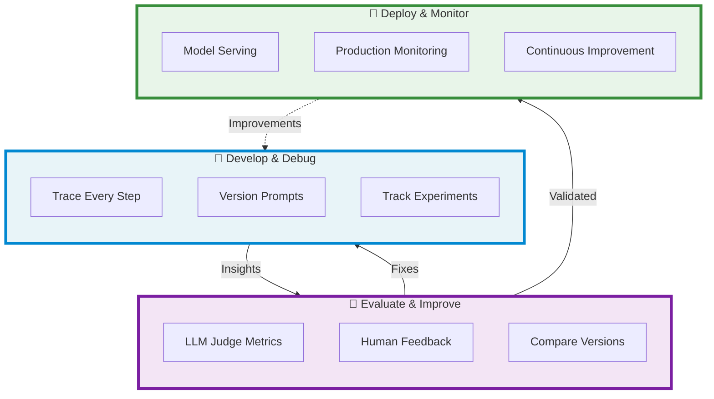

# Getting Started with MLflow for GenAI

## Build Production-Ready GenAI Applications with Confidence

MLflow transforms how you develop, evaluate, and deploy GenAI applications. From prototype to production, get complete visibility into your AI systems while maintaining the flexibility to use any framework or model provider.

## Why MLflow for GenAI?

### 🔍 **Complete Observability**

See exactly what's happening inside your AI applications. MLflow Tracing captures every LLM call, tool interaction, and decision point—turning black-box systems into transparent, debuggable workflows.

### 📊 **Automated Quality Assurance**

Stop guessing if your changes improve quality. MLflow's evaluation framework uses LLM judges and custom metrics to systematically test every iteration, ensuring consistent improvements.

### 🚀 **Framework Freedom**

Use LangChain, LlamaIndex, OpenAI, or any of the 15+ supported frameworks. MLflow integrates seamlessly with your existing tools while providing a unified platform for tracking and deployment.

### 💡 **Human-in-the-Loop Excellence**

Bridge the gap between AI and domain expertise. Collect structured feedback from users and experts to continuously refine your applications based on real-world usage.

## Start Building in Minutes

Follow our quickstart guides to experience MLflow's power for GenAI development. Each guide takes less than 15 minutes and demonstrates core capabilities you'll use every day.

### 📋 Prerequisites

Before starting, ensure you have:

- Python 3.9 or higher
- MLflow 3+ installed (`pip install --upgrade mlflow`)
- An MLflow tracking server (local or remote)

:::tip New to MLflow?
Start with our [Environment Setup Quickstart](/genai/getting-started/connect-environment) to get started in minutes!
:::

### Connect Your Environment

Set up MLflow to work with your development environment, whether you're using a local setup, cloud platform, or managed service.

**What you'll learn:**

- Configure MLflow tracking URI
- Set up experiment tracking
- Connect to model registries

**[Learn how to connect your environment →](/genai/getting-started/connect-environment)**

---

### Collect App Instrumentation with Tracing

Add comprehensive observability to your GenAI application with just a few lines of code. Watch every prompt, retrieval, and tool call as it happens.

**What you'll learn:**

- Auto-instrumentation of popular frameworks (i.e., OpenAI, LangChain, and DSPy)
- Capture custom traces
- Debug complex AI workflows

**[Learn how to use Tracing in an IDE →](/genai/getting-started/tracing/tracing-ide)**

**[Learn how to use Tracing in a Notebook →](/genai/getting-started/tracing/tracing-notebook)**

---

### Evaluate Application Quality

Systematically test and improve your application using LLM judges and custom metrics. Move beyond manual testing to data-driven quality assurance.

**What you'll learn:**

- Create evaluation datasets
- Use LLM judges for quality metrics
- Compare model versions objectively

**[Learn how to evaluate your application →](https://docs.databricks.com/aws/en/mlflow3/genai/getting-started/eval.html)**

---

## Real-World Impact

  

    <h3 style={{marginTop: 0}}>🎯 Faster Debugging</h3>
    
Reduce debugging time by 70% with complete visibility into every AI decision and interaction.

  

  

    <h3 style={{marginTop: 0}}>📈 Quality Confidence</h3>
    
Deploy with certainty using automated evaluation that catches regressions before production.

  

  

    <h3 style={{marginTop: 0}}>🔄 Rapid Iteration</h3>
    
Ship improvements 3x faster with integrated experiment tracking and version control.

  

## Continue Your Journey

### 📚 Core Concepts

- [Understanding MLflow Tracing](/genai/tracing)
- [Evaluation Best Practices](/genai/eval-monitor)
- [Model Registry for GenAI](/genai/data-model/model-registry)
- [Deployment Strategies](/genai/serving)

### 🛠️ Framework Guides

- [LangChain Integration](/genai/flavors/langchain)
- [LlamaIndex Integration](/genai/flavors/llama-index)
- [OpenAI Integration](/genai/flavors/openai)
- [Custom Framework Support](/genai/flavors/chat-model-intro)
