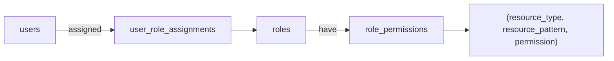

import Link from "@docusaurus/Link";
import { APILink } from "@site/src/components/APILink";

# Role-Based Access Control (RBAC)

MLflow's role-based access control lets you express authorization as named, reusable
roles instead of one-off per-resource grants. A **role** is a bundle of permissions;
**users** are assigned to roles; permissions decisions are made against the
combined set of permissions a user holds in the workspace they're acting in.

Use RBAC when you have more than a handful of users, when teams share access
patterns ("data scientists can read all experiments in `ml-research`"), or when
you want to delegate workspace administration without giving out global admin.
For a single-user setup or a simple installation with a few direct grants, the
per-user mechanics described in <Link to="/self-hosting/security/basic-http-auth">Username and Password</Link>
remain the right starting point.

:::note[Prerequisites]

- Authentication enabled (`mlflow server --app-name basic-auth`)
- Workspaces enabled (`--enable-workspaces`); RBAC roles are workspace-scoped

:::

## The model



- **Users** are global (one row per identity in the auth database).
- **Roles** are workspace-scoped. A role named `editor` in workspace `foo` is a
  separate row from `editor` in workspace `bar`.
- **Permissions** live as rows under a role: `(resource_type, resource_pattern,
permission)`. The pattern is either a literal resource id or `*` (apply to all
  resources of that type in the workspace).
- **Direct per-user grants** (when you want to give one user one permission,
  no role to share) are stored under a hidden synthetic role named
  `__user_<id>__`. Same storage, same resolver; the synthetic role is just an
  authoring detail.

### Permission levels

The grantable permission levels for resource-scoped permissions are:

| Permission | Can read | Can use | Can update | Can delete | Can manage |
| ---------- | -------- | ------- | ---------- | ---------- | ---------- |
| `READ`     | Yes      | No      | No         | No         | No         |
| `USE`      | Yes      | Yes     | No         | No         | No         |
| `EDIT`     | Yes      | Yes     | Yes        | No         | No         |
| `MANAGE`   | Yes      | Yes     | Yes        | Yes        | Yes        |

`USE` is for consuming a resource without modifying it (invoking a gateway
endpoint, referencing a model definition, creating new experiments /
registered models within a workspace).

`NO_PERMISSIONS` exists as the deny-by-default sentinel. It's the effective
state of any `(user, resource)` pair with no matching grant in the resolver's
chain. It is **not grantable** as a role permission or a direct grant; the
auth server rejects attempts to assign it.

RBAC has no explicit-deny override: a workspace-level grant cannot be
"excepted" for a single resource by an absent or lesser per-resource grant.
The resolver's specific-pattern check finds no row, falls through to the
workspace grant, and allows. To restrict access to a specific resource,
grant access more narrowly (per-resource or resource-type wildcard) rather
than holding a broad workspace-level grant and trying to except the resource.

### Workspace-level grants

Workspace-wide access is expressed as a permission on the special
`(resource_type='workspace', resource_pattern='*')` slot. Two levels:

- `USE`: workspace **member**. Read every resource in the workspace; create
  experiments and registered models.
- `MANAGE`: workspace **admin**. Full authority within the workspace, including
  creating roles, granting permissions, and managing users assigned to roles in
  this workspace. Cannot perform system-wide operations such as deleting users.

### Permission resolution

For each authorization check, MLflow evaluates in this order:

1. **Super-admin bypass**: `is_admin = true` short-circuits to allow.
2. **Role-derived grant on the resource**: the user's roles in the request's
   workspace are unioned, and a row matching `(resource_type, resource_id)` is
   sought. Specific patterns win over `*`.
3. **Workspace-level grant**: if no resource-specific row matched, a
   `(workspace, *, …)` row that satisfies the requested permission applies.
4. **Server `default_permission`**: a configured fallback. With workspaces
   enabled, this only applies to the reserved `default` workspace when
   `grant_default_workspace_access` is set; otherwise the effective default is
   deny.

### Identity tiers

| Tier            | How it's expressed                          | Capability                                                                  |
| --------------- | ------------------------------------------- | --------------------------------------------------------------------------- |
| Super admin     | `is_admin = true` on the user row           | Unrestricted system-wide. Sole bearer of user delete + bulk operations.     |
| Workspace admin | Holds `(workspace, *, MANAGE)` via any role | Full authority within those workspaces; can manage roles, users, and grants |
| Regular user    | Any other authenticated identity            | Authorization flows through role-derived permissions only                   |

## Common scenarios

The big shift from the pre-RBAC model: every "give X access to Y" used to be a
one-off per-resource POST. Now you either build the permission set once (a
role) and add users to it, or grant a one-off **direct permission** to a single
user. Both flows live behind the same admin UI modals. There's no separate
"Assign user" or "Grant permission" button.

The examples below assume you've authenticated as a super admin or as a
workspace admin of `ml-research`.

```python
from mlflow.server import get_app_client

tracking_uri = "http://localhost:5000"
auth_client = get_app_client("basic-auth", tracking_uri=tracking_uri)
```

### 1. Give Alice EDIT on experiment 42 (one-off)

When the grant is genuinely just for one user and won't be reused, a **direct
permission** is the simplest option. Internally it's stored under Alice's
synthetic per-user role; no role to maintain.

In the admin UI: `/admin` → Users → click `alice` → **Edit access** → in the
_Direct permissions_ section, add `experiment:42 → EDIT` → review → apply.

Via the role API, the equivalent is to add a permission to Alice's synthetic
role. In practice, prefer the UI for this case. The role API is more
convenient when you'll reuse the grant.

### 2. Give Alice EDIT on experiment 42 (reusable)

When the same permission set will be granted to other users (now or later),
build it as a role:

```python
# 1. Create the role (workspace-scoped)
role = auth_client.create_role(name="exp-42-editor", workspace="ml-research")

# 2. Add the permission
auth_client.add_role_permission(
    role_id=role.id,
    resource_type="experiment",
    resource_pattern="42",
    permission="EDIT",
)

# 3. Assign Alice
auth_client.assign_role(username="alice", role_id=role.id)
```

In the admin UI: `/admin` → Roles → **Create role** → in the _Permissions_
section add `experiment:42 → EDIT`; in the _Assigned users_ section add
`alice` → Create.

### 3. Give a team READ access to every experiment in a workspace

A wildcard pattern lets the role apply to resources that don't exist yet;
adding a new experiment automatically inherits the grant.

```python
role = auth_client.create_role(name="experiment-reader", workspace="ml-research")
auth_client.add_role_permission(
    role_id=role.id,
    resource_type="experiment",
    resource_pattern="*",
    permission="READ",
)

for member in ("alice", "bob", "carol"):
    auth_client.assign_role(username=member, role_id=role.id)
```

In the admin UI: `/admin` → Roles → **Create role** → resource type
`experiment`, pattern `*` (rendered as "All experiments"), permission `READ`;
add the team in the _Assigned users_ section → Create.

### 4. Make a user a workspace admin

Each newly created workspace is automatically seeded with a default `admin`
role (and a `user` role). See [Default roles](#default-roles). Promoting a
user to workspace admin means assigning the seeded `admin` role:

```python
# The seeded ``admin`` role lives in the same workspace; look it up by name.
admin_role = next(r for r in auth_client.list_roles("ml-research") if r.name == "admin")
auth_client.assign_role(username="alice", role_id=admin_role.id)
```

The role explicitly carries `(workspace, *, MANAGE)`. A named, listable,
bulk-assignable grant. Unlike the legacy workspace `MANAGE` permission, it does
not implicitly fan out to every resource type.

In the admin UI: `/admin` → Users → click `alice` → **Edit access** → in the
_Role assignments_ section, add `ml-research/admin` → review changes → apply.

### 5. Onboard a team of N users with the same access

Either reuse the seeded `<workspace>/user` role or create one once. Two entry
points to add multiple users:

- **From the role.** `/admin` → Roles → click the role → **Edit role** → in the
  _Assigned users_ section, add all the users → review → apply.
- **From each user.** Users → click user → **Edit access** → in the _Role
  assignments_ section, add the role → apply.

The first form is one round trip per user assignment; the second is one round
trip per user end-to-end. Pick whichever fits the operator's mental model. The
result is identical.

## Admin UI

The admin UI is the operator-facing surface for everything above. It's reached
from two entry points:

- **Platform admins** (`is_admin = true`) navigate to `/admin` via the sidebar
  `Manage` entry. The page renders cross-workspace: every user in the system,
  every role in every workspace.
- **Workspace admins** click a gear icon on the home-page workspaces table
  next to a workspace they administer. The link lands at `/admin/ws?workspace=<name>`
  . The per-workspace view, scoped to roles and users they can see.

Both views share the same layout: a **Users** tab and a **Roles** tab.

### Users tab

Lists every user, each row showing their visible roles. Click a username to
open the user detail page, then **Edit access** to manage that user's roles,
direct permissions, and admin status (platform-admin-only). Changes are
previewed in a Review step before they're applied.

### Roles tab

Lists roles in the active scope (all roles for platform admins; the active
workspace's roles for workspace admins). **Create role** opens a single-page
form with three sections (_Role details_, _Permissions_, _Assigned users_)
and submits them in one shot. **Edit role** on the role detail page mirrors
the same shape.

## Default roles

When `MLFLOW_RBAC_SEED_DEFAULT_ROLES` is on (it is, by default), MLflow seeds
two roles into every newly created workspace:

| Role    | Permission               | Intent                                                                                       |
| ------- | ------------------------ | -------------------------------------------------------------------------------------------- |
| `admin` | `(workspace, *, MANAGE)` | Workspace administrator. Full authority within the workspace.                                |
| `user`  | `(workspace, *, USE)`    | Member. Reads every resource in the workspace; can create experiments and registered models. |

The user who creates the workspace is automatically assigned the seeded `admin`
role for that workspace.

To disable the seeding (for installations that prefer to define roles
manually):

```bash
export MLFLOW_RBAC_SEED_DEFAULT_ROLES=false
```

## Migrating from the pre-RBAC model

If you're upgrading from a release that used the per-resource permission
endpoints, the auth-store backfill migration translates the legacy tables
(`experiment_permissions`, `registered_model_permissions`, the four
`gateway_*_permissions`, `scorer_permissions`, `workspace_permissions`) into
`role_permissions` rows. The legacy tables remain on disk for rollback safety
through at least one full release cycle, then are dropped in a subsequent
migration.

The wire surface and `AuthServiceClient` shape change as follows:

| Pre-RBAC surface                                                                                                                               | Status                                                                                              | Replacement                                                                                                                               |
| ---------------------------------------------------------------------------------------------------------------------------------------------- | --------------------------------------------------------------------------------------------------- | ----------------------------------------------------------------------------------------------------------------------------------------- |
| `POST/GET/PATCH/DELETE` on `/mlflow/{experiments,registered-models,scorers,gateway/*}/permissions`                                             | **Deprecated** (still works; emits a deprecation warning; backed by synthetic per-user role grants) | `POST /mlflow/roles/create` + `POST /mlflow/roles/permissions/add` + `POST /mlflow/roles/assign`, or a direct permission via the admin UI |
| `auth_client.create_experiment_permission()`, `update_registered_model_permission()`, and the ~30 sibling per-resource client methods          | **Deprecated**                                                                                      | `auth_client.create_role()`, `add_role_permission()`, `assign_role()`, etc.                                                               |
| `POST/GET/PATCH/DELETE` on `/mlflow/workspaces/<workspace>/permissions`                                                                        | **Removed**                                                                                         | Assign the seeded `admin` or `user` role for the workspace, or a custom role with a `(workspace, *, …)` permission                        |
| `auth_client.set_workspace_permission()`, `list_workspace_permissions()`, `delete_workspace_permission()`, `list_user_workspace_permissions()` | **Removed**                                                                                         | The role API (`assign_role` to a workspace-scoped role with a `(workspace, *, …)` permission)                                             |

The per-resource path is "deprecated, not removed" so existing scripts keep
working; new code should use the role API directly. The workspace-permission
path is fully gone. Calls to those endpoints will 404.

**Behavioral note: owner delegation.** Pre-RBAC, a resource creator with
`MANAGE` could delegate permissions on that resource to others. Post-RBAC,
delegation requires a workspace admin (any role with `(workspace, *, MANAGE)`)
or a super admin. If your deployment relied on owner-delegation, either
elevate the relevant users to workspace admins or treat permission delegation
as an admin operation going forward.

## API reference

- <APILink fn="mlflow.server.auth.client.AuthServiceClient">`AuthServiceClient` Python API</APILink>
- <Link to="/api_reference/auth/rest-api.html" target="_blank"><span>Authentication REST API</span></Link>

The role-related methods on `AuthServiceClient`:

```python
auth_client.create_role(workspace, name, description=None)
auth_client.get_role(role_id)
auth_client.list_roles(workspace)
auth_client.update_role(role_id, name=None, description=None)
auth_client.delete_role(role_id)

auth_client.add_role_permission(role_id, resource_type, resource_pattern, permission)
auth_client.update_role_permission(role_permission_id, permission)
auth_client.remove_role_permission(role_permission_id)
auth_client.list_role_permissions(role_id)

auth_client.assign_role(username, role_id)
auth_client.unassign_role(username, role_id)
auth_client.list_user_roles(username)
auth_client.list_role_users(role_id)
```
