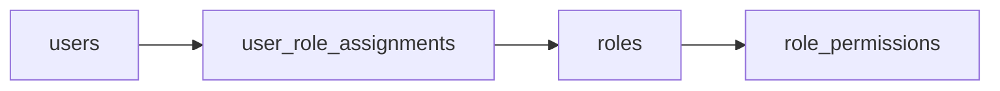

import Link from "@docusaurus/Link";
import { APILink } from "@site/src/components/APILink";

# Role-Based Access Control (RBAC)

MLflow's role-based access control lets you express authorization as named, reusable
roles instead of one-off per-resource grants. A **role** is a bundle of permissions;
**users** are assigned to roles; permissions decisions are made against the
combined set of permissions a user holds in the workspace they're acting in.

RBAC is the authorization model for all permission grants. Even a single
one-off grant on one resource goes through it (see [Scenario 1](#1-give-alice-edit-on-experiment-42-one-off)).
A named role pays off when you have more than a handful of users, when teams
share access patterns ("data scientists can read all experiments in
`ml-research`"), or when you want to delegate workspace administration
without giving out global admin. For setting up authentication and managing
users (login, signup, admin status, password updates), see
[Username and Password](/self-hosting/security/basic-http-auth); this page
picks up once users exist.

:::note[Prerequisites]

- Authentication enabled (`mlflow server --app-name basic-auth`)
- RBAC works against the reserved `default` workspace out of the box.
  Pass `--enable-workspaces` to enable multi-workspace setups: named
  workspaces, the workspace switcher, and `/admin/ws?workspace=…` for
  Workspace Managers.

:::

## The model



A user-role assignment links one user to one role; a role contains zero or
more `role_permissions` rows of the form
`(resource_type, resource_pattern, permission)`.

- **Users** are global (one row per identity in the auth database).
- **Roles** are workspace-scoped. A role named `editor` in workspace `foo` is a
  separate row from `editor` in workspace `bar`.
- **Permissions** live as rows under a role: `(resource_type, resource_pattern,
permission)`. The pattern is either a literal resource id or `*` (apply to all
  resources of that type in the workspace).
- **Direct per-user grants** (when you want to give one user one permission,
  no role to share) are stored under a reserved synthetic role named
  `__user_<id>__`. Same storage, same resolver; operators don't author or
  edit synthetic roles directly — they're managed by the admin UI's
  _Direct permissions_ section and by the `grant_user_permission` /
  `revoke_user_permission` convenience APIs. The `__user_<id>__` name
  pattern is reserved: `create_role` and `update_role` reject it.

### Permission levels

The grantable permission levels for resource-scoped permissions are:

| Permission | Can read | Can use | Can update | Can delete | Can manage |
| ---------- | -------- | ------- | ---------- | ---------- | ---------- |
| `READ`     | Yes      | No      | No         | No         | No         |
| `USE`      | Yes      | Yes     | No         | No         | No         |
| `EDIT`     | Yes      | Yes     | Yes        | No         | No         |
| `MANAGE`   | Yes      | Yes     | Yes        | Yes        | Yes        |

`USE` is for consuming a resource without modifying it (invoking a gateway
endpoint, referencing a model definition, creating new experiments /
registered models within a workspace).

`NO_PERMISSIONS` exists as the deny-by-default sentinel. It's the effective
state of any `(user, resource)` pair with no matching grant in the resolver's
chain. It is **not grantable** as a role permission or a direct grant; the
auth server rejects attempts to assign it.

Because grants are folded via a max (see
[Permission resolution](#permission-resolution)), RBAC has no
explicit-deny override: an absent or lesser per-resource grant cannot
revoke a broader grant the user already holds. To restrict access to a
specific resource, grant access more narrowly (per-resource or
resource-type wildcard) rather than holding a broad workspace-level grant
and trying to except the resource.

### Workspace-level grants

Workspace-wide access is expressed as a permission on the special
`(resource_type='workspace', resource_pattern='*')` slot. Two levels:

- `USE` on `(workspace, *)` is the **Workspace Member** grant. Holders get
  USE-level access (read + use) to every resource in the workspace, plus the
  ability to create experiments and registered models. Per-resource grants
  can upgrade individual rows. A user _without_ this grant doesn't get a
  workspace floor; they only get what their specific resource grants
  provide, or what the [resolution chain](#permission-resolution) returns
  for ungranted resources (typically `NO_PERMISSIONS`).
- `MANAGE` on `(workspace, *)` is the **Workspace Manager** grant. Full
  authority within the workspace, including creating roles, granting
  permissions, and managing users assigned to roles in this workspace.
  Cannot perform system-wide operations such as deleting users.

### Permission resolution

For each authorization check, MLflow evaluates the user's effective
permission as follows:

1. **Platform Admin bypass**: `is_admin = true` short-circuits to allow.
2. **Role-derived grants**: all of the user's roles in the request's workspace
   contribute. Every grant that applies to the resource is folded together
   via a max, and the highest-priority permission wins
   (`MANAGE` > `EDIT` > `USE` > `READ`). A `(workspace, *, …)` row
   participates in the same max because it applies to all resources in the
   workspace, so a workspace-level grant acts as a floor that per-resource
   grants can upgrade but never downgrade.
3. **Server `default_permission`**: a configured fallback consulted only when
   no role-derived grant matches. With workspaces disabled, it always applies.
   With workspaces enabled, it applies only to the reserved `default`
   workspace when `grant_default_workspace_access` is set; otherwise the
   effective default is deny.

### Identity tiers

The admin UI uses **Platform Admin** for the first tier and **Workspace
Manager** for the second; the doc uses the same labels.

| Tier              | How it's expressed                          | Capability                                                                     |
| ----------------- | ------------------------------------------- | ------------------------------------------------------------------------------ |
| Platform Admin    | `is_admin = true` on the user row           | Unrestricted system-wide. Sole bearer of user delete and bulk operations.      |
| Workspace Manager | Holds `(workspace, *, MANAGE)` via any role | Full authority within those workspaces; can manage roles, users, and grants.   |
| Regular user      | Any other authenticated identity            | No admin UI access; authorization flows through role-derived permissions only. |

## Common scenarios

The big shift from the legacy permission model: every "give X access to Y" used to be a
one-off per-resource POST. Now you either build the permission set once (a
role) and add users to it, or grant a one-off **direct permission** to a single
user. Both flows live behind the same admin UI modals. There's no separate
"Assign user" or "Grant permission" button.

The examples below assume you've authenticated as a Platform Admin or as a
Workspace Manager of `ml-research`.

```python
from mlflow.server import get_app_client

tracking_uri = "http://localhost:5000"
auth_client = get_app_client("basic-auth", tracking_uri=tracking_uri)
```

### 1. Give Alice EDIT on experiment 42 (one-off)

For a one-user, one-resource grant that won't be reused, a **direct
permission** is the simplest fit. Internally it lives on Alice's synthetic
per-user role; no admin-managed role to maintain.

**Via the admin UI:** `/admin` → Users → click `alice` → **Edit access** → in
the _Direct permissions_ section, add `experiment:42 → EDIT` → review → apply.

**Via the convenience API:** the cleanest single-call path is
`auth_client.grant_user_permission(username, resource_type, resource_id,
permission)`. Internally it writes to the same synthetic per-user role
as the admin UI's _Direct permissions_ section:

```python
auth_client.grant_user_permission("alice", "experiment", "42", "EDIT")
```

`grant_user_permission` is gated by per-resource MANAGE on the target
resource — the same authority check the legacy
`create_experiment_permission()` family used — so an experiment owner
who holds `(experiment, 42, MANAGE)` can grant access without holding
workspace-wide MANAGE.

**Via the role API:** the synthetic role isn't its own API surface. Use the
same pattern as [Scenario 2](#2-give-alice-edit-on-experiment-42-reusable)
with a single-user role (`create_role` + `add_role_permission` +
`assign_role`). This works but requires workspace MANAGE or Platform Admin
because `create_role` is an administrative action; the convenience API
above is the lower-privilege path for the same outcome.

### 2. Give Alice EDIT on experiment 42 (reusable)

When the same permission set will be granted to other users (now or later),
build it as a role.

**Via the admin UI:** `/admin` → Roles → **Create role** → in the
_Permissions_ section add `experiment:42 → EDIT`; in the _Assigned users_
section add `alice` → Create.

**Via the role API:**

```python
# 1. Create the role (workspace-scoped)
role = auth_client.create_role(name="exp-42-editor", workspace="ml-research")

# 2. Add the permission
auth_client.add_role_permission(
    role_id=role.id,
    resource_type="experiment",
    resource_pattern="42",
    permission="EDIT",
)

# 3. Assign Alice
auth_client.assign_role(username="alice", role_id=role.id)
```

### 3. Give a team READ access to every experiment in a workspace

A wildcard pattern lets the role apply to resources that don't exist yet;
adding a new experiment automatically inherits the grant.

**Via the admin UI:** `/admin` → Roles → **Create role** → resource type
`experiment`, pattern `*` (rendered as "All experiments"), permission
`READ`; add the team in the _Assigned users_ section → Create.

**Via the role API:** the shape is identical to Scenario 2 with two
differences: `resource_pattern="*"` and a loop over the team:

```python
role = auth_client.create_role(name="experiment-reader", workspace="ml-research")
auth_client.add_role_permission(
    role_id=role.id,
    resource_type="experiment",
    resource_pattern="*",
    permission="READ",
)
for member in ("alice", "bob", "carol"):
    auth_client.assign_role(username=member, role_id=role.id)
```

### 4. Make a user a Workspace Manager

Each newly created workspace is automatically seeded with a default `admin`
role (and a `user` role). See [Default roles](#default-roles). Promoting a
user to Workspace Manager means assigning the seeded `admin` role. The role
explicitly carries `(workspace, *, MANAGE)`, which is a named, listable,
bulk-assignable grant; unlike the legacy workspace `MANAGE` permission, it
does not implicitly fan out to every resource type.

**Via the admin UI:** `/admin` → Users → click `alice` → **Edit access** →
in the _Role assignments_ section, add `ml-research/admin` → review changes
→ apply.

**Via the role API:**

```python
# The seeded ``admin`` role lives in the same workspace; look it up by name.
admin_role = next(r for r in auth_client.list_roles("ml-research") if r.name == "admin")
auth_client.assign_role(username="alice", role_id=admin_role.id)
```

### 5. Onboard a team of N users with the same access

Either reuse the seeded `<workspace>/user` role or create one once.

**Via the admin UI**, there are two entry points to add multiple users:

- **From the role.** `/admin` → Roles → click the role → **Edit role** → in
  the _Assigned users_ section, add all the users → review → apply.
- **From each user.** Users → click user → **Edit access** → in the _Role
  assignments_ section, add the role → apply.

The first form is one round trip per user assignment; the second is one
round trip per user end-to-end. Pick whichever fits the operator's mental
model; the result is identical.

**Via the role API:** loop over the team and call `assign_role` once per
member, as in Scenario 3.

## Admin UI

The admin UI is the operator-facing surface for everything above. It's reached
from two entry points:

- **Platform Admins** (`is_admin = true`) navigate to `/admin` via the
  sidebar `Manage` entry. The page renders cross-workspace: every user in
  the system, every role in every workspace.
- **Workspace Managers** click a gear icon on the home-page workspaces table
  next to a workspace they administer. The link lands at
  `/admin/ws?workspace=<name>`, the per-workspace view scoped to roles and
  users they can see.

Both views share the same layout: a **Users** tab and a **Roles** tab.

### Users tab

Lists every user, each row showing their visible roles. Click a username to
open the user detail page, then **Edit access** to manage that user's roles,
direct permissions, and admin status (Platform Admins only). Changes are
previewed in a Review step before they're applied.

### Roles tab

Lists roles in the active scope (all roles for Platform Admins; the active
workspace's roles for Workspace Managers). **Create role** opens a
single-page form with three sections (_Role details_, _Permissions_,
_Assigned users_) and submits them in one shot. **Edit role** on the role
detail page mirrors the same shape.

## Default roles

When `MLFLOW_RBAC_SEED_DEFAULT_ROLES` is on (it is, by default), MLflow seeds
two roles into every newly created workspace:

| Role    | Permission               | Intent                                                                                                 |
| ------- | ------------------------ | ------------------------------------------------------------------------------------------------------ |
| `admin` | `(workspace, *, MANAGE)` | Workspace Manager. Full authority within the workspace.                                                |
| `user`  | `(workspace, *, USE)`    | Workspace Member. Reads every resource in the workspace; can create experiments and registered models. |

The user who creates the workspace is automatically assigned the seeded `admin`
role for that workspace.

To disable the seeding (for installations that prefer to define roles
manually):

```bash
export MLFLOW_RBAC_SEED_DEFAULT_ROLES=false
```

## Migrating from the legacy permission model

If you're upgrading from a release before MLflow 3.13 that used the
per-resource permission endpoints, the auth-store backfill migration
translates the legacy tables
(`experiment_permissions`, `registered_model_permissions`, the four
`gateway_*_permissions`, `scorer_permissions`, `workspace_permissions`) into
`role_permissions` rows. The legacy tables remain on disk for rollback safety
through at least one full release cycle, then are dropped in a subsequent
migration.

The wire surface and `AuthServiceClient` shape change as follows:

| Pre-RBAC surface                                                                                                                               | Status      | Replacement                                                                                                                                                                  |
| ---------------------------------------------------------------------------------------------------------------------------------------------- | ----------- | ---------------------------------------------------------------------------------------------------------------------------------------------------------------------------- |
| `POST/GET/PATCH/DELETE` on `/mlflow/{experiments,registered-models,scorers,gateway/*}/permissions`                                             | **Removed** | `POST /mlflow/users/permissions/grant` / `revoke` for one-user one-resource direct grants, or the role API (`POST /mlflow/roles/create` + `add` + `assign`) for shared sets. |
| `auth_client.create_experiment_permission()`, `update_registered_model_permission()`, and the ~23 sibling per-resource client methods          | **Removed** | `auth_client.grant_user_permission(username, resource_type, resource_id, permission)` / `revoke_user_permission(...)`, or `create_role` + `add_role_permission` + `assign_role`. |
| `POST/GET/PATCH/DELETE` on `/mlflow/workspaces/<workspace>/permissions`                                                                        | **Removed** | Assign the seeded `admin` or `user` role for the workspace, or a custom role with a `(workspace, *, …)` permission                                                           |
| `auth_client.set_workspace_permission()`, `list_workspace_permissions()`, `delete_workspace_permission()`, `list_user_workspace_permissions()` | **Removed** | The role API (`assign_role` to a workspace-scoped role with a `(workspace, *, …)` permission)                                                                                |

All four legacy surfaces are removed at the same upgrade that lands RBAC.
There is no deprecation-warning window: basic-auth was still marked
experimental, so the carry cost of 25 deprecation-warning-emitting
methods outweighed the soft-transition benefit. The auth-store backfill
migration moves existing legacy permission rows into synthetic-role
storage, so existing grants survive the upgrade — only the API surface
changes.

After the upgrade, the one-user one-resource workflow is:

```python
# Replace this:
#   auth_client.create_experiment_permission(experiment_id, username, "EDIT")
auth_client.grant_user_permission(username, "experiment", experiment_id, "EDIT")
```

**Per-resource MANAGE retains delegation.** A user with `(experiment, 42,
MANAGE)` can still grant other users access to experiment 42 — the new
`grant_user_permission` / `revoke_user_permission` are gated by the same
per-resource MANAGE check the legacy endpoints used. The role API itself
(`create_role`, `add_role_permission`, `assign_role`) still requires
workspace MANAGE or Platform Admin; that's by design, since creating a
role is an administrative action.

## API reference

The full list of role/permission/user-assignment methods and their
signatures lives in the auto-generated API docs:

- <APILink fn="mlflow.server.auth.client.AuthServiceClient">`AuthServiceClient` Python API</APILink>
- <Link to="/api_reference/auth/rest-api.html" target="_blank"><span>Authentication REST API</span></Link>
