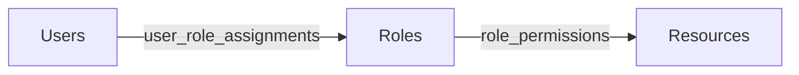
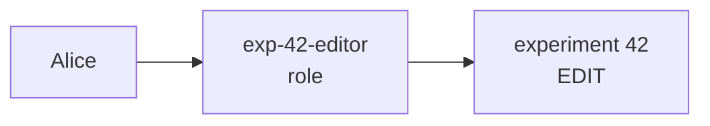
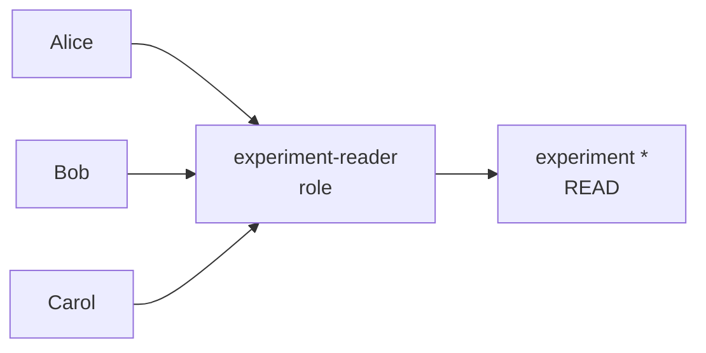
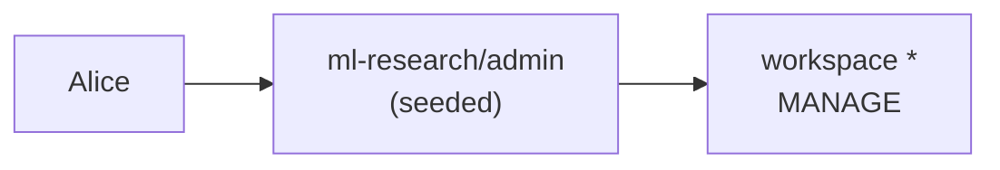
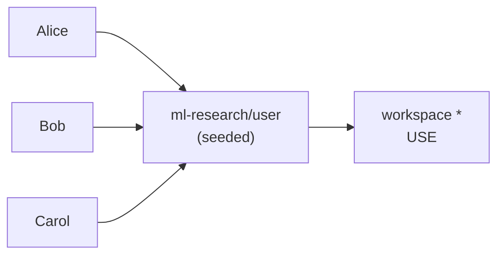
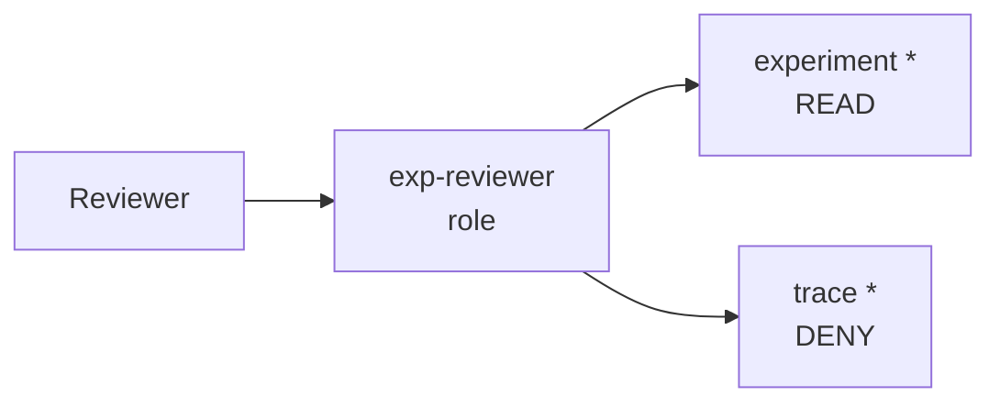
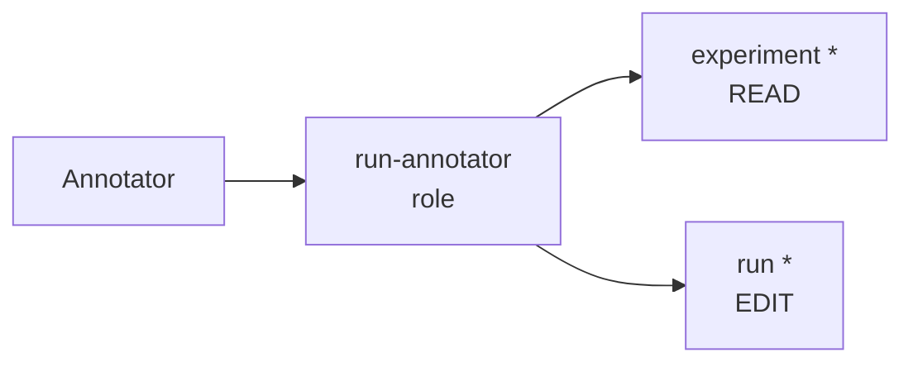

import Link from "@docusaurus/Link";
import { APILink } from "@site/src/components/APILink";
import Tabs from "@theme/Tabs";
import TabItem from "@theme/TabItem";

# Role-Based Access Control (RBAC)

In MLflow, admins grant users permissions by assigning them **roles**.
A role is a named group of permissions defined once and used multiple times.
With workspaces (`--enable-workspaces`), roles become workspace-scoped.

## Prerequisite

Authentication enabled (`mlflow server --app-name basic-auth`).

For setting up authentication and managing users (login, signup, admin
status, password updates), see
[Username and Password](/self-hosting/security/basic-http-auth); this page
picks up once users exist.

## Concepts

Three entities - users, roles, resources - connected by two relations:
role assignment and permission grants. Roles (and the grants they carry) are
workspace-scoped when workspaces are enabled; see
[Workspace isolation](#workspace-isolation) for the on/off delta.


```mermaid
flowchart LR
    Users[Users]
    Roles[Roles]
    Resources[Resources]

    Users -- user_role_assignments --> Roles
    Roles -- role_permissions --> Resources
```

- **User** - an actor who wants to access resources.
- **Resource** - a target entity in MLflow that permissions are
  managed on, such as an experiment, a registered model, a prompt,
  a scorer, or an AI Gateway resource (a secret, an endpoint,
  or a model definition). Some resources live **inside** another one - a
  run inside an experiment, a version inside a registered model - and are
  granted on their own tier; see
  [Sub-resource tiers](#sub-resource-tiers).
- **Role** - a named bundle of permissions on resources.

## Roles

A role is a named list of `(resource_type, resource_pattern, permission)` grants.
Grants can target a single resource (`experiment:42`) or every resource of
a type (`experiment:*`), so one role can express both fine-grained and broad
access. For example, an _editor_ role might carry `(experiment, *, EDIT)` to
let its members edit every experiment, while a narrower role could combine
`(experiment, 42, READ)` with `(prompt, 7, EDIT)`.

### Permission levels

The grantable permission levels for resource-scoped permissions are:

| Permission | Can read | Can use | Can update | Can delete | Can manage |
| ---------- | -------- | ------- | ---------- | ---------- | ---------- |
| `READ`     | Yes      | No      | No         | No         | No         |
| `USE`      | Yes      | Yes     | No         | No         | No         |
| `EDIT`     | Yes      | Yes     | Yes        | No         | No         |
| `MANAGE`   | Yes      | Yes     | Yes        | Yes        | Yes        |
| `DENY`     | No       | No      | No         | No         | No         |

`USE` is for consuming a resource without modifying it (invoking a gateway
endpoint, referencing a model definition, creating new experiments /
registered models within a workspace).

`NO_PERMISSIONS` is the resolver's deny sentinel for workspace-boundary
cases - e.g., a user with no workspace membership when
`grant_default_workspace_access` is off. It is **not grantable** as a role
permission or a direct grant; the auth server rejects attempts to assign
it. The effective permission when no role grant matches is the server's
`default_permission` (`READ` by default; see
[Permission resolution](#permission-resolution)).

`DENY` is an explicit-deny override. Unlike the levels above it is not a
point on the capability ladder: it carries no capabilities, and it wins over
any positive grant that applies to the same resource, so it can carve an
exception out of a broad grant. `(experiment, *, EDIT)` together with
`(experiment, 42, DENY)` edits every experiment except 42.

Two limits are worth knowing before relying on it:

- A **workspace administrator is not restrictable**. A
  `(workspace, *, MANAGE)` grant short-circuits resolution to `MANAGE`
  before `DENY` is considered, so it cannot be excepted this way. Remove the
  workspace grant instead.
- `DENY` applies at the tier it is granted on. It does not cascade from a
  parent to an unrelated resource type; see
  [Permission resolution](#permission-resolution) for how a grant on one
  tier overrides another.

### Sub-resource tiers

A resource that lives inside another can be granted on separately, so access
to the container and access to its contents are not the same decision. The
sub-resource types are:

| Tier                       | Inside                     |
| -------------------------- | -------------------------- |
| `run`                      | `experiment`               |
| `trace`                    | `experiment`               |
| `assessment`               | `experiment` (via a trace) |
| `logged_model`             | `experiment`               |
| `review_queue`             | `experiment`               |
| `registered_model_version` | `registered_model`         |
| `prompt_version`           | `prompt`                   |
| `scorer_version`           | `scorer`                   |
| `mcp_server_version`       | `mcp_server`               |

:::note
Sub-resource tiers are **wildcard grain only**. A grant must use the `*`
pattern - `(run, *, DENY)` is valid, while `(run, r-abc123, READ)` is
rejected with a 400. A per-id grant here could be honoured on a point route
but not in a search, and a grant that holds in one place and silently lapses
in another is worse than no grant, so the server refuses it at the source
rather than dropping it later.
:::

### Permission resolution

For each authorization check, MLflow evaluates the user's effective permission as
follows. An operation on a sub-resource is authorized against the tier **and** its
container, which is what steps 3 and 5 cover.

1. **Platform Admin bypass** - `is_admin = true` short-circuits to allow.
2. **Workspace admin** - a `(workspace, *, MANAGE)` grant resolves every resource in
   the workspace to `MANAGE`, ahead of every rule below including `DENY`.
   `(workspace, *, USE)` does **not** fold into per-resource checks; it confers
   workspace membership and create rights only (see
   [Workspace isolation](#workspace-isolation)).
3. **Container READ** - an operation on a sub-resource also requires READ on its
   container. This is a separate check from the tier, and it is what bounds a
   sub-resource grant to the containers the caller can already see. A tier grant
   names no container, because the grain is wildcard-only, so without this check
   `(run, *, READ)` would read every run in every experiment in the workspace.
   Requiring `READ` costs nothing, because every permission level carrying update,
   delete or manage already carries read.
4. **Grants on the same tier fold together** - all of the user's roles in the
   request's workspace contribute. Grants that apply to the same resource fold via a
   max, and the highest-priority permission wins
   (`MANAGE` > `EDIT` > `USE` > `READ`) - except that a matching `DENY` wins
   outright, whatever it is folded with.
5. **The tier decides; the container is its fallback** - the sub-resource tier is
   consulted first. If it holds **any** grant, that grant decides the action and the
   container's own level is not consulted for it. The container decides **only when
   the tier holds no grant at all** - that is the fallback. Tiers are therefore
   **not** max'd together, so a tier grant overrides its container whether it is more
   or less permissive, and `(run, *, DENY)` is not rescued by
   `(experiment, 42, MANAGE)`. In a longer chain - an `assessment` inside a `trace`
   inside an `experiment` - each tier holding no grant is silent and the next one
   decides. The step 3 READ check applies either way: a tier grant does not waive it.
6. **Server `default_permission`** (defaults to `READ`) - a floor max'd into the
   resolution result, and the final answer when no role grant matches at all. The
   floor does **not** lift `NO_PERMISSIONS` - when the resolver returns it for a
   workspace-boundary reason (no workspace membership, missing workspace, lookup
   error), that deny stands - and it does not lift `DENY` either, since flooring an
   explicit deny would void it. See
   [Workspace isolation](#workspace-isolation) for when the floor applies in
   multi-workspace mode.

Steps 5 and 6 are what make a tier grant optional: with no grant on the tier,
the container decides exactly as it did before these types existed.

Editing a run in experiment 42. The first five rows hold in any configuration,
because an explicit grant on the experiment settles step 3:

| Grants                                        | Read run  | Edit run  | Why                                                     |
| --------------------------------------------- | --------- | --------- | ------------------------------------------------------- |
| `(experiment, 42, EDIT)`                      | yes       | yes       | no run grant, so the container decides                  |
| `(experiment, 42, EDIT)` + `(run, *, READ)`   | yes       | no        | the run tier decides, and it is lower                   |
| `(experiment, 42, READ)` + `(run, *, EDIT)`   | yes       | yes       | the run tier decides, and it is higher                  |
| `(experiment, 42, MANAGE)` + `(run, *, DENY)` | no        | no        | `DENY` on the tier is not rescued by the container      |
| `(experiment, 42, DENY)` + `(run, *, MANAGE)` | no        | no        | step 3: `DENY` on the container blocks every tier grant |
| `(run, *, EDIT)` alone                        | see below | see below | step 3 falls through to `default_permission`            |

The shape to remember: **the tier grant sets the verb, the container grants set
the reach.** `(experiment, 42, READ)` + `(run, *, MANAGE)` deletes runs in
experiment 42 and nowhere else, even though the run grant names no experiment.

Anything that leaves the container below `READ` therefore blocks every operation
on its contents, whatever the tier grant says - `DENY` on the container, or a
`NO_PERMISSIONS` floor.

The last row depends on configuration, and is worth understanding because it is
the common case. With no grant on the experiment, step 3 falls through to
`default_permission`: on a default server that is `READ`, which satisfies the
container check, so a `run` grant alone is enough to edit runs. Set
`default_permission = NO_PERMISSIONS`, or run in multi-workspace mode where an
absent grant is a denial rather than a default, and the same grant is refused.

## Workspace isolation

A [workspace](https://mlflow.org/docs/latest/self-hosting/workspaces/) is an
isolated container for MLflow resources. Workspaces are off by default. To
turn them on, start the server with `--enable-workspaces`. Once enabled,
every experiment, registered model, prompt, scorer, and AI Gateway resource
belongs to exactly one workspace, and nothing crosses the boundary.

Roles and permissions follow the same boundary. A role named `editor` in
workspace `foo` is a completely separate row from `editor` in workspace
`bar`, and a permission grant made in one workspace has no effect in any
other. How that boundary shows up depends on whether multi-workspace
support is enabled.

**Default (no `--enable-workspaces`).** A single reserved `default`
workspace exists. All roles, all assignments, all permissions live there.
The server's `default_permission` config (when set) applies as a floor
for any `(user, resource)` pair.

**Multi-workspace (`--enable-workspaces`).** Named workspaces become
first-class. The home page renders a workspace switcher; the admin UI gets
a per-workspace entry point (`/admin/ws?workspace=<name>`); roles must be
created in a specific workspace. The server's `default_permission` applies
as the floor in named workspaces only when `grant_default_workspace_access`
is set; otherwise the effective floor in each named workspace is deny.

Two grants on the special `(resource_type='workspace',
resource_pattern='*')` slot define workspace-wide access:

- `USE` on `(workspace, *)` - the **Workspace Member** grant.
  - Confers workspace membership: the user can list and enter the workspace.
  - Allows creating new resources (e.g., experiments, registered models) within it.
  - Does **not** itself grant per-resource access. Read access on
    individual resources comes from the server `default_permission` floor
    (defaults to `READ`); higher tiers require an explicit per-resource or
    resource-type wildcard grant.
- `MANAGE` on `(workspace, *)` - the **Workspace Manager** grant. Full
  authority within the workspace, including creating roles, granting
  permissions, and managing role assignments. Cannot perform system-wide
  operations such as deleting users.

The seeded `admin` and `user` roles each carry one of these grants; see
[Default roles](#default-roles).

### User tiers

The admin UI uses **Platform Admin** for the first tier and **Workspace
Manager** for the second; the doc uses the same labels.

| Tier              | How it's expressed                          | Capability                                                                     |
| ----------------- | ------------------------------------------- | ------------------------------------------------------------------------------ |
| Platform Admin    | `is_admin = true` on the user row           | Unrestricted system-wide. Sole bearer of user delete and bulk operations.      |
| Workspace Manager | Holds `(workspace, *, MANAGE)` via any role | Full authority within those workspaces; can manage roles, users, and grants.   |
| Regular user      | Any other authenticated identity            | No admin UI access; authorization flows through role-derived permissions only. |

### Direct grants without a role

For the one-user one-resource case, you don't need to author a single-user
role. Each user has a reserved per-user role that holds their direct
grants; the `grant_user_permission` / `revoke_user_permission` APIs and the
admin UI's _Direct permissions_ section write to it directly. From an
operator's perspective it's one call or one form field - the reserved role
is an implementation detail you never touch.

**Admin UI:** `/admin` → **Users** → click the user → **Edit access** → in
the _Direct permissions_ section, add the `(resource, permission)` grant →
review → apply.

**API:**

```python
auth_client.grant_user_permission("alice", "experiment", "42", "EDIT")
```

`grant_user_permission` is gated by per-resource MANAGE on the target
resource - the same authority check the legacy
`create_experiment_permission()` family used - so an experiment owner who
holds `(experiment, 42, MANAGE)` can grant access without holding
workspace-wide MANAGE. The role API itself requires workspace MANAGE or
Platform Admin, since authoring a role is an administrative action.

For reads, the same family includes
`auth_client.get_user_permission(username, resource_type, resource_id)` -
returns the resolved effective permission via the same resolver the
runtime authorization check uses - and
`auth_client.list_user_permissions(username)`, which returns every grant
the user holds across all their roles, enriched with `role_id` /
`role_name` / `workspace`.

## Common scenarios

The big shift from the legacy permission model: every "give X access to Y"
used to be a one-off per-resource POST. Now you build the permission set
once as a role and assign users to it. Both the admin UI and the
`AuthServiceClient` go through the same role-based primitives.

The examples below assume multi-workspace mode and that you've
authenticated as a Platform Admin or as a Workspace Manager of `ml-research`.

```python
from mlflow.server import get_app_client

tracking_uri = "http://localhost:5000"
auth_client = get_app_client("basic-auth", tracking_uri=tracking_uri)
```

### 1. Give Alice EDIT on experiment 42


```mermaid
flowchart LR
    Alice[Alice] --> R["exp-42-editor<br/>role"]
    R --> P["experiment 42<br/>EDIT"]
```

<Tabs groupId="rbac-flow">
<TabItem value="ui" label="Admin UI">

1. Navigate to `/admin` → **Roles**.
2. Click **Create role**.
3. In _Permissions_, add `experiment:42 → EDIT`.
4. In _Assigned users_, add `alice`.
5. Click **Create**.

</TabItem>
<TabItem value="api" label="Role API">

```python
role = auth_client.create_role(name="exp-42-editor", workspace="ml-research")
auth_client.add_role_permission(
    role_id=role.id,
    resource_type="experiment",
    resource_pattern="42",
    permission="EDIT",
)
auth_client.assign_role(username="alice", role_id=role.id)
```

</TabItem>
</Tabs>

### 2. Give a team READ access to every experiment in a workspace

A wildcard pattern lets the role apply to resources that don't exist yet;
adding a new experiment automatically inherits the grant.


```mermaid
flowchart LR
    A[Alice] --> R["experiment-reader<br/>role"]
    B[Bob] --> R
    C[Carol] --> R
    R --> P["experiment *<br/>READ"]
```

<Tabs groupId="rbac-flow">
<TabItem value="ui" label="Admin UI">

1. Navigate to `/admin` → **Roles**.
2. Click **Create role**.
3. In _Permissions_, add resource type `experiment`, pattern `*` (rendered
   as "All experiments"), permission `READ`.
4. In _Assigned users_, add `alice`, `bob`, `carol`.
5. Click **Create**.

</TabItem>
<TabItem value="api" label="Role API">

The shape is identical to Scenario 1 with two differences:
`resource_pattern="*"` and a loop over the team.

```python
role = auth_client.create_role(name="experiment-reader", workspace="ml-research")
auth_client.add_role_permission(
    role_id=role.id,
    resource_type="experiment",
    resource_pattern="*",
    permission="READ",
)
for member in ("alice", "bob", "carol"):
    auth_client.assign_role(username=member, role_id=role.id)
```

</TabItem>
</Tabs>

### 3. Make a user a Workspace Manager

Every newly created workspace is seeded with a default `admin` role (and a
`user` role; see [Default roles](#default-roles)). Promoting a user means
assigning them the seeded `admin` role for that workspace. The role
explicitly carries `(workspace, *, MANAGE)`.


```mermaid
flowchart LR
    Alice[Alice] --> R["ml-research/admin<br/>(seeded)"]
    R --> P["workspace *<br/>MANAGE"]
```

<Tabs groupId="rbac-flow">
<TabItem value="ui" label="Admin UI">

1. Navigate to `/admin` → **Users**.
2. Click `alice`.
3. Click **Edit access**.
4. In _Role assignments_, add `ml-research/admin`.
5. Review changes → apply.

</TabItem>
<TabItem value="api" label="Role API">

```python
# The seeded `admin` role lives in the workspace; look it up by name.
admin_role = next(r for r in auth_client.list_roles("ml-research") if r.name == "admin")
auth_client.assign_role(username="alice", role_id=admin_role.id)
```

</TabItem>
</Tabs>

### 4. Onboard a team of N users with the same access

Create one role with desired permissions or reuse the seeded `<workspace>/user` role.


```mermaid
flowchart LR
    A[Alice] --> R["ml-research/user<br/>(seeded)"]
    B[Bob] --> R
    C[Carol] --> R
    R --> P["workspace *<br/>USE"]
```

<Tabs groupId="rbac-flow">
<TabItem value="ui" label="Admin UI - from the role">

1. Navigate to `/admin` → **Roles** → click the role.
2. Click **Edit role**.
3. In _Assigned users_, add all the users.
4. Review → apply.

</TabItem>
<TabItem value="ui-per-user" label="Admin UI - from each user">

1. Navigate to `/admin` → **Users** → click the user.
2. Click **Edit access**.
3. In _Role assignments_, add the role → apply.
4. Repeat for each user.

One round trip per user end-to-end. Pick whichever fits the operator's
mental model; the result is identical.

</TabItem>
<TabItem value="api" label="Role API">

Loop over the team and call `assign_role` once per member:

```python
user_role = next(r for r in auth_client.list_roles("ml-research") if r.name == "user")
for member in ("alice", "bob", "carol"):
    auth_client.assign_role(username=member, role_id=user_role.id)
```

</TabItem>
</Tabs>

### 5. Let a reviewer read an experiment but not its traces

Carve the traces out of a grant that would otherwise include them. `DENY` on the
[sub-resource tier](#sub-resource-tiers) applies to the experiment's traces without
affecting the experiment or its runs.


```mermaid
flowchart LR
    Rev[Reviewer] --> R["exp-reviewer<br/>role"]
    R --> P1["experiment *<br/>READ"]
    R --> P2["trace *<br/>DENY"]
```

```python
role = auth_client.create_role(name="exp-reviewer", workspace="ml-research")
auth_client.add_role_permission(
    role_id=role.id, resource_type="experiment", resource_pattern="*", permission="READ"
)
auth_client.add_role_permission(
    role_id=role.id, resource_type="trace", resource_pattern="*", permission="DENY"
)
auth_client.assign_role(username="carol", role_id=role.id)
```

Carol can read every experiment in the workspace and the runs inside them, while trace
reads and searches are refused. Note the `*` pattern: sub-resource tiers are wildcard
grain only, so `resource_pattern="tr-abc123"` is rejected with a 400.

### 6. Let an annotator edit runs without giving away the experiment

The mirror image: a grant on the tier can also widen access, so an annotator can work on
runs while the experiment itself stays read-only.


```mermaid
flowchart LR
    Ann[Annotator] --> R["run-annotator<br/>role"]
    R --> P1["experiment *<br/>READ"]
    R --> P2["run *<br/>EDIT"]
```

```python
role = auth_client.create_role(name="run-annotator", workspace="ml-research")
auth_client.add_role_permission(
    role_id=role.id, resource_type="experiment", resource_pattern="*", permission="READ"
)
auth_client.add_role_permission(
    role_id=role.id, resource_type="run", resource_pattern="*", permission="EDIT"
)
auth_client.assign_role(username="dave", role_id=role.id)
```

Dave can update runs and log to them, but renaming or deleting the experiment is refused —
the run tier decides run operations outright rather than being max'd against its parent.

## Admin UI

The admin UI is the operator-facing surface for managing users, roles and
direct permissions. It's reached from two entry points:

- **Platform Admins** (`is_admin = true`) navigate to `/admin` via the
  sidebar `Manage` entry. The page renders cross-workspace: every user in
  the system, every role in every workspace.
- **Workspace Managers** click a gear icon on the home-page workspaces table
  next to a workspace they administer. The link lands at
  `/admin/ws?workspace=<name>`, the per-workspace view scoped to roles and
  users they can see.

Both views share the same layout: a **Users** tab and a **Roles** tab.

### Managing Users


The Users tab lists every user with their visible roles. Click a username to
open the user detail page, then **Edit access** to manage that user's roles,
direct permissions, and admin status (Platform Admins only). Changes are
previewed in a Review step before they're applied.


### Managing Roles

The Roles tab lists roles in the active scope (all roles for Platform Admins;
the active workspace's roles for Workspace Managers). **Create role** opens a
single-page form with three sections (_Role details_, _Permissions_,
_Assigned users_) and submits them in one shot. **Edit role** on the role
detail page mirrors the same shape.


## Default roles

When `MLFLOW_RBAC_SEED_DEFAULT_ROLES` is on (it is, by default), MLflow seeds
two roles into every newly created workspace:

| Role    | Permission               | Intent                                                                                                 |
| ------- | ------------------------ | ------------------------------------------------------------------------------------------------------ |
| `admin` | `(workspace, *, MANAGE)` | Workspace Manager. Full authority within the workspace.                                                |
| `user`  | `(workspace, *, USE)`    | Workspace Member. Reads every resource in the workspace; can create experiments and registered models. |

The user who creates the workspace is automatically assigned the seeded `admin`
role for that workspace.

To disable the seeding (for installations that prefer to define roles
manually):

```bash
export MLFLOW_RBAC_SEED_DEFAULT_ROLES=false
```

## Migrating from the legacy permission model

If you're upgrading from a release before MLflow 3.13 that used the
per-resource permission endpoints, the auth-store backfill migration
translates the legacy permission tables into `role_permissions` rows.
Existing grants survive the upgrade - only the API surface changes.

The wire surface and `AuthServiceClient` shape change as follows:

| Pre-RBAC surface                                                                                              | Status      | Replacement                                                                                                    |
| ------------------------------------------------------------------------------------------------------------- | ----------- | -------------------------------------------------------------------------------------------------------------- |
| Per-resource permission REST endpoints + `AuthServiceClient` methods (`create_experiment_permission()`, etc.) | **Removed** | `grant_user_permission` / `revoke_user_permission` for one-off direct grants, or the role API for shared sets. |
| Workspace permission REST endpoints + `AuthServiceClient` methods (`set_workspace_permission()`, etc.)        | **Removed** | The role API: assign the seeded `admin` / `user` role, or author a role carrying `(workspace, *, ...)`.        |

At the wire level, the ~24 legacy per-resource REST endpoints consolidated
into four under `/mlflow/users/permissions/*`: `grant`, `revoke`, `get`,
`list`.

There is no deprecation-warning window: basic-auth was still marked
experimental, so the carry cost of dozens of deprecation-warning-emitting
methods outweighed the soft-transition benefit. After the upgrade, the
one-user one-resource workflow is:

```python
# Replace this:
#   auth_client.create_experiment_permission(experiment_id, username, "EDIT")
auth_client.grant_user_permission(username, "experiment", experiment_id, "EDIT")
```

**Per-resource MANAGE retains delegation.** A user with `(experiment, 42,
MANAGE)` can still grant other users access to experiment 42 - the new
`grant_user_permission` / `revoke_user_permission` are gated by the same
per-resource MANAGE check the legacy endpoints used.

### Rollback

The legacy permission tables (`experiment_permissions`,
`registered_model_permissions`, the four `gateway_*_permissions`,
`scorer_permissions`, `workspace_permissions`) remain on disk for rollback
safety through at least one full release cycle. To revert the auth-store
schema:

```bash
mlflow db downgrade <previous-revision> --backend-store-uri <auth-db-uri>
```

The downgrade leaves the legacy tables in place and removes the
`role_permissions` rows the backfill produced. Re-running the upgrade
re-applies the backfill. The legacy tables are dropped in a subsequent
migration after one full release cycle, so plan upgrade timing accordingly.

## API reference

The full list of role/permission/user-assignment methods and their
signatures lives in the auto-generated API docs:

- <APILink fn="mlflow.server.auth.client.AuthServiceClient">`AuthServiceClient` Python API</APILink>
- <Link to="https://mlflow.org/docs/latest/api_reference/auth/rest-api.html" target="_blank"><span>Authentication REST API</span></Link>
