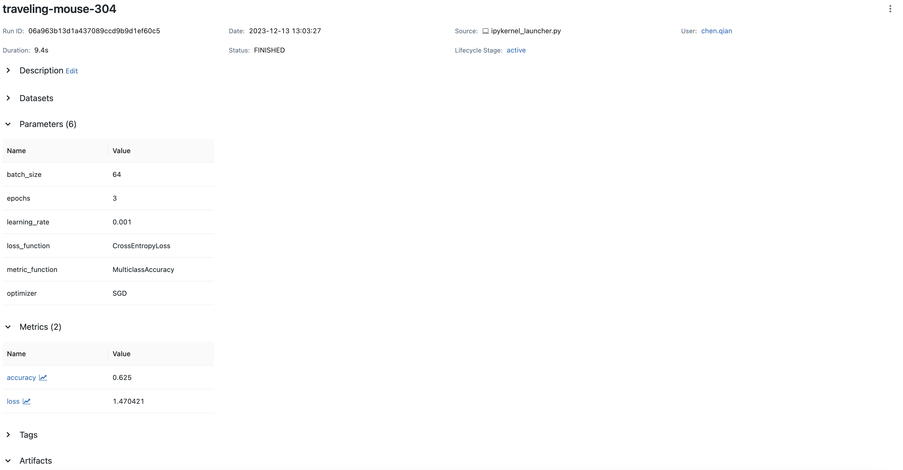
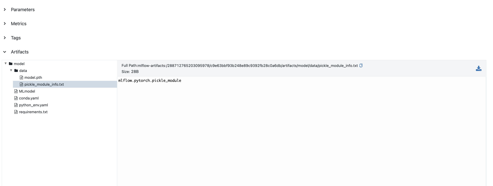
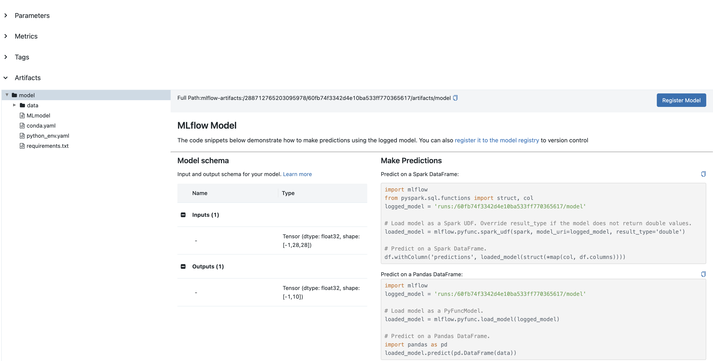

PyTorch within MLflow
=========================

In this guide we will walk you through how to use PyTorch within MLflow. We will demonstrate
how to track your PyTorch experiments and log your PyTorch models to MLflow.

Logging PyTorch Experiments to MLflow
-------------------------------------

Autologging PyTorch Experiments
^^^^^^^^^^^^^^^^^^^^^^^^^^^^^^^

Unlike other deep learning flavors, MLflow does not have an autologging integration with PyTorch because
native PyTorch requires writing custom training loops. If you want to use autologging with PyTorch, please
use `Lightning <https://lightning.ai/>`_ to train your models. When Lightning is being used, you can turned
on autologging by calling :py:func:`mlflow.tensorflow.autolog()` or :py:func:`mlflow.autolog()`. For more
details, please refer to the MLflow Lightning Developer Guide.

Manually Logging PyTorch Experiments
^^^^^^^^^^^^^^^^^^^^^^^^^^^^^^^^^^^^

To log your PyTorch experiments, you can insert MLflow logging into your PyTorch training loop, which relies
on the following APIs:

- :py:func:`mlflow.log_metric()` / :py:func:`mlflow.log_metrics()`: log metrics such as accuracy and loss
  during training.
- :py:func:`mlflow.log_param()` / :py:func:`mlflow.log_params()`: log parameters such as learning rate and
  batch size during training.
- :py:func:`mlflow.pytorch.log_model()`: save your PyTorch model to MLflow, which is usually called at the
  end of training.
- :py:func:`mlflow.log_artifact()`: log artifacts such as model checkpoints and plots during training.

Best Practice of Logging PyTorch to MLflow
~~~~~~~~~~~~~~~~~~~~~~~~~~~~~~~~~~~~~~~~~~

While logging PyTorch experiments is identical to other kinds of manual logging, there are some best
practices that we recommend you to follow:

- Log your model and training parameters via :py:func:`mlflow.log_params()` at the beginning of training
  loop, such as learning rate, batch size, etc. :py:func:`mlflow.log_params()` is the
  batched logging version of :py:func:`mlflow.log_param()`, which is more efficient than the latter.
- Log your model architecture at the beginning of training via :py:func:`mlflow.log_artifact()`. You can use
  ``torchinfo`` package to get the model summary.
- Log training and validation metrics via :py:func:`mlflow.log_metric()` inside your training loop, such as
  loss and accuracy for classification tasks. If you have multiple metrics per logging step, you can
  use :py:func:`mlflow.log_metrics()` to log them together.
- Log your trained/finetuned model to MLflow via `mlflow.pytorch.log_model()` at the end of your training.
- [Optional] You can also log your model checkpoints to MLflow via :py:func:`mlflow.log_artifact()` during
  training if you wish to keep middle training status.

The following is an end-to-end example of how to log your PyTorch experiments to MLflow:

.. code-block:: python

    import mlflow
    import torch

    from torch import nn
    from torch.utils.data import DataLoader
    from torchinfo import summary
    from torchmetrics import Accuracy
    from torchvision import datasets
    from torchvision.transforms import ToTensor

    # Download training data from open datasets.
    training_data = datasets.FashionMNIST(
        root="data",
        train=True,
        download=True,
        transform=ToTensor(),
    )

    # Create data loaders.
    train_dataloader = DataLoader(training_data, batch_size=64)

    # Get cpu or gpu for training.
    device = "cuda" if torch.cuda.is_available() else "cpu"

    # Define the model.
    class NeuralNetwork(nn.Module):
        def __init__(self):
            super().__init__()
            self.flatten = nn.Flatten()
            self.linear_relu_stack = nn.Sequential(
                nn.Linear(28 * 28, 512),
                nn.ReLU(),
                nn.Linear(512, 512),
                nn.ReLU(),
                nn.Linear(512, 10),
            )

        def forward(self, x):
            x = self.flatten(x)
            logits = self.linear_relu_stack(x)
            return logits

    def train(dataloader, model, loss_fn, metrics_fn, optimizer):
        model.train()
        for batch, (X, y) in enumerate(dataloader):
            X, y = X.to(device), y.to(device)

            pred = model(X)
            loss = loss_fn(pred, y)
            accuracy = metrics_fn(pred, y)

            # Backpropagation.
            loss.backward()
            optimizer.step()
            optimizer.zero_grad()

            if batch % 100 == 0:
                loss, current = loss.item(), batch
                mlflow.log_metric("loss", f"{loss:3f}", step=(batch // 100))
                mlflow.log_metric("accuracy", f"{accuracy:3f}", step=(batch // 100))
                print(
                    f"loss: {loss:3f} accuracy: {accuracy:3f} [{current} / {len(dataloader)}]"
                )

    epochs = 3
    loss_fn = nn.CrossEntropyLoss()
    metric_fn = Accuracy(task="multiclass", num_classes=10).to(device)
    model = NeuralNetwork().to(device)
    optimizer = torch.optim.SGD(model.parameters(), lr=1e-3)

    with mlflow.start_run():
        params = {
            "epochs": epochs,
            "learning_rate": 1e-3,
            "batch_size": 64,
            "loss_function": loss_fn.__class__.__name__,
            "metric_function": metric_fn.__class__.__name__,
            "optimizer": "SGD",
        }
        # Log training parameters.
        mlflow.log_params(params)

        # Log model summary.
        with open("model_summary.txt", "w") as f:
            f.write(str(summary(model)))
        mlflow.log_artifact("model_summary.txt")

        for t in range(epochs):
            print(f"Epoch {t+1}\n-------------------------------")
            train(train_dataloader, model, loss_fn, metric_fn, optimizer)

        # Save the trained model to MLflow.
        mlflow.pytorch.log_model(model, "model")

If you run the above code and log to your local MLflow server (for how to use local MLflow server, please read the
`tracking server overview <https://mlflow.org/docs/latest/getting-started/tracking-server-overview/index.html#method-1-start-your-own-mlflow-server>`_),
you will see results on MLflow UI similar to the screenshot below:

Saving Your PyTorch Model to MLflow
------------------------------------

As we mentioned in the previous section, you can save your PyTorch model to MLflow via :py:func:`mlflow.pytorch.log_model()`.
By default MLflow saves your model with `.pth` suffix. A sample code of saving and loading your PyTorch model is as below:

.. code-block:: python

    import mlflow
    import numpy as np

    from torch import nn

    # Define model
    class NeuralNetwork(nn.Module):
        def __init__(self):
            super().__init__()
            self.flatten = nn.Flatten()
            self.linear_relu_stack = nn.Sequential(
                nn.Linear(28 * 28, 512),
                nn.ReLU(),
                nn.Linear(512, 512),
                nn.ReLU(),
                nn.Linear(512, 10),
            )

        def forward(self, x):
            x = self.flatten(x)
            logits = self.linear_relu_stack(x)
            return logits

    model = NeuralNetwork()

    with mlflow.start_run() as run:
        mlflow.pytorch.log_model(model, "model")

    logged_model = f"runs:/{run.info.run_id}/model"
    loaded_model = mlflow.pyfunc.load_model(logged_model)
    loaded_model.predict(np.random.uniform(size=[1, 28, 28]).astype(np.float32))

You can view the saved file on MLflow UI, which will be similar to below:

``mlflow.pytorch.log_model()`` is compatible with ``torch.jit.script()``, if you have a jit-compiled model,
MLflow will save the compiled graph.

Model Signature
^^^^^^^^^^^^^^^

A model signature is a description of a model's input and output. A model signature is not necessary for loading
a model, you can still load the model and perform inferenece if you know the input format. However, it's a good
practice to include the signature for better model understanding. To add a model signature to PyTorch model, you
can either use the :py:func:`mlflow.models.infer_signature()` API or manually set the signature.

:py:func:`mlflow.models.infer_signature()` takes your input data and model outputs to automatically infer the
model signature:

.. code-block:: python

    input = np.random.uniform(size=[1, 28, 28])
    signature = mlflow.models.infer_signature(
        input,
        model(input).detach().numpy(),
    )

.. attention::
    As of MLflow 2.9.1, there is a caveat that the input and output to ``mlflow.models.infer_signature()`` cannot be
    a `torch.Tensor`, please convert them to `numpy.ndarray` before passing to ``mlflow.models.infer_signature()``.

You can also manually set the signature:

.. code-block:: python

    import numpy as np
    from mlflow.types import Schema, TensorSpec

    input_schema = Schema([TensorSpec(np.dtype(np.float32), (-1, 28, 28))])
    output_schema = Schema([TensorSpec(np.dtype(np.float32), (-1, 10))])
    signature = ModelSignature(inputs=input_schema, outputs=output_schema)

After setting the signature, you can include it when calling :py:func:`mlflow.pytorch.log_model()`:

.. code-block:: python

    import mlflow
    import numpy as np

    from torch import nn
    from mlflow.types import Schema, TensorSpec
    from mlflow.models import ModelSignature

    # Define model
    class NeuralNetwork(nn.Module):
        def __init__(self):
            super().__init__()
            self.flatten = nn.Flatten()
            self.linear_relu_stack = nn.Sequential(
                nn.Linear(28 * 28, 512),
                nn.ReLU(),
                nn.Linear(512, 512),
                nn.ReLU(),
                nn.Linear(512, 10),
            )

        def forward(self, x):
            x = self.flatten(x)
            logits = self.linear_relu_stack(x)
            return logits

    model = NeuralNetwork()
    input_schema = Schema([TensorSpec(np.dtype(np.float32), (-1, 28, 28))])
    output_schema = Schema([TensorSpec(np.dtype(np.float32), (-1, 10))])
    signature = ModelSignature(inputs=input_schema, outputs=output_schema)

    with mlflow.start_run() as run:
        mlflow.pytorch.log_model(model, "model", signature=signature)

    logged_model = f"runs:/{run.info.run_id}/model"
    loaded_model = mlflow.pyfunc.load_model(logged_model)
    loaded_model.predict(np.random.uniform(size=[1, 28, 28]).astype(np.float32))

In your MLflow UI you should be able to see the signature of your model as the screenshot below:

