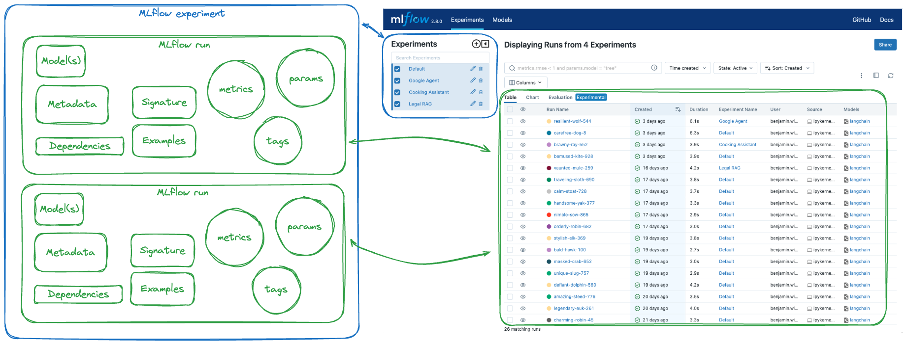
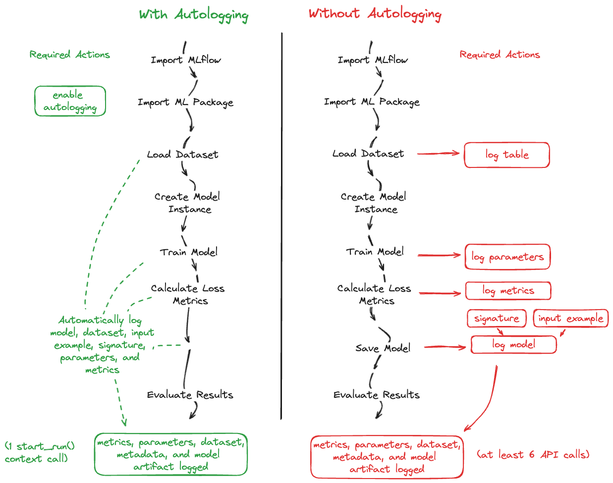
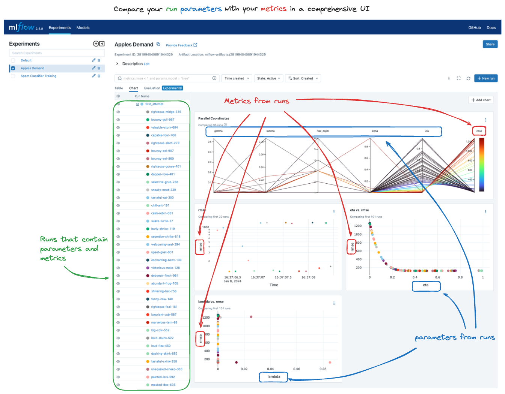

Getting Started with MLflow
===========================

For those new to MLflow or seeking a refresher on its core functionalities, the
quickstart tutorials here are the perfect starting point. They will guide you
step-by-step through fundamental concepts, focusing purely on a task that will maximize your understanding of 
how to use MLflow to solve a particular task. 

Guidance on Running Tutorials
-----------------------------

If you are new to MLflow and have never interfaced with the `MLflow Tracking Server <../tracking/server.html>`_, we highly encourage you to head on over to quickly **read the guide below**. It 
will help you get started as quickly as possible with tutorial content throughout the documentation.

.. raw:: html

     <section>
        <article class="simple-grid">
            

                <a href="running-notebooks/index.html" >
                    

                        Tracking Server Options
                    

                    

                    Learn about your options for running an MLflow Tracking Server for executing any of the guides and tutorials in the MLflow documentation
                    

                </a>
            

        </article>
    </section>

.. toctree::
    :maxdepth: 1
    :hidden:

    running-notebooks/index

Getting Started Guides
----------------------

MLflow Tracking
^^^^^^^^^^^^^^^

:ref:`MLflow Tracking <tracking>` is one of the primary service components of MLflow. In these guides, you will gain an understanding of what MLflow Tracking can do to 
enhance your MLOps related activities while building ML models.

In these introductory guides to MLflow Tracking, you will learn how to leverage MLflow to:

* **Log** training statistics (loss, accuracy, etc.) and hyperparameters for a model
* **Log** (save) a model for later retrieval
* **Register** a model using the :ref:`MLflow Model Registry <registry>` to enable deployment
* **Load** the model and use it for inference

In the process of learning these key concepts, you will be exposed to the `MLflow Tracking APIs <../tracking/tracking-api.html>`_, the MLflow Tracking UI, and learn how to add metadata associated with 
a model training event to an MLflow run.

.. raw:: html

     <section>
        <article class="simple-grid">
            

                <a href="intro-quickstart/index.html" >
                    

                        MLflow Tracking Quickstart Guide
                    

                    

                    Learn the basics of MLflow Tracking in a fast-paced guide with a focus on seeing your first model in the MLflow UI
                    

                </a>
            

            

                <a href="logging-first-model/index.html" >
                    

                        In-depth Tutorial for MLflow Tracking
                    

                    

                        Learn the nuances of interfacing with the MLflow Tracking Server in an in-depth tutorial
                    

                </a>
            

        </article>
    </section>

.. toctree::
    :maxdepth: 1
    :hidden:

    intro-quickstart/index

Autologging Basics
^^^^^^^^^^^^^^^^^^

A great way to get started with MLflow is to use the autologging feature. Autologging automatically logs your model, metrics, examples, signature, and parameters 
with only a single line of code for many of the most popular ML libraries in the Python ecosystem.

In this brief tutorial, you'll learn how to leverage MLflow's autologging feature to simplify your model logging activities.

.. raw:: html

     <section>
        <article class="simple-grid">
            

                <a href="../tracking/autolog.html" >
                    

                        MLflow Autologging Quickstart
                    

                    

                    Get started with logging to MLflow with the high-level autologging API in a fast-paced guide 
                    

                </a>
            

        </article>
    </section>

Run Comparison Basics
^^^^^^^^^^^^^^^^^^^^^

This quickstart tutorial focuses on the MLflow UI's run comparison feature and provides a step-by-step walkthrough of registering the best model found from a 
hyperparameter tuning execution. After locally serving the registered model, a brief example of preparing a model for remote `deployment <../deployment/index.html>`_ 
by containerizing the model using Docker is covered. 

.. raw:: html

     <section>
        <article class="simple-grid">
            

                <a href="quickstart-2/index.html" >
                    

                        MLflow Run Comparison Quickstart
                    

                    

                    Get started with using the MLflow UI to compare runs and register a model for deployment
                    

                </a>
            

        </article>
    </section>

.. toctree::
    :maxdepth: 1
    :hidden:

    quickstart-2/index

Tracking Server Quickstart
^^^^^^^^^^^^^^^^^^^^^^^^^^

This quickstart tutorial walks through different types of `MLflow Tracking Servers <../tracking/server.html>`_ and how to use them to log 
your MLflow experiments.

.. raw:: html

     <section>
        <article class="simple-grid">
            

                <a href="tracking-server-overview/index.html" >
                    

                        5 Minute Tracking Server Overview
                    

                </a>
                

                    Learn how to log MLflow experiments with different tracking servers
                

            

        </article>
    </section>

.. toctree::
    :maxdepth: 1
    :hidden:

    tracking-server-overview/index

Model Registry Quickstart
^^^^^^^^^^^^^^^^^^^^^^^^^

This quickstart tutorial walks through registering a model in the MLflow model registry and how to
retrieve registered models. 

.. raw:: html

     <section>
        <article class="simple-grid">
            

                <a href="registering-first-model/index.html" >
                    

                        5 Minute Model Registry Overview
                    

                </a>
                

                    Learn how to log MLflow models to the model registry
                

            

        </article>
    </section>

.. toctree::
    :maxdepth: 1
    :hidden:

    registering-first-model/index

Further Learning - What's Next?
-------------------------------

Now that you have the essentials under your belt, below are some recommended collections of tutorial and guide content that will help to broaden your 
understanding of MLflow and its APIs. 

- **Tracking** - Learn more abou the MLflow tracking APIs by `reading the tracking guide <../tracking.html>`_.
- **LLMs** - Discover how you can leverage cutting-edge advanced LLMs to power your ML applications by `reading the LLMs guide <../llms/index.html>`_.
- **MLflow Deployment** - Follow the comprehensive `guide on model deployment <../deployment/index.html>`_ to learn how to deploy your MLflow models to a variety of deployment targets.
- **Model Registry** - Learn about the `MLflow Model Registry <../model-registry.html>`_ and how it can help you manage the lifecycle of your ML models.
- **Deep Learning Library Integrations** - From PyTorch to TensorFlow and more, learn about the integrated deep learning capabilities in MLflow by `reading the deep learning guide <../deep-learning/index.html>`_.
- **Traditional ML** - Learn about the `traditional ML capabilities <../traditional-ml/index.html>`_ in MLflow and how they can help you manage your traditional ML workflows.

.. toctree::
    :maxdepth: 1
    :hidden:

    logging-first-model/index
    
