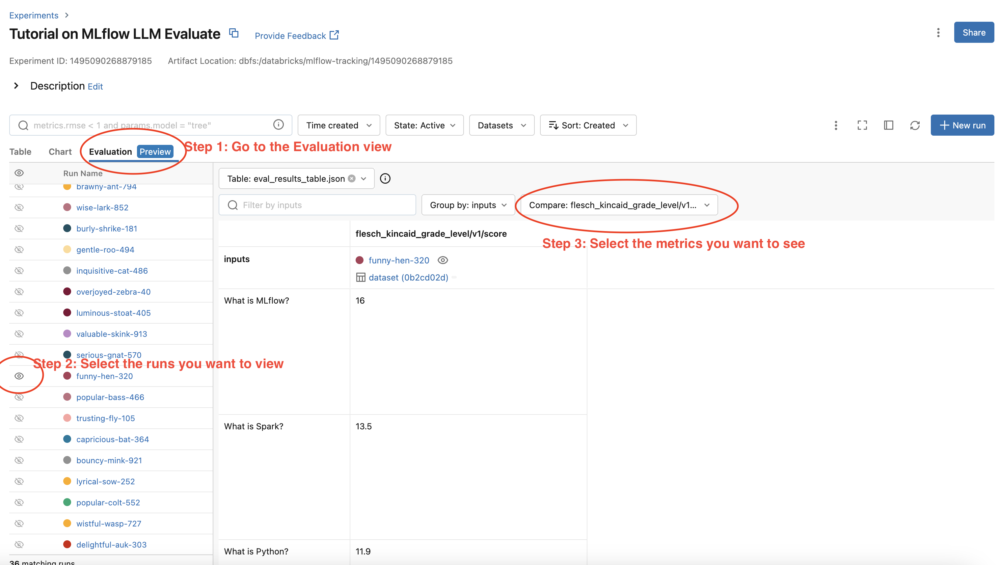

.. meta::
  :description: LLM evaluation involves assessing how well a model performs on a task. MLflow provides a simple API to evaluate your LLMs with popular metrics.

.. _llm-eval:

MLflow LLM Evaluation
=====================

With the emerging of ChatGPT, LLMs have shown its power of text generation in various fields, such as 
question answering, translating and text summarization. Evaluating LLMs' performance is slightly different 
from traditional ML models, as very often there is no single ground truth to compare against. 
MLflow provides an API :py:func:`mlflow.evaluate()` to help evaluate your LLMs.

MLflow's LLM evaluation functionality consists of 3 main components:

1. **A model to evaluate**: it can be an MLflow ``pyfunc`` model, a URI pointing to one registered 
   MLflow model, or any python callable that represents your model, e.g, a HuggingFace text summarization pipeline. 
2. **Metrics**: the metrics to compute, LLM evaluate will use LLM metrics. 
3. **Evaluation data**: the data your model is evaluated at, it can be a pandas Dataframe, a python list, a 
   numpy array or an :py:func:`mlflow.data.dataset.Dataset` instance.

Full Notebook Guides and Examples
---------------------------------
If you're interested in thorough use-case oriented guides that showcase the simplicity and power of MLflow's evaluate 
functionality for LLMs, please navigate to the notebook collection below:

.. raw:: html

    <a href="notebooks/index.html" class="download-btn">View the Notebook Guides</a> 

Quickstart
----------

Below is a simple example that gives an quick overview of how MLflow LLM evaluation works. The example builds
a simple question-answering model by wrapping "openai/gpt-4" with custom prompt. You can paste it to
your IPython or local editor and execute it, and install missing dependencies as prompted. Running the code 
requires OpenAI API key, if you don't have an OpenAI key, you can set it up by following the `OpenAI guide <https://platform.openai.com/account/api-keys>`_.

.. code-block:: shell

    export OPENAI_API_KEY='your-api-key-here'

.. code-block:: python

    import mlflow
    import openai
    import os
    import pandas as pd
    from getpass import getpass

    eval_data = pd.DataFrame(
        {
            "inputs": [
                "What is MLflow?",
                "What is Spark?",
            ],
            "ground_truth": [
                "MLflow is an open-source platform for managing the end-to-end machine learning (ML) "
                "lifecycle. It was developed by Databricks, a company that specializes in big data and "
                "machine learning solutions. MLflow is designed to address the challenges that data "
                "scientists and machine learning engineers face when developing, training, and deploying "
                "machine learning models.",
                "Apache Spark is an open-source, distributed computing system designed for big data "
                "processing and analytics. It was developed in response to limitations of the Hadoop "
                "MapReduce computing model, offering improvements in speed and ease of use. Spark "
                "provides libraries for various tasks such as data ingestion, processing, and analysis "
                "through its components like Spark SQL for structured data, Spark Streaming for "
                "real-time data processing, and MLlib for machine learning tasks",
            ],
        }
    )

    with mlflow.start_run() as run:
        system_prompt = "Answer the following question in two sentences"
        # Wrap "gpt-4" as an MLflow model.
        logged_model_info = mlflow.openai.log_model(
            model="gpt-4",
            task=openai.chat.completions,
            artifact_path="model",
            messages=[
                {"role": "system", "content": system_prompt},
                {"role": "user", "content": "{question}"},
            ],
        )

        # Use predefined question-answering metrics to evaluate our model.
        results = mlflow.evaluate(
            logged_model_info.model_uri,
            eval_data,
            targets="ground_truth",
            model_type="question-answering",
        )
        print(f"See aggregated evaluation results below: \n{results.metrics}")

        # Evaluation result for each data record is available in `results.tables`.
        eval_table = results.tables["eval_results_table"]
        print(f"See evaluation table below: \n{eval_table}")

LLM Evaluation Metrics
----------------------

There are two types of LLM evaluation metrics in MLflow:

1. **Heuristic-based metrics**: These metrics calculate a score for each data record (row in terms of Pandas/Spark dataframe), based on certain functions, such as: Rouge (:py:func:`~mlflow.metrics.rougeL`), Flesch Kincaid (:py:func:`~mlflow.metrics.flesch_kincaid_grade_level`) or Bilingual Evaluation Understudy (BLEU) (:py:func:`~mlflow.metrics.bleu`). These metrics are similar to traditional continuous value metrics. For the list of built-in heuristic metrics and how to define a custom metric with your own function definition, see the `Heuristic-based Metrics <#heuristic-based-metrics>`_ section.

2. **LLM-as-a-Judge metrics**: LLM-as-a-Judge is a new type of metric that uses LLMs to score the quality of model outputs. It overcomes the limitations of heuristic-based metrics, which often miss nuances like context and semantic accuracy. LLM-as-a-Judge metrics provides a more human-like evaluation for complex language tasks while being more scalable and cost-effective than human evaluation. MLflow provides various built-in LLM-as-a-Judge metrics and supports creating custom metrics with your own prompt, grading criteria, and reference examples. See the `LLM-as-a-Judge Metrics <#llm-as-a-judge-metrics>`_ section for more details.

Heuristic-based Metrics
^^^^^^^^^^^^^^^^^^^^^^^

Built-in Heuristic Metrics
**************************

See `this page <https://mlflow.org/docs/latest/python_api/mlflow.metrics.html>`_ for the full list of the built-in heuristic metrics.

.. _llm-eval-default-metrics:

Default Metrics with Pre-defined Model Types
********************************************

MLflow LLM evaluation includes default collections of metrics for pre-selected tasks, e.g, "question-answering". Depending on the 
LLM use case that you are evaluating, these pre-defined collections can greatly simplify the process of running evaluations. To use
defaults metrics for pre-selected tasks, specify the ``model_type`` argument in :py:func:`mlflow.evaluate`, as shown by the example 
below:

.. code-block:: python

    results = mlflow.evaluate(
        model,
        eval_data,
        targets="ground_truth",
        model_type="question-answering",
    )

The supported LLM model types and associated metrics are listed below:

* **question-answering**: ``model_type="question-answering"``:

    * exact-match
    * `toxicity <https://huggingface.co/spaces/evaluate-measurement/toxicity>`_ :sup:`1`
    * `ari_grade_level <https://en.wikipedia.org/wiki/Automated_readability_index>`_ :sup:`2`
    * `flesch_kincaid_grade_level <https://en.wikipedia.org/wiki/Flesch%E2%80%93Kincaid_readability_tests#Flesch%E2%80%93Kincaid_grade_level>`_ :sup:`2`

* **text-summarization**: ``model_type="text-summarization"``: 

    * `ROUGE <https://huggingface.co/spaces/evaluate-metric/rouge>`_ :sup:`3`
    * `toxicity <https://huggingface.co/spaces/evaluate-measurement/toxicity>`_ :sup:`1`
    * `ari_grade_level <https://en.wikipedia.org/wiki/Automated_readability_index>`_ :sup:`2`
    * `flesch_kincaid_grade_level <https://en.wikipedia.org/wiki/Flesch%E2%80%93Kincaid_readability_tests#Flesch%E2%80%93Kincaid_grade_level>`_ :sup:`2`

* **text models**: ``model_type="text"``:

    * `toxicity <https://huggingface.co/spaces/evaluate-measurement/toxicity>`_ :sup:`1`
    * `ari_grade_level <https://en.wikipedia.org/wiki/Automated_readability_index>`_ :sup:`2`
    * `flesch_kincaid_grade_level <https://en.wikipedia.org/wiki/Flesch%E2%80%93Kincaid_readability_tests#Flesch%E2%80%93Kincaid_grade_level>`_ :sup:`2`

* **retrievers**: ``model_type="retriever"``:

    * `precision_at_k <https://en.wikipedia.org/wiki/Evaluation_measures_(information_retrieval)#Precision_at_k>`_  :sup:`4`
    * `recall_at_k <https://en.wikipedia.org/wiki/Evaluation_measures_(information_retrieval)#Recall>`_ :sup:`4`
    * `ndcg_at_k <https://en.wikipedia.org/wiki/Discounted_cumulative_gain#Normalized_DCG>`_ :sup:`4`

:sup:`1` Requires packages `evaluate <https://pypi.org/project/evaluate>`_, `torch <https://pytorch.org/get-started/locally/>`_, and 
`transformers <https://huggingface.co/docs/transformers/installation>`_

:sup:`2` Requires package `textstat <https://pypi.org/project/textstat>`_

:sup:`3` Requires packages `evaluate <https://pypi.org/project/evaluate>`_, `nltk <https://pypi.org/project/nltk>`_, and 
`rouge-score <https://pypi.org/project/rouge-score>`_

:sup:`4` All retriever metrics have a default ``retriever_k`` value of ``3`` that can be overridden by specifying ``retriever_k`` in the ``evaluator_config`` argument. 

.. _llm-eval-custom-metrics:

Use a Custom List of Metrics
****************************

Using the pre-defined metrics associated with a given model type is not the only way to generate scoring metrics 
for LLM evaluation in MLflow. You can specify a custom list of metrics in the `extra_metrics` argument in `mlflow.evaluate`:

* To add additional metrics to the default metrics list of pre-defined model type, keep the `model_type` and add your metrics to ``extra_metrics``:
  
  .. code-block:: python

        results = mlflow.evaluate(
            model,
            eval_data,
            targets="ground_truth",
            model_type="question-answering",
            extra_metrics=[mlflow.metrics.latency()],
        )

  The above code will evaluate your model using all metrics for "question-answering" model plus :py:func:`mlflow.metrics.latency()`.

* To disable default metric calculation and only calculate your selected metrics, remove the ``model_type`` argument and define the desired metrics. 

    .. code-block:: python

        results = mlflow.evaluate(
            model,
            eval_data,
            targets="ground_truth",
            extra_metrics=[mlflow.metrics.toxicity(), mlflow.metrics.latency()],
        )

The full reference for supported evaluation metrics can be found `here <../../python_api/mlflow.html#mlflow.evaluate>`_.

Create Custom heuristic-based LLM Evaluation Metrics
****************************************************

This is very similar to creating custom traditional metrics, with the exception of returning a :py:func:`mlflow.metrics.MetricValue` instance.
Basically you need to:

1. Implement An ``eval_fn`` to define your scoring logic. This function must take in 2 args: ``predictions`` and ``targets``.
   ``eval_fn`` must return a :py:func:`mlflow.metrics.MetricValue` instance.
2. Pass ``eval_fn`` and other arguments to the ``mlflow.metrics.make_metric`` API to create the metric. 

The following code creates a dummy per-row metric called ``"over_10_chars"``; if the model output is greater than 10, 
the score is "yes", otherwise it is "no".

.. code-block:: python

    def eval_fn(predictions, targets):
        scores = ["yes" if len(pred) > 10 else "no" for pred in predictions]
        return MetricValue(
            scores=scores,
            aggregate_results=standard_aggregations(scores),
        )

    # Create an EvaluationMetric object.
    passing_code_metric = make_metric(
        eval_fn=eval_fn, greater_is_better=False, name="over_10_chars"
    )

To create a custom metric that is dependent on other metrics, include those other metrics' names as an argument after ``predictions`` and ``targets``. This can be the name of a builtin metric or another custom metric.
Ensure that you do not accidentally have any circular dependencies in your metrics, or the evaluation will fail.

The following code creates a dummy per-row metric called ``"toxic_or_over_10_chars"``: if the model output is greater than 10 or the toxicity score is greater than 0.5, the score is "yes", otherwise it is "no".

.. code-block:: python

    def eval_fn(predictions, targets, toxicity, over_10_chars):
        scores = [
            "yes" if toxicity.scores[i] > 0.5 or over_10_chars.scores[i] else "no"
            for i in len(toxicity.scores)
        ]
        return MetricValue(scores=scores)

    # Create an EvaluationMetric object.
    toxic_and_over_10_chars_metric = make_metric(
        eval_fn=eval_fn, greater_is_better=False, name="toxic_or_over_10_chars"
    )

LLM-as-a-Judge Metrics
^^^^^^^^^^^^^^^^^^^^^^

LLM-as-a-Judge is a new type of metric that uses LLMs to score the quality of model outputs, providing a more human-like evaluation for complex language tasks while being more scalable and cost-effective than human evaluation.

MLflow supports several builtin LLM-as-a-judge metrics, as well as allowing you to create your own LLM-as-a-judge metrics with custom configurations and prompts.

Built-in LLM-as-a-Judge metrics
*******************************

To use built-in LLM-as-a-Judge metrics in MLflow, pass the list of metrics definitions to the ``extra_metrics`` argument in the :py:func:`mlflow.evaluate()` function.

The following example uses the built-in answer correctness metric for evaluation, in addition to the latency metric (heuristic):

.. code-block:: python

    from mlflow.metrics import latency
    from mlflow.metrics.genai import answer_correctness

    results = mlflow.evaluate(
        eval_data,
        targets="ground_truth",
        extra_metrics=[
            answer_correctness(),
            latency(),
        ],
    )

Here is the list of built-in LLM-as-a-Judge metrics. Click on the link to see the full documentation for each metric:

* :py:func:`~mlflow.metrics.genai.answer_similarity`: Evaluate how similar a model's generated output is compared to the information in the ground truth data.
* :py:func:`~mlflow.metrics.genai.answer_correctness`: Evaluate how factually correct a model's generated output is based on the information within the ground truth data.
* :py:func:`~mlflow.metrics.genai.answer_relevance`: Evaluate how relevant the model generated output is to the input (context is ignored).
* :py:func:`~mlflow.metrics.genai.relevance`: Evaluate how relevant the model generated output is with respect to both the input and the context.
* :py:func:`~mlflow.metrics.genai.faithfulness`: Evaluate how faithful the model generated output is based on the context provided.

Selecting the Judge Model
*************************

By default, MLflow will use OpenAI's GPT-4 model as the judge model that scores metrics. You can change the judge model by passing an override to the ``model`` argument within the metric definition.

1. SaaS LLM Providers
#####################

To use SaaS LLM providers, such as OpenAI or Anthropic, set the ``model`` parameter in the metrics definition, in the format of ``<provider>:/<model-name>``. Currently, MLflow supports ``["openai", "anthropic", "bedrock", "mistral", "togetherai"]`` as viable LLM providers for any judge model. 

.. tabs::

    .. tab:: OpenAI / Azure OpenAI

        OpenAI models can be accessed via the ``openai:/<model-name>`` URI.

        .. code-block:: python

            import mlflow
            import os

            os.environ["OPENAI_API_KEY"] = "<your-openai-api-key>"

            answer_correctness = mlflow.metrics.genai.answer_correctness(model="openai:/gpt-4o")

            # Test the metric definition
            answer_correctness(
                inputs="What is MLflow?",
                predictions="MLflow is an innovative full self-driving airship.",
                targets="MLflow is an open-source platform for managing the end-to-end ML lifecycle.",
            )

        Azure OpenAI endpoints can be accessed via the same ``openai:/<model-name>`` URI, by setting the environment variables, such as ``OPENAI_API_BASE``, ``OPENAI_API_TYPE``, etc.

        .. code-block:: python

            os.environ["OPENAI_API_TYPE"] = "azure"
            os.environ["OPENAI_API_BASE"] = "https:/my-azure-openai-endpoint.azure.com/"
            os.environ["OPENAI_DEPLOYMENT_NAME"] = "gpt-4o-mini"
            os.environ["OPENAI_API_VERSION"] = "2024-08-01-preview"
            os.environ["OPENAI_API_KEY"] = "<your-api-key-for-azure-openai-endpoint>"

    .. tab:: Anthropic

        Anthropic models can be accessed via the ``anthropic:/<model-name>`` URI. Note that the `default judge parameters <#overriding-default-judge-parameters>` need to be overridden by passing the ``parameters`` argument to the metrics definition, since the default parameters violates the Anthropic endpoint requirement (``temperature`` and ``top_p`` cannot be specified together).

        .. code-block:: python

            import mlflow
            import os

            os.environ["ANTHROPIC_API_KEY"] = "<your-anthropic-api-key>"

            answer_correctness = mlflow.metrics.genai.answer_correctness(
                model="anthropic:/claude-3-5-sonnet-20241022",
                # Override default judge parameters to meet Claude endpoint requirements.
                parameters={"temperature": 0, "max_tokens": 256},
            )

            # Test the metric definition
            answer_correctness(
                inputs="What is MLflow?",
                predictions="MLflow is an innovative full self-driving airship.",
                targets="MLflow is an open-source platform for managing the end-to-end ML lifecycle.",
            )

    .. tab:: Bedrock

        Bedrock models can be accessed via the ``bedrock:/<model-name>`` URI. Make sure you have set the authentication information via the environment variables. You can use both role-based or API key-based authentication for accessing Bedrock models.

        .. code-block:: python

            import mlflow
            import os

            os.environ["AWS_REGION"] = "<your-aws-region>"

            # Option 1. Role-based authentication
            os.environ["AWS_ROLE_ARN"] = "<your-aws-role-arn>"

            # Option 2. API key-based authentication
            os.environ["AWS_ACCESS_KEY_ID"] = "<your-aws-access-key-id>"
            os.environ["AWS_SECRET_ACCESS_KEY"] = "<your-aws-secret-access-key>"
            # You can also use session token for temporary credentials.
            # os.environ["AWS_SESSION_TOKEN"] = "<your-aws-session-token>"

            answer_correctness = mlflow.metrics.genai.answer_correctness(
                model="bedrock:/anthropic.claude-3-5-sonnet-20241022-v2:0",
                parameters={
                    "temperature": 0,
                    "max_tokens": 256,
                    "anthropic_version": "bedrock-2023-05-31",
                },
            )

            # Test the metric definition
            answer_correctness(
                inputs="What is MLflow?",
                predictions="MLflow is an innovative full self-driving airship.",
                targets="MLflow is an open-source platform for managing the end-to-end ML lifecycle.",
            )

    .. tab:: Mistral

        Mistral models can be accessed via the ``mistral:/<model-name>`` URI.

        .. code-block:: python

            import mlflow
            import os

            os.environ["MISTRAL_API_KEY"] = "<your-mistral-api-key>"

            answer_correctness = mlflow.metrics.genai.answer_correctness(
                model="mistral:/mistral-small-latest",
            )

            # Test the metric definition
            answer_correctness(
                inputs="What is MLflow?",
                predictions="MLflow is an innovative full self-driving airship.",
                targets="MLflow is an open-source platform for managing the end-to-end ML lifecycle.",
            )

    .. tab:: TogetherAI

        TogetherAI models can be accessed via the ``togetherai:/<model-name>`` URI.

        .. code-block:: python

            import mlflow
            import os

            os.environ["TOGETHERAI_API_KEY"] = "<your-togetherai-api-key>"

            answer_correctness = mlflow.metrics.genai.answer_correctness(
                model="togetherai:/togetherai-small-latest",
            )

            # Test the metric definition
            answer_correctness(
                inputs="What is MLflow?",
                predictions="MLflow is an innovative full self-driving airship.",
                targets="MLflow is an open-source platform for managing the end-to-end ML lifecycle.",
            )

.. note::

    Your use of a third party LLM service (e.g., OpenAI) for evaluation may be subject to and governed by the LLM service's terms of use.

2. Self-hosted Proxy Endpoints
##############################

If you are accessing SaaS LLM providers via a proxy endpoint (e.g., for security compliance), you can set the ``proxy_url`` parameter in the metrics definition. Additionally, use the ``extra_headers`` parameters  to pass extra headers for the endpoint for authentication.

.. code-block:: python

    answer_similarity = mlflow.metrics.genai.answer_similarity(
        model="openai:/gpt-4o",
        proxy_url="https://my-proxy-endpoint/chat",
        extra_headers={"Group-ID": "my-group-id"},
    )

3. MLflow AI Gateway Endpoints
##############################

`MLflow AI Gateway <../deployments/index.html>`_ is a self-hosted solution that allows you to query various LLM providers in a unified interface. To use an endpoint hosted by MLflow AI Gateway:

1. Start the MLflow AI Gateway server with your LLM setting by following `these steps <../deployments/index.html#quickstart>`_.
2. Set the MLflow deployment client to target the server address by using :py:func:`~mlflow.deployments.set_deployments_target()`.
3. Set ``endpoints:/<endpoint-name>`` to the ``model`` parameter in the metrics definition.

.. code-block:: python

    from mlflow.deployments import set_deployments_target

    # When the MLflow AI Gateway server is running at http://localhost:5000
    set_deployments_target("http://localhost:5000")
    my_answer_similarity = mlflow.metrics.genai.answer_similarity(
        model="endpoints:/my-endpoint"
    )

4. Databricks Model Serving
###########################

If you have a model hosted on Databricks, you can use it as a judge model by setting ``endpoints:/<endpoint-name>`` to the ``model`` parameter in the metrics definition. The following code uses a Llama 3.1 405B model available via the `Foundation Model API <https://docs.databricks.com/en/machine-learning/model-serving/index.html>`_.

.. code-block:: python

    from mlflow.deployments import set_deployments_target

    set_deployments_target("databricks")
    llama3_answer_similarity = mlflow.metrics.genai.answer_similarity(
        model="endpoints:/databricks-llama-3-1-405b-instruct"
    )

Overriding Default Judge Parameters
***********************************

By default, MLflow queries the judge LLM model with the following parameters:

.. code-block:: yaml

    temperature: 0.0
    max_tokens: 200
    top_p: 1.0

However, this might not be suitable for all LLM providers. For example, accessing Anthropic's Claude models on Amazon Bedrock requires an ``anthropic_version`` parameter to be specified in the request payload. You can override these default parameters by passing the ``parameters`` argument to the metrics definition.

.. code-block:: python

    my_answer_similarity = mlflow.metrics.genai.answer_similarity(
        model="bedrock:/anthropic.claude-3-5-sonnet-20241022-v2:0",
        parameters={
            "temperature": 0,
            "max_tokens": 256,
            "anthropic_version": "bedrock-2023-05-31",
        },
    )

Note that the parameters dictionary you pass in the ``parameters`` argument will **replace the default parameters**, instead of being merged with them. For example, ``top_p`` will **not** be sent to the model in the above code example.

Creating Custom LLM-as-a-Judge Metrics
**************************************

You can also create your own LLM-as-a-Judge evaluation metrics with :py:func:`mlflow.metrics.genai.make_genai_metric` API, which needs the following information:

* ``name``: the name of your custom metric.
* ``definition``: describe what's the metric doing. 
* ``grading_prompt``: describe the scoring criteria. 
* ``examples`` (Optional): a few input/output examples with scores provided; used as a reference for the LLM judge.

See the :py:func:`API documentation <mlflow.metrics.genai.make_genai_metric>` for the full list of the configurations.

Under the hood, ``definition``, ``grading_prompt``, ``examples`` together with evaluation data and model output will be 
composed into a long prompt and sent to LLM. If you are familiar with the concept of prompt engineering, 
SaaS LLM evaluation metric is basically trying to compose a "right" prompt containing instructions, data and model 
output so that LLM, e.g., GPT4 can output the information we want. 

Now let's create a custom GenAI metrics called "professionalism", which measures how professional our model output is. 

Let's first create a few examples with scores, these will be the reference samples LLM judge uses. To create such examples, 
we will use :py:func:`mlflow.metrics.genai.EvaluationExample` class, which has 4 fields:

* input: input text.
* output: output text.
* score: the score for output in the context of input. 
* justification: why do we give the `score` for the data. 

.. code-block:: python

    professionalism_example_score_2 = mlflow.metrics.genai.EvaluationExample(
        input="What is MLflow?",
        output=(
            "MLflow is like your friendly neighborhood toolkit for managing your machine learning projects. It helps "
            "you track experiments, package your code and models, and collaborate with your team, making the whole ML "
            "workflow smoother. It's like your Swiss Army knife for machine learning!"
        ),
        score=2,
        justification=(
            "The response is written in a casual tone. It uses contractions, filler words such as 'like', and "
            "exclamation points, which make it sound less professional. "
        ),
    )
    professionalism_example_score_4 = mlflow.metrics.genai.EvaluationExample(
        input="What is MLflow?",
        output=(
            "MLflow is an open-source platform for managing the end-to-end machine learning (ML) lifecycle. It was "
            "developed by Databricks, a company that specializes in big data and machine learning solutions. MLflow is "
            "designed to address the challenges that data scientists and machine learning engineers face when "
            "developing, training, and deploying machine learning models.",
        ),
        score=4,
        justification=("The response is written in a formal language and a neutral tone. "),
    )

Now let's define the ``professionalism`` metric, you will see how each field is set up.

.. code-block:: python

    professionalism = mlflow.metrics.genai.make_genai_metric(
        name="professionalism",
        definition=(
            "Professionalism refers to the use of a formal, respectful, and appropriate style of communication that is "
            "tailored to the context and audience. It often involves avoiding overly casual language, slang, or "
            "colloquialisms, and instead using clear, concise, and respectful language."
        ),
        grading_prompt=(
            "Professionalism: If the answer is written using a professional tone, below are the details for different scores: "
            "- Score 0: Language is extremely casual, informal, and may include slang or colloquialisms. Not suitable for "
            "professional contexts."
            "- Score 1: Language is casual but generally respectful and avoids strong informality or slang. Acceptable in "
            "some informal professional settings."
            "- Score 2: Language is overall formal but still have casual words/phrases. Borderline for professional contexts."
            "- Score 3: Language is balanced and avoids extreme informality or formality. Suitable for most professional contexts. "
            "- Score 4: Language is noticeably formal, respectful, and avoids casual elements. Appropriate for formal "
            "business or academic settings. "
        ),
        examples=[professionalism_example_score_2, professionalism_example_score_4],
        model="openai:/gpt-4o-mini",
        parameters={"temperature": 0.0},
        aggregations=["mean", "variance"],
        greater_is_better=True,
    )

Prepare Your Target Models
--------------------------

In order to evaluate your model with ``mlflow.evaluate()``, your model has to be one of the following types:

1. A :py:func:`mlflow.pyfunc.PyFuncModel` instance or a URI pointing to a logged ``mlflow.pyfunc.PyFuncModel`` model. In
   general we call that MLflow model. The 
2. A python function that takes in string inputs and outputs a single string. Your callable must match the signature of 
   :py:func:`mlflow.pyfunc.PyFuncModel.predict` (without ``params`` argument), briefly it should:

   * Has ``data`` as the only argument, which can be a ``pandas.Dataframe``, ``numpy.ndarray``, python list, dictionary or scipy matrix.
   * Returns one of ``pandas.DataFrame``, ``pandas.Series``, ``numpy.ndarray`` or list. 
3. An MLflow Deployments endpoint URI pointing to a local `MLflow AI Gateway <../deployments/index.html>`_, `Databricks Foundation Models API <https://docs.databricks.com/en/machine-learning/model-serving/score-foundation-models.html>`_, and `External Models in Databricks Model Serving <https://docs.databricks.com/en/generative-ai/external-models/index.html>`_. 
4. Set ``model=None``, and put model outputs in ``data``. Only applicable when the data is a Pandas dataframe.

Evaluating with an MLflow Model
^^^^^^^^^^^^^^^^^^^^^^^^^^^^^^^

For detailed instruction on how to convert your model into a ``mlflow.pyfunc.PyFuncModel`` instance, please read
`this doc <https://mlflow.org/docs/latest/python_api/mlflow.pyfunc.html#creating-custom-pyfunc-models>`_. But in short,
to evaluate your model as an MLflow model, we recommend following the steps below:

1. Log your model to MLflow server by ``log_model``. Each flavor (``opeanai``, ``pytorch``, ...) 
   has its own ``log_model`` API, e.g., :py:func:`mlflow.openai.log_model()`:

   .. code-block:: python

        with mlflow.start_run():
            system_prompt = "Answer the following question in two sentences"
            # Wrap "gpt-4o-mini" as an MLflow model.
            logged_model_info = mlflow.openai.log_model(
                model="gpt-4o-mini",
                task=openai.chat.completions,
                artifact_path="model",
                messages=[
                    {"role": "system", "content": system_prompt},
                    {"role": "user", "content": "{question}"},
                ],
            )
2. Use the URI of logged model as the model instance in ``mlflow.evaluate()``:
   
   .. code-block:: python

        results = mlflow.evaluate(
            logged_model_info.model_uri,
            eval_data,
            targets="ground_truth",
            model_type="question-answering",
        )

.. _llm-eval-custom-function:

Evaluating with a Custom Function
^^^^^^^^^^^^^^^^^^^^^^^^^^^^^^^^^

As of MLflow 2.8.0, :py:func:`mlflow.evaluate()` supports evaluating a python function without requiring 
logging the model to MLflow. This is useful when you don't want to log the model and just want to evaluate
it. The following example uses :py:func:`mlflow.evaluate()` to evaluate a function. You also need to set
up OpenAI authentication to run the code below.

.. code-block:: python

    import mlflow
    import openai
    import pandas as pd
    from typing import List

    eval_data = pd.DataFrame(
        {
            "inputs": [
                "What is MLflow?",
                "What is Spark?",
            ],
            "ground_truth": [
                "MLflow is an open-source platform for managing the end-to-end machine learning (ML) lifecycle. It was developed by Databricks, a company that specializes in big data and machine learning solutions. MLflow is designed to address the challenges that data scientists and machine learning engineers face when developing, training, and deploying machine learning models.",
                "Apache Spark is an open-source, distributed computing system designed for big data processing and analytics. It was developed in response to limitations of the Hadoop MapReduce computing model, offering improvements in speed and ease of use. Spark provides libraries for various tasks such as data ingestion, processing, and analysis through its components like Spark SQL for structured data, Spark Streaming for real-time data processing, and MLlib for machine learning tasks",
            ],
        }
    )

    def openai_qa(inputs: pd.DataFrame) -> List[str]:
        predictions = []
        system_prompt = "Please answer the following question in formal language."

        for _, row in inputs.iterrows():
            completion = openai.chat.completions.create(
                model="gpt-4o-mini",
                messages=[
                    {"role": "system", "content": system_prompt},
                    {"role": "user", "content": row["inputs"]},
                ],
            )
            predictions.append(completion.choices[0].message.content)

        return predictions

    with mlflow.start_run():
        results = mlflow.evaluate(
            model=openai_qa,
            data=eval_data,
            targets="ground_truth",
            model_type="question-answering",
        )

    print(results.metrics)

.. code-block:: python
    :caption: Output

    {
        "flesch_kincaid_grade_level/v1/mean": 14.75,
        "flesch_kincaid_grade_level/v1/variance": 0.5625,
        "flesch_kincaid_grade_level/v1/p90": 15.35,
        "ari_grade_level/v1/mean": 18.15,
        "ari_grade_level/v1/variance": 0.5625,
        "ari_grade_level/v1/p90": 18.75,
        "exact_match/v1": 0.0,
    }

.. _llm-eval-model-endpoint:

Evaluating with an MLflow Deployments Endpoint
^^^^^^^^^^^^^^^^^^^^^^^^^^^^^^^^^^^^^^^^^^^^^^

For MLflow >= 2.11.0, :py:func:`mlflow.evaluate()` supports evaluating a model endpoint by directly passing the MLflow Deployments endpoint URI to the ``model`` argument.
This is particularly useful when you want to evaluate a deployed model hosted by a local `MLflow AI Gateway <../deployments/index.html>`_,  `Databricks Foundation Models API <https://docs.databricks.com/en/machine-learning/model-serving/score-foundation-models.html>`_, and `External Models in Databricks Model Serving <https://docs.databricks.com/en/generative-ai/external-models/index.html>`_, without implementing custom prediction logic to wrap it as an MLflow model or a python function.

Please don't forget to set the target deployment client by using :py:func:`mlflow.deployments.set_deployments_target` before calling :py:func:`mlflow.evaluate()` with the endpoint URI, as shown in the example below. Otherwise, you will see an error message like ``MlflowException: No deployments target has been set...``.

.. hint::

    When you want to use an endpoint **not** hosted by an MLflow AI Gateway or Databricks, you can create a custom Python function following the :ref:`Evaluating with a Custom Function <llm-eval-custom-function>` guide and use it as the ``model`` argument.

Supported Input Data Formats
****************************

The input data can be either of the following format when using an URI of the MLflow Deployment Endpoint as the model:

.. list-table::
    :widths: 20 40 40
    :header-rows: 1
    :class: wrap-table

    * - Data Format
      - Example
      - Additional Notes

    * - A pandas DataFrame with a string column.
      - 
        .. code-block:: python

            pd.DataFrame(
                {
                    "inputs": [
                        "What is MLflow?",
                        "What is Spark?",
                    ]
                }
            )

      - For this input format, MLflow will construct the appropriate request payload to the model endpoint type. For example, if your model is a chat endpoint (``llm/v1/chat``), MLflow will wrap your input string with the chat messages format like ``{"messages": [{"role": "user", "content": "What is MLflow?"}]}``. If you want to customize the request payload e.g. including system prompt, please use the next format.

    * - A pandas DataFrame with a dictionary column.
      - 
        .. code-block:: python

            pd.DataFrame(
                {
                    "inputs": [
                        {
                            "messages": [
                                {"role": "system", "content": "Please answer."},
                                {"role": "user", "content": "What is MLflow?"},
                            ],
                            "max_tokens": 100,
                        },
                        # ... more dictionary records
                    ]
                }
            )

      - In this format, the dictionary should have the correct request format for your model endpoint. Please refer to the `MLflow Deployments documentation <../deployments/index.html#standard-query-parameters>`_ for more information about the request format for different model endpoint types.

    * - A list of input strings.
      - 
        .. code-block:: python

            [
                "What is MLflow?",
                "What is Spark?",
            ]

      - The :py:func:`mlflow.evaluate()` also accepts a list input.

    * - A list of request payload (dictionary).
      - 
        .. code-block:: python

            [
                {
                    "messages": [
                        {"role": "system", "content": "Please answer."},
                        {"role": "user", "content": "What is MLflow?"},
                    ],
                    "max_tokens": 100,
                },
                # ... more dictionary records
            ]

      - Similarly to Pandas DataFrame input, the dictionary should have the correct request format for your model endpoint.

Passing Inference Parameters
****************************

You can pass additional inference parameters such as ``max_tokens``, ``temperature``, ``n``, to the model endpoint by setting the ``inference_params`` argument in :py:func:`mlflow.evaluate()`. The ``inference_params`` argument is a dictionary that contains the parameters to be passed to the model endpoint. The specified parameters are used for all the input record in the evaluation dataset.

.. note::

    When your input is a dictionary format that represents request payload, it can also include the parameters like ``max_tokens``. If there are overlapping parameters in both the ``inference_params`` and the input data, the values in the ``inference_params`` will take precedence.

Examples
********

**Chat Endpoint hosted by a local** `MLflow AI Gateway <../deployments/index.html>`_

.. code-block:: python

    import mlflow
    from mlflow.deployments import set_deployments_target
    import pandas as pd

    # Point the client to the local MLflow AI Gateway
    set_deployments_target("http://localhost:5000")

    eval_data = pd.DataFrame(
        {
            # Input data must be a string column and named "inputs".
            "inputs": [
                "What is MLflow?",
                "What is Spark?",
            ],
            # Additional ground truth data for evaluating the answer
            "ground_truth": [
                "MLflow is an open-source platform ....",
                "Apache Spark is an open-source, ...",
            ],
        }
    )

    with mlflow.start_run() as run:
        results = mlflow.evaluate(
            model="endpoints:/my-chat-endpoint",
            data=eval_data,
            targets="ground_truth",
            inference_params={"max_tokens": 100, "temperature": 0.0},
            model_type="question-answering",
        )

**Completion Endpoint hosted on** `Databricks Foundation Models API <https://docs.databricks.com/en/machine-learning/model-serving/score-foundation-models.html>`_

.. code-block:: python

    import mlflow
    from mlflow.deployments import set_deployments_target
    import pandas as pd

    # Point the client to Databricks Foundation Models API
    set_deployments_target("databricks")

    eval_data = pd.DataFrame(
        {
            # Input data must be a string column and named "inputs".
            "inputs": [
                "Write 3 reasons why you should use MLflow?",
                "Can you explain the difference between classification and regression?",
            ],
        }
    )

    with mlflow.start_run() as run:
        results = mlflow.evaluate(
            model="endpoints:/databricks-mpt-7b-instruct",
            data=eval_data,
            inference_params={"max_tokens": 100, "temperature": 0.0},
            model_type="text",
        )

Evaluating `External Models in Databricks Model Serving <https://docs.databricks.com/en/generative-ai/external-models/index.html>`_ can be done in the same way, you just need to specify the different URI that points to the serving endpoint like ``"endpoints:/your-chat-endpoint"``.

.. _llm-eval-static-dataset:

Evaluating with a Static Dataset
^^^^^^^^^^^^^^^^^^^^^^^^^^^^^^^^

For MLflow >= 2.8.0, :py:func:`mlflow.evaluate()` supports evaluating a static dataset without specifying a model.
This is useful when you save the model output to a column in a Pandas DataFrame or an MLflow PandasDataset, and
want to evaluate the static dataset without re-running the model.

If you are using a Pandas DataFrame, you must specify the column name that contains the model output using the
top-level ``predictions`` parameter in :py:func:`mlflow.evaluate()`:

.. code-block:: python

    import mlflow
    import pandas as pd

    eval_data = pd.DataFrame(
        {
            "inputs": [
                "What is MLflow?",
                "What is Spark?",
            ],
            "ground_truth": [
                "MLflow is an open-source platform for managing the end-to-end machine learning (ML) lifecycle. "
                "It was developed by Databricks, a company that specializes in big data and machine learning solutions. "
                "MLflow is designed to address the challenges that data scientists and machine learning engineers "
                "face when developing, training, and deploying machine learning models.",
                "Apache Spark is an open-source, distributed computing system designed for big data processing and "
                "analytics. It was developed in response to limitations of the Hadoop MapReduce computing model, "
                "offering improvements in speed and ease of use. Spark provides libraries for various tasks such as "
                "data ingestion, processing, and analysis through its components like Spark SQL for structured data, "
                "Spark Streaming for real-time data processing, and MLlib for machine learning tasks",
            ],
            "predictions": [
                "MLflow is an open-source platform that provides handy tools to manage Machine Learning workflow "
                "lifecycle in a simple way",
                "Spark is a popular open-source distributed computing system designed for big data processing and analytics.",
            ],
        }
    )

    with mlflow.start_run() as run:
        results = mlflow.evaluate(
            data=eval_data,
            targets="ground_truth",
            predictions="predictions",
            extra_metrics=[mlflow.metrics.genai.answer_similarity()],
            evaluators="default",
        )
        print(f"See aggregated evaluation results below: \n{results.metrics}")

        eval_table = results.tables["eval_results_table"]
        print(f"See evaluation table below: \n{eval_table}")

Viewing Evaluation Results
--------------------------

View Evaluation Results via Code
^^^^^^^^^^^^^^^^^^^^^^^^^^^^^^^^

``mlflow.evaluate()`` returns the evaluation results as an :py:func:`mlflow.models.EvaluationResult` instance. 
To see the score on selected metrics, you can check:

* ``metrics``: stores the aggregated results, like average/variance across the evaluation dataset. Let's take a second
  pass on the code example above and focus on printing out the aggregated results.
  
  .. code-block:: python

    with mlflow.start_run() as run:
        results = mlflow.evaluate(
            data=eval_data,
            targets="ground_truth",
            predictions="predictions",
            extra_metrics=[mlflow.metrics.genai.answer_similarity()],
            evaluators="default",
        )
        print(f"See aggregated evaluation results below: \n{results.metrics}")

* ``tables["eval_results_table"]``: stores the per-row evaluation results. 

  .. code-block:: python

    with mlflow.start_run() as run:
        results = mlflow.evaluate(
            data=eval_data,
            targets="ground_truth",
            predictions="predictions",
            extra_metrics=[mlflow.metrics.genai.answer_similarity()],
            evaluators="default",
        )
        print(
            f"See per-data evaluation results below: \n{results.tables['eval_results_table']}"
        )

View Evaluation Results via the MLflow UI
^^^^^^^^^^^^^^^^^^^^^^^^^^^^^^^^^^^^^^^^^

Your evaluation result is automatically logged into MLflow server, so you can view your evaluation results directly from the
MLflow UI. To view the evaluation results on MLflow UI, please follow the steps below:

1. Go to the experiment view of your MLflow experiment.
2. Select the "Evaluation" tab.
3. Select the runs you want to check evaluation results.
4. Select the metrics from the dropdown menu on the right side. 

Please see the screenshot below for clarity:

