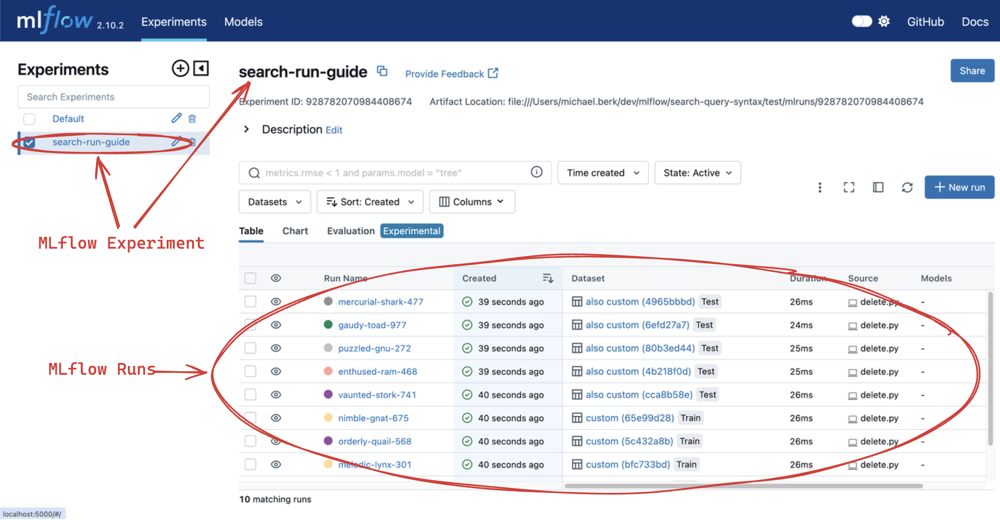
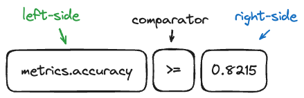

Search Runs
===========

This guide will walk you through how to search your MLflow runs through the MLflow UI and Python API.
This resource will be valuable if you're interested in querying specific runs based on their metrics,
params, tags, dataset information, or run metadata.

In short, you can leverage SQL-like syntax to filter your runs based on a variety of conditions. 
Note that the ``OR`` keyword is not supported and there are a few other differences from SQL 
mentioned below, but despite these limitations, the run search functionality is quite powerful.

Search Runs on MLflow UI
------------------------

The MLflow UI provides a powerful search interface that allows you to filter runs. Below we'll...

1. Create example MLflow runs
2. Look at a simple querying example
3. Deep dive into query syntax
4. Provide a variety of example queries

Create Example MLflow Runs
^^^^^^^^^^^^^^^^^^^^^^^^^^

First, let's create some example MLflow runs. This documentation is based on experiments created 
with the below script. If you don't want to interactively explore this on your machine, skip 
this section.

Before running the script, let's simply start the MLflow UI on a local host. 

.. code-block:: bash

  mlflow ui

Let's visit ``http://localhost:5000/`` in our web browser. After doing so, you'll notice that we don't 
have any experiments or models. Let's resolve this by creating a few MLflow runs via the script
below. 

Note that when you run this script, you'll want to do so from the same directory that you ran
the ``mlflow ui`` command.

.. code-block:: python

  import mlflow
  import numpy as np

  mlflow.set_experiment("search-run-guide")

  accuracy = np.arange(0, 1, 0.1)
  loss = np.arange(1, 0, -0.1)
  log_scale_loss = np.log(loss)
  f1_score = np.arange(0, 1, 0.1)

  batch_size = [2] * 5 + [4] * 5
  learning_rate = [0.001, 0.01] * 5
  model = ["GPT-2", "GPT-3", "GPT-3.5", "GPT-4"] + [None] * 6

  task = ["classification", "regression", "causal lm"] + [None] * 7
  environment = ["notebook"] * 5 + [None] * 5

  dataset_name = ["custom"] * 5 + ["also custom"] * 5
  dataset_digest = ["s8ds293b", "jks834s2"] + [None] * 8
  dataset_context = ["train"] * 5 + ["test"] * 5

  for i in range(10):
      with mlflow.start_run():
          mlflow.log_metrics(
              {
                  "loss": loss[i],
                  "accuracy": accuracy[i],
                  "log-scale-loss": log_scale_loss[i],
                  "f1 score": f1_score[i],
              }
          )

          mlflow.log_params(
              {
                  "batch_size": batch_size[i],
                  "learning rate": learning_rate[i],
                  "model": model[i],
              }
          )

          mlflow.set_tags(
              {
                  "task": task[i],
                  "environment": environment[i],
              }
          )

          dataset = mlflow.data.from_numpy(
              features=np.random.uniform(size=[20, 28, 28, 3]),
              targets=np.random.randint(0, 10, size=[20]),
              name=dataset_name[i],
              digest=dataset_digest[i],
          )
          mlflow.log_input(dataset, context=dataset_context[i])

The code above creates 10 MLflow runs with different metrics, params, tags and dataset information. 
After successful execution, if you return to the MLflow UI in your browser, you should find all of 
these runs under the experiment "search-run-guide", as shown by the following screenshot:

In real-world production deployments of MLflow, it's common to have thousands or even hundreds of thousands of  
runs. In such cases, it's important to be able to filter and search for runs based on specific criteria.

.. _search-runs-syntax:

Search Query Example 
^^^^^^^^^^^^^^^^^^^^

In order to filter your MLflow runs, you will need to write **search queries**, which are pseudo-SQL
conditions expressed in a distinct syntax. 

To showcase this functionality, let's look at the below code examples.

.. code-block:: python

  import mlflow

  all_runs = mlflow.search_runs(search_all_experiments=True)
  print(all_runs)

.. code-block:: text
  :caption: Output

                               run_id  ... tags.mlflow.user
  0  5984a3488161440f92de9847e846b342  ...     michael.berk
  1  41160f238a5841998dda263794b26067  ...     michael.berk
  2  babe221a676b4fa4b204f8240f2c4f14  ...     michael.berk
  3  45eb4f02c5a1461aa6098fa550233be6  ...     michael.berk
  4  1c7c459486c44b23bb016028aee1f153  ...     michael.berk
  5  4453f59f1ab04491bb9582d8cba5f437  ...     michael.berk
  6  22db81f070f6413588641c8c343cdd72  ...     michael.berk
  7  c3680e37d0fa44eb9c9fb7828f6b5481  ...     michael.berk
  8  67973142b9c0470d8d764ada07c5a988  ...     michael.berk
  9  59853d5f17f946218f63de1dc82de07b  ...     michael.berk

  [10 rows x 19 columns]

Second, let's try filtering the runs for our really bad models: ``metrics.loss > 0.8``.

.. code-block:: python
  
  import mlflow

  bad_runs = mlflow.search_runs(
      filter_string="metrics.loss > 0.8", search_all_experiments=True
  )
  print(bad_runs)

.. code-block:: text
  :caption: Output

                               run_id  ... tags.mlflow.source.name
  0  67973142b9c0470d8d764ada07c5a988  ...               delete.py
  1  59853d5f17f946218f63de1dc82de07b  ...               delete.py

  [2 rows x 19 columns]

You'll notice that we now are displaying 2 runs instead of 10. Pretty easy, right?

Search Syntax Overview
^^^^^^^^^^^^^^^^^^^^^^

MLflow's Search functionality leverages a Domain Specific Language (DSL) for querying. It is inspired by SQL but does not 
offer the full range of SQL capabilities.

This section describes the syntax formatting, focusing on "left side" and "right side" elements in search queries. The 
"left side" pertains to the field being filtered, such as ``metrics.loss``, while the "right side" relates to the value against which 
the field is being compared, like ``0.8``.

**Visual Representation of Search Components:**

**Valid Syntax for Left and Right Side Elements:**

1. **Left Side Syntax:**

   * Fields without special characters or reserved keywords can be referenced directly (e.g., ``tag.test``).
   * Use backticks for fields that contain special characters or are reserved keywords.
   * Double quotes are also acceptable for enclosing field names (e.g., ``tag."test"``).

   **Unsupported:**
   
   * Single quotes are **not valid** for enclosing field names (e.g., ``tag.'test'`` results in a syntax error).

2. **Right Side Syntax:**
   
   * Enclose values in single or double quotes based on content requirements (e.g., ``tag.`test` = 'abc'`` or ``tag.`test` = "abc"``). 
   * Non-metric values, **including numeric values** that may be stored as tags or as parameters must be enclosed in quotations.

   **Unsupported:**
   
   * Using backticks or no wrapping for values is not allowed. Examples of invalid syntax include:

    .. code-block:: sql
      :caption: This results in a syntax error as backticks cannot be used for right-hand values.

      tag.`test` = `abc`

    .. code-block:: sql
      :caption: This results in a syntax error as values must be wrapped in double quotes if they are not metrics.

      tag.`test` = abc

Search Query Syntax Deep Dive
^^^^^^^^^^^^^^^^^^^^^^^^^^^^^

As noted above, MLflow search syntax is similar to SQL with a few notable exceptions.

* The SQL ``OR`` keyword is not supported.
* For fields that contain special characters or start with numbers, these should be wrapped in **backticks**.

  .. code-block:: diff

    - Bad:  metrics.cross-entropy-loss < 0.5
    + Good: metrics.`cross-entropy-loss` < 0.5

    - Bad:  params.1st_iteration_timestamp = "2022-01-01"
    + Good: params.`1st_iteration_timestamp` = "2022-01-01"

* For the SQL ``IN`` keyword, you must surround the values of your list with **single quotes**.

  .. code-block:: diff

    - Bad:  attributes.run_id IN ("5984a3488161440f92de9847e846b342", "babe221a676b4fa4b204f8240f2c4f14")
    + Good: attributes.run_id IN ('5984a3488161440f92de9847e846b342', 'babe221a676b4fa4b204f8240f2c4f14')

* For the SQL ``IN`` keyword, you can only search the following fields:

  * ``datasets.name``
  * ``datasets.digest``
  * ``datasets.context``
  * ``attributes.run_id``

* Non-None conditions for numeric fields are not supported e.g. ``metrics.accuracy != "None"`` will fail.

Other than the that, the syntax should be intuitive to anyone who has used SQL. To assemble
a single search condition, you must assemble an inequality using the following components...

1. **An MLflow field**: a metric, param, tag, dataset or run metadata.
2. **A comparator**: an inequality operator. 

  * For numerics, MLflow supports ``=``, ``!=``, ``>``, ``>=``, ``<``, and ``<=``. Examples include:

    .. code-block:: sql

      metrics.accuracy > 0.72
      metrics.loss <= 0.15
      metrics.accuracy != 0.15

  * For strings, MLflow supports ``=``, ``!=``, ``LIKE`` (case-sensitive) and ``ILIKE`` (case-insensitive). Examples include:

    .. code-block:: sql

      params.model = "GPT-4o"
      params.model LIKE "GPT%"
      params.model ILIKE "gpt%"

  * For sets, MLflow supports ``IN``. Examples include:

    .. code-block:: sql

      datasets.name IN ('custom', 'also custom', 'another custom name')
      datasets.digest IN ('s8ds293b', 'jks834s2')
      attributes.run_id IN ('5984a3488161440f92de9847e846b342')

3. **A reference value**: a numeric value, string, or set of strings.

Let's look at some more examples.

Example Queries
^^^^^^^^^^^^^^^

In this section we will go over how to search by different categories of MLflow fields. For each category we provide
a few sample queries. If you have executed the run creation script we provided, these queries should fetch certain runs
but sometimes require modification for run-specific information, such as ``start_time``.

1 - Searching By Metrics
~~~~~~~~~~~~~~~~~~~~~~~~

Metrics are quantitative measures typically used to evaluate the model's performance during 
or after training. Metrics can include values like accuracy, precision, recall, F1 score, etc., and 
can change over time as the model trains. They are logged manually via ``mlflow.log_metric`` or 
``mlflow.log_metrics`` or automatically via autologging.

To search for runs by filtering on metrics, you must include the ``metrics`` prefix in the left 
side of the inequality. Note that they are **stored as numbers**, so you must use numeric comparators.

.. code-block:: sql

  metrics.accuracy > 0.72
  metrics."accuracy" > 0.72
  metrics.loss <= 0.15
  metrics.`log-scale-loss` <= 0
  metrics.`f1 score` >= 0.5
  metrics.accuracy > 0.72 AND metrics.loss <= 0.15

2 - Searching By Params
~~~~~~~~~~~~~~~~~~~~~~~

Params are strings that typically represent the configuration aspects of the model. Parameters can include values 
like learning rate, batch size, and number of epochs. They are logged manually via ``mlflow.log_param``
or ``mlflow.log_params`` or automatically via autologging.

To search for runs by filtering on params, you must include the ``params`` prefix in the left 
side of the inequality. Note that they are **stored as strings**, so you must use string 
comparators, such as ``=`` and ``!=``.

Note that numeric values stored as parameters are cast to string in the tracking store. 
When querying for numeric parameters, you must specify them as strings by enclosing them in **double quotes**.

.. code-block:: sql

    params.batch_size = "2"
    params.model LIKE "GPT%"
    params.model ILIKE "gPt%"
    params.model LIKE "GPT%" AND params.batch_size = "2"

.. _mlflow_tags:

3 - Searching By Tags
~~~~~~~~~~~~~~~~~~~~~

Tags are metadata that typically provide additional context about the run. Tags can include values
like user name, team, etc. They are logged manually via ``mlflow.set_tag``
or ``mlflow.set_tags``. In addition, `system tags <https://mlflow.org/docs/latest/tracking/tracking-api.html#system-tags>`_,
such as ``mlflow.user``, are automatically logged.

To search for runs by filtering on tags, you must include the ``tags`` or ``mlflow`` prefixes in
the left side of the inequality. Note that tags are **stored as strings**, so you must use string 
comparators, such as ``=`` and ``!=``.

.. code-block:: sql

    tags."environment" = "notebook"
    tags.environment = "notebook"
    tags.task = "Classification"
    tags.task ILIKE "classif%"

4 - Searching By Dataset Information
~~~~~~~~~~~~~~~~~~~~~~~~~~~~~~~~~~~~

Datasets represent data used in model training or evaluation, including features, targets, 
predictions, and metadata such as the dataset's name, digest (hash) schema, profile, and source. 
They are logged via ``mlflow.log_input`` or automatically via autologging.

To search for runs by filtering on dataset information, you must filter on one of the below fields

1. ``datasets.name``, which is the dataset's name.
2. ``datasets.digest``, which is a unique identifier for the dataset.
3. ``datasets.context``, which represents if the dataset is used for train, evaluation or test.

Note that dataset information is **stored as strings**, so you must use string comparators, such as ``=`` and ``!=``.
Also note that datasets support set comparators, such as ``IN``.

.. code-block:: sql

    datasets.name LIKE "custom"
    datasets.digest IN ('s8ds293b', 'jks834s2')
    datasets.context = "train"

5 - Searching By Run's Metadata
~~~~~~~~~~~~~~~~~~~~~~~~~~~~~~~

Run metadata are a variety of user-specified and system-generated attributes that provide additional context about the run.

To search for runs by filtering on the metadata of runs, you must include the ``attributes`` prefix in the left
side of the inequality. Note that run metadata can be either a string or a numeric depending on the 
attribute, so you must use the appropriate comparator. For a complete list of attributes, see
:py:class:`mlflow.entities.RunInfo`, however note that not all fields in the RunInfo object are
searchable.

To search for runs by filtering on tags, you must include the ``tags`` or ``mlflow`` prefixes in
the left side of the inequality. Note that tags are **stored as strings**, so you must use string 
comparators, such as ``=`` and ``!=``.

.. code-block:: sql
  :caption: Examples for Strings

  attributes.status = "ACTIVE"
  attributes.user_id LIKE "user1"
  attributes.run_name = "my-run"
  attributes.run_id = "a1b2c3d4"
  attributes.run_id IN ('a1b2c3d4', 'e5f6g7h8')

.. code-block:: sql
  :caption: Examples for Numerics

  attributes.start_time >= 1664067852747
  attributes.end_time < 1664067852747
  attributes.created > 1664067852747

6 - Searching over a Set
~~~~~~~~~~~~~~~~~~~~~~~~

You can search for runs by filtering on a set of acceptable values via the ``IN`` keyword. As noted
above, this is only supported for the following fields:

* ``datasets.{any_attribute}``
* ``attributes.run_id``

.. code-block:: sql

    datasets.name IN ('custom', 'also custom')
    datasets.digest IN ('s8ds293b', 'jks834s2')
    attributes.run_id IN ('a1b2c3d4', 'e5f6g7h8')

7 - Chained Queries
~~~~~~~~~~~~~~~~~~~

You can chain multiple queries together using the ``AND`` keyword. For example, to search for runs
with a variety of conditions, you can use the following queries:

.. code-block:: sql

  metrics.accuracy > 0.72 AND metrics.loss <= 0.15
  metrics.accuracy > 0.72 AND metrics.batch_size != 0
  metrics.accuracy > 0.72 AND metrics.batch_size != 0 AND attributes.run_id IN ('a1b2c3d4', 'e5f6g7h8')

You can also apply multiple conditions on the same field, for example searching for all loss metrics
``BETWEEEN`` 0.1 and 0.15, inclusive:

.. code-block:: sql

  metrics.loss <= 0.15 AND metrics.loss >= 0.1

Finally, before moving on it's important to revisit that that you cannot use the ``OR`` keyword in 
your queries.

8 - Non-None Queries
~~~~~~~~~~~~~~~~~~~~

To search for runs where a field (only type string is supported) is not null, use the 
``field != "None"`` syntax. For example, to search for runs where the batch_size is not null, you 
can use the following query:

.. code-block:: sql

    params.batch_size != "None"

Programmatically Searching Runs
--------------------------------

When scaling out to large production systems, typically you'll want to interact with your runs
outside the MLflow UI. This can be done programmatically using the MLflow client APIs.

Python
^^^^^^

:py:func:`mlflow.client.MlflowClient.search_runs()` or :py:func:`mlflow.search_runs()` 
take the same arguments as the above UI examples and more! They return all the runs that 
match the specified filters. Your best resource is the dosctrings for each of these functions, but
here are some useful examples.

1 - Complex Filter
~~~~~~~~~~~~~~~~~~

Python provides powerful ways to build these queries programmatically. Some tips:

* For complex filters, specifically those with both single and double quotes, use multi-line strings or `\\"` to escape the quotes.
* When working with lists, use the ``.join()`` method to concatenate the list elements with a delimiter.
* It's often most concise to use the fluent APIs, so below we demo only with the fluent API.

.. code-block:: python

  import mlflow

  run_ids = ["22db81f070f6413588641c8c343cdd72", "c3680e37d0fa44eb9c9fb7828f6b5481"]
  run_id_condition = "'" + "','".join(run_ids) + "'"

  complex_filter = f"""
  attributes.run_id IN ({run_id_condition})
    AND metrics.loss > 0.3
    AND metrics."f1 score" < 0.5
    AND params.model LIKE "GPT%"
  """

  runs_with_complex_filter = mlflow.search_runs(
      experiment_names=["search-run-guide"],
      filter_string=complex_filter,
  )
  print(runs_with_complex_filter)

The output will be a pandas DataFrame with the runs that match the specified filters, as shown below.

.. code-block:: text

                                run_id  ... tags.mlflow.runName
  0  22db81f070f6413588641c8c343cdd72  ...   orderly-quail-568
  1  c3680e37d0fa44eb9c9fb7828f6b5481  ...    melodic-lynx-301

  [2 rows x 19 columns]

2 - `run_view_type`
~~~~~~~~~~~~~~~~~~~

The ``run_view_type`` parameter exposes additional filtering options, as noted in the 
:py:class:`mlflow.entities.ViewType` enum. For example, if you want to filter only active runs,
which is a dropdown in the UI, simply pass ``run_view_type=ViewType.ACTIVE_ONLY``.

.. code-block:: python

  import mlflow
  from mlflow.entities import ViewType

  active_runs = mlflow.search_runs(
      experiment_names=["search-run-guide"],
      run_view_type=ViewType.ACTIVE_ONLY,
      order_by=["metrics.accuracy DESC"],
  )

2 - Ordering
~~~~~~~~~~~~

Another useful feature that is available in the search API is allowing for ordering of the returned search results. You can specify a list of columns of interest along with
``DESC`` or ``ASC`` in the ``order_by`` kwarg. Note that the ``DESC`` or ``ASC`` value is optional,
so when the value is not provided, the default is ``ASC``. Also note that the default ordering when
the ``order_by`` parameter is omitted is to sort by ``start_time DESC``, then ``run_id ASC``.

.. code-block:: python

  import mlflow
  from mlflow.entities import ViewType

  active_runs_ordered_by_accuracy = mlflow.search_runs(
      experiment_names=["search-run-guide"],
      run_view_type=ViewType.ACTIVE_ONLY,
      order_by=["metrics.accuracy DESC"],
  )

A common use case is getting the top `n` results, for example, the top 5 runs by accuracy. When 
combined with the ``max_results`` parameter, you can get the top ``n`` that match your query. 

.. code-block:: python

  import mlflow
  from mlflow.entities import ViewType

  highest_accuracy_run = mlflow.search_runs(
      experiment_names=["search-run-guide"],
      run_view_type=ViewType.ACTIVE_ONLY,
      max_results=1,
      order_by=["metrics.accuracy DESC"],
  )[0]

3 - Searching All Experiments
~~~~~~~~~~~~~~~~~~~~~~~~~~~~~

Now you might be wondering how to search all experiments. It's as simple as specifying 
``search_all_experiments=True`` and omitting the ``experiment_ids`` parameter.

.. code-block:: python

  import mlflow
  from mlflow.entities import ViewType

  model_of_interest = "GPT-4"
  gpt_4_runs_global = mlflow.search_runs(
      filter_string=f"params.model = '{model_of_interest}'",
      run_view_type=ViewType.ALL,
      search_all_experiments=True,
  )

Finally, there are additioanl useful features in the 
:py:func:`mlflow.client.MlflowClient.search_runs()` or :py:func:`mlflow.search_runs()` methods, so be sure to 
check out the documentation for more details.

R
^^^^^^
The R API is similar to the Python API, with the exeption that the filter conditions must be string wrapped. Due to this 
behavior, right-hand side conditional elements must be wrapped in single quotes for parameters, attributes, and tags. 

.. code-block:: r

  library(mlflow)
  mlflow_search_runs(
    filter = "metrics.rmse < 0.9 and tags.production = 'true'",
    experiment_ids = as.character(1:2),
    order_by = "params.lr DESC"
  )

Java
^^^^
The Java API is similar to the Python API with the exception that the entire conditional filter syntax is string-encapsulated. 
This is due to the fact that the Java API is a thin wrapper around the Python core APIs, and as such, will be translated between 
the two languages.

.. code-block:: java

  List<Long> experimentIds = Arrays.asList("1", "2", "4", "8");
  List<RunInfo> searchResult = client.searchRuns(experimentIds, "metrics.accuracy_score < 99.90");
