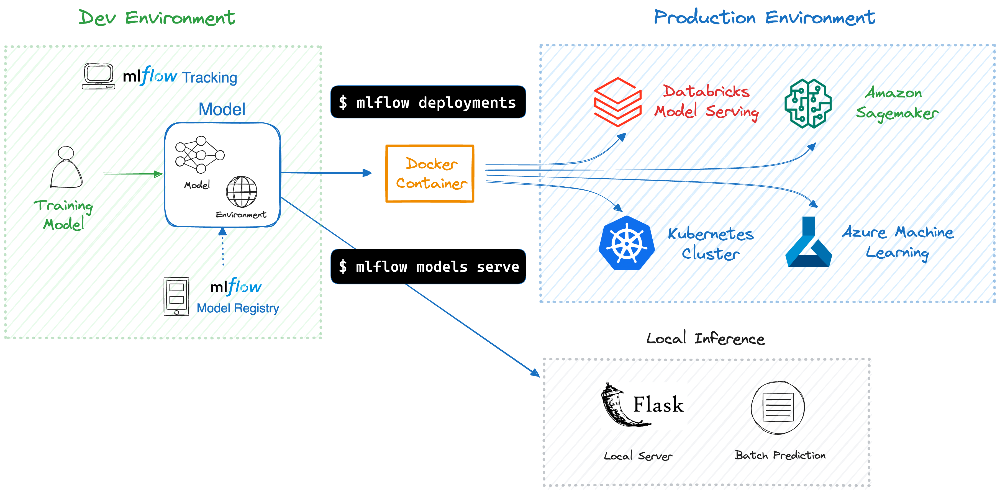

Deployment
==========

.. important::

    This page describes the toolset for deploying your in-house MLflow Model. For information on the **LLM Deployment Server** (formerly known as AI Gateway), please refer to `MLflow Deployment Server <../llms/deployments/index.html>`_.

After training your machine learning model and ensuring its performance, the next step is deploying it to a production environment.
This process can be complex, but MLflow simplifies it by offering an easy toolset for deploying your ML models to various targets, including local environments, cloud services, and Kubernetes clusters.

By using MLflow deployment toolset, you can enjoy the following benefits:

- **Effortless Deployment**: MLflow provides a simple interface for deploying models to various targets, eliminating the need to write boilerplate code.
- **Dependency and Environment Management**: MLflow ensures that the deployment environment mirrors the training environment, capturing all dependencies. This guarantees that models run consistently, regardless of where they're deployed.
- **Packaging Models and Code**: With MLflow, not just the model, but any supplementary code and configurations are packaged along with the deployment container. This ensures that the model can be executed seamlessly without any missing components.
- **Avoid Vendor Lock-in**: MLflow provides a standard format for packaging models and unified APIs for deployment. You can easily switch between deployment targets without having to rewrite your code.

Concepts
--------

`MLflow Model <../models.html>`_
~~~~~~~~~~~~~~~~~~~~~~~~~~~~~~~~
`MLflow Model <../models.html>`_ is a standard format that packages a machine learning model with its metadata, such as dependencies and inference schema.
You typically create a model as a result of training execution using the `MLflow Tracking APIs <../tracking.html>`_, for instance, :py:func:`mlflow.pyfunc.log_model`. 
Alternatively, models can be registered and retrieved via the `MLflow Model Registry <../model-registry.html>`_.
To use MLflow deployment, you must first create a model.

Container
~~~~~~~~~
Container plays a critical role for simplifying and standardizing the model deployment process. MLflow uses Docker containers to package models with their dependencies,
enabling deployment to various destinations without environment compatibility issues. See :ref:`Building a Docker Image for MLflow Model <build-docker-for-deployment>` for more details on how to deploy your model as a container.
If you're new to Docker, you can start learning at `"What is a Container" <https://www.docker.com/resources/what-container//>`_.

Deployment Target
~~~~~~~~~~~~~~~~~
Deployment target refers to the destination environment for your model. MLflow supports various targets, including local environments, cloud services (AWS, Azure), Kubernetes clusters, and others.

How it works
------------
An `MLflow Model <../models.html>`_ already packages your model and its dependencies, hence MLflow can create either a virtual environment (for local deployment)
or a Docker container image containing everything needed to run your model. Subsequently, MLflow launches an inference server with REST endpoints using
frameworks like `Flask <https://flask.palletsprojects.com/en/1.1.x/>`_, preparing it for deployment to various destinations to handle inference requests.
Detailed information about the server and endpoints is available in :ref:`Inference Server Specification <local-inference-server-spec>`.

MLflow provides :ref:`CLI commands <deployment-cli>` and :ref:`Python APIs <deployment-python-api>` to facilitate the deployment process.
The required commands differ based on the deployment target, so please continue reading to the next section for more details about your specific target.

Supported Deployment Targets
----------------------------
MLflow offers support for a variety of deployment targets. For detailed information and tutorials on each, please follow the respective links below.

.. toctree::
    :maxdepth: 1
    :hidden:

    deploy-model-locally
    deploy-model-to-sagemaker
    deploy-model-to-kubernetes/index

.. raw:: html

    <section>
        <article class="simple-grid">
            

                <a href="deploy-model-locally.html">
                    

                        Deploying a Model Locally
                    

                    

                       Deploying a model locally as an inference server is straightforward with MLflow, requiring just a single command <code>mlflow models serve</code>.
                    

                </a>
            

            

                <a href="deploy-model-to-sagemaker.html">
                    

                        
                    

                    

                        Amazon SageMaker is a fully managed service for scaling ML inference containers.
                        MLflow simplifies the deployment process with easy-to-use commands, eliminating the need to write container definitions.
                    

                </a>
            

            

                <a href="https://learn.microsoft.com/en-us/azure/machine-learning/how-to-deploy-mlflow-models">
                    

                        
                    

                    

                        MLflow integrates seamlessly with Azure ML. You can deploy MLflow Model to the Azure ML managed online/batch endpoints,
                        or to Azure Container Instances (ACI) / Azure Kubernetes Service (AKS).
                    

                </a>
            

            

                <a href="https://docs.databricks.com/en/mlflow/models.html">
                    

                        
                    

                    

                        Databricks Model Serving offers a fully managed service for serving MLflow models at scale,
                        with added benefits of performance optimizations and monitoring capabilities.
                    

                </a>
            

            

                <a href="deploy-model-to-kubernetes/index.html">
                    

                        
                    

                    

                       MLflow Deployment integrates with Kubernetes-native ML serving frameworks
                       such as Seldon Core and KServe (formerly KFServing).
                     

                </a>
            

            

                <a href="../plugins.html#deployment-plugins">
                    

                        Community Supported Targets
                    

                    

                        MLflow also supports more deployment targets such as Ray Serve, Redis AI, Torch Serve, Oracle Cloud Infrastructure (OCI), through community-supported plugins.
                    

                </a>
            

        </article>
    </section>

API References
--------------

.. _deployment-cli:

Command Line Interface
~~~~~~~~~~~~~~~~~~~~~~

Deployment-related commands are primarily categorized under two modules:

* `mlflow models <../cli.html#mlflow-models>`_ - typically used for local deployment.
* `mlflow deployments <../cli.html#mlflow-deployments>`_ - typically used for deploying to custom targets.

Note that these categories are not strictly separated and may overlap. Furthermore, certain targets require
custom modules or plugins, for example, `mlflow sagemaker <../cli.html#mlflow-sagemaker>`_ is used for Amazon
SageMaker deployments, and the `azureml-mlflow <https://pypi.org/project/azureml-mlflow/>`_ library is required for Azure ML.

Therefore, it is advisable to consult the specific documentation for your chosen target to identify the appropriate commands.

.. _deployment-python-api:

Python APIs
~~~~~~~~~~~

Almost all functionalities available in MLflow deployment can also be accessed via Python APIs. For more details, refer to the following API references:

* `mlflow.models <../python_api/mlflow.models.html>`_
* `mlflow.deployments <../python_api/mlflow.deployments.html>`_
* `mlflow.sagemaker <../python_api/mlflow.sagemaker.html>`_

FAQ
---
If you encounter any dependency issues during model deployment, please refer to :ref:`Model Dependencies FAQ <model-dependencies-troubleshooting>`
for guidance on how to troubleshoot and validate fixes.
