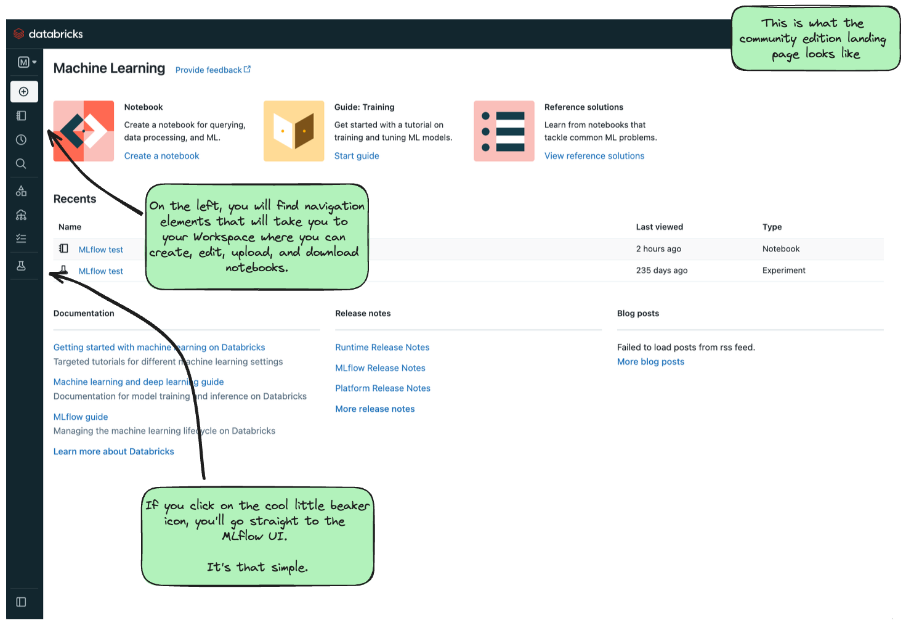
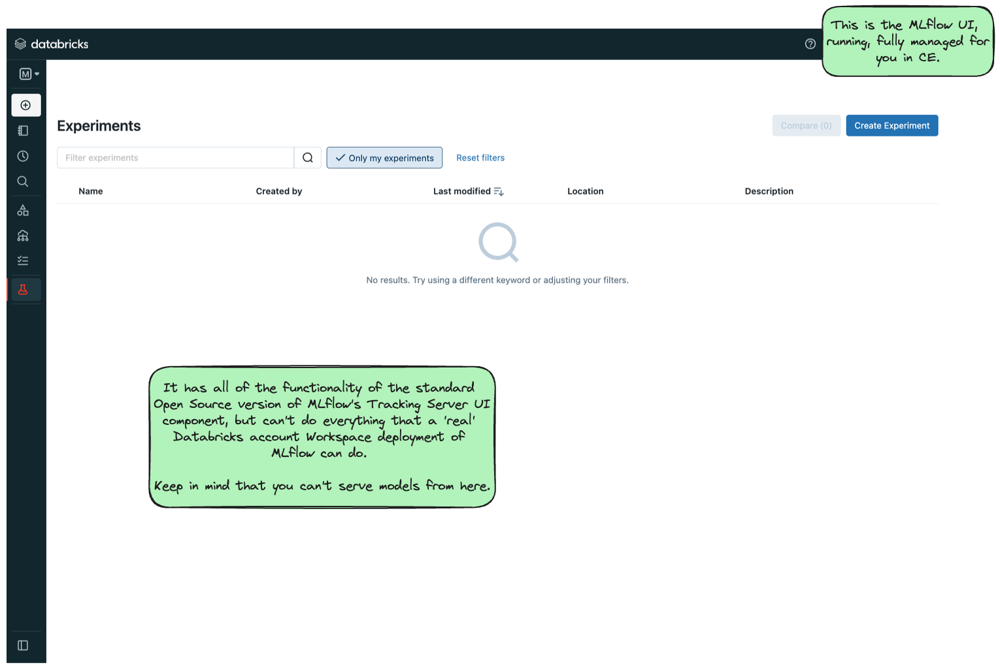

Databricks Community Edition
============================

The  `Databricks Community Edition (CE) <https://docs.databricks.com/en/getting-started/community-edition.html>`_ is a fully managed, Databricks-hosted version of the Databricks platform. While many of the enterprise features of the 
Databricks platform are unavailble on CE, the vast majority of MLflow functionality is supported (with the notable exception that you cannot create serving 
endpoints on CE, so deployment of models is not supported).

To get started with Databricks CE, please visit the `Databricks Community Edition page <https://docs.databricks.com/en/getting-started/community-edition.html>`_ 
and follow the instructions outlined there. It takes about 5 minutes to get started, and you'll have a (mostly) fully functional Databricks Workspace that you 
can use to log your tutorial experiments, runs, and artifacts to. 

Once you log in to the Community Edition, you will see a landing page like this:

    
    Databricks CE Landing Page

In order to get to the MLflow UI, you can navigate to it by clicking on the "Experiments" link on the left-hand side (denoted by the laboratory beaker icon). 
When you get to the MLflow UI on CE for the first time, you'll see this:

    
    Databricks CE MLflow UI

Decisions about where to run your Notebook
~~~~~~~~~~~~~~~~~~~~~~~~~~~~~~~~~~~~~~~~~~

With a Databricks managed instance of MLflow, you have two options for running the tutorial notebooks:

.. raw:: html
    
    

        
<b>Expand to learn about Importing Notebooks directly into CE</b>

         
        
Once you're at the main page of CE, you can import any of the notebooks within this tutorial by navigating to the "Workspace" tab on the left.
 
        
Click that link to expand the file navigation pane. From there, navigate to Users/&lt;you&gt; and you can right click to bring up the "Import" option.

        
The below image shows what the import dialog should look like if you're going to directly import a notebook from the MLflow documentation website:

        <figure>
            
        </figure>

        
At this point, you can simply just run the tutorial.   Any calls to MLflow for creating experiments, initiating runs, logging metadata, and saving artifacts will be fully managed for you and your logging history will appear within the MLflow UI.

    

     
    

        
<b>Expand to learn about Running Notebooks locally and using CE as a remote tracking server</b>

         
        
In order to stay within the comfortable confines of your local machine and still have the use of the managed MLflow Tracking Server, you can simply add a call to <code>mlflow.login()</code> to your notebook. This will generate a prompt for you to enter your <strong>username</strong> and <strong>password</strong> that were defined when creating your account on CE. 

        
<strong>Note:</strong> your username will be the <strong>email address</strong> that you used when signing up.

        <pre><code class="language-python">
        import mlflow

        mlflow.login()
        </code></pre>
        
After the login process is done, you will simply have to set your MLflow Tracking URI to the instance that you just logged in to.  It's made fairly easy for you:

        <pre><code class="language-python">
        mlflow.set_tracking_uri("databricks")
        </code></pre>
    

     

At this point, you're ready to go! You can run any of the tutorials locally and they will log to the managed MLflow Tracking Server.
