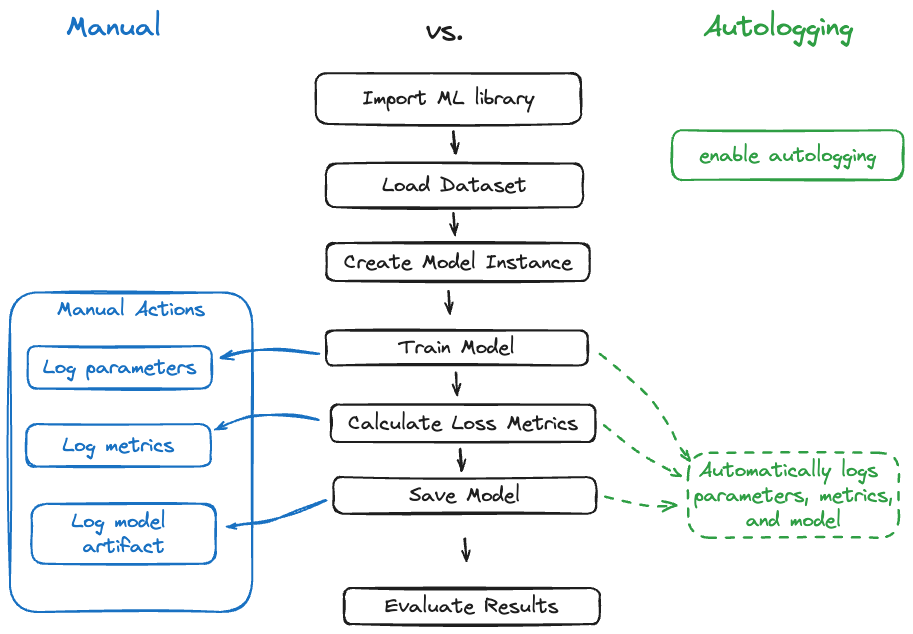
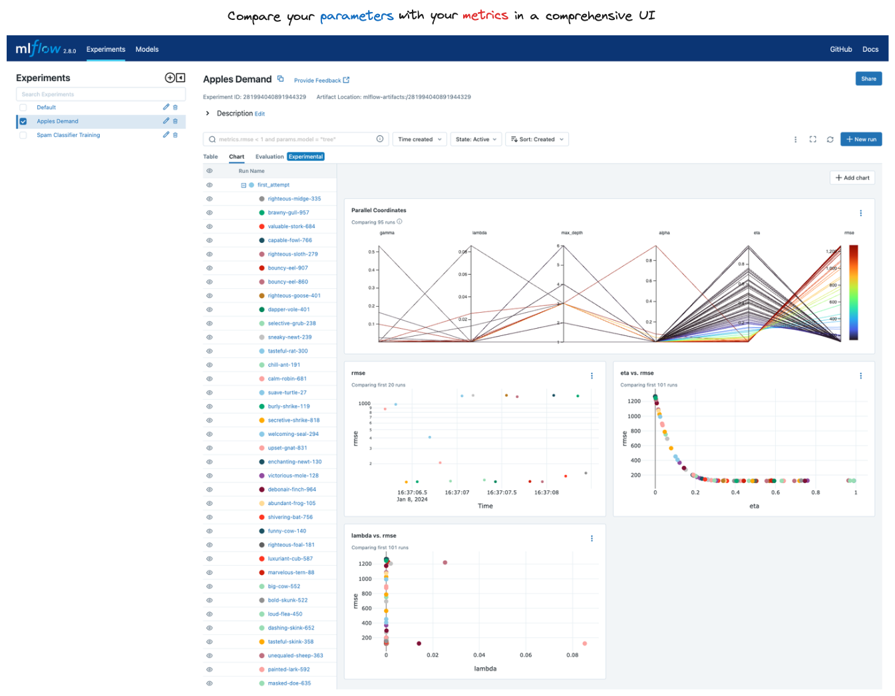

Getting Started with MLflow
===========================

For those new to MLflow or seeking a refresher on its core functionalities, the
quickstart tutorials here are the perfect starting point. They will guide you
step-by-step through fundamental concepts, focusing purely on a task that will maximize your understanding of 
how to use MLflow to solve a particular task. 

Guidance on Running Tutorials
-----------------------------

If you are new to MLflow and have never interfaced with the MLflow Tracking Server, we highly encourage you to head on over to quickly **read the guide below**. It 
will help you get started as quickly as possible with tutorial content throughout the documentation.

.. raw:: html

    <a href="running-notebooks/index.html" class="download-btn">View the Guide to Running Tutorial Notebooks</a>

.. toctree::
    :maxdepth: 1
    :hidden:

    running-notebooks/index

Getting Started Guides
----------------------

MLflow Tracking
^^^^^^^^^^^^^^^

This quick, 5-minute introductory tutorial will get you up to speed on the basics of MLflow tracking. 

.. figure:: ../_static/images/tutorials/introductory/tracking-basics.png
    :width: 100%
    :align: center
    :alt: The basics of MLflow tracking.

In this brief introductory quickstart on MLflow Tracking, you will learn how to leverage MLflow to:

* **Log** training statistics (loss, accuracy, etc.) and hyperparameters for a model
* **Log** (save) a model for later retrieval
* **Register** a model to enable deployment
* **Load** the model and use it for inference

In the process of learning these key concepts, you will be exposed to the MLflow fluent API, the MLflow Tracking UI, and learn how to add metadata associated with 
a model training event to an MLflow run.

.. raw:: html

     <section>
        <article class="simple-grid">
            

                <a href="intro-quickstart/index.html" >
                    

                        MLflow Tracking Quickstart Guide
                    

                    

                    Learn the basics of MLflow Tracking in a fast-paced guide with a focus on seeing your first model in the MLflow UI
                    

                </a>
            

        </article>
    </section>

If you would like to get started immediately by downloading and running a notebook yourself:

.. raw:: html

    <a href="https://raw.githubusercontent.com/mlflow/mlflow/master/docs/source/getting-started/intro-quickstart/notebooks/tracking_quickstart.ipynb" class="notebook-download-btn">
        <i class="fas fa-download"></i>Download the Tracking Quickstart Notebook</a> 

.. toctree::
    :maxdepth: 1
    :hidden:

    intro-quickstart/index

Autologging Basics
^^^^^^^^^^^^^^^^^^

A great way to get started with MLflow is to use the autologging feature. Autologging automatically logs your model, metrics, and parameters 
with only a single line of code for many of the most popular ML libraries in the Python ecosystem.

In this brief tutorial, you'll learn how to leverage MLflow's autologging feature to simplify your model logging activities.

.. raw:: html

     <section>
        <article class="simple-grid">
            

                <a href="../tracking/autolog.html" >
                    

                        MLflow Autologging Quickstart
                    

                    

                    Get started with logging to MLflow with the high-level autologging API in a fast-paced guide 
                    

                </a>
            

        </article>
    </section>

Run Comparison Basics
^^^^^^^^^^^^^^^^^^^^^

This quickstart tutorial focuses on the MLflow UI's run comparison feature, provides a brief overview of MLflow Projects, 
and shows how to register a model. After locally serving the registered model, a brief example of preparing a model for remote deployment 
via containerizing the model via Docker is covered. 

.. raw:: html

     <section>
        <article class="simple-grid">
            

                <a href="quickstart-2/index.html" >
                    

                        MLflow Run Comparison Quickstart
                    

                    

                    Get started with using the MLflow UI to compare runs and register a model for deployment
                    

                </a>
            

        </article>
    </section>

.. toctree::
    :maxdepth: 1
    :hidden:

    quickstart-2/index

Tracking Server Quickstart
^^^^^^^^^^^^^^^^^^^^^^^^^^

This quickstart tutorial walks through different types of MLflow Tracking Servers and how to use them to log 
your MLflow experiments.

.. raw:: html

     <section>
        <article class="simple-grid">
            

                <a href="tracking-server-overview/index.html" >
                    

                        5 Minute Tracking Server Overview
                    

                </a>
                

                    Learn how to log MLflow experiments with different tracking servers
                

            

        </article>
    </section>

.. toctree::
    :maxdepth: 1
    :hidden:

    tracking-server-overview/index

In-depth Guides
---------------

Logging your first MLflow Model
^^^^^^^^^^^^^^^^^^^^^^^^^^^^^^^

In this lengthy tutorial, you will walk through the basics of MLflow in a sequential and guided manner. With each subsequent step, 
you will increase your familiarity with the primary functionality around MLflow Tracking and how to navigate the MLflow UI.

.. raw:: html

     <section>
        <article class="simple-grid">
            

                <a href="logging-first-model/index.html" >
                    

                        In-depth Guide to MLflow Tracking
                    

                    

                        Learn the nuances of interfacing with the MLflow Tracking Server in an in-depth tutorial
                    

                </a>
            

        </article>
    </section>

If you would like to get started immediately by interactively running the notebook, you can:

.. raw:: html

    <a href="https://raw.githubusercontent.com/mlflow/mlflow/master/docs/source/getting-started/logging-first-model/notebooks/logging-first-model.ipynb" class="notebook-download-btn">
        <i class="fas fa-download"></i>Download the Notebook</a> 

.. toctree::
    :maxdepth: 1
    :hidden:

    logging-first-model/index
    

