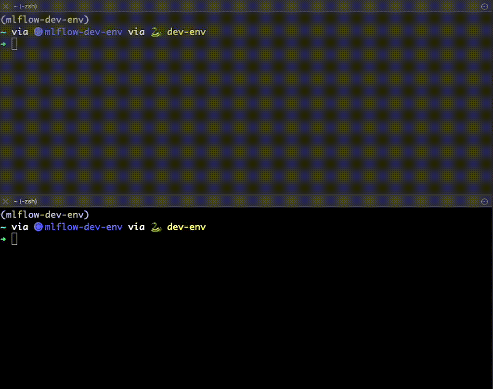

Starting the MLflow Tracking Server
===================================

Before diving into MLflow's rich features, let's set up the foundational components: the MLflow
Tracking Server and the MLflow UI. This guide will walk you through the steps to get both up and running.

Setting Up MLflow
-----------------

The first thing that we need to do is to get MLflow.

Step 1: Install MLflow from PyPI
--------------------------------

MLflow is conveniently available on PyPI. Installing it is as simple as running a pip command.

.. code-section::
    .. code-block:: bash
        :name: download-mlflow

        pip install mlflow

Step 2: Launch the MLflow Tracking Server
-----------------------------------------

To begin, you'll need to initiate the MLflow Tracking Server. Remember to keep the command prompt
running during the tutorial, as closing it will shut down the server.

.. code-section::
    .. code-block:: bash
        :name: tracking-server-start

        mlflow server --host 127.0.0.1 --port 8080

**Note**: Closing the command prompt or terminating the process will shut down the server.

.. note::
        Remember the host and port name that your MLflow tracking server is assigned. You will need
        this information in the next section of this tutorial!

Step 3: Start the MLflow UI
---------------------------

With the Tracking Server operational, it's time to start the MLflow UI. Launch it from a new command
prompt. As with the Tracking Server, ensure this window remains open.

.. code-section::
    .. code-block:: bash
        :name: mlflow-ui-start

        mlflow ui --host 127.0.0.1 --port 8090

   Starting the MLflow Tracking Server and the MLflow UI

Congratulations! Your MLflow environment is now set up and ready to go. As you progress, you'll
explore the myriad of functionalities MLflow has to offer, streamlining and enhancing your machine learning workflows.
