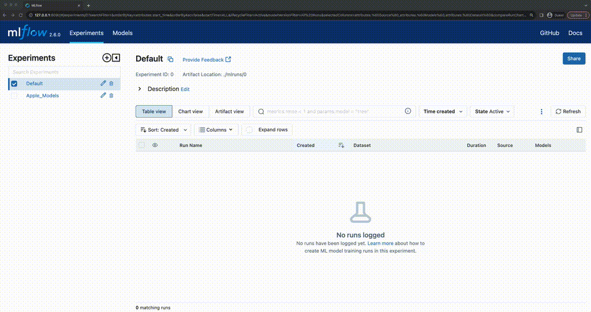
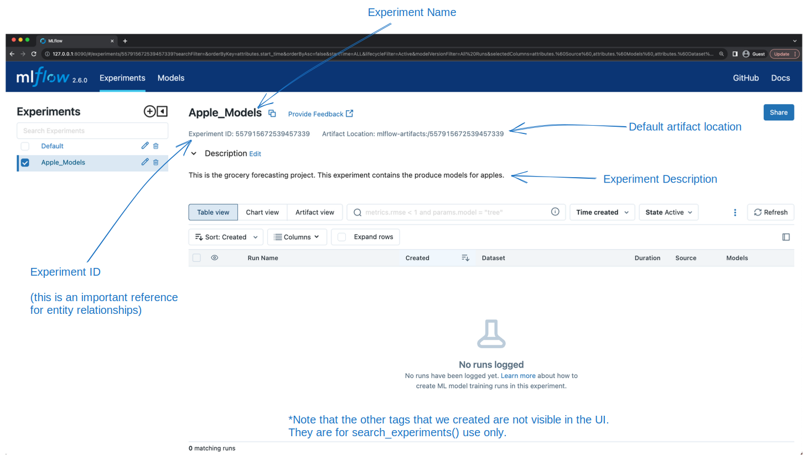
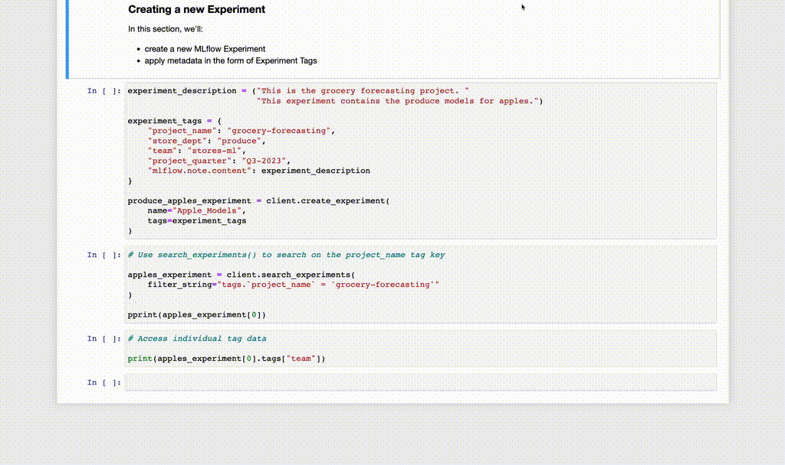

Searching Experiments
=====================

In the last section, we created our first MLflow Experiment, providing custom tags so that we can find
co-related Experiments that are part of a larger project.

In this brief section, we're going to see how to perform those searches with the MLflow Client API.

Before we perform the search, let's take a look at our ``Apple_Models`` experiment in the UI.

Seeing our new Experiment in the UI
-----------------------------------
As before, we're going to connect to our running MLflow Tracking server to view the MLflow UI. If you've closed the browser
window that was running it, simply navigate to ``http://127.0.0.1:8080`` in a new browser window.

   The "Apple_Models" Experiment in the MLflow UI

Important components to be aware of in the UI
^^^^^^^^^^^^^^^^^^^^^^^^^^^^^^^^^^^^^^^^^^^^^
There are some important elements in the UI to be aware of at this point, before we start adding more exciting things like runs to
our new experiment. Note the annotated elements on the figure below. It will be useful to know that these bits of data are there later on.

   Key elements of the Experiments view page

Searching based on tags
-----------------------

Now that we've seen the experiment and understand which of the tags that we specified during the creation of the experiment
are visible within the UI and which are not, we're going to explore the reason for defining those tags as we
apply searches against the tracking server to find experiments whose custom tags values match our query terms.

One of the more versatile uses of setting ``tags`` within Experiments is to enable searching for
related Experiments based on a common tag. The filtering capabilities within the ``search_experiments`` API
can be seen below, where we are searching for experiments whose custom ``project_name`` tag exactly matches
``grocery-forecasting``.

Note that the format that is used for the search filtering has some nuance to it. For named entities (for instance,
here, the ``tags`` term in the beginning of the filter string), keys can be directly used. However, to reference custom
tags, note the particular syntax used. The custom tag names are wrapped with back ticks (`) and our matching search
condition is wrapped in single quotes.

.. code-section::

    .. code-block:: python

        # Use search_experiments() to search on the project_name tag key

        apples_experiment = client.search_experiments(
            filter_string="tags.`project_name` = 'grocery-forecasting'"
        )

        print(vars(apples_experiment[0]))

.. code-block:: bash
    :caption: The metadata associated with a created Experiment

    <Experiment: artifact_location='mlflow-artifacts:/926031323154788454',
                 creation_time=1694018173427,
                 experiment_id='926031323154788454',
                 last_update_time=1694018173427,
                 lifecycle_stage='active',
                 name='Apple_Models',
                 tags={
                    'mlflow.note.content': 'This is the grocery forecasting project. This '
                            'experiment contains the produce models for apples.',
                    'project_name': 'grocery-forecasting',
                    'project_quarter': 'Q3-2023',
                    'team': 'stores-ml'}
    >

.. note::
    The returned results above are formatted for legibility. This return type is an ``Experiment`` object, not a ``dict``.

Executing the Search
--------------------

   Creating a new Experiment and searching based on an Experiment tag

In the next section, we'll begin to use this experiment to log training data to runs that are associated with this experiment, introducing
another aspect of both the MLflow APIs (the fluent API) and another part of the MLflow UI (the run information page).