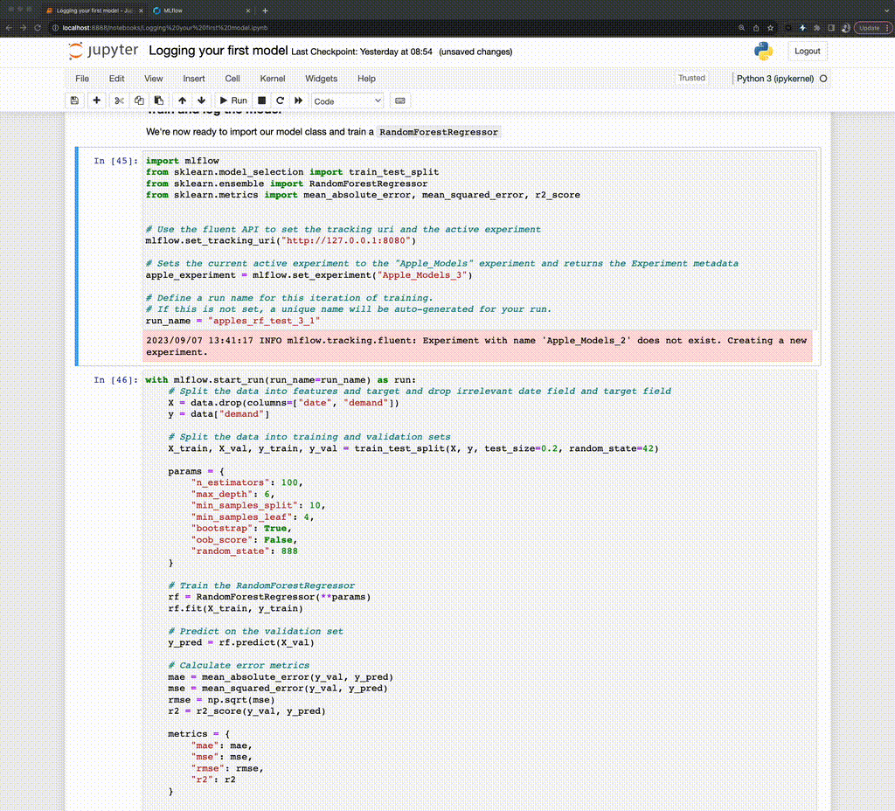
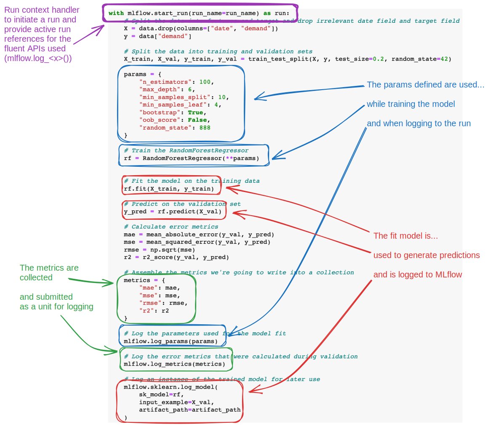
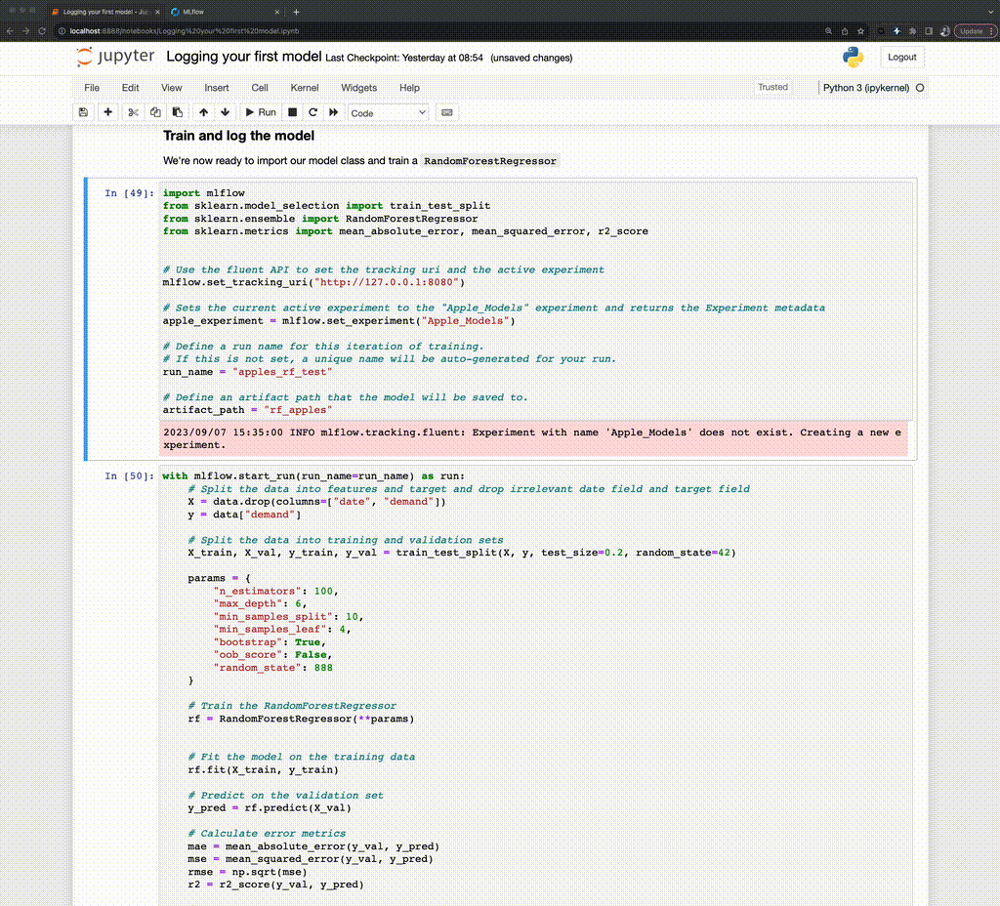

Logging our first runs with MLflow
==================================

In our previous segments, we worked through setting up our first MLflow Experiment and equipped it
with custom tags. These tags, as we'll soon discover, are instrumental in seamlessly retrieving
related experiments that belong to a broader project.

In the last section, we created a dataset that we'll be using to train a series of models.

As we advance in this section, we'll delve deeper into the core features of MLflow Tracking:

- Making use of the ``start_run`` context for creating and efficiently managing runs.
- An introduction to logging, covering tags, parameters, and metrics.
- Understanding the role and formation of a model signature.
- Logging a trained model, solidifying its presence in our MLflow run.

But first, a foundational step awaits us. For our upcoming tasks, we need a dataset, specifically
focused on apple sales. While it's tempting to scour the internet for one, crafting our own dataset
will ensure it aligns perfectly with our objectives.

Crafting the Apple Sales Dataset
--------------------------------

Let's roll up our sleeves and construct this dataset.

We need a data set that defines the dynamics of apple sales influenced by various factors like
weekends, promotions, and fluctuating prices. This dataset will serve as the bedrock upon which
our predictive models will be built and tested.

Before we get to that, though, let's take a look at what we've learned so far and how these principles
were used when crafting this data set for the purposes of this tutorial.

Using Experiments in early-stage project development
^^^^^^^^^^^^^^^^^^^^^^^^^^^^^^^^^^^^^^^^^^^^^^^^^^^^

As the diagram below shows, I tried taking a series of shortcuts. In order to record what I was trying,
I created a new MLflow Experiment to record the state of what I tried. Since I was using different data
sets and models, each subsequent modification that I was trying necessitated a new Experiment.

.. figure:: ../../_static/images/tutorials/introductory/logging-first-model/dogfood-diagram.svg
   :width: 90%
   :align: center
   :alt: Using MLflow Tracking for building this demo

   Using Experiments in MLflow Tracking to keep track of building this tutorial

After finding a workable approach for the dataset generator, the results can be seen in the MLflow
UI.

   Validating the results of a training run in the MLflow UI

Once I found something that actually worked, I cleaned everything up (deleted them).

.. figure:: ../../_static/images/tutorials/introductory/logging-first-model/cleanup-experiments.gif
   :width: 90%
   :align: center
   :alt: Tidying up

   Removing experiments that were filled with failed attempts

.. note::
    If you're precisely following along to this tutorial and you delete your ``Apple_Models``
    Experiment, recreate it before proceeding to the next step in the tutorial.

Using MLflow Tracking to keep track of training
-----------------------------------------------

Now that we have our data set and have seen a little bit of how runs are recorded, let's dive in to
using MLflow to tracking a training iteration.

To start with, we will need to import our required modules.

.. code-section::

    .. code-block:: python

        import mlflow
        from sklearn.model_selection import train_test_split
        from sklearn.ensemble import RandomForestRegressor
        from sklearn.metrics import mean_absolute_error, mean_squared_error, r2_score

Notice that here we aren't importing the ``MlflowClient`` directly. For this portion, we're going to
be using the ``fluent`` API. The fluent APIs use a globally referenced state of the MLflow tracking
server's uri. This global instance allows for us to use these 'higher-level' (simpler) APIs to perform
every action that we can otherwise do with the ``MlflowClient``, with the addition of some other useful
syntax (such as context handlers that we'll be using very shortly) to make integrating MLflow to
ML workloads as simple as possible.

In order to use the ``fluent`` API, we'll need to set the global reference to the Tracking server's
address. We do this via the following command:

.. code-section::

    .. code-block:: python

        mlflow.set_tracking_uri("http://127.0.0.1:8080")

Once this is set, we can define a few more constants that we're going to be using when logging our
training events to MLflow in the form of runs. We'll start by defining an Experiment that will be used
to log runs to. The parent-child relationship of Experiments to Runs and its utility will become very
clear once we start iterating over some ideas and need to compare the results of our tests.

.. code-section::

    .. code-block:: python

        # Sets the current active experiment to the "Apple_Models" experiment and
        # returns the Experiment metadata
        apple_experiment = mlflow.set_experiment("Apple_Models")

        # Define a run name for this iteration of training.
        # If this is not set, a unique name will be auto-generated for your run.
        run_name = "apples_rf_test"

        # Define an artifact path that the model will be saved to.
        artifact_path = "rf_apples"

With these variables defined, we can commence with actually training a model.

Firstly, let's look at what we're going to be running. Following the code display, we'll look at
an annotated version of the code.

.. code-section::

    .. code-block:: python

        # Split the data into features and target and drop irrelevant date field and target field
        X = data.drop(columns=["date", "demand"])
        y = data["demand"]

        # Split the data into training and validation sets
        X_train, X_val, y_train, y_val = train_test_split(X, y, test_size=0.2, random_state=42)

        params = {
            "n_estimators": 100,
            "max_depth": 6,
            "min_samples_split": 10,
            "min_samples_leaf": 4,
            "bootstrap": True,
            "oob_score": False,
            "random_state": 888,
        }

        # Train the RandomForestRegressor
        rf = RandomForestRegressor(**params)

        # Fit the model on the training data
        rf.fit(X_train, y_train)

        # Predict on the validation set
        y_pred = rf.predict(X_val)

        # Calculate error metrics
        mae = mean_absolute_error(y_val, y_pred)
        mse = mean_squared_error(y_val, y_pred)
        rmse = np.sqrt(mse)
        r2 = r2_score(y_val, y_pred)

        # Assemble the metrics we're going to write into a collection
        metrics = {"mae": mae, "mse": mse, "rmse": rmse, "r2": r2}

        # Initiate the MLflow run context
        with mlflow.start_run(run_name=run_name) as run:
            # Log the parameters used for the model fit
            mlflow.log_params(params)

            # Log the error metrics that were calculated during validation
            mlflow.log_metrics(metrics)

            # Log an instance of the trained model for later use
            mlflow.sklearn.log_model(
                sk_model=rf, input_example=X_val, artifact_path=artifact_path
            )

To aid in visualizing how MLflow tracking API calls add in to an ML training code base, see the figure below.

   

Putting it all together
-----------------------

Let's see what this looks like when we run our model training code and navigate to the MLflow UI.

