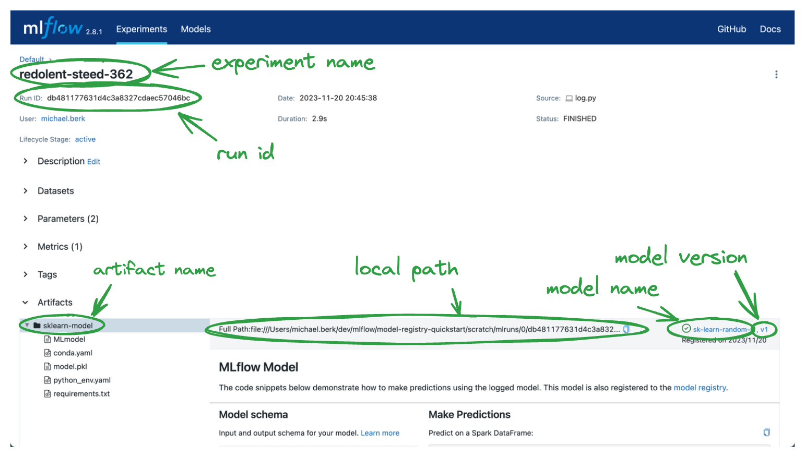

Registering a Model
===================

With the prior step, we now have a folder that stores models at `./mlruns/models/{model_name}`. 
There are many ways to access a model. 

Now that the model is registered, let's pull it from the model repository. There are a variety of ways 
to access a registered model. Here are some common choices...
1. Reference via model name and model version: `mlflow.sklearn.load_model(f"models:/{model_name}/{model_version}")`
3. Reference via model name and stage: `mlflow.sklearn.load_model(f"models:/{model_name}/{model_stage}")`
4. Reference via remote/local path: `mlflow.sklearn.load_model(f"{local_path_to_model}")`

All of the above information can be found either programmatically or via the mlflow UI. 

Step 1: Open the MLflow UI
--------------------------

You can access the information above programmatically or via the UI. For demonstration purposes,
we will leverage the MLflow UI, however the programmatic interface is typically more scalable and is
thereby recommended for production solutions.

.. code-section::
    .. code-block:: bash 
        :name: start-mlflow-ui

        mlflow ui

Step 2: Get the Required Information 
------------------------------------

As shown in the image below, we can access all information required to access our model in virtually
any way we want. 

   Accessing model information from the model registry.

For the above variables, you should have the same model name, model version, and artifact path.
However, all other values by default are dynamically generated at runtime, so you values should
differ. 

Step 3: Query the Model
------------------------

As shown above, there are many ways to reference a registered model. Depending upon the information
in your enviornment, it might make sense to use one method over another. However, they are highly
interchaneable and all leverage the same `mlflow.{flavor_name}.load_model()` syntax. 

For simplicity, we will leverage the model name `sk-learn-random-forest-reg-model` that we specified
 when logging the model.

.. code-section::
    .. code-block:: python 
        :name: get-model 

        import mlflow.sklearn
        from sklearn.datasets import make_regression

        model_name = "sk-learn-random-forest-reg-model"
        model_version = "latest" 

        # Load the model from the Model Registry
        model_uri = f"models:/{model_name}/{model_version}"
        model = mlflow.sklearn.load_model(model_uri)

        # Generate a new dataset for prediction and predict
        X_new, _ = make_regression(n_features=4, n_informative=2, random_state=0, shuffle=False)
        y_pred_new = model.predict(X_new)

        print(y_pred_new)

