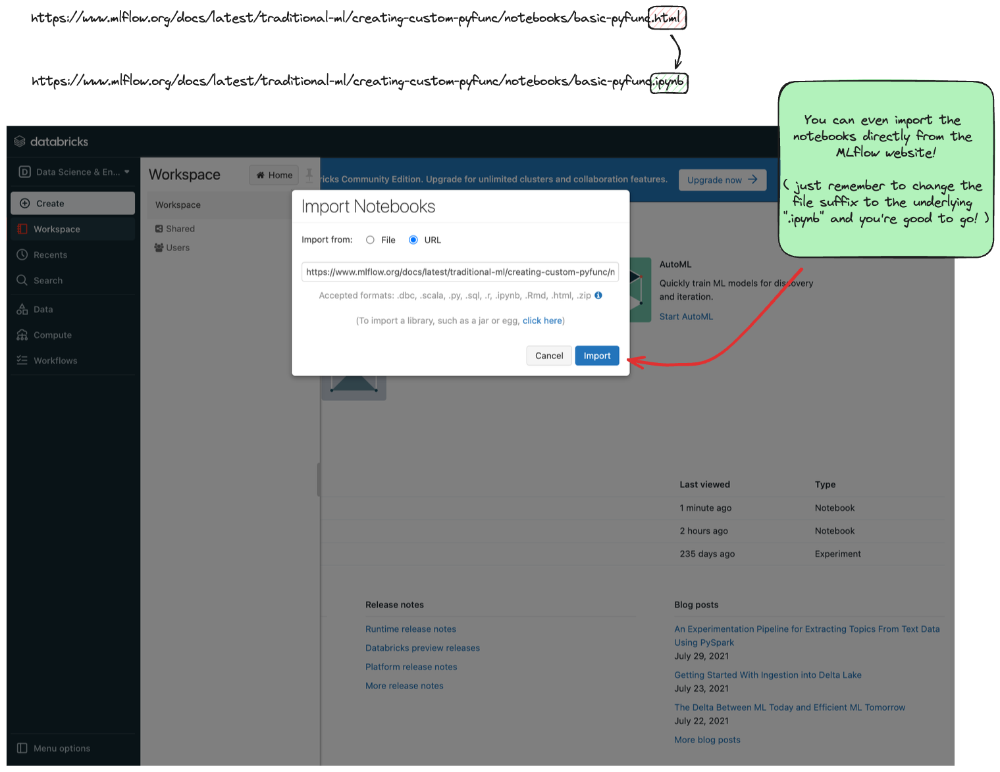

How to Run Tutorials
====================

Throughout the MLflow documentation, you'll find a collection of notebook-based tutorials that will help to provide a primer on learning concepts of MLflow. 
From the very `first getting started tutorials <../intro-quickstart/index.html>`_ to in-depth use-case driven examples of using MLflow with popular ML frameworks 
`like transformers <../../llms/transformers/index.html>`_, these tutorials 
typically integrate with the MLflow Tracking Server (to learn more about it, see `the guide here <../../tracking.html>`_ and view the 
`5 minute quickstart tutorial here <https://www.mlflow.org/docs/latest/getting-started/tracking-server-overview/index.html>`_) to record information about 
experiments, runs, and the artifacts that are produced by your machine learning code. 

This brief guide will walk you through some options that you have to run these tutorials and have a Tracking Server that is available to log the results to, 
as well as providing guidance on these different modes and how to access the MLflow UI to view the results. 

The listing of topics in this guide are in ascending order of complexity, so if you're looking for the quickest and easiest way to get started, please 
evaluate the first option. 

Managed MLflow
--------------

The easiest way to get started with MLflow is to use the managed MLflow service provided by Databricks. There are two separate options here, one that is 
most expedient if you're a Databricks customer, and another that is available to anyone, free of charge.

Databricks Customers
^^^^^^^^^^^^^^^^^^^^

If you're already a customer of Databricks, you can use the MLflow service that is available as part of your Databricks workspace. 
MLflow on Databricks is a fully managed service with additional functionality for enterprise customers, providing a scalable and secure managed deployment 
of MLflow. Note that the MLflow APIs from within Databricks are the same as the open source version, so you can use the same code to run on Databricks or on 
your own infrastructure.

To learn how to get started using MLflow from within your Databricks account, please see the respective links below for your cloud provider:

- `Azure Databricks <https://learn.microsoft.com/en-gb/azure/databricks/mlflow/>`_
- `Databricks on AWS <https://docs.databricks.com/en/mlflow/index.html>`_
- `Databricks on GCP <https://docs.gcp.databricks.com/en/mlflow/index.html>`_

Databricks Community Edition
^^^^^^^^^^^^^^^^^^^^^^^^^^^^

The Databricks Community Edition (CE) is a fully managed, Databricks-hosted version of the Databricks platform. While many of the enterprise features of the 
Databricks platform are unavailble on CE, the vast majority of MLflow functionality is supported (with the notable exception that you cannot create serving 
endpoints on CE, so deployment of models is not supported).

To get started with Databricks CE, please visit the `Databricks Community Edition page <https://docs.databricks.com/en/getting-started/community-edition.html>`_ 
and follow the instructions outlined there. It takes about 5 minutes to get started, and you'll have a (mostly) fully functional Databricks Workspace that you 
can use to log your tutorial experiments, runs, and artifacts to. 

Once you log in to the Community Edition, you will see a landing page like this:

.. figure:: ../../_static/images/tutorials/introductory/community-edition-main.png
    :alt: Databricks CE Landing Page
    :width: 100%
    :align: center
    
    Databricks CE Landing Page

In order to get to the MLflow UI, you can navigate to it by clicking on the "Experiments" link on the left-hand side (denoted by the laboratory beaker icon). 
When you get to the MLflow UI on CE for the first time, you'll see this:

.. figure:: ../../_static/images/tutorials/introductory/mlflow-ui-in-ce.png
    :alt: Databricks CE MLflow UI
    :width: 100%
    :align: center
    
    Databricks CE MLflow UI

Decisions about where to run your Notebook
~~~~~~~~~~~~~~~~~~~~~~~~~~~~~~~~~~~~~~~~~~

With a Databricks managed instance of MLflow, you have two options on how you'd like to proceed with using the managed Tracking Server instance. You can 
import any notebooks that you'd like and use them from within CE directly, or you can execute the tutorials locally from your computer and simply login to CE 
from within your notebook. 

**Importing Notebooks directly into CE**

Once you're at the main page of CE, you can import any of the notebooks within this tutorial by navigating to the "Workspace" tab on the left. Click that link to 
expand the file navigation pane. 
From there, navigate to Users/<you> and you can right click to bring up the "Import" option. 

Here is what the import dialog should look like if you're going to directly import a notebook from the MLflow documentation website:

    Importing a tutorial directly from the MLflow docs website

At this point, you can simply just run the tutorial. Any calls to MLflow for creating experiments, initiating runs, logging metadata, and saving artifacts will 
be fully managed for you. Your logging history will appear within the MLflow UI.

**Running locally and using CE as a remote tracking server**

In order to stay within the comfortable confines of your local machine and still have the use of the managed MLflow Tracking Server, you can simply add a 
call to ``mlflow.login()`` to your notebook. This will generate a prompt for you to enter your **username** and **password** that were defined when creating your 
account on CE. Note: your username will be the **email address** that you used when signing up. 

.. code-block:: python

    import mlflow

    mlflow.login()

After the login process is done, you will simply have to set your MLflow Tracking URI to the instance that you just logged in to. It's made fairly easy for you:

.. code-block:: python

    mlflow.set_tracking_uri("databricks")

At this point, you're ready to go! You can run any of the tutorials locally and they will log to the managed MLflow Tracking Server.

Self-managed MLflow
-------------------

If you have your own managed MLflow server that you'd like to use, you can simply set the MLflow Tracking URI to point to your server.
If there are additional configurations or access restrictions for connecting, please contact the group that manages your MLflow deployment for more information.

To set the MLflow Tracking URI directly (assuming that you don't have additional security validation set up), all you need to do is, from within a notebook:

.. code-block:: python

    mlflow.set_tracking_uri("http://<your-mlflow-server>:<the port number that is configured to accept traffic>")

Local Tracking Server
---------------------

If you'd like to run the MLflow Tracking Server locally, you can do so by following the instructions in the 
`quickstart tutorial here <../tracking-server-overview/index.html#method-1-start-your-own-mlflow-server>`_.

If you're just trying to quickly learn some concepts from MLflow, this is probably not the best option for you. However, if you're looking to 
learn how to set up infrastructure for deploying MLflow for a team to collaborate using a remote tracking server, this guide will cover the basics 
in preparation for `learning more about the tracking server <../../tracking.html>`_ and the specifics around `how to deploy a tracking server here <../../tracking/server.html>`_.

