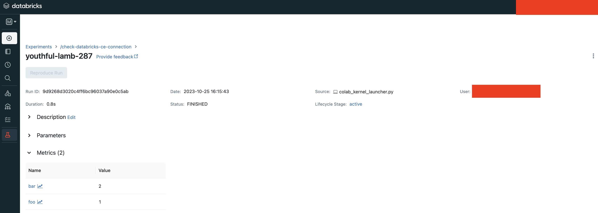

.. _tracking-server-overview:

5 Minute Tracking Server Overview
==================================

In this guide we will walk you through how to view your MLflow experiment results with different types of 
tracking server configurations. At a high level, there are 3 ways to view your MLflow experiments:

* **[Method 1]** Start your own MLflow server.
* **[Method 2]** Use a free hosted tracking server - Databricks Community Edition.
* **[Method 3]** Use production Databricks/AzureML.

To choose among these 3 methods, here is our recommendation:

* If you have privacy concerns (data/model/tech stack), use **Method 1 - start your own server**.
* If you are a student or an individual researcher, or if you are developing in cloud-based notebooks (e.g., Google 
  Colab), use **Method 2 - free hosted tracking server**.
* Enterprise users, or if you want to serve or deploy your model for a production use-case, please use 
  **Method 3 - production Databricks/AzureML**.

Overall **Method 2 - free hosted tracking server** is the simplest way to get started with MLflow, but please
pick the method that best suits your needs.

Method 1: Start Your Own MLflow Server
---------------------------------------

**Disclaimier**: This part of guide is not suitable for running in a cloud-provided IPython environment 
(e.g., Collab, Databricks). Please follow the guide below in your local machine (laptop/desktop).

A hosted tracking server is the simplest way to store and view MLflow experiments, but it is not suitable for 
every user. For example, you may not want to expose your data and model to others in your cloud provider account. In this case, 
you can use a local hosted MLflow server to store and view your experiments. To do so, there are two steps:

* Start your MLflow server.
* Connect MLflow session to the local MLflow server IP by :py:func:`mlflow.set_tracking_uri()`.

Start a Local MLflow Server
^^^^^^^^^^^^^^^^^^^^^^^^^^^

If you don't have MLflow installed, please run the command below to install it:

.. code-block:: bash

    $ pip install mlflow

The installation of MLflow includes the MLflow CLI tool, so you can start a local MLflow server with UI 
by running the command below in your terminal:

.. code-block:: bash

    $ mlflow ui

It will generate logs with the IP address, for example:

.. code-block:: bash

    (mlflow) [master][~/Documents/mlflow_team/mlflow]$ mlflow ui
    [2023-10-25 19:39:12 -0700] [50239] [INFO] Starting gunicorn 20.1.0
    [2023-10-25 19:39:12 -0700] [50239] [INFO] Listening at: http://127.0.0.1:5000 (50239)

Opening the URL of the MLflow tracking server in your browser will bring you to the MLflow UI. The image below is from the open source version of the MLflow UI, 
which is a bit different from the MLflow UI on Databricks CE. Below is a screenshot of the landing page:

.. image:: ../../_static/images/quickstart/tracking-server-overview/mlflow-localhost-landing-page.png
    :width: 800px
    :align: center
    :alt: Landing page of OSS MLflow server

.. note::

  It's also possible to deploy your own MLflow server on cloud platforms, but it is out of the scope of this guide.

Connect MLflow Session to Your Server
^^^^^^^^^^^^^^^^^^^^^^^^^^^^^^^^^^^^^^

Now that the server is spun up, let's connect our MLflow session to the local server. This is very 
similar to how we connect to a remote hosted tracking provider such as the Databricks platform.

.. code-block:: python

  mlflow.set_tracking_uri("http://localhost:5000")

Next, let's try logging some dummy metrics. We can view these test metrics on the local hosted UI:

.. code-block:: python

  mlflow.set_experiment("check-localhost-connection")

  with mlflow.start_run():
      mlflow.log_metric("foo", 1)
      mlflow.log_metric("bar", 2)

Putting it together you can copy the following code to your editor and save it as `log_mlflow_with_localhost.py`:

.. code-block:: python

  import mlflow

  mlflow.set_tracking_uri("http://localhost:5000")
  mlflow.set_experiment("check-localhost-connection")

  with mlflow.start_run():
      mlflow.log_metric("foo", 1)
      mlflow.log_metric("bar", 2)

Then execute it by:

.. code-block:: bash

  $ python log_mlflow_with_localhost.py

View Experiment on Your MLflow Server
^^^^^^^^^^^^^^^^^^^^^^^^^^^^^^^^^^^^^^

Now let's view your experiment on the local server. Open the URL in your browser, which is `http://localhost:5000` 
in our case. In the UI, inside the left sidebar you should see the experiment with name 
`"check-localhost-connection"`. Clicking on this experiment name should bring you to the experiment view, similar to what is shown below. 

.. image:: ../../_static/images/quickstart/tracking-server-overview/mlflow-localhost-experiment-view.png
    :width: 800px
    :align: center
    :alt: Experiment view of OSS MLflow server

Clicking on the run (`"clumsy-steed-426"` in this example, yours will be different) will bring you to the run view, similar as below.

.. image:: ../../_static/images/quickstart/tracking-server-overview/mlflow-localhost-run-view.png
    :width: 800px
    :align: center
    :alt: Run view of OSS MLflow server

Conclusion
^^^^^^^^^^^

That's all about how to start your own MLflow server and view your experiments. Please see the pros and cons
of this method below:

* **Pros**
  
  * You have full control of your data and model, which is good for privacy concerns.
  * No subscription is required.
  * Unlimited quota of experiments/runs.
  * You can even customize your UI by forking the MLflow repo and modify the UI code.

* **Cons**
  
  * Requires manual setup and maintenance.
  * Team collaboration is harder than using a hosted tracking server.
  * Not suitable for cloud-based notebook, e.g., Google Colab.
  * Requires extra port forwarding if you deploy your server on cloud VM.
  * No serving support.

Method 2: Use Free Hosted Tracking Server (Databricks Community Edition)
------------------------------------------------------------------------

**Notice**: This part of guide can be directly executed in cloud-based notebook, e.g., Google Colab or 
Databricks Notebook.

`Databricks Community Edition (CE) <https://community.cloud.databricks.com/>`_ is the free, limited-use version of the 
cloud-based big data platform Databricks. Databricks CE users can access a micro-cluster as well as 
a cluster manager and notebook environment. All users can share their notebooks and host them free of 
charge with Databricks. You can use Databricks CE to store and view your MLflow experiments without 
being charged.

To use Databricks CE to store and view our MLflow experiments, basically we need to:

* Create a free Databricks CE account.
* Set up Databricks CE authentication in our dev environment.
* Connect to Databricks CE in our MLflow experiment session.

Then the experiment results will be automatically sent to Databricks CE, where you can view it in 
MLflow experiment UI. Now let's look at the code.

Create a Databricks CE Account
^^^^^^^^^^^^^^^^^^^^^^^^^^^^^^^

If you don't have an account of Databricks CE yet, you can create one 
`here <https://www.databricks.com/try-databricks#account>`_. The full process should take no longer than 3 minutes.

Install Dependencies
^^^^^^^^^^^^^^^^^^^^

.. code-block:: bash

  %pip install -q mlflow databricks-sdk

Set Up Authentication of Databricks CE
^^^^^^^^^^^^^^^^^^^^^^^^^^^^^^^^^^^^^^

To set up Databricks CE authentication, we can use the API :py:func:`mlflow.login()`, which will prompt you for required information:

* **Databricks Host**: Use https://community.cloud.databricks.com/
* **Username**: Your email address that signs in Databricks CE.
* **Password**: Your password of Databricks CE.

If the authentication succeeds, you should see a message "Succesfully signed in Databricks!".

.. code-block:: python

  import mlflow

  mlflow.login()

.. code-block:: text

  2023/10/25 22:59:27 ERROR mlflow.utils.credentials: Failed to sign in Databricks: default auth: cannot configure default credentials
  Databricks Host (should begin with https://): https://community.cloud.databricks.com/
  Username: weirdmouse@gmail.com
  Password: ··········
  2023/10/25 22:59:38 INFO mlflow.utils.credentials: Succesfully signed in Databricks!

Connect MLflow Session to Databricks CE
^^^^^^^^^^^^^^^^^^^^^^^^^^^^^^^^^^^^^^^

We have set up the credentials, now we need to tell MLflow to send the data into Databricks CE. 
To do so, we will use ``mlflow.set_tracking_uri("databricks")`` to port MLflow to Databricks CE. Basically 
it is the command below. Please note that you need to always use `"databricks"` as the keyword.

.. code-block:: python

  mlflow.set_tracking_uri("databricks")

Now you are ready to go! Let's try starting an MLflow experiment and log some dummy metrics and view it in our UI.

.. code-block:: python

  mlflow.set_experiment("/check-databricks-connection")

  with mlflow.start_run():
      mlflow.log_metric("foo", 1)
      mlflow.log_metric("bar", 2)

.. code-block:: text

  2023/10/25 23:15:42 INFO mlflow.tracking.fluent: Experiment with name '/check-databricks-ce-connection' does not exist. Creating a new experiment.

View Your Experiment on Databricks CE
^^^^^^^^^^^^^^^^^^^^^^^^^^^^^^^^^^^^^

Now let's navigate to Databricks CE to view the experiment result. Log in to your 
`Databricks CE <https://community.cloud.databricks.com/>`_ account, and click on top left to select machine learning 
in the drop down list. Then click on the experiment icon. See the screenshot below:

.. image:: ../../_static/images/quickstart/tracking-server-overview/databricks-ce-landing-page.png 
    :width: 800px
    :align: center
    :alt: Landing page of Databricks MLflow server

In the "Experiments" view, you should be able to find the experiment "/check-databricks-ce-connection", similar to 

.. image:: ../../_static/images/quickstart/tracking-server-overview/databricks-ce-experiment-view.png
    :width: 800px
    :align: center
    :alt: Experiment view of Databricks MLflow server

Clicking on the run name, in our example it is "youthful-lamb-287" (it's a randomly generated name, you will see 
a different name in your CE console), will bring you to the run view, similar to 

In the run view, you will see our dummy metrics `"foo"` and `"bar"` are logged successfully.

Conclusion
^^^^^^^^^^^

That's all about how to use Databricks CE as the tracking server. Please see the pros and cons
of this method below:

* **Pros**
  
  * Effortless setup.
  * Free. 
  * Good for collaboration, e.g., you can share your MLflow experiment with your teammates easily.
  * Compatible for developing on cloud-based notebook, e.g., Google Colab.
  * Compatible for developing on cloud VM.

* **Cons**
  
  * Has quota limit of experiments/runs.
  * No model registration/serving support.

Method 3: Use Production Hosted Tracking Server
------------------------------------------------

If you are an enterprise user and willing to productionize your model, you can use a production platform like 
Databricks or Microsoft AzureML. If you use Databricks, MLflow experiment will log your model into the Databricks 
MLflow server, and you can register your model then serve your model by a few clicks. Serving feature 
is only available on production Databricks workspace, and not available on Databricks CE.

The method of using production Databricks is the same as using Databricks CE, you only need to 
change the host to be the production workspace. For example, ``https://dbc-1234567-123.cloud.databricks.com``.
For more information about how Databricks power your Machine Learning workflow, please refer to the `doc 
here <https://docs.databricks.com/en/machine-learning/index.html>`_.

To use AzureML as the tracking server, please read 
`the doc here <https://learn.microsoft.com/en-us/azure/machine-learning/how-to-use-mlflow-cli-runs?view=azureml-api-2&tabs=interactive%2Ccli>`_

Conclusion
^^^^^^^^^^^

That's all about how to use a production platform as the tracking server. Please see the pros and cons
of this method below:

* **Pros**
  
  * Effortless setup.
  * Good for collaboration, e.g., you can share your MLflow experiment with your teammates easily.
  * Compatible for developing on cloud-based notebook, e.g., Google Colab.
  * Compatible for developing on cloud VM.
  * Seamless model registration/serving support.
  * Higher quota than Databricks CE (pay as you go).

* **Cons**
  
  * Not free.
  * Need to manage a billing account.
