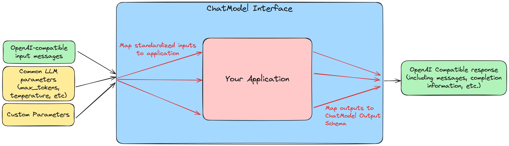

Tutorial: Getting Started with ChatModel
========================================

MLflow's :py:class:`mlflow.pyfunc.ChatModel` class provides a standardized way to create production-ready conversational AI models. The resulting models are fully integrated with MLflow's tracking, evaluation, and lifecycle management capabilities. They can be shared with others in the MLflow Model Registry, deployed as a REST API, or loaded in a notebook for interactive use. Furthermore, they are compatible with the widely-adopted OpenAI chat API spec, making them easy to integrate with other AI systems and tools.

If you're already familiar with :py:class:`mlflow.pyfunc.PythonModel`, you might be wondering why :py:class:`mlflow.pyfunc.ChatModel` exists given that you can accomplish the same thing with a custom ``PythonModel``. As GenAI applications become more prevalent and more complex, mapping the inputs, outputs, and parameters between your application and the custom ``PythonModel`` can become quite challenging. The ``ChatModel`` class offers a structured way to define custom conversational AI models that simplifies this process, with a focus on standardized, OpenAI-compatible inputs, outputs, and parameters.

If you're new to MLflow, or you have not used custom ``PythonModel`` s before, you can just think of ``ChatModel`` as a way to standardize how your AI Chat application talks to other systems, including deployment platforms, monitoring tools, and other AI services.

What You'll Learn
-----------------

This guide will take you through the basics of using the ChatModel API to define custom conversational AI models. In particular, you will learn:

#. How to map your application logic to the ``ChatModel``'s input/output schema
#. How to use the pre-defined inference parameters supported by ChatModels
#. How to pass custom parameters to a ChatModel using ``metadata``
#. How :py:class:`mlflow.pyfunc.ChatModel` compares to :py:class:`mlflow.pyfunc.PythonModel` for defining custom chat models

To illustrate these points, this guide will walk you through building a custom ``ChatModel``, using a locally-hosted Ollama model as our example. There is no built-in Ollama model flavor, so creating a custom ``ChatModel`` provides a way to use MLflow's extensive tracking, evaluation, and lifecycle management capabilities with Ollama models.

Prerequisites
-------------

- Familiarity with MLflow logging APIs and GenAI concepts.
- MLflow version 2.17.0 or higher installed for use of :py:class:`mlflow.pyfunc.ChatModel`.

Understanding ChatModel: Input/Output Mapping
---------------------------------------------

The :py:class:`mlflow.pyfunc.ChatModel` interface sits between your application and MLflow's ecosystem, providing a layer of standardization that makes it easier to integrate your application with MLflow's other features and to deploy your model in an accessible, production-ready format.

To that end, when defining a custom ``ChatModel``, the key task is to map your application's logic to the ``ChatModel``'s standardized interface. :emphasis:`This mapping exercise is the fundamental part of creating a custom` ``ChatModel``.

|ChatModel Interface|

When using a custom ChatModel, the ``predict`` method expects standardized inputs that look like this:

.. code-block:: python

    input = {
        "messages": [{"role": "user", "content": "What is MLflow?"}],
        "max_tokens": 25,
    }

with a ``messages`` key containing a list of messages, and optional inference parameters such as ``max_tokens``, ``temperature``, ``top_p``, and ``stop``. You can find details of the full chat request object `here <https://mlflow.org/docs/latest/python_api/mlflow.types.html#mlflow.types.llm.ChatRequest>`__.

The output is also returned in a standardized format that looks like this:

.. code-block:: python

    {
        "choices": [
            {
                "index": 0,
                "message": {
                    "role": "assistant",
                    "content": "MLflow is an open-source platform for machine learning (ML) and artificial intelligence (AI). It's designed to manage,",
                },
                "finish_reason": "stop",
            }
        ],
        "model": "llama3.2:1b",
        "object": "chat.completion",
        "created": 1729190863,
    }

You can find details of the full chat response object `here <https://mlflow.org/docs/latest/python_api/mlflow.types.html#mlflow.types.llm.ChatResponse>`__.

These input/output schemas are compatible with the widely-adopted OpenAI spec, making ``ChatModel`` s easy to use in a wide variety of contexts.

To demonstrate this mapping process, we will show how to use the :py:class:`mlflow.pyfunc.ChatModel` class to log Meta's Llama 3.2 1B model via the Ollama llm client, which does not have a native MLflow flavor.

Building Your First ChatModel
-----------------------------

In this section, we will wrap a locally-hosted Ollama model with the ``ChatModel`` interface. We will build a simplified version showing how to handle inputs and outputs, and then we will show how to handle inference parameters such as ``max_tokens`` and ``temperature``.

**Setup: Install Ollama and download the model**

#. Install Ollama from `here <https://ollama.com/>`__.
#. Once Ollama is installed and running, download the Llama 3.2 1B model by running ``ollama pull llama3.2:1b``

You can validate that the model is downloaded and available on your system with ``ollama run llama3.2:1b``.

.. code-block:: text

    > ollama run llama3.2:1b

    >>> Hello world!
    Hello! It's great to see you're starting the day with a cheerful greeting. How can I assist you today?
    >>> Send a message (/? for help)

We will use the ``ollama-python`` library to interface with the Ollama model. Install it to your Python environment with ``pip install ollama``. Also, install ``mlflow`` with ``pip install mlflow``.

**Using the Ollama Python library**

In order to map the Ollama input/output schema to the ChatModel input/output schema, we first need to understand what kinds of inputs and outputs the Ollama model expects and returns. Here's how to query the model with a simple prompt:

.. code-block:: python

    import ollama
    from ollama import Options
    from rich import print

    response = ollama.chat(
        model="llama3.2:1b",
        messages=[
            {
                "role": "user",
                "content": "What is MLflow Tracking?",
            }
        ],
        options=Options({"num_predict": 25}),
    )

    print(response)

Which returns the following output:

.. code-block:: text

    {
        'model': 'llama3.2:1b',
        'created_at': '2024-11-04T12:47:53.075714Z',
        'message': {
            'role': 'assistant',
            'content': 'MLflow Tracking is an open-source platform for managing, monitoring, and deploying machine learning (ML) models. It provides a'
        },
        'done_reason': 'length',
        'done': True,
        'total_duration': 1201354125,
        'load_duration': 819609167,
        'prompt_eval_count': 31,
        'prompt_eval_duration': 41812000,
        'eval_count': 25,
        'eval_duration': 337872000
    }

Here are a few things to note about the Ollama inputs and outputs:

- The ``messages`` argument expected by the ``ollama.chat`` method is a list of dictionaries with ``role`` and ``content`` keys. We will need to convert the list of ``ChatMessage`` objects expected by the ChatModel API to a list of dictionaries.
- Inference parameters are passed to Ollama via the ``options`` argument, which is a dictionary of parameters. Furthermore, as we can see based on ``num_predict``, the parameter names are different from those expected by ChatModel. We will need to map the ChatModel inference parameters to the Ollama options.
- The output is structured differently from the ``ChatModel`` output schema. We will need to map this to the ChatModel output schema.

**Ollama ChatModel Version 1: Chat only**

Let's start with a simple version of a custom ``ChatModel`` that handles inputs/output messages but does not yet handle inference parameters. To accomplish this, we need to:

#. Define a class that extends :py:class:`mlflow.pyfunc.ChatModel`
#. Implement the ``load_context`` method, which will handle the initialization of the Ollama client
#. Implement the ``predict`` method, which will handle the input/output mapping

Most of the customization, at least in this simple version, will occur in the ``predict`` method. When implementing the ``predict`` method, we make use of the following standardized inputs:

- ``messages``: a list of ``ChatMessage`` objects
- ``params``: a ``ChatParams`` object, which contains the inference parameters

And we need to return a ``ChatResponse`` object, which is a dataclass made up of a list of ``ChatChoice`` objects, along with (optional) usage data and other metadata.

These are what we must map to the Ollama inputs and outputs. Here's a simplified version that, for now, only handles the input/output messages:

.. code-block:: python

    # if you are using a jupyter notebook
    # %%writefile ollama_model.py
    from mlflow.pyfunc import ChatModel
    from mlflow.types.llm import ChatMessage, ChatResponse, ChatChoice
    from mlflow.models import set_model
    import ollama

    class SimpleOllamaModel(ChatModel):
        def __init__(self):
            self.model_name = "llama3.2:1b"
            self.client = None

        def load_context(self, context):
            self.client = ollama.Client()

        def predict(self, context, messages, params=None):
            # Prepare the messages for Ollama
            ollama_messages = [msg.to_dict() for msg in messages]

            # Call Ollama
            response = self.client.chat(model=self.model_name, messages=ollama_messages)

            # Prepare and return the ChatResponse
            return ChatResponse(
                choices=[{"index": 0, "message": response["message"]}],
                model=self.model_name,
            )

    set_model(SimpleOllamaModel())

In the above code, we mapped the ``ChatModel`` inputs to the Ollama inputs, and the Ollama output back to the ``ChatModel`` output schema. More specifically:

- The ``messages`` key in the ``ChatModel`` input schema is a list of ``ChatMessage`` objects. We converted this to a list of dictionaries with ``role`` and ``content`` keys, which is the expected input format for Ollama.
- The ``ChatResponse`` that the ``predict`` method returns must be created using the ``ChatResponse`` dataclass, but the nested message and choice data can be provided as dictionaries that match the expected schema. MLflow will automatically convert these dictionaries to the appropriate dataclass objects. In our case, we created a ``ChatResponse`` but provided the choices and messages as dictionaries.

In a notebook environment, we can save the model to a file called ``ollama_model.py`` with the ``%%writefile`` magic command and call ``set_model(SimpleOllamaModel())``. This is the "models from code" approach to model logging, which you can read more about :doc:`here </model/models-from-code>`.

Now we can log this model to MLflow as follows, passing the path to the file containing the model definition we just created:

.. code-block:: python

    import mlflow

    mlflow.set_experiment("chatmodel-quickstart")
    code_path = "ollama_model.py"

    with mlflow.start_run():
        model_info = mlflow.pyfunc.log_model(
            "ollama_model",
            python_model=code_path,
            input_example={
                "messages": [{"role": "user", "content": "Hello, how are you?"}]
            },
        )

Again, we used the models-from-code approach to log the model, so we passed the path to the file containing our model definition to the ``python_model`` parameter. Now we can load the model and try it out:

.. code-block:: python

    loaded_model = mlflow.pyfunc.load_model(model_info.model_uri)

    result = loaded_model.predict(
        data={
            "messages": [{"role": "user", "content": "What is MLflow?"}],
            "max_tokens": 25,
        }
    )
    print(result)

.. code-block:: python

    {
        "choices": [
            {
                "index": 0,
                "message": {
                    "role": "assistant",
                    "content": "MLflow is an open-source platform for model deployment, monitoring, and tracking. It was created by Databricks, a cloud-based data analytics company, in collaboration with The Data Science Experience (TDEE), a non-profit organization that focuses on providing high-quality, free machine learning resources.\n\nMLflow allows users to build, train, and deploy machine learning models in various frameworks, such as TensorFlow, PyTorch, and scikit-learn. It provides a unified platform for model development, deployment, and tracking across different environments, including local machines, cloud platforms (e.g., AWS), and edge devices.\n\nSome key features of MLflow include:\n\n1. **Model versioning**: Each time a model is trained or deployed, it generates a unique version number. This allows users to track changes, identify conflicts, and manage multiple versions.\n2. **Model deployment**: MLflow provides tools for deploying models in various environments, including Docker containers, Kubernetes, and cloud platforms (e.g., AWS).\n3. **Monitoring and logging**: The platform includes built-in monitoring and logging capabilities to track model performance, errors, and other metrics.\n4. **Integration with popular frameworks**: MLflow integrates with popular machine learning frameworks, making it easy to incorporate the platform into existing workflows.\n5. **Collaboration and sharing**: MLflow allows multiple users to collaborate on models and tracks changes in real-time.\n\nMLflow has several benefits, including:\n\n1. **Improved model management**: The platform provides a centralized view of all models, allowing for better model tracking and management.\n2. **Increased collaboration**: MLflow enables team members to work together on machine learning projects more effectively.\n3. **Better model performance monitoring**: The platform offers real-time insights into model performance, helping users identify issues quickly.\n4. **Simplified model deployment**: MLflow makes it easy to deploy models in various environments, reducing the complexity of model deployment.\n\nOverall, MLflow is a powerful tool for managing and deploying machine learning models, providing a comprehensive platform for model development, tracking, and collaboration.",
                },
                "finish_reason": "stop",
            }
        ],
        "model": "llama3.2:1b",
        "object": "chat.completion",
        "created": 1730739510,
    }

Now we have received a chat response in a standardized, OpenAI-compatible format. But something is wrong: even though we set ``max_tokens`` to 25, the response is well over 25 tokens! Why is this?

We have not yet handled the inference parameters in our custom ChatModel: in addition to mapping the input/output messages between the ChatModel and Ollama formats, we also need to map the inference parameters between the two formats. We will address this in the next version of our custom ChatModel.

Building a ChatModel that Accepts Inference Parameters
------------------------------------------------------

Most LLMs support inference parameters that control how the response is generated, such as ``max_tokens``, which limits the number of tokens in the response, or ``temperature``, which adjusts the "creativity" of the response. The ChatModel API includes built-in support for many of the most commonly-used inference parameters, and we will see how to configure and use them in this section.

**Passing Parameters to a ChatModel**

When using a ChatModel, parameters are passed alongside messages in the input:

.. code-block:: python

    result = model.predict(
        {
            "messages": [{"role": "user", "content": "Write a story"}],
            "max_tokens": 100,
            "temperature": 0.7,
        }
    )

You can find the full list of supported parameters `here <https://mlflow.org/docs/latest/python_api/mlflow.types.html#mlflow.types.llm.ChatParams>`__. Furthermore, you can pass arbitrary additional parameters to a ChatModel via the ``metadata`` key in the input, which we will cover in more detail in the next section.

**Comparison to Parameter Handling in Custom PyFunc Models**

If you're familiar with configuring inference parameters for `PyFunc models <https://mlflow.org/blog/custom-pyfunc#parameterizing-the-custom-model>`__, you will notice some key differneces in how ChatModel handles parameters:

+------------------------------------------------------------------------------------------------------------------------------+---------------------------------------------------------------------+
| ChatModel                                                                                                                    | PyFunc                                                              |
+==============================================================================================================================+=====================================================================+
| Parameters are part of the ``data`` dictionary passed to ``predict``, which also includes the ``messages`` key               | Parameters are passed to ``predict`` as ``params`` keyword argument |
+------------------------------------------------------------------------------------------------------------------------------+---------------------------------------------------------------------+
| Commonly-used chat model parameters (e.g. ``max_tokens``, ``temperature``, ``top_p``) are pre-defined in the ChatModel class | Parameters are chosen and configured by the developer               |
+------------------------------------------------------------------------------------------------------------------------------+---------------------------------------------------------------------+
| Model signature is automatically configured to support the common chat model parameters                                      | Parameters must be explicitly defined in the model signature        |
+------------------------------------------------------------------------------------------------------------------------------+---------------------------------------------------------------------+

In short, ChatModels make it easy to configure and use inference parameters, while also providing a standardized, OpenAI-compatible output format, but at the cost of some flexibility.

Now, let's configure our custom ChatModel to handle inference parameters.

**Ollama ChatModel Version 2: Chat with inference parameters**

Setting up a ChatModel with inference parameters is straightforward: just like with the input messages, we need to map the inference parameters to the format expected by the Ollama client. In the Ollama client, inference parameters are passed to the model as an ``options`` dictionary. When defining our custom ChatModel, we can access the inference parameters passed to ``predict`` via the ``params`` keyword argument. Our job is to map the predict method's ``params`` dictionary to the Ollama client's ``options`` dictionary. You can find the list of options supported by Ollama `here <https://github.com/ollama/ollama/blob/main/docs/api.md#generate-request-with-options>`__.

.. code-block:: python

    # if you are using a jupyter notebook
    # %%writefile ollama_model.py

    import mlflow
    from mlflow.pyfunc import ChatModel
    from mlflow.types.llm import ChatMessage, ChatResponse, ChatChoice
    from mlflow.models import set_model
    import ollama
    from ollama import Options

    class OllamaModelWithMetadata(ChatModel):
        def __init__(self):
            self.model_name = None
            self.client = None

        def load_context(self, context):
            self.model_name = "llama3.2:1b"
            self.client = ollama.Client()

        def _prepare_options(self, params):
            # Prepare options from params
            options = {}
            if params:
                if params.max_tokens is not None:
                    options["num_predict"] = params.max_tokens
                if params.temperature is not None:
                    options["temperature"] = params.temperature
                if params.top_p is not None:
                    options["top_p"] = params.top_p
                if params.stop is not None:
                    options["stop"] = params.stop

                if params.metadata is not None:
                    options["seed"] = int(params.metadata.get("seed", None))

            return Options(options)

        def predict(self, context, messages, params=None):
            ollama_messages = [
                {"role": msg.role, "content": msg.content} for msg in messages
            ]
            options = self._prepare_options(params)

            # Call Ollama
            response = self.client.chat(
                model=self.model_name, messages=ollama_messages, options=options
            )

            # Prepare the ChatResponse
            return ChatResponse(
                choices=[{"index": 0, "message": response["message"]}],
                model=self.model_name,
            )

    set_model(OllamaModelWithMetadata())

Here's what we changed from the previous version:

- We mapped ``max_tokens``, ``temperature``, ``top_p``, and ``stop`` from the ``params`` dictionary to ``num_predict``, ``temperature``, ``top_p``, and ``stop`` in the Ollama client's ``options`` dictionary (note the different parameter name for ``max_tokens`` expected by Ollama)
- We passed the ``options`` dictionary to the Ollama client's ``chat`` method. Note that we created a new private method, ``_prepare_options``, to handle the mapping from ``params`` to ``options``. Additional methods can be added to a custom ``ChatModel`` to keep code clean and organized while handling custom logic.
- We checked the ``metadata`` key in the ``params`` dictionary for a ``seed`` value—we'll cover this in more detail in the next section.

Now we can log this model to MLflow, load it, and try it out in the same way as before:

.. code-block:: python

    code_path = "ollama_model.py"

    with mlflow.start_run():
        model_info = mlflow.pyfunc.log_model(
            "ollama_model",
            python_model=code_path,
            input_example={
                "messages": [{"role": "user", "content": "Hello, how are you?"}]
            },
        )

    loaded_model = mlflow.pyfunc.load_model(model_info.model_uri)

    result = loaded_model.predict(
        data={
            "messages": [{"role": "user", "content": "What is MLflow?"}],
            "max_tokens": 25,
        }
    )
    print(result)

Which returns:

.. code-block:: python

    {
        "choices": [
            {
                "index": 0,
                "message": {
                    "role": "assistant",
                    "content": "MLflow is an open-source platform that provides a set of tools for managing and tracking machine learning (ML) model deployments,",
                },
                "finish_reason": "stop",
            }
        ],
        "model": "llama3.2:1b",
        "object": "chat.completion",
        "created": 1730724514,
    }

Now that we have appropriately mapped ``max_tokens`` from the ChatModel input schema to the Ollama client's ``num_predict`` parameter, we receive a response with the expected number of tokens.

**Passing Custom Parameters**

What if we want to pass a custom paramerter that is not included in the list of built-in inference parameters? The ChatModel API provides a way to do this via the ``metadata`` key, which accepts a dictionary of key-value pairs that are passed through to the model as-is. Both the keys and values must be strings, so it might be necessary to handle type conversions in the ``predict`` method. In the above example, we configured the Ollama model to use a custom ``seed`` value by adding a ``seed`` key to the ``metadata`` dictionary:

.. code-block:: python

    if params.metadata is not None:
        options["seed"] = int(params.metadata.get("seed", None))

Because we included this, we can now pass a ``seed`` value via the ``metadata`` key in the ``predict`` method. If you call ``predict`` multiple times with the same seed value, you will always receive the same response.

.. code-block:: python

    result = loaded_model.predict(
        data={
            "messages": [{"role": "user", "content": "What is MLflow?"}],
            "max_tokens": 25,
            "metadata": {"seed": "321"},
        }
    )

    print(result)

Which returns:

.. code-block:: python

    {
        "choices": [
            {
                "index": 0,
                "message": {
                    "role": "assistant",
                    "content": "MLflow is an open-source software framework used for machine learning model management, monitoring, and deployment. It's designed to provide",
                },
                "finish_reason": "stop",
            }
        ],
        "model": "llama3.2:1b",
        "object": "chat.completion",
        "created": 1730724533,
    }

.. tip:: Using vs. Defining ChatModels

   There's an important distinction between how you pass data when *using* a ChatModel versus how you access that data when *defining* one.

   When *using* an instantiated ChatModel, all the arguments—messages, parameters, etc.—are passed to the ``predict`` method as a single dictionary.

   .. code:: python

      model.predict({"messages": [{"role": "user", "content": "Hello"}], "temperature": 0.7})

   When *defining* the custom ChatModel's ``predict`` method, on the other hand, we access the data through separate ``messages`` and ``params`` arguments, where ``messages`` is a list of ``ChatMessage`` objects and ``params`` is a ``ChatParams`` object. Understanding this distinction—unified input for users, structured access for developers—is important to working effectively with ChatModels.

Comparison to PyFunc
--------------------

To illustrate some of the benefits and trade-offs of setting up a chat model via the ``ChatModel`` API vs. the ``PythonModel`` API, let's see what the above model would look like if we implemented it as a ``PythonModel``.

**Ollama Model Version 3: Custom PyFunc Model**

.. code-block:: python

    # if you are using a jupyter notebook
    # %%writefile ollama_pyfunc_model.py

    import mlflow
    from mlflow.pyfunc import PythonModel
    from mlflow.types.llm import ChatRequest, ChatResponse, ChatMessage, ChatChoice
    from mlflow.models import set_model
    import ollama
    from ollama import Options
    import pandas as pd
    from typing import List, Dict

    class OllamaPyfunc(PythonModel):
        def __init__(self):
            self.model_name = None
            self.client = None

        def load_context(self, context):
            self.model_name = "llama3.2:1b"
            self.client = ollama.Client()

        def _prepare_options(self, params):
            options = {}
            if params:
                if "max_tokens" in params:
                    options["num_predict"] = params["max_tokens"]
                if "temperature" in params:
                    options["temperature"] = params["temperature"]
                if "top_p" in params:
                    options["top_p"] = params["top_p"]
                if "stop" in params:
                    options["stop"] = params["stop"]
                if "seed" in params:
                    options["seed"] = params["seed"]

            return Options(options)

        def predict(self, context, model_input, params=None):
            if isinstance(model_input, (pd.DataFrame, pd.Series)):
                messages = model_input.to_dict(orient="records")[0]["messages"]
            else:
                messages = model_input.get("messages", [])

            options = self._prepare_options(params)
            ollama_messages = [
                {"role": msg["role"], "content": msg["content"]} for msg in messages
            ]

            response = self.client.chat(
                model=self.model_name, messages=ollama_messages, options=options
            )

            chat_response = ChatResponse(
                choices=[
                    ChatChoice(
                        index=0,
                        message=ChatMessage(
                            role="assistant", content=response["message"]["content"]
                        ),
                    )
                ],
                model=self.model_name,
            )

            return chat_response.to_dict()

    set_model(OllamaPyfunc())

This looks quite similar to how we defined our ``ChatModel`` above, and you could in fact use this ``PythonModel`` to serve the same Ollama model. However, there are some important differences:

- We had to handle the input data as a pandas DataFrame, even though the input is ultimately just a list of messages.
- Instead of receiving the inference parameters as a pre-configured ``ChatParams`` object, receive a ``params`` dictionary. One consequence of this is that we did not have to treat ``seed`` any differently from the other inference parameters: they're *all* custom parameters in the ``PythonModel`` API.
- We had to call ``chat_response.to_dict()`` to convert the ``ChatResponse`` object to a dictionary rather than a ``ChatResponse`` object. This is handled automatically by ``ChatModel``.

Some of the biggest differences come up when it's time to log the model:

.. code-block:: python

    from mlflow.models import infer_signature

    code_path = "ollama_pyfunc_model.py"

    params = {
        "max_tokens": 25,
        "temperature": 0.5,
        "top_p": 0.5,
        "stop": ["\n"],
        "seed": 123,
    }
    request = {"messages": [{"role": "user", "content": "What is MLflow?"}]}

    signature = infer_signature(model_input=request, params=params)

    with mlflow.start_run():
        model_info = mlflow.pyfunc.log_model(
            "ollama_pyfunc_model",
            python_model=code_path,
            signature=signature,
            input_example=(request, params),
        )

With a custom :py:class:`mlflow.pyfunc.PythonModel`, we need to manually define the model signature and input example. This is a significant difference from the ChatModel API, which automatically configured the signature to conform to the standardized OpenAI-compatible input/output/parameter schemas.

There is also one notable difference in how we call the loaded model's ``predict`` method: parameters are passed as a dictionary via the ``params`` keyword argument, rather than in the dictionary containing the messages.

.. code-block:: python

    loaded_model = mlflow.pyfunc.load_model(model_info.model_uri)

    result = loaded_model.predict(
        data={"messages": [{"role": "user", "content": "What is MLflow?"}]},
        params={"max_tokens": 25, "seed": 42},
    )
    print(result)

Which returns:

.. code-block:: python

    {
        "choices": [
            {
                "index": 0,
                "message": {
                    "role": "assistant",
                    "content": "MLflow is an open-source platform for machine learning (ML) and deep learning (DL) model management, monitoring, and",
                },
                "finish_reason": "stop",
            }
        ],
        "model": "llama3.2:1b",
        "object": "chat.completion",
        "created": 1731000733,
    }

In summary, ``ChatModel`` provides a more structured approach to defining custom chat models, with a focus on standardized, OpenAI-compatible inputs and outputs. While it requires a bit more setup work to map the input/output schemas between the ``ChatModel`` schema and the application it wraps, it can be easier to use than a fully custom :py:class:`mlflow.pyfunc.PythonModel` as it handles the often-challenging task of defining input/output/parameter schemas. The :py:class:`mlflow.pyfunc.PythonModel` approach, on the other hand, provides the most flexibility but requires the developer to manually handle all of the input/output/parameter mapping logic.

Conclusion
----------

In this guide, you have learned:

- How to map the input/output schemas between the ChatModel API and your application
- How to configure commonly-used chat model inference parameters with the ChatModel API
- How to pass custom parameters to a ``ChatModel`` using the ``metadata`` key
- How :py:class:`mlflow.pyfunc.ChatModel` compares to the :py:class:`mlflow.pyfunc.PythonModel` for defining custom chat models

You should now have a good sense of what the ChatModel API is and how it can be used to define custom chat models.

``ChatModel`` includes some additional functionality that was not covered in this introductory guide, including:

- Out of the box support for MLflow Tracing, which is useful for debugging and monitoring your chat models, especially in models with multiple components or calls to LLM APIs.
- Support for customizing the model's configuration using an external configuration file.

To learn more about these and other advanced features of the ChatModel API, you can read :doc:`this guide </llms/chat-model-guide/index>`.

